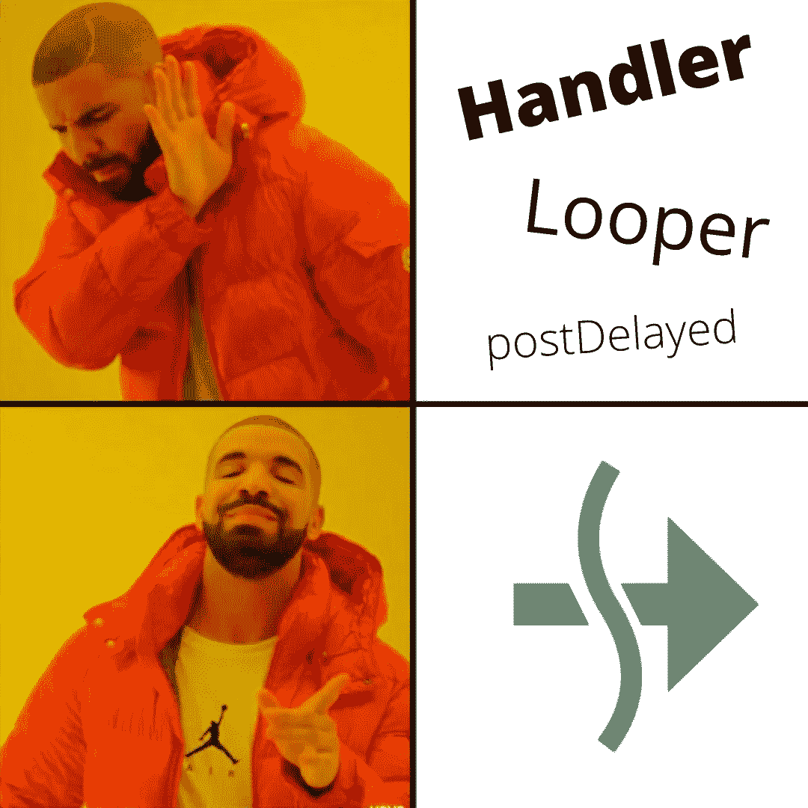

# 远离 Android 处理器。请改用协程和作业！

> 原文：<https://betterprogramming.pub/drift-away-from-android-handlers-use-coroutines-and-jobs-instead-581815dd3e72>

## 通过使用协程和处理程序上的作业，可以简化定时任务。看如何！

远离处理程序，改用协程和作业！

# 方案

在我们的 Android 应用程序中，我们都使用过带有`[postDelayed](https://developer.android.com/reference/android/os/Handler#postDelayed(java.lang.Runnable,%20long))` )方法的处理程序来执行某个任务。这是我们在这种时间要求下执行任务的常用方法。

使用`Handler`，10 秒后执行任务的典型代码如下所示:

# 我觉得这太繁琐了！

当有一个作用域要求我们取消当前正在运行的定时任务，并且我们同时有多个任务在运行时，处理程序实例的创建和维护就变得特别乏味。

在这种情况下，我们必须维护一个令牌或单独的 runnable 实例，以便在计时器超时之前取消所需的任务。

此外，为 Handler 的创建提供 looper 实例可能看起来有点乏味，我们大多数人倾向于只使用默认的主 Looper(在上面的要点中使用),这又会导致一些 UI 问题/ Janks 等。

# 输入协程和作业

多亏了 Kotlin 协程和作业机制，我们可以在这种情况下不使用处理程序，通过创建轻量级协程作业并在中间取消它们来阻止所需任务的执行。

上面使用协程作业的代码如下所示:

我们可以只维护一个作业实例，而不是维护两个单独的`Handler`实例和一个 runnable 实例。

每当我们想要启动一个在 X 秒(本例中为 10 秒)后执行的任务时，我们可以取消以前运行的作业实例(这是可选的，只是为了避免不一致的状态)，并创建一个新的作业实例并获取它的引用。

作业中使用的 delay 方法会将任务暂停 X 秒(在本例中为 10 秒)，然后继续执行。如果我们想取消中间的任务，我们可以直接取消作业！很干净简单，不是吗？

因为协程和作业被认为是轻量级的，所以每次创建新作业都不会对性能产生任何显著影响。我们还可以使用期望的调度程序(例如，`Dispatchers.IO`)来执行任务，因此不需要像处理程序那样提供固定的`Looper`实例，从而使代码更加线程友好，错误更少！

虽然 Handler 有自己的用例，但是我们肯定可以在它上面使用协程和作业，以简洁的方式执行定时任务。

你认为这种方法怎么样？你想进一步改进它吗？有什么你担心的吗？