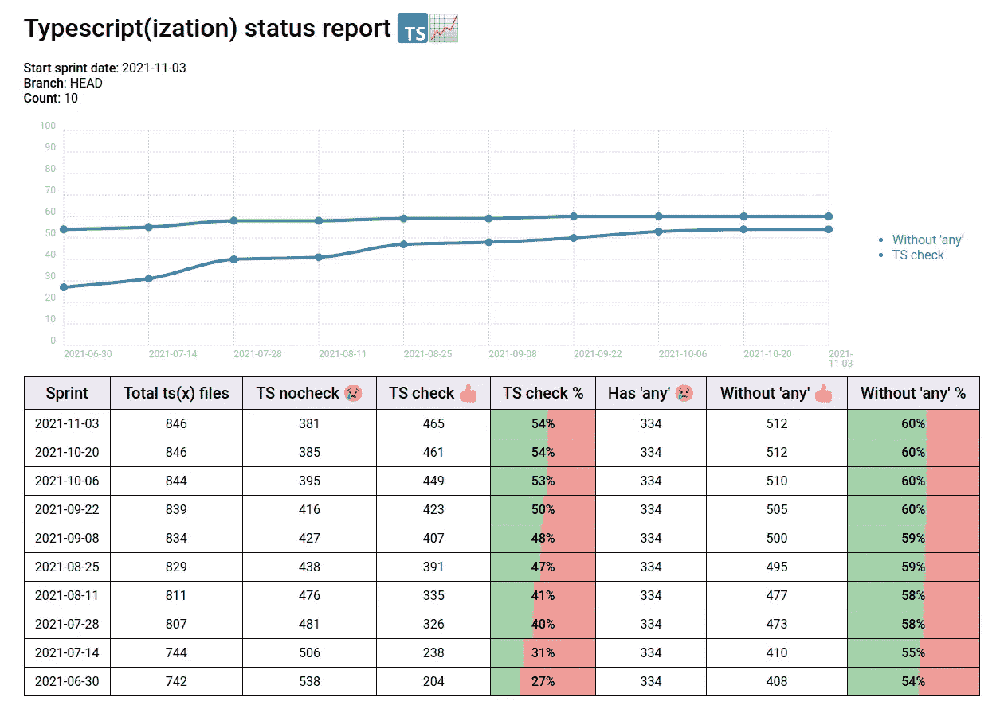
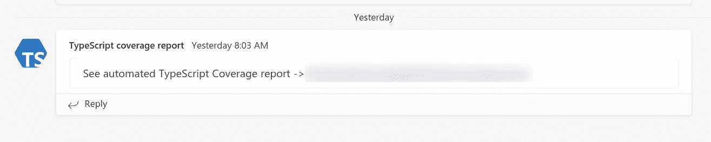

# 通过自动化报告推动 TypeScript 的采用

> 原文：<https://betterprogramming.pub/driving-typescript-adoption-with-automated-reports-dee725298302>

## 如何优先清理你的代码库

[蓝登](https://unsplash.com/@landall?utm_source=medium&utm_medium=referral)在 [Unsplash](https://unsplash.com?utm_source=medium&utm_medium=referral) 上拍照

第一，TypeScript 好。但这不是这篇文章的内容。它是关于如果你工作中的代码库没有足够的代码该怎么办。

> "你在你的 React 代码库中使用类型脚本吗？"我在一次求职面试中问我未来的老板。
> 
> “是的。”答案是。
> 
> “太好了！”

但是，唉，这并不伟大。我应该问，“你在多大程度上使用了 TypeScript？”。TypeScript 采用不是二元状态，而是一个谱。

像许多老的 React 项目一样，代码库被重写为 TypeScript，以一种“用 TypeScript 写新东西，有时间时修复旧东西”的方式。但是，如果没有一个设定的目标和一个衡量进展的标准，激励总是放在提供新功能上，而不是解决技术债务。

切换后几个月，大部分代码仍然是无类型的，进展缓慢。我们知道从长远来看重写打字稿是有价值的。但是为了证明在它上面花费开发时间的合理性，我们想要跟踪和可视化我们的进展。

# **游戏化最终目标**

1.  向您的决策者解释，在任何地方启用 TypeScript 都将有助于您提高运输速度和睡眠质量。
2.  建立一个进度条给他们看。

就是这样。[进度条很神奇](https://dl.acm.org/doi/10.1145/317456.317459)。它们简单得有些愚蠢，但却很有效。RPG 玩家会苦干几个小时让他们的老圣骑士升到 75 级或者别的什么。目标清晰推动动力。人们做事是为了看到数字上升。出于同样的原因，开发人员会修复 TypeScript 错误。你可以在每个重要的里程碑给他们买披萨。

不要误解我的意思，开发人员本质上是并且应该被激励去提高代码质量。但是这种情况发生了:

> “为什么这项任务需要这么长时间？”— PM
> 
> "嗯，有许多打字稿要添加和修改."—开发
> 
> “呃，好吧，听起来像是一个借口，但无论如何，我们能专注于提供客户价值吗？”— PM(可能在他的脑子里)

也许下一次你会把代码弄得和你发现的一样乱，以便在下一个任务中取得进展。你解决技术债务的工作是看不见的，只会碍事。或者对话可以这样进行:

> “为什么这项任务需要这么长时间？”— PM
> 
> “嗯，有很多打字稿需要添加和修改，所以我把它修好了。看到进度条了吗？在这个冲刺阶段，我们将打字稿覆盖率从 54%提高到了 60%。我们越接近 100，我们作为一个团队的长期速度就越快。”—开发
> 
> “我明白了，干得好。”— PM

你的工作不再是无形的了。它使团队朝着既定目标**前进了特定的量**。“有所衡量，有所作为”在这里很适用。

# 衡量正确的事情

衡量 TypeScript 的适应性取决于您是否真的采用了 TypeScript。

也许你有`.js(x)`和`.ts(x)`档并排生活。这是最干净的选择。你可以用一个小魔术来计算它们:

数一数。js(x)和。ts(x)文件来计算类型脚本覆盖率

事实上，GitHub 和 GitLab 都会自动显示你的库的语言统计数据。

也许你所有的文件都是`.ts`，但是你输入的所有文件都是`any`。最好使用一种工具来分析你的`any`使用情况并给出报告:

*   [类型-覆盖范围](https://github.com/plantain-00/type-coverage)
*   [打印-覆盖-报告](https://github.com/alexcanessa/typescript-coverage-report)

也许你的情况很乱。你的文件是`.ts`并且包含一些类型，但是大多数都有`@ts-nocheck`标志在最上面。然后，您需要计算违规文件的数量:

计算包含@ts-nocheck 的文件的百分比，以计算 TypeScript 覆盖率

你可以对`@ts-ignore`做类似的事情。无论问题是什么，你都需要相应地调整你的测量。

# 构建报告

百分比很好，但是你真的想要一个漂亮的彩色进度条。红色是坏的，绿色是好的。至关重要的是，它有助于及时看到进展，看到绿色慢慢击败红色，慢慢走向胜利。时间表也会有所帮助。

我们的报告——在一天的黑客马拉松中拼凑而成——看起来像这样:

我们使用 bash 脚本对文件进行计数，并生成一个带有表格和图表的 HTML 文件。但是你可以用任何东西。

# 自动化报告

如果没有人看，进度条是没有用的。把数字放在人们面前很重要，这样他们就不用去挖了。尽可能消除摩擦。在我们的案例中，这意味着每周安排一次 GitLab 管道:

1.  在我们的存储库上运行`ts-report` bash 脚本并生成报告。
2.  将报告上传到 [GitLab 页面](https://docs.gitlab.com/ee/user/project/pages/#how-it-works)。
3.  [向团队频道](https://docs.microsoft.com/en-us/microsoftteams/platform/webhooks-and-connectors/how-to/add-incoming-webhook)发送带有报告链接的消息。

我们的`.gitlab-ci.yml`文件中的`pages`作业(简体)

然后每周一次，我们得到这个:

将报告直接放在消息中会更好，但现在这样就可以了。延期通知或电子邮件也可以。选择你的团队最常用的沟通工具。

# 让自己负起责任

最后一步是分享你的进步。我们的 sprint 评论有一个关于技术债务更新的专用幻灯片，所以我们在那里讨论我们的 TypeScript 覆盖范围。进度条可能是有效的，即使只在团队内部使用。但是更好的办法是公开承诺一个目标，并定期向利益相关者更新。

自构建报告以来，我们的 TypeScript 采用速度显著提高。(新团队成员等其他因素也有帮助。)

这一次是打字稿覆盖，但是您可以将相同的想法应用于不同类型的长期技术债务:

*让看不见的工作不仅仅是看得见的，还要让看得见的工作变得容易，这样工作会完成得更快。*

感谢您的阅读！你知道更好的方法吗？