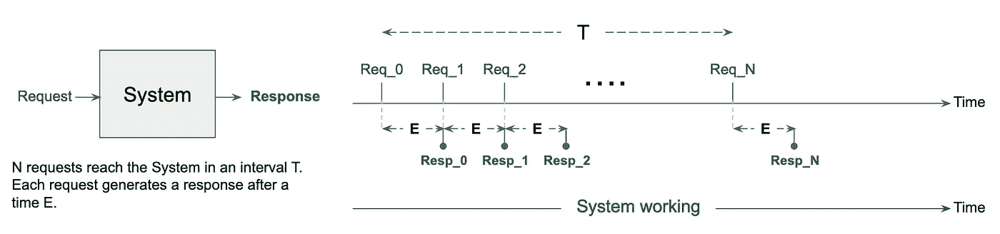
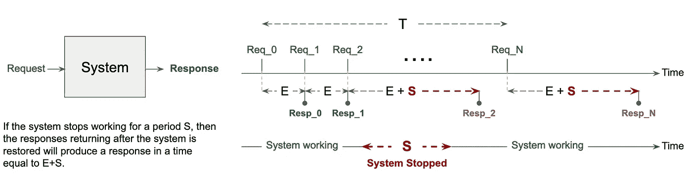
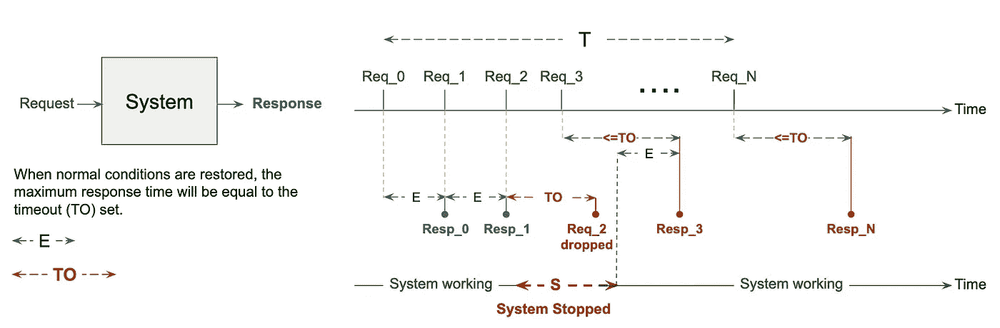
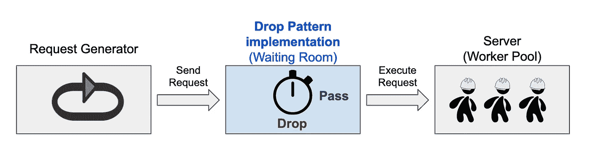
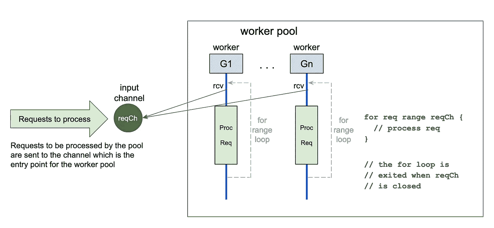
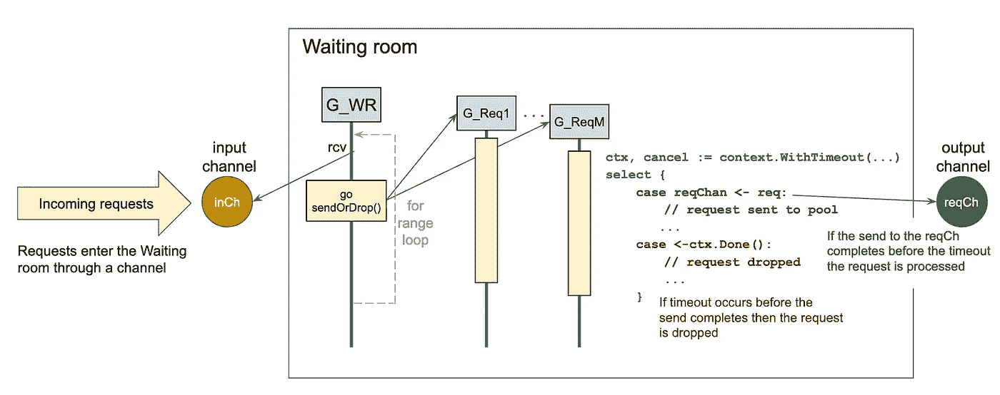

# Go 中超时的丢弃模式

> 原文：<https://betterprogramming.pub/drop-pattern-with-timeout-in-go-29c41b0488b7>

## 简单看一下这个极其有用的功能

通常，服务器端系统的规模可以处理预期数量的传入请求。如果设计是正确的，向服务器发送请求的客户机在正常工作条件下，在特定系统可接受的延迟内收到响应。

然而，有时工作条件会变得不正常。数据库会降低其性能，网络变慢，并且突然出现请求高峰。

在这种情况下，请求开始在队列中堆积，客户端经历响应延迟，最终整个系统可能崩溃。

在这种情况下，系统“抵制数据流”这种现象称为[背压](https://medium.com/@jayphelps/backpressure-explained-the-flow-of-data-through-software-2350b3e77ce7)。

这与交通拥挤时高速公路上发生的现象相同。只要不发生事故或者汽车密度低于某个阈值，汽车就会以合理的速度流动。事故一发生，汽车就开始排队。即使在道路清理完毕后，这些长队还会持续很长时间，尽管我们可能经历过堵在高速公路中间的烦恼。

我们对汽车和高速公路无能为力，但有了 IT 系统，我们可以在异常情况发生时找到减少损失的策略。一种这样的策略是所谓的“超时丢弃模式”，这意味着如果请求等待的时间太长，就取消请求。

让我们更详细地看看这种模式是如何工作的，并使用 Go 举例说明这种模式的一种可能的实现。

# 队列和延迟传播

让我们考虑一个理想的系统，其中服务器的大小可以响应不断传入的请求。

换句话说，具有以下特征:

*   服务器可以服务一个执行时间为`E`的请求
*   请求到达的时间间隔等于`E`

一种系统，其大小正好能以指定的延迟响应请求

在这种情况下，如果服务器在一段时间内停止响应，一旦它再次运行，就会有一个请求队列等待处理。因为，在这个理想的场景中，每个请求需要`E`时间来执行和产生响应，在停止之后，客户端将经历`E+S`的响应时间，这意味着与正常情况相比有`S`的延迟。同样重要的是，在问题出现后，这种延迟对于所有到达服务器的请求都将保持不变，并且永远不会减少。

服务器的停止会产生一个随时间传播的延迟

这是一个极端的例子，但有助于说明这样一个事实:如果我们什么都不做，事故的负面影响可能会在事故解决后很长时间内传播(事故解决后几个小时，你可能会在高速公路上排队)。

# 暂停救援

减轻这些长期负面影响的常用策略之一是引入超时。如果请求在队列中停留的时间超过了一定的限制(超时)，该请求将被终止并从队列中删除。

这是以一些请求失败为代价的，一些客户端会收到超时错误消息，但它带来的好处是当正常工作条件重新建立时，限制了所有其他客户端的延迟。

超时表示请求可以拥有的最大响应时间

在我们的理想情况下，如果我们设置一个等于`TO`的超时，在事件被解决后进入的请求将经历最多等于`TO`的响应时间(如果是`TO < E+S`，这比前面的情况有所改进)。

这就是“超时丢弃模式”的工作原理。

# Go 中超时的丢弃模式

使用通道、上下文和 goroutines 可以在 Go 中实现“超时丢弃模式”。这个模式实现的所有代码都可以在[这个 repo](https://github.com/EnricoPicci/drop-pattern-with-timeout/tree/master/) 中找到。

## 起作用的因素

要查看“超时丢弃模式”的运行情况，我们需要三个基本要素:

*   能够以一定吞吐量处理请求的服务器
*   我们希望服务器处理的请求的生成器
*   类似于位于中间的等候室，实现“超时丢弃模式”逻辑

起作用的因素

让我们更详细地看看这些元素。

## 工人池服务器

我们将使用一个工作池来实现一个可以并发服务请求的服务器(服务器是一个工作池的事实与模式无关，它只是实现服务器的一种常见方式)。

工人池是按照标准的 Go 模式实现的。启动一组 goroutines，每个实现一个 worker。每个工作者在池的输入通道的接收端循环，`reqCh`。

工人一收到请求，就开始处理它。当一个请求的处理完成时，worker 返回到输入通道`reqCh`上的 receive，准备开始处理一个新的请求。

工人池

实现工人池的代码可以在[这里](https://github.com/EnricoPicci/drop-pattern-with-timeout/tree/master/src/workerpool)找到。

## “超时丢弃模式”的实现

“带超时的丢弃模式”核心的实现基于带超时的`context`和强大的`select` on channels 语句的使用。在示例代码中，逻辑是由`WaitingRoom`类型实现的。

等候室实施“超时丢弃模式”

必须进入等候室的请求被发送到其输入通道`inCh`。驱动等候室工作的 goroutine 从该通道中读取数据，并为每个请求启动一个新的 goroutine，启动`sendOrDrop`功能，其中实现了“超时丢弃模式”的核心逻辑。

对于每个请求，`sendOrDrop`函数创建一个超时的`context`，然后在通道上运行`select`语句。

在第一种情况下,`select`检查工作池输入通道上的发送,`reqCh`是否完成。如果请求完成，池中的一个工作线程已经收到请求，并将处理它。

第二种情况使用`select`检查`context`的`Done`通道是否关闭。如果发生这种情况，这意味着在请求能够被池接收之前，超时已经过期，因此，请求必须被丢弃。

实现`WaitingRoom`的代码可以在这里找到[。](https://github.com/EnricoPicci/drop-pattern-with-timeout/tree/master/src/waitingroom)

# 请求生成器

请求生成器可以是生成请求的任何东西，从 REST 端点到接收消息的队列。

在我们的例子中，为了简单起见，我们有一个简单的 Go 函数，它生成请求并将它们发送给`WaitingRoom`。

# 最终的画面

因此，使用两个通道实现“带超时的丢弃模式”，一个作为`WaitingRoom`的输入，一个作为服务器的输入(以及作为`WaitingRoom`本身的输出)，带超时的`context`和`select` on channels 语句，所有这些都由 goroutines 提供的并发性支持。

“超时丢弃模式”的一个工作示例在[这个回购](https://github.com/EnricoPicci/drop-pattern-with-timeout/tree/master/)中实现。