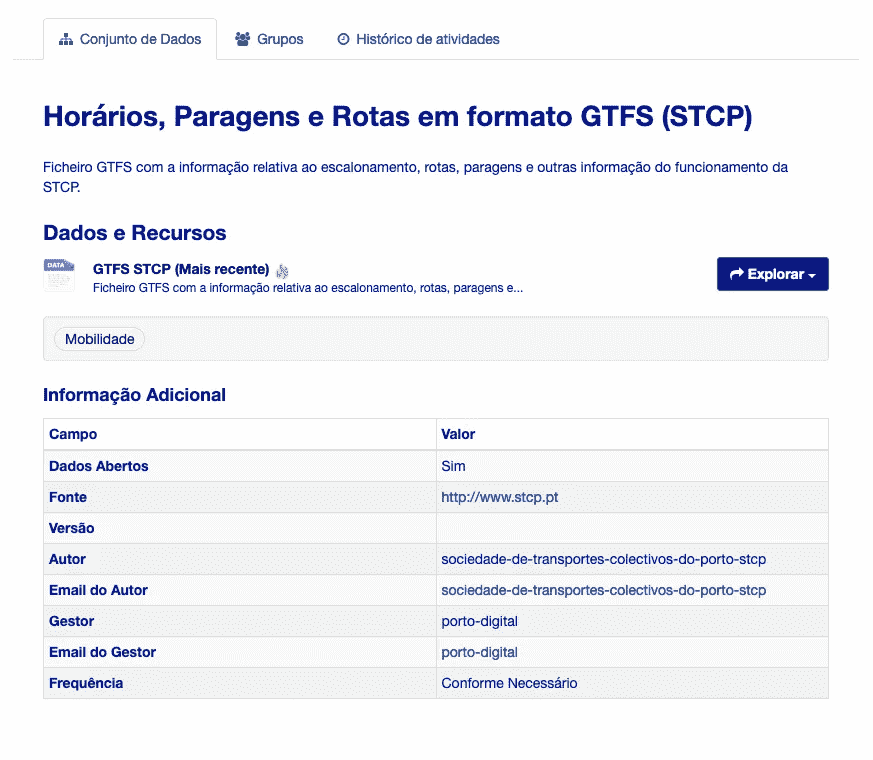
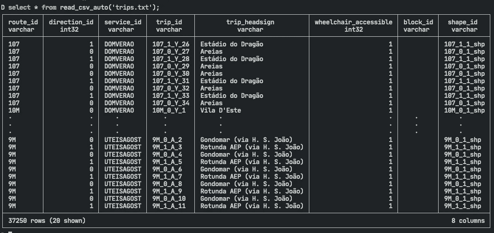
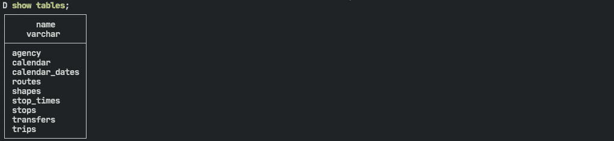
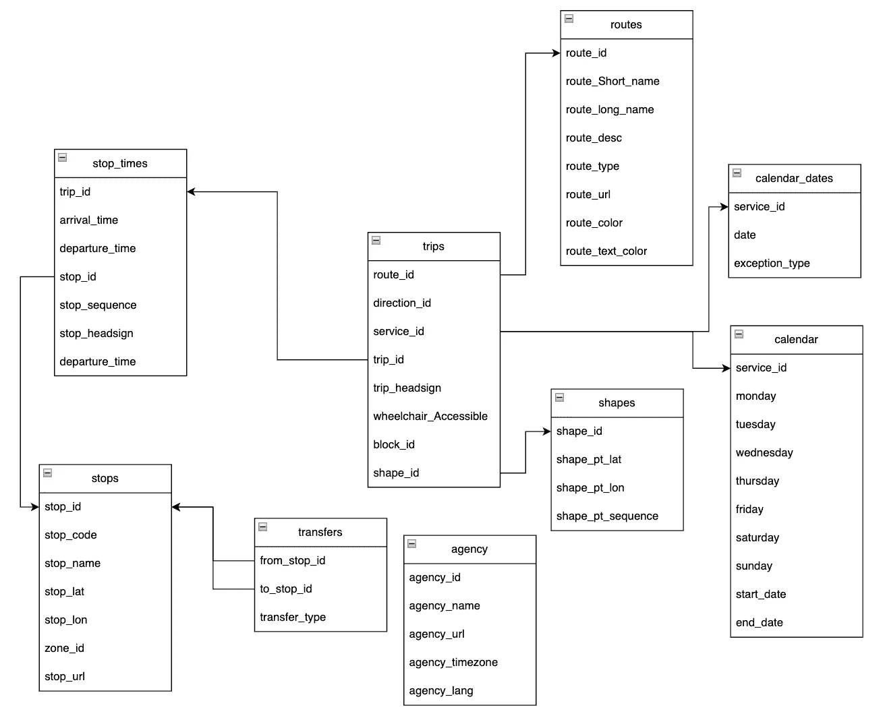
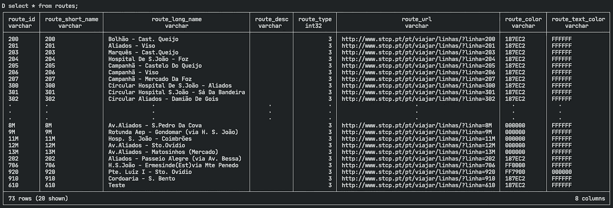
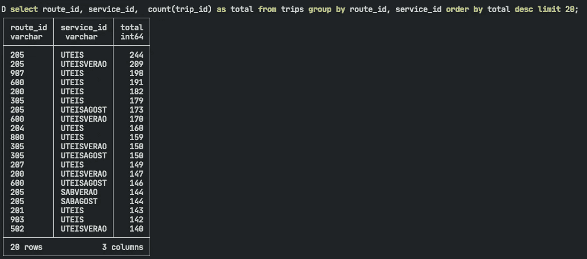

# DuckDB vs. Porto Buses 新 OLAP 发动机的一个小案例

> 原文：<https://betterprogramming.pub/duckdb-vs-porto-buses-a-small-case-for-a-new-olap-engine-1c04b898d293>

## 如何在只有一些 SQL 知识的情况下使用 DuckDB 进行局部分析


图片来自联合国西班牙语网站 Daniel Seß ler 的照片

近年来，一个新的数据库 DuckDB 越来越受欢迎。对于许多公司来说，红移等其他替代方案过于昂贵。在开源领域，Postgres 关注的是交易，而不是数据分析。

Clickhouse 有一个复杂的体系结构来处理与 Redshift 相同规模的数据。有没有可能像我们拥有 Sqlite 一样，拥有一个小而精简的数据库来进行分析？

起初，我并不理解它的吸引力，但我决定拿它来测试一下。它可能会被证明对于快速分析和作为数据平台的替代物是很棒的。

# 鸭子…什么？

那么 DuckDB 是什么呢？如果我们进入他们的[页面](https://duckdb.org/)，我们会看到:

> “DuckDB 是一个进程内 SQL OLAP 数据库管理系统”。

换句话说，这意味着我们可以只执行一个文件，导入数据，并分析它。我们不需要复杂的分布式系统，只要它运行在单台机器上(看你火花)。

文档显示它有内置的工具来读取 CSV、Parquet 和 Postgres 表。这看起来已经很有希望了，让我们来测试一下吧！

> **注** : DuckDB 可以在 python 内部运行，读写熊猫数据帧。这是它在 Python 社区如此受欢迎的特性之一！然而，为了保持专注，我将把它留给另一篇文章。

# 怎么安装？

对于本文，我正在用 Macbook Pro M1 进行测试，并将运行版本`0.6.0`。要安装它，您可以做如下:

```
wget https://github.com/duckdb/duckdb/releases/download/v0.6.0/duckdb_cli-osx-universal.zip unzip duckdb_cli-osx-universal.zip

unzip duckdb_cli-osx-universal.zip
```

我们现在可以通过调用可执行文件在终端上使用 DuckDB。/duckdb。但是我们可以做得更好，用`brew install duckdb`让 DB 在系统范围内可用(需要[自制](https://brew.sh/))。

从任何控制台运行 Duckdb，现在您将看到一个新的会话🙂。

# 让我们用一些本地数据来测试一下

对于这个测试，我将利用这个机会分析我的本地公共汽车(葡萄牙🇵🇹).的 Porto)的时间表幸运的是，市政会有一个开放的数据门户。搜索了一下，发现了一个[数据集](https://opendata.porto.digital/dataset/horarios-paragens-e-rotas-em-formato-gtfs-stcp)，正好是我们需要的(⚠️门户是葡萄牙语)。



我们通过单击“transfer”按钮继续传输它，或者您可以运行以下命令:

```
wget https://opendata.porto.digital/dataset/5275c986-592c-43f5-8f87-aabbd4e4f3a4/resource/1f845744-1962-4108-a20c-ac3357d0957b/download/gtfs-stcp.zip unzip gtfs-stcp.zip
unzip gtfs-stcp.zip
```

zip 包含 9 个文件:

*   routes.txt
*   calendar.txt
*   stops.txt
*   trips.txt
*   形状. txt
*   停止 _ 时间. txt
*   calendar _ dates.txt
*   agency.txt
*   transfers.txt

虽然它们是文本文件，但打开后我们可以看到它们遵循 CSV 格式。这很好，因为 DuckDB 有一个本机函数`read_csv_auto`来读取这些文件。



这是一个很好的特性，但是我们不想每次运行查询时都导入文件。因此，下一步是为每个文件创建一个表:

```
create table routes as select * from read_csv_auto('routes.txt');
create table calendar as select * from read_csv_auto('calendar.txt');
create table stops as select * from read_csv_auto('stops.txt');
create table trips as select * from read_csv_auto('trips.txt');
create table shapes as select * from read_csv_auto('shapes.txt');
create table stop_times as select * from read_csv_auto('stop_times.txt');
create table calendar_dates as select * from read_csv_auto('calendar_dates.txt');
create table transfers as select * from read_csv_auto('transfers.txt');

-- For some reason this file requires the additional parameter to detect the headers
create table agency as select * from read_csv_auto('agency.txt' , header=True);
```

运行这个命令后，您可以检查用`show tables`创建的表。



整洁的🤌🏼但是…

如果你关闭外壳或者电脑关机会发生什么？嗯，我们会很难过地失去一切。为了解决这个问题，DuckDB 可以通过创建一个*来存储所有数据。duckdb 文件(非常类似于 SQLite 的工作方式)。这意味着不允许有并发的写者(只有读者)。但是，对于我们的用例来说，这不是困扰我们的问题。

因此，为了在测试中取得进展，我们将执行`.open main.duckdb`。此命令打开当前目录中的现有文件或创建一个新文件。从这一刻起，你所做的一切都将被永久保存。或者直到您删除该文件。否则硬盘会爆炸。无论什么先来，🧨.

这提醒我，如果您再次运行`show tables`，您将看到您创建的表不再存在😅。这是因为在我们运行`.open`之前，我们一直把所有东西都存储在内存中。您需要再次运行上面的命令。这样，当我们想返回这个数据库时，我们只需运行`duckdb main.duckdb`。

简单干净，你说呢？

# 我们可以用 DuckDB 做什么？

通过上面的步骤，我们可以继续分析我们的数据集。对于这个测试，我想出了两个问题:

1.  我们有多少条路线？每条路线有多少站？
2.  公共汽车的频率是多少？

要回答这些问题，我们应该首先检查我们的表的模式(对于本文，我手动绘制这个模式)。



数据集的模式

> 我们有多少条路线？每条路线有多少站？

对于第一个问题，我们可以用 select 语句检查路由表。



第一列名为 route_id，如果唯一的话，它将正确地指出我们有多少行。为此，我们运行两个查询:

```
select count(*) from routes;

select count(distinct route_id) from routes;
```

两者都返回 73，所以我们可以有把握地说，在波尔图有 73 条路由。但是我们每条线有几站？

```
create table route_stops as
with stops_routes as (

    select distinct (
    routes.route_short_name,
    stop_times.stop_id) as routes
    from
        trips
    inner join routes
        on trips.route_id = routes.route_id
    inner join stop_times
        on stop_times.trip_id = trips.trip_id
)
select
    routes.route_short_name as routes_name,
    count(routes.stop_id) as total
from stops_routes
group by routes_name
order by total desc;

-- Linted with sqlfluff
```

现在我们得到了一个漂亮的结果表。现在我们得到了一个漂亮的结果表。从该表中，我们了解到平均停留次数为 70 次。并且它可以少到 21(路线 [920](https://www.stcp.pt/pt/viajar/linhas/?linha=920) 和 [910](https://www.stcp.pt/pt/viajar/linhas/?linha=910) )到 121(路线 [508](https://www.stcp.pt/pt/viajar/linhas/?linha=508) 和 [603](https://www.stcp.pt/pt/viajar/linhas/?linha=603) )。所有这些都使用聚合函数 avg、min 和 max。

```
select avg(total) from route_stops;
select min(total) from route_stops;
select max(total) from route_stops;

-- To get exactly which routes have the fewer and most stops respectivelly
select * from route_stops order by total asc limit 10;
select * from route_stops order by total desc limit 10;
```

> 公共汽车的频率是多少？

要回答这个问题，我们可以看看 trips 表。

```
select
    route_id,
    count(trip_id) as total
from trips group by route_id order by total desc limit 10;
```


这一切都很好，但是如果我们按不同的时期分配旅行，那会更有用。为了简单起见，我们可以使用 service_id 来定义工作日的“类型”:

*   八月的周末
*   DOMAGOST:八月的星期天
*   UTEIS:工作日
*   唐:星期天
*   萨博:星期六
*   SABVERAO:夏季的星期六
*   冬至:夏季的星期天
*   UTEISVERAO:夏季的工作日

```
select
    route_id,
    service_id,
    count(trip_id) as total
from trips group by route_id, service_id order by total desc limit 10;
```



现在我们得到了更有趣的东西来分析。到目前为止，205 号路线是工作日最频繁的路线。另一个值得注意的路线是 [907](https://www.stcp.pt/pt/viajar/linhas/?linha=907) 。这是工作日第二常见的路线，但在周末，它从前 20 名中消失了。这表明它主要是工人的路线。

# 结论

在这篇文章中，我试图展示我们如何在只有一些 SQL 知识的情况下使用 DuckDB 进行局部分析。但现在我想进一步测试。我希望在未来回答的一些问题是:

*   DuckDB + Jupyter 笔记本的 DevX 是什么？
*   操作 S3 数据有多容易？还有 Postgres？
*   DuckDB + dbt 有多稳定？
*   我们能在数据平台中使用它吗？

*最初发布于*[*https://*](https://blog-migsz1hey-jecabeda.vercel.app/2022/20221117-duckdb_transports/)*cabeda . dev*