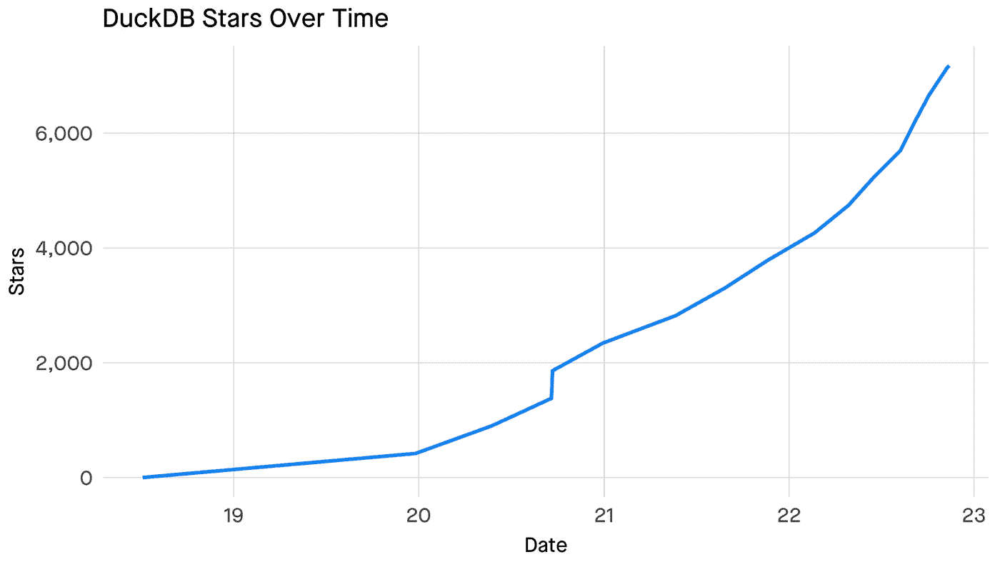
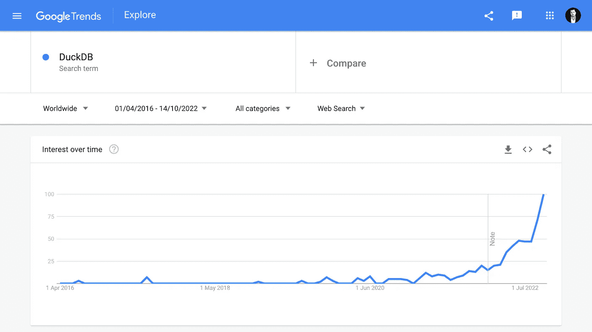
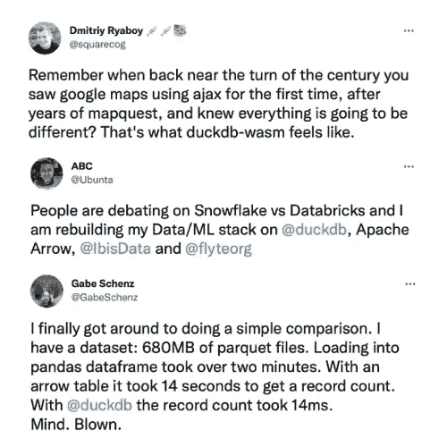
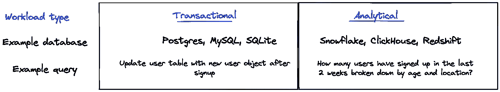
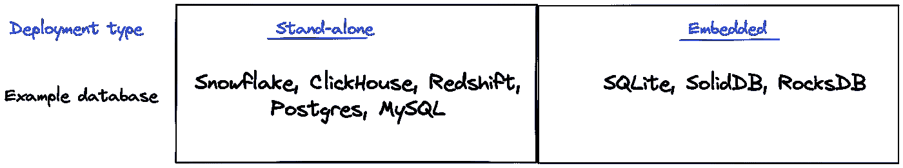
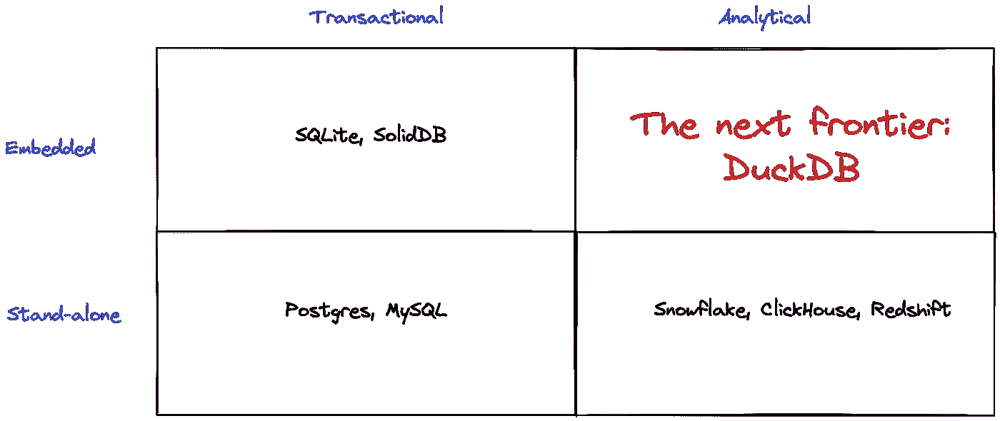

# duck db——炒作什么？

> 原文：<https://betterprogramming.pub/duckdb-whats-the-hype-about-5d46aaa73196>

## 当我看到围绕 [DuckDB](https://duckdb.org/) 的炒作开始达到新的高度时，我已经计划在春天写这篇博文了。从那以后，围绕 DuckDB 的讨论在开发人员和数据工程社区中愈演愈烈。我目前在数据社区中看到两个高参与度的趋势:DuckDB 和 [Rust 接管数据工程](https://airbyte.com/blog/rust-for-data-engineering?utm_source=pocket_saves)。但是围绕 DuckDB 的炒作到底是为了什么呢？让我们稍微了解一下表面。

[DuckDB Github stars](https://github.com/duckdb/duckdb) 随着时间的推移

当今数据领域的加速发展与过去几年云数据仓库的爆炸性增长密切相关。云数据仓库已经成为数据堆栈的基石:各种规模的公司和组织都使用数据仓库来支持分析用例。雪花的迅速崛起——以 2020 年 9 月的轰动性 IPO 达到高潮，成为历史上最大的软件 IPO——一直是这一趋势的典型代表。

当看到大数据的[3v](https://www.techtarget.com/whatis/definition/3Vs)(速度、容量、多样性)时，我最近交谈过的数据社区中的许多人都说，过去几年中最需要的维度是速度。

正如 Mehdi Ouazza(Trade Republic 的员工数据工程师)所指出的那样，事实是，每个人都没有“大”数据，但是对 OLTP 数据库处理的数据资产的微服务的低延迟消耗需求是一个常见的用例。

正如 [Mehdi](https://www.linkedin.com/in/mehd-io/) 所说，如果你观察一些产品趋势(RocksDB、DuckDB、Clickhouse)，它们都为低延迟消费提供了更简单的接口。甚至一些云数据仓库巨头也投资了这些应用，比如[雪花 Unistore](https://www.snowflake.com/en/data-cloud/workloads/unistore/) 。

然而，当前的云数据仓库范式仍然严重偏向于客户端-服务器用例，并且忽略了不断增长的用户群。正如 Tomasz Tunguz (红点风险投资公司的投资者)所指出的:

> “大多数工作负载并不庞大。无需在空中部署横向扩展数据库，在您的计算机上安装一个优化的数据库，可以在需要时利用云，从而加快大多数分析的速度。”

DuckDB 正在改变这一点。

谷歌趋势搜索“DuckDB”的数据

从上面的 Google 趋势搜索数据中可以看出，在过去的几个月里，数据社区中围绕 DuckDB 的讨论和宣传越来越多。

# 日益增长的势头

只要看看社交媒体上的帖子，DuckDB 背后的增长势头就变得显而易见。例如，[罗伯特·萨赫林](https://www.linkedin.com/in/robertsahlin/)(MatHem 的数据工程主管)，[7 月份在 LinkedIn 上记录了以下](https://www.linkedin.com/posts/robertsahlin_read-bq-table-to-duckdb-directly-from-storage-activity-6949849237752852480-tod6?utm_source=linkedin_share&utm_medium=member_desktop_web):

> “最近我听到了很多关于 DuckDB 的好消息，并发现乔丹·蒂加尼(MotherDuck 和 BigQuery 名人网站的创始人)和汉尼斯·米莱森(DuckDB 实验室的创始人)的播客非常好。因此我不得不试一试。我的第一个程序是通过使用 BigQuery 存储读取 API 直接从 BigQuery 表中读取来创建 DuckDB 表，因为它支持箭头表(不支持计算)。原来真的很简单，分享作为主旨。我迫不及待地想用 DuckDB 和更大的数据量进行更多的实验，它肯定有巨大的潜力。”

罗伯特肯定不是唯一一个在阅读社交媒体帖子时对 DuckDB 感到兴奋的人(我建议在 LinkedIn 或 Twitter 上搜索#duckdb 标签)。例如 [Abhishek Choudhary](https://www.linkedin.com/in/iamabhishekchoudhary/) (高级首席数据工程师 Bayer)最近在 [LinkedIn](https://www.linkedin.com/feed/update/urn:li:activity:6954034470370873345?utm_source=linkedin_share&utm_medium=member_desktop_web) 上写了以下内容:

> “观点:数据工程/数据科学最令人兴奋的新技术之一是 DuckDB。DuckDB 的速度快得惊人，有了 Apache Arrow，这两人组能够提供惊人的结果。DuckDB 背后的另一个要点是它很简单。它没有宣称任何突破性的东西，但坚持简单和更快的数据访问的核心。”

然而，我最喜欢的关于 DuckDB 的社交媒体评论最有可能是由 [Josh Wills](https://www.linkedin.com/in/josh-wills-13882b/) 在[的 Twitter 帖子](https://twitter.com/josh_wills/status/1565738898436661248)中发表的，该帖子讨论了总是很有趣的 Benn Stancil 的“[雪花如何失败](https://benn.substack.com/p/how-snowflake-fails)”博客帖子(我推荐订阅他的[子帖子](https://benn.substack.com/)):

下面是一些额外的推文截图，展示了 DuckDB 目前在数据社区引发的兴趣:

图片来源 [Madrona](https://www.madrona.com/why-madrona-invested-in-motherduck/)

## 在 DuckDB 上构建托管解决方案

这是一个非常经典的剧本——使用一个展示动力的开源工具，并在它的基础上构建一个服务。比如 Databricks 用 Spark 做到了这一点，用 Kafka 做到了合流。

[Jordan Tigan](https://www.linkedin.com/in/jordantigani/) 我是谷歌 BigQuery 的长期产品负责人(罗伯特萨赫林早些时候提到的 BigQuery 名人)，他在 5 月份宣布，他正在联合创建一个名为 [MotherDuck](https://motherduck.com/) 的无服务器云版本 DuckDB。和他一起的是他的谷歌同事蒂诺·特雷什科。

除了 MotherDuck，我们还有 [DuckDB Labs](https://www.duckdblabs.com/?ref=hackernoon.com) ，这是一家商业公司，由[汉尼斯·穆莱森](https://www.linkedin.com/in/hfmuehleisen/?originalSubdomain=nl)和 DuckDB 的其他创作者于 2021 年 7 月成立，提供支持、定制扩展，甚至定制版本的产品，以此作为一种赚钱的方式。

正如 Lauren Balik 在她的博客文章“对 2023 年数据的 6 个基于现实的预测”中指出的那样，风险投资家和数据专业人士涌向 DuckDB 是正确的。

这种兴趣昨天实现了，MotherDuck 宣布了由 a16z(例如 Databricks 的早期投资者)和 Redpoint Ventures(例如 Snowflake 的早期投资者)牵头的 4750 万美元的融资轮。MotherDuck 和 DuckDB Labs 同时宣布了一项[战略合作](https://duckdblabs.com/news/2022/11/15/motherduck-partnership.html)。

Jordan Tigani(mother duck 的联合创始人)在宣布融资时向 [TechCrunch](https://techcrunch.com/2022/11/15/motherduck-secures-investment-from-andreessen-horowitz-to-commercialize-duckdb/) 发表了以下评论:

> “用户希望他们的问题得到简单快速的答案，他们不想等待云的到来……事实是，现代笔记本电脑比现代数据仓库更快。云数据供应商专注于 100TB 查询的性能，这不仅与绝大多数用户无关，还会分散供应商提供出色用户体验的能力。"

# 但是这种炒作到底是怎么回事呢？让我们稍微了解一下表面。

DuckDB 是一个易于使用的开源进程内 OLAP 数据库(它在内存中处理数据，不需要专用的服务器/服务)，许多人用简化的术语将其描述为分析 OLAP 工作负载的 SQLite 等价物。

在 HackerNoon 上，曾经[把它](https://hackernoon.com/what-the-heck-is-duckdb)描述为“SQLite 和 Redshift 的突变后代”。

正如 MoterDuck 团队所指出的那样，作为一个进程内数据库，DuckDB 是一个存储和计算引擎，使开发人员、数据科学家、数据工程师和数据分析师能够使用普通 SQL 以极快的速度分析他们的代码。此外，DuckDB 能够分析数据所在的位置，例如笔记本电脑或云中。此外， [DuckDB 附带了一个简单的 CLI](https://duckdb.org/docs/api/cli) 用于快速原型开发——不需要设置、许可、创建和管理表等。

根据在 HackerNews、Reddit 和 Twitter 等网站上阅读的帖子，DuckDB 似乎有很多优点，例如:

*   它在单节点机器上的分析工作负载的性能似乎令人印象深刻，并且设置起来没有痛苦(从技术上讲，您可以在 5 分钟内开始探索 DuckDB)。
*   像 SQLite 一样，DuckDB 是可嵌入的，并针对分析进行了优化。这里最重要的是可嵌入部分(就像一个没有引入典型 PostgreSQL 依赖的库)，消除了与数据库对话时通常会遇到的网络延迟。
*   DuckDB 的部署工作量也非常低，只需“安装 duckdb ”,您就可以开始比赛了。
*   此外，DuckDB 更快——与查询 Postgres 相比， [DuckDB 快了 80 倍](https://www.dataduel.co/revisiting-data-query-speed-with-duckdb/),当对其他系统进行基准测试时，我们可以看到[类似的令人印象深刻的结果](https://duckdb.org/2021/08/27/external-sorting.html)。

这些是 DuckDB 在过去的 12 个月里[经历了令人印象深刻的增长](https://db-engines.com/en/ranking_trend/system/DuckDB)的部分原因。

在实践中，任何 CPU 都可以通过 DuckDB 进行强大的分析。此外，DuckDB 是可移植的和模块化的，没有外部依赖性。具体来说，这意味着您可以在云虚拟机、云功能、浏览器或之前提到的笔记本电脑上运行 DuckDB。

## 让我们后退一步

在接下来的章节中，我将大量引用 Matrix Partners 的投资者 Kojo Osei 在 6 月份发表的关于 DuckDB 的博客文章。

正如 Kojo 提到的，一个新兴的数据仓库类别位于分析查询和嵌入式部署的交叉点。为了说明这一点为何如此引人注目，他沿着两条轴线对数据库进行了分类:

数据库工作负载类型(图片来源 [Kojo Osei](https://kojo.blog/duckdb/)

如上所述，Kojo 指出，当前的数据库针对分析或事务性工作负载进行了优化。分析工作负载也称为在线分析处理(OLAP)，是对历史数据的复杂查询。例如，您可能希望分析按人口统计(如年龄和位置)细分的用户注册。另一方面，事务性工作负载(也称为在线事务处理(OLTP))针对快速实时读写进行了优化。

让我们继续讨论部署类型。

数据库部署类型(图片来源 [Kojo Osei](https://kojo.blog/duckdb/)

如上所述，Kojo 指出，当前的数据库技术是作为独立或嵌入式解决方案部署的。独立数据库通常部署在客户机-服务器模式中。数据库位于中央服务器上，由客户端应用程序查询。嵌入式数据库运行在任何访问数据库的应用程序的主机进程中。

现在来点魔法。当我们合并这两个轴时，我们可以看到创新差距！正如 Kojo 所强调的，目前 OLAP 数据库的创新集中在独立的 OLAP 数据库上，如 Snowflake、ClickHouse 和 Redshift(不知道他为什么遗漏了 BigQuery)。这导致了嵌入式分析用例被忽视和服务不足的情况。DuckDB 正在改变这一点。

图片来源 [Kojo Osei](https://kojo.blog/duckdb/)

## DuckDB 的用例

Airbyte 的术语表中有[对 DuckDB 用例示例的简短总结:](https://glossary.airbyte.com/term/duckdb/?fbclid=IwAR35TXxCxK5cmAVuwzD8lGnTbudO6m8NcK_Kyd4q-0l77uxTB5U8_szLHeY)

*   本地超快速分析用例。例如， [Airbyte 词汇表](https://glossary.airbyte.com/term/duckdb/?fbclid=IwAR35TXxCxK5cmAVuwzD8lGnTbudO6m8NcK_Kyd4q-0l77uxTB5U8_szLHeY)中的出租车示例包括一个 10 年、15 亿行的出租车数据示例，它仍然可以在笔记本电脑上工作。见基准[此处](https://glossary.airbyte.com/term/duckdb/?fbclid=IwAR35TXxCxK5cmAVuwzD8lGnTbudO6m8NcK_Kyd4q-0l77uxTB5U8_szLHeY)。
*   它可以用作零拷贝的 SQL 包装器(在 S3 的 parquets 上)。
*   将您的**数据带给用户**,而不是通过 REST 调用产生大量的往返和延迟。相反，您可以将数据放入客户端。你可以做到每秒 60 帧，因为数据是查询的地方。
*   Kubernetes 上的 DuckDB 用于零拷贝层读取数据湖[中的 S3](https://glossary.airbyte.com/term/data-lake)！受[这条](https://twitter.com/Ubunta/status/1584907743391272961)推文的启发。最便宜、最快速的入门选择。

根据[文档](https://duckdb.org/docs/)，在以下情况下应使用 DuckDB:

*   处理和存储表格数据集，例如 CSV 或拼花文件
*   进行交互式数据分析，例如连接和聚合多个大型表
*   对多个大表进行并发的大更改，例如追加行、添加/删除/更新列
*   将大量结果集传输到客户端

根据[文档](https://duckdb.org/docs/)，在以下情况下不应使用 DuckDB:

*   拥有大量交易用例(例如，跟踪电子商务订单)
*   从多个并发进程写入单个数据库
*   为集中式企业数据仓库安装大型客户机/服务器

要了解关于 DuckDB 用例的更多信息，请收听由 DuckDB 的创建者之一汉尼斯·米莱森主持的[本期数据工程播客](https://www.dataengineeringpodcast.com/duckdb-in-process-olap-database-episode-270/)(用例讨论大约在 14 分钟后开始)。

# 最后的想法

有许多数据库管理系统。但是正如 DuckDB 的创建者[所说的](https://duckdb.org/why_duckdb):没有放之四海而皆准的数据库系统。所有这些都采取不同的折衷方案，以更好地适应特定的用例。DuckDB 也不例外。

当您考虑为项目选择数据库引擎时，通常会考虑侧重于为多个并发用户提供服务的选项。有时，您真正需要的是一个运行速度极快的嵌入式数据库，能够处理单用户工作负载。输入 DuckDB。

此外，DuckDB 似乎还允许整个 SQL 爱好者社区在不学习非常基础的知识的情况下，立即提高 Python 的工作效率。越来越多的数据社区成员不再使用 Pandas 来处理任何复杂的事情，因为他们更喜欢 SQL。

[路易斯·维拉斯科](https://www.linkedin.com/in/luisvelascouk/)(谷歌数据解决方案主管)[几个月前在 LinkedIn](https://www.linkedin.com/feed/update/urn:li:activity:6963501218480431105/) 上很好地总结了他为什么认为 DuckDB 很重要:

1.我们生活在中央数据平台时代的大分解中。我能想到的更极端的计算分散模式是笔记本电脑网格。像 parquet + pyaArrow 这样的技术与矢量化执行相结合，使得在个人设备中查询大型数据集变得非常有效。

2.随着大多数数据工作者的数据素养和编码技能的提高，洞察消费不再是静态的(仪表盘),而是探索性和自助式的。所以我设想数据分析师访问云存储中的数据，用 duckDB 在本地运行嵌入式分析。

3.SQL 比以往任何时候都更有活力。

4.零部署工作—“pip install duck db ”,您就成功了

5.开源——有一个充满活力的社区正在形成，有像 pandas、dbt 或 apachesuperset 这样的关键组件的支持，更不用说像 DuckDB Labs 和 MotherDuck 这样的新兴公司了

你对 DuckDB 的未来怎么看？

PS:我推荐观看由西雅图数据人员制作的“什么是 DuckDB”视频，在视频中，他与[Joseph Machado](https://www.linkedin.com/in/josephmachado1991/)(LinkedIn 的高级数据工程师)一起讨论了 DuckDB 是如何进入数据世界的。