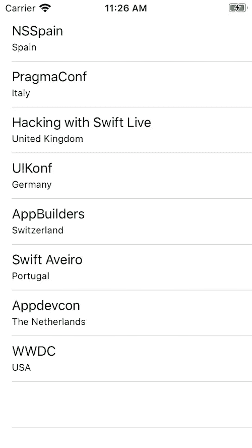
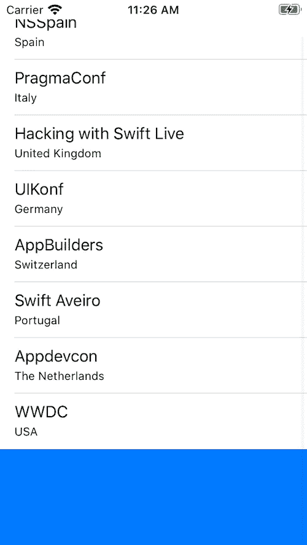
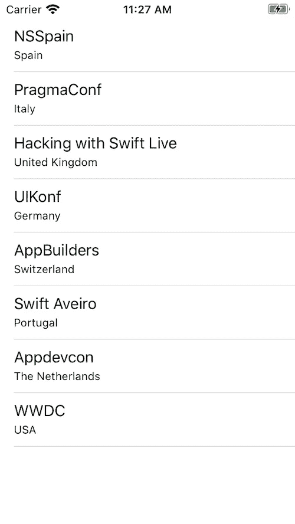
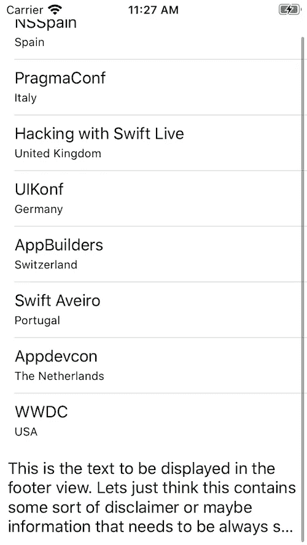
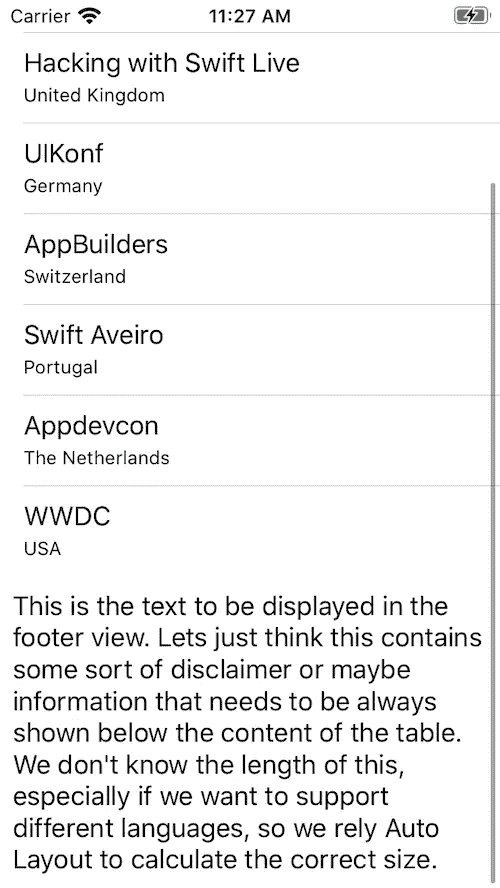

# 创建具有动态高度的 UITableView 页脚

> 原文：<https://betterprogramming.pub/dynamic-height-uitableview-footer-e99e8c04484a>

## 如何在 UITableView 页脚中使用自动布局


照片由[伊戈尔·斯塔科夫](https://www.pexels.com/@igor-starkov-233202?utm_content=attributionCopyText&utm_medium=referral&utm_source=pexels)从 [Pexels](https://www.pexels.com/photo/photo-of-people-on-building-under-construction-1117452/?utm_content=attributionCopyText&utm_medium=referral&utm_source=pexels) 拍摄

就像设置`translatesAutoresizingMaskIntoConstraints = false`这样一些简单的事情一样，我经常忘记`UITableView`的`tableFooterView` *不支持开箱即用的*自动布局。还需要一个不那么直观的额外步骤。

在本文中，我想谈谈如何使用自定义 UIView 作为带有`autoLayout`的页脚。我希望这能帮助正在尝试这样做的人——我知道下次我需要使用它时，它会帮助我自己。

# 脚注

在`UITableView`中，我们可以使用两种不同的类型:章节页脚和表格页脚。这里我们将关注后者——位于表格视图所有行下面的页脚。

对于我们的示例，我们将创建一个非常简单的`UITableView`，它将显示一些 Swift 会议的名称和地点。我不会详细说明如何设置`UITableView`，但是你可以在这里找到完整的代码。



我们的起点:不带页脚的基本 UITableView

首先，我们创建一个空的`UIView`，并将其设置为`viewDidLoad()`中的`tableFooterView`:

我们运行应用程序，可以看到蓝色的页脚，没有问题。在本例中，我们手动设置高度，默认情况下，宽度与`tableView`的宽度相同。



固定高度页脚

# 使用自动布局

现在让我们尝试使用包含一个`UILabel`的自定义`UIView`。该视图将使用自动布局，因此我们可以期望表格视图动态计算页脚大小。让我们用下面的代码替换前面的代码:



找不到页脚

如你所见，没有页脚。不幸的是，即使我们使用`autoLayout`并确保在`FooterView`中没有任何不明确的约束，系统也无法正确计算它的大小，因此它的高度为 0。如果我们手动添加一个固定的大小，我们可以看到页脚显示:

```
footerView.frame.size.height = 100
```



我们的自定义页脚，固定高度为 100

虽然页脚现在显示出来了，但是我们可以看到，因为它使用了固定的大小，所以文本被剪切了。为了在页脚视图中适当地支持`autoLayout`，我们还需要做一件事——帮助`autoLayout`在`viewDidLayoutSubviews()`上进行正确的尺寸计算。

# 还有一点

首先，我们验证头确实存在:

```
override func viewDidLayoutSubviews() {
    super.viewDidLayoutSubviews()
    guard let footerView = self.tableView.tableFooterView else {
        return
    }
```

接下来，我们获取`tableView`的宽度，并用它来计算页脚的大小:

```
 let width = self.tableView.bounds.size.width
    let size = footerView.systemLayoutSizeFitting(CGSize(width: width, height: UIView.layoutFittingCompressedSize.height))
```

然后我们使用计算出来的页脚高度。这里的一个细节是，我们需要确保只有当这个值真正改变时才这样做，否则我们每次设置这个值时都会触发一个新的布局周期。

```
 if footerView.frame.size.height != size.height {
        footerView.frame.size.height = size.height
        tableView.tableFooterView = footerView
    }
}
```

整个代码块

我们现在运行应用程序并检查:



最后，动态计算页脚大小

最后，`autoLayout`很高兴，能够为页脚使用合适的大小，我们可以看到页脚没有任何文本剪辑。

# 摘要

在本文中，我们看到了如何在表视图页脚中使用`autoLayout`,方法是使用一个简单的方法帮助`autoLayout`引擎进行计算。

在 [GitHub](https://github.com/danmunoz/autolayout-footer-view.git) 上找到本文的示例代码。