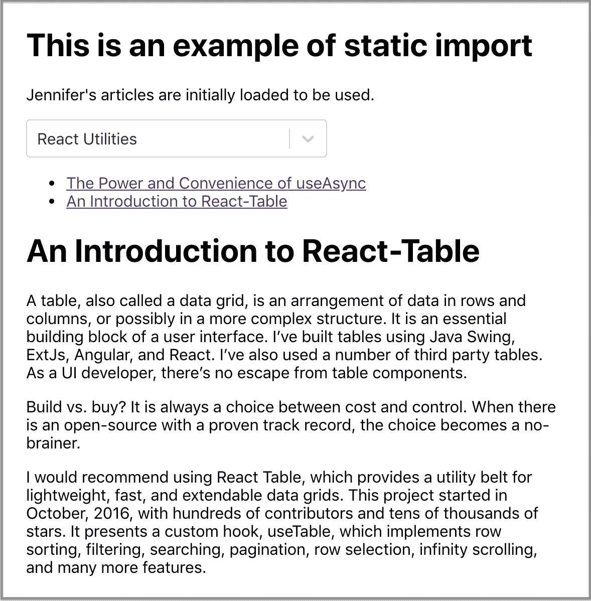

# 动态导入、代码分割、延迟加载和错误边界

> 原文：<https://betterprogramming.pub/dynamic-import-code-splitting-lazy-loading-and-error-boundaries-fff57e63f6c4>

## 详细的指南


照片由 [Mazhar Zandsalim](https://unsplash.com/@m47h4r) i 在 [Unsplash](https://unsplash.com/) 上拍摄

本文是关于如何使用动态导入的详细指南，动态导入支持代码分割和延迟加载。它还描述了如何使用错误边界来捕捉错误。

`[import()](https://github.com/tc39/proposal-dynamic-import)`是函数吗？

有，但是没有。

`[import()](https://github.com/tc39/proposal-dynamic-import)`目前处于 TC39 流程的第 4 阶段。它是一个类似函数的模块，在 JavaScript 中加载语法形式。

它在许多方面都像一个函数:

*   它由`()`操作符调用。
*   它返回所请求模块的模块名称空间对象的承诺，该对象是在获取、实例化和评估模块的所有依赖项以及模块本身之后创建的。

但它不是一个函数:

*   是一种刚好使用括号的句法形式，类似于`[super(](https://developer.mozilla.org/en-US/docs/Web/JavaScript/Reference/Operators/super))`。
*   它不是从`Function.prototype`继承来的。因此不能用`apply`或`call`调用。
*   它不从`Object.prototype`继承。因此，它不能用作变量。`const a = import`违法。

另一个有趣的地方:`import.meta`，一个第 4 阶段的 TC39 提案，将特定于上下文的元数据暴露给一个 JavaScript 模块。它包含关于模块的信息，比如模块的 URL。`import.meta`是一个带有`null`原型的对象。但是，它是可扩展的，其属性是可写的、可配置的和可枚举的。

动态导入、代码分割、延迟加载和错误边界都是有趣的技术。你想知道更多吗？

# **什么是动态导入？**

与[静态导入模块](https://medium.com/better-programming/a-handy-guide-to-export-and-import-modules-for-javascript-and-typescript-6cff8e47d554)相反，动态导入是一种设计模式，将对象的初始化推迟到需要它的时候。动态导入支持代码拆分和延迟加载。这可以显著提高应用程序的性能。

由`import()`完成:

```
import("/path/to/import-module.js") // .js can be skipped
  .then((module) => {
    // do something with the module
  });
```

[MDN web 文档](https://developer.mozilla.org/en-US/docs/Web/JavaScript/Reference/Statements/import)中描述了五种动态导入用例:

*   当静态导入显著降低了加载速度，并且您不太可能需要该代码，或者您以后会需要它时
*   当静态导入显著增加了内存使用量，并且不太可能需要该代码时
*   当模块在加载时不存在时
*   当需要动态构造导入说明符字符串时
*   当被导入的模块有副作用时，这些副作用是可以避免的，除非某些情况发生

# 静态导入的示例

这是一个网页的用户界面。一切都是静态导入的，不管用户是否要选择任何东西。


选择菜单有两个选项:

*   `Micro Frontends`话题
*   `React Utilities`话题

选择`Micro Frontends`主题后，显示两个文章链接。当您单击任一链接时，将显示相关介绍:


选择`React Utilities`主题后，显示另外两篇文章链接。当您单击任一链接时，将显示相关介绍:



让我们创建这个例子。[创建 React 应用](https://medium.com/better-programming/10-fun-facts-about-create-react-app-eb7124aa3785)是启动 React 编码环境的一种便捷方式:

```
npx create-react-app my-app
cd my-app
npm start
```

我们在`package.json:`中增加两个`[dependencies](https://medium.com/better-programming/package-jsons-dependencies-in-depth-a1f0637a3129)`

```
"dependencies": {
  "react-router-dom": "^5.2.0",
  "react-select": "^3.1.0"
}
```

*   `react-router-dom`用于构建路线。
*   `[react-select](https://medium.com/better-programming/react-select-makes-creating-selectable-menus-easy-5d9dffc7e0d9)`是实现下拉列表的一种优雅方式。

将`src/App.css`改为最小样式:

在下面的`src/index.js`中，在第 10 行和第 12 行增加`BrowserRouter`:

创建组件生成器:`src/buildComponent.js`。

在`src/microFrontendRoutes.js`中为`Micro Frontends`主题创建路线信息。

为`src/reactUtilitiesRoutes.js`中的`React Utilities`主题创建路线信息。

现在我们来看看`src/App.js`的主要变化:

在第 4 行和第 5 行，`mfaRoutes`和`utilRoutes`被静态导入。它们被映射到第 26 - 32 行。

第 9 行定义了由选择组件设置的`topic`状态。第 12 - 24 行定义了选择选项。选择组件由第 49 - 54 行定义。当选择一个`topic`时，第 53 行的`onChange`将调用`handleTopicChange`(第 36 - 43 行)。

第 10 行定义了`routes`状态。当`handleTopicChange`被调用时，它在第 38 行设置选择的`topic`并在第 39 行设置选择的`routes`。`routes`更改将导致第 55 - 61 行的链接重新呈现以及第 63 - 67 行的路线更改。

本例中的所有内容都是静态导入的。

# 转换为动态导入

这是一个网页的相同用户界面。选择组件下面的内容将被动态导入。


选择`Micro Frontends`主题后，加载链接和相关介绍。


选择`React Utilities`主题后，加载链接和相关介绍。


这个例子使用与静态导入例子相同的代码库，在`src/App.js`中有一些变化。

`mfaRoutes`和`utilRoute`的静态导入被移除。`routeMapping`第 24 - 30 行指向文件名，而不是静态导入。可以跳过文件扩展名。

关键的区别在`handleTopicChange`(第 34 - 43 行)。它动态导入相关模块来设置`currentRoutes`。

这就是所有的变化。这看起来简单明了。

# 代码分割

如果你仔细阅读上面的`src/App.js`，你可能会奇怪为什么我们要在第 37 行构建文件路径，而不是在`routeMapping`中构建完整的路径。

试试看。

您将遇到错误:“[找不到具有动态导入](https://github.com/webpack/webpack/issues/6680)的模块。”这个错误来自于 [Webpack](https://webpack.js.org/) ，由 Create React App 使用。Webpack 在构建时执行静态分析。它可以很好地处理静态路径，但是它很难从变量中推断出哪些文件需要放在单独的块中。

如果我们硬编码类似于`import(“./microFrontendRoutes.js”)`的东西，它将使这个文件成为一个单独的块。

如果我们编写类似于`import(“./” + routeMapping[selected.value])`的代码，它将使`./`目录中的每个文件成为一个独立的块。

如果我们编写类似`import(someVariable)`的代码，Webpack 会抛出一个错误。

什么是代码拆分？

将代码分成不同的包(块)是一个特性，这些包可以按需或并行加载。它可以用来实现更小的包并控制资源负载优先级。如果使用正确，它可以减少加载时间。

Webpack 提供了三种执行代码拆分的通用方法:

*   入口点:使用入口配置手动分割代码
*   防止重复:使用`SplitChunksPlugin`来删除重复数据和分割数据块
*   动态导入:通过内联`import()`拆分代码

对于我们的静态示例，`npm run build`显示了以下生成的包:

```
File sizes after gzip:71.85 KB (+32.46 KB)  build/static/js/2.489c17a1.chunk.js
2.24 KB (+1.6 KB)     build/static/js/main.7c91b243.chunk.js
776 B                 build/static/js/runtime-main.8894ea17.js
312 B (-235 B)        build/static/css/main.83b9e03d.chunk.css
```

在上面的包中:

*   `main.[hash].chunk.js`:是应用代码，包括 App.js 等。
*   `[number].[hash].chunk.js`:要么是厂商代码，要么是分割块。
*   `runtime-main.[hash].js`:它是 Webpack 运行时逻辑的一小部分，用于加载和运行应用程序。
*   `main.[hash].chunk.css`:是 CSS 代码。

使用硬编码的`import(“./microFrontendRoutes.js”)`，我们可以看到生成了一个额外的块:

```
File sizes after gzip:71.85 KB (+70.95 KB)  build/static/js/2.489c17a1.chunk.js
  1.17 KB (-74 B)       build/static/js/runtime-main.c08b891b.js
  902 B (-912 B)        build/static/js/main.a5e0768c.chunk.js
  885 B (-290 B)        build/static/js/3.b3637929.chunk.js
  312 B                 build/static/css/main.83b9e03d.chunk.css
```

编码为`import(“./” + routeMapping[selected.value])`，我们可以看到`./`目录中的每个文件都变成了一个单独的块。

```
File sizes after gzip:71.86 KB           build/static/js/9.e1addb36.chunk.js
50.68 KB           build/static/js/1.ee2fd9a6.chunk.js
49.51 KB           build/static/js/0.ee6ff7e2.chunk.js
1.77 KB (-477 B)   build/static/js/main.21dcc146.chunk.js
1.24 KB (+496 B)   build/static/js/runtime-main.834cfecb.js
1.15 KB            build/static/js/3.5ca48094.chunk.js
919 B (-70.95 KB)  build/static/js/2.4da83169.chunk.js
312 B              build/static/css/main.83b9e03d.chunk.css
283 B              build/static/js/5.0753ed26.chunk.js
283 B              build/static/js/4.7720f7a0.chunk.js
177 B              build/static/js/10.880ba423.chunk.js
160 B              build/static/js/6.f3a8c74d.chunk.js
```

# 惰性装载

延迟加载是代码分割的后续。由于代码已经在逻辑断点处被分割，我们在需要的时候加载代码。通过这种方式，我们可以显著提高性能。尽管加载时间总量可能相同，但初始加载时间得到了改善。通过这样做，我们避免了加载用户可能根本无法访问的内容。

动态导入延迟加载任何 JavaScript 模块。`React.lazy`使它变得更容易，限制将动态导入渲染为常规组件。

下面是一个类似的用户界面。`Other Articles`链接以下的东西都是懒加载的。


点击`Other Articles`链接后，它会加载剩余的内容:


在`src/OtherRouteComp.js`中创建要延迟加载的组件。

目前，这个 React 组件必须默认导出。命名导出不支持延迟加载。

上述组件可以在`src/App.js`中被延迟加载:

第 6 行延迟加载`OtherRouteComp`，它返回一个解析为由`src/OtherRouteComp.js`导出的组件的承诺。这个组件被包装在`<Suspense>`中，它在第 10 行有一个回退用户界面来显示加载期间的转换。

类似地，由于延迟加载，会产生额外的块。

```
File sizes after gzip:47.91 KB (+480 B)  build/static/js/2.27608de7.chunk.js
1.17 KB (-1 B)     build/static/js/runtime-main.fce20771.js
911 B (+232 B)     build/static/js/main.6680ea99.chunk.js
372 B (-10 B)      build/static/js/3.df091b29.chunk.js
312 B              build/static/css/main.83b9e03d.chunk.css
```

在 Network 选项卡上，它显示在点击`Other Articles`链接后加载了一个新块。这种延迟加载行为适用于所有动态导入情况。


# 误差边界

懒加载返回一个承诺。如果这个过渡失败了呢？

设计良好的用户体验可以很好地处理这种情况。误差边界用于此目的。这是一个经典的组件，可以捕捉子组件树中任何地方的 JavaScript 错误。它记录这些错误，并显示一个回退用户界面，而不是崩溃的组件树。

这里是在第 11 行和第 25 行设置了`MyErrorBoundary`的`src/App.js`。

`src/MyErrorBoundary.js`是典型的误差边界元件:

错误边界有一种或两种生命周期方法:

*   `[static getDerivedStateFromError()](https://reactjs.org/docs/react-component.html#static-getderivedstatefromerror)`(第 9 - 11 行):它设置错误状态以呈现回退用户界面。
*   `[componentDidCatch()](https://reactjs.org/docs/react-component.html#componentdidcatch)`(第 13 - 16 行):用于记录错误信息。

我们可以通过在第 6 行将`hasError`初始化为`true`来模拟一个错误。然后，我们将遇到由第 20 行定义的以下回退用户界面:


错误边界的粒度取决于开发人员。可以有多级误差边界。

# 结论

我们已经讨论了好处，并提供了动态导入、代码分割、延迟加载和错误边界的例子。

最后，我们想强调不要过度使用任何技术。静态导入更适合于加载初始依赖项，并且可以更容易地从静态分析工具和树抖动中受益。仅在必要时使用动态导入。

感谢阅读。我希望这有所帮助。你可以在这里看到我的其他媒体出版物。

*注:Jonathan Ma 对本文部分内容有贡献。*