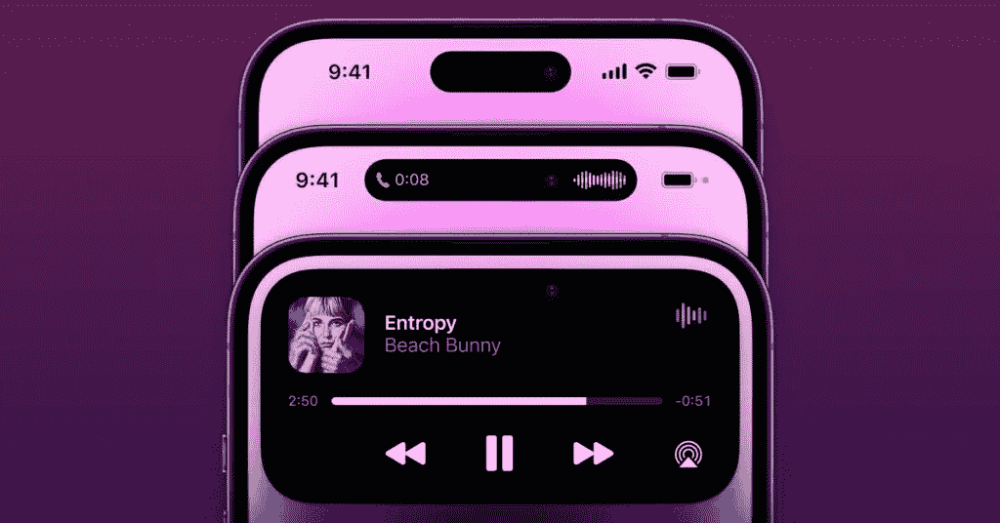
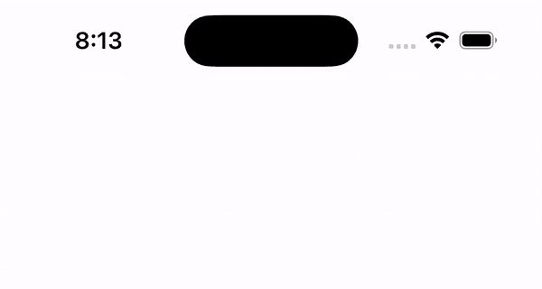

# 在 SwiftUI 中复制动态岛动画

> 原文：<https://betterprogramming.pub/dynamic-island-animation-5869fbce41e6>

## 这里有一个有趣的很酷的演示！

来源:苹果

在最近结束的苹果活动上宣布，动态岛随着 iPhone 14 Pro 进入我们的生活。它提供了显示新通知的可能性。

我有机会用 Xcode 14 release 候选版体验了一下这个，想和大家分享一下。您将看到我们在 SwiftUI 中复制它是多么容易。

当我们按下一个按钮，我们将开始动态岛动画。我们要放一段时间，然后再放回去。

让我们创建我们的内容视图，并在其中放置一个按钮。按钮动作发布通知。

在此之前，我们需要创建一个通知模型。

为了显示视图(在？)动态岛，我们需要忽略安全区。

让我们称这个视图为`NotificationView`并把它放在`GeometryReader`中，因为这个视图将有一个灵活的大小。那我们就忽略安全区吧。

动态岛具有 11 像素的顶部填充。它的宽度是 126，高度是 37.33。

所以我们要在缺口后面放一个视图。我们会用动画把它放大。

因为这是一个演示，我们将通过在这个视图中保持一个状态来改变视图的大小。收到通知后，我们将激活视图并设置通知。

此外，我们将设置`isExpanded`等于真。

当我们按下按钮时，我们可以看到我们为动态岛制作的动画。

现在我们可以画出我们想要的视图了。

我们可以随时触发和发送通知。

如果我们想确定设备是否有动态岛，我们需要给自己写一个扩展。

苹果尚未发布这样的扩展。我估计 iOS 16.1 会这么做。

现在，我们可以提供对设备名称的控制:

动画一个动态岛似乎和普通的视图动画没什么区别。我们都准备好了。

我们可以发展我们想要的尺寸和外观。此外，我们在动态岛上所做的事情在最终用户的应用程序中看起来很美观。