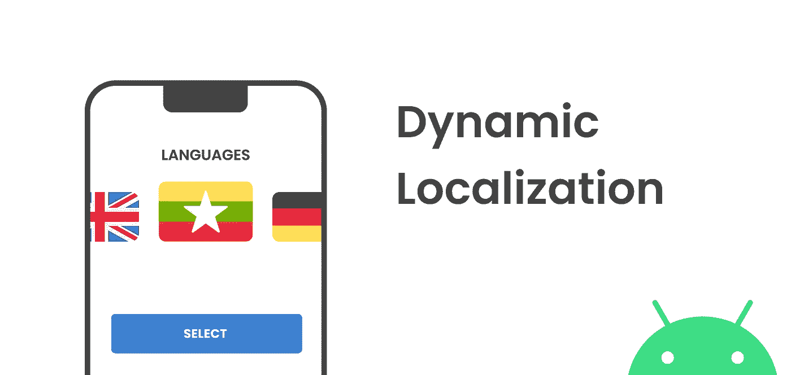
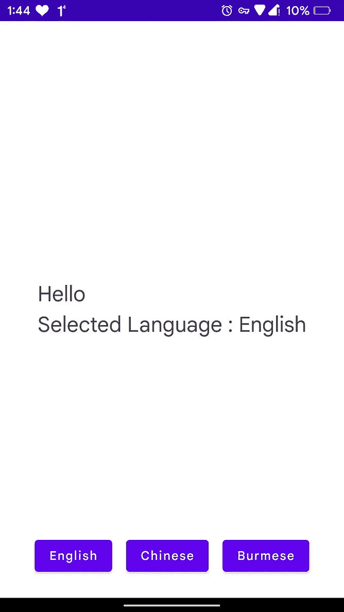
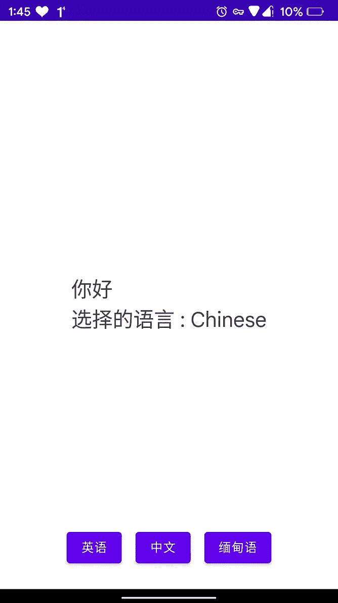
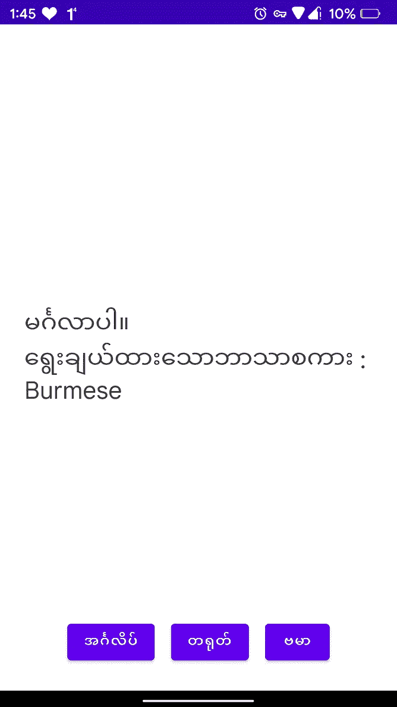
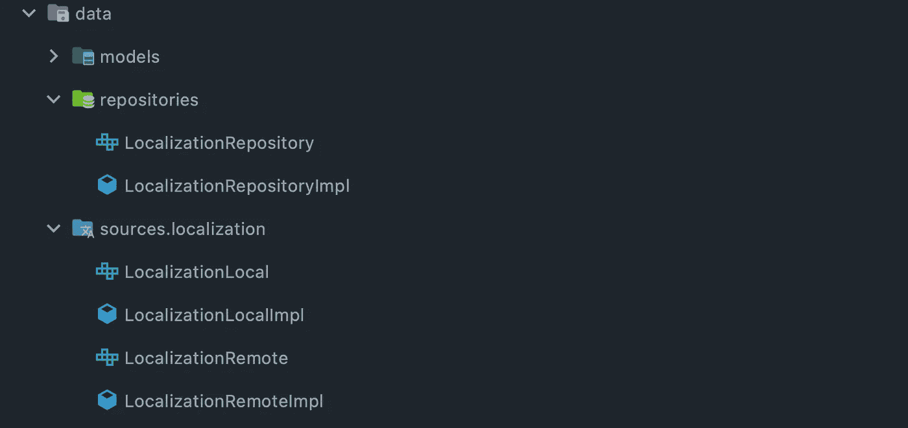

# 在 Android 上实现动态本地化

> 原文：<https://betterprogramming.pub/dynamic-localization-on-android-be0b69f73be4>

## 翻译..翻译..到处



如果你的应用面向全球用户，应用内本地化在现代 android 应用开发中是不可避免的。有多种方法可以在 android 应用中实现应用内本地化。

在这篇博客中，我将向你展示我们的 Android 团队如何在 [Codigo](https://codigo.co) 实现动态本地化

## 在我们深入研究实现之前，为什么标题是"**动态本地化**"？

这只是因为我们在运行时加载整个应用程序的翻译。
翻译的数据源可以来自任何地方！(远程、本地 JSON 文件，或来自任何类型的本地资产)

## 是什么让动态本地化比 Android 的本地化资源更好？

Android 的本地化资源取决于您用户的设备语言设置。手动控制特定于应用程序的区域设置并实时反映变化是很困难的。*(也就是说，你必须重启你的整个活动来刷新你的语言环境)。*

此外，您的翻译资源完全是本地的，因为它与 APK 打包在一起。这意味着每当你想更新翻译时，你都必须构建并发布一个新版本的应用程序。

通过动态本地化，您可以从 CMS 或管理仪表板或任何地方远程更新您的翻译，您的应用程序将在运行时获取和更新，而无需更改您的代码或生成任何新版本。

听起来很有希望？来实施吧！

# 我们的目标

让我们在开始之前设定我们的目标。我们的应用应该能够:

1.  应用程序启动后加载默认本地化数据
2.  在应用程序中的任何地方提供对翻译的轻松访问
3.  实时反映用户的首选语言
    (即应用程序应反映对所选语言的更改，而无需重启应用程序)
4.  支持翻译文本中的文本模板
5.  使用默认语言以防出错

# 我们的解决方案

1.  用一个`localization.json`文件作为原始资产保留我们的默认本地化。
2.  创建一个提供本地化相关信息和功能的抽象`LocalizedViewModel`,这样任何视图模型都可以很容易地从它扩展并利用它。
3.  公开一个**可观察的**本地化数据，并将用户选择的语言作为一个`SharedPreference`持久化。
4.  创建一个文本格式化函数，这样我们就可以在本地化的字符串中支持文本模板。
5.  万一远程获取失败，回退到我们的缓存翻译。

# 演示项目设置

既然我们已经设定了目标，让我们开始实施吧。我已经建立了一个项目来演示我们如何进行动态本地化。您可以从以下存储库中克隆或下载示例项目。

[](https://github.com/NaingAungLuu/dynamic-localization.git) [## GitHub-NaingAungLuu/Dynamic-localization:一个展示动态…

### 此时您不能执行该操作。您已使用另一个标签页或窗口登录。您已在另一个选项卡中注销，或者…

github.com](https://github.com/NaingAungLuu/dynamic-localization.git) 

示例项目使用以下堆栈:

*   **MVVM +存储库+本地&远程数据源**
*   **Jetpack 撰写+单个活动**(用于 UI)
*   **科特林流量**(用于反应性)
*   莫希-科特林(用于 JSON 序列化)
*   **匕首柄**(依赖注射用)

## 应用程序 UI

演示应用程序设置了一个最小的用户界面，只有一个屏幕来显示翻译的文本和三个按钮来切换语言:**英语**、**中文**和**缅甸语**。



带有不同语言设置的演示应用程序的主屏幕

# 数据模型

为了给我们的应用程序提供本地化数据，我设置了一个`localization.json`文件作为`raw` android 资源。

如果您检查了结构，它只是三个 json 对象，每个翻译一个。每一个都包含相同的密钥。我们将在演示应用中使用这些翻译。

现在，让我们创建一个`Localization`类来保存上面的翻译。

`Localization.getDefaultLocalization()`该功能用于在 Jetpack Compose 中进行预览。

现在我们有了`Localization`类，我们将创建一个`LocalizationBundle`类来保存所有语言的翻译。

最后，我们将创建一个 enum 类来保存我们支持的语言。

数据模型到此结束，我们现在可以进入有趣的部分，`Repository`和`DataSources`

# 存储库和数据源

我们的数据层是这样建立的…



## 本地化知识库

`LocalizationRepository`将消耗来自本地*(原始 json 文件)*和远程*(虚拟网络 api)* 源的数据

我们的`LocalizationRepository`曝光了以下…

*   `localizationFlow`实时消费本地化
*   `currentAppLanguage`，顾名思义
*   `updateLanguage`语言切换功能

我们对`LocalizationRepository`的实现如下…

哇，这里发生了很多事！让我给你解释一下。

*   首先，我们设置了流和缓存状态。这里你会看到私人和公共的流动。私立学校是个`MutableStateFlow`，公立学校只是个`StateFlow`。这样，我们就限制了外部类修改我们的状态。
*   `updateLanguage`函数发出各自的语言本地化对象并保存在`SharedPreference`
*   我们有名为`getLocalization`和`LocalizationBundle.getLocalization()`的辅助函数。如果缓存为空，前者返回缓存的翻译或来自`localization.json,`的翻译。后者从所选语言的`LocalizationBundle`中提取正确的`Localization`对象。
*   `getLocalizationFromRemote()`展示了从远程本地化获取`Localization`的例子。

## 本地数据源

你可以在下面看到`LocalizationLocal`类的实现。

它基本上将`localization.json`文件从**原始资产**反序列化为`LocalizationBundle`。

# 视图模型

现在我们的`LocalizationRepository`已经准备好了，我们可以开始将它集成到我们的视图模型中。我们将创建一个名为`LocalizedViewModel`的抽象类，如下…

# 还是用 UI 实现吧！

我们已经成功地设置了视图模型和存储库。现在我们可以开始使用 UI 中的数据了！为了使用本地化数据，我们只需要用`ViewModel`类来扩展`LocalizedViewModel`。

你可以看到我们的演示应用程序的主屏幕实现如下…

因为我们使用的是 Jetpack Compose，所以我们只是使用`collectAsState()`扩展函数来消费本地化流。

如果使用 Android 的`DataBinding`功能，我们也可以轻松绑定！

## 顶部带有字符串模板的 Cherry

我们可以通过在翻译中支持字符串模板来进一步扩展我们的实现。我们可以利用下面的方法来替换翻译后的字符串中的变量。

在我们的实现中，我们使用`%@`作为模板句柄。所以我们的函数用传递的参数替换每个`%@`。我们可以为`TEMPLATE_HANDLE`使用任何一种独特的字符或字符串

## 就是这样！干杯！

我们已经成功实现了“动态本地化”功能，我们的用户界面将实时反映所选择的语言。您可以在这个 Github 资源库中阅读或尝试我对这个演示应用程序的完整实现。你也可以自由评论文章中的任何错误或误解！

[](https://github.com/NaingAungLuu/dynamic-localization.git) [## GitHub-NaingAungLuu/Dynamic-localization:一个展示动态…

### 此时您不能执行该操作。您已使用另一个标签页或窗口登录。您已在另一个选项卡中注销，或者…

github.com](https://github.com/NaingAungLuu/dynamic-localization.git) 

```
**Want to Connect?**You can follow me on [Twitter](https://twitter.com/harryluu_96) and [LinkedIn](https://www.linkedin.com/in/naing-aung-luu-6113b7192/) too!
```