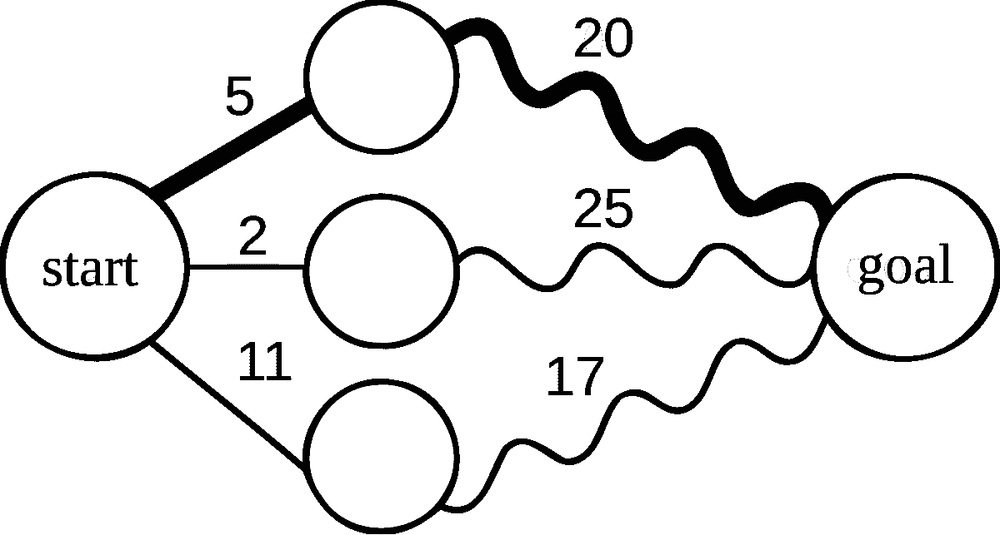
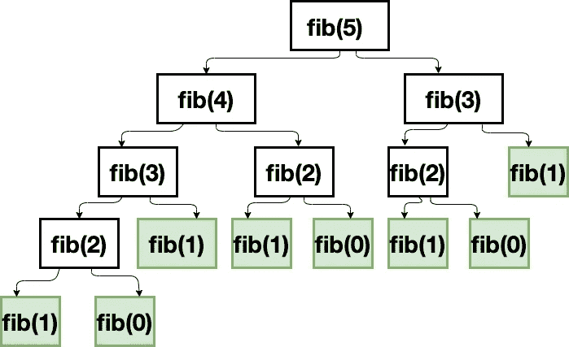

# Golang 中的动态规划

> 原文：<https://betterprogramming.pub/dynamic-programming-in-go-a95d32ee9953>

## 在围棋中把问题分解成子问题



# 介绍

动态编程可以被认为是一种将复杂问题分解为子问题，一次性解决每个子问题，并保存解决方案以备后用的方法。正如我们将在本文后面看到的，这种方法比其他方法提供了更高的效率和模块化优势，我们将很快对此进行探讨。

# 动态编程技术

当我们谈论动态编程时，我们还必须讨论以下技术:

*   `Memoization`:不要与`Memorization`混淆，`Memoization`是一种提高递归函数/算法性能的技术。换句话说，它通过存储昂贵的函数调用的解决方案，并在相同的输入再次提供给程序时返回缓存的解决方案，提供了加速程序的优化。
*   也被称为自底向上技术，这是另一种在动态编程中使用的优化技术。正如您可能猜到的那样，这种技术采用表格方法，首先填写表格，然后根据表格中填写的解决方案解决原始问题。

在本文中，我们只看记忆化，不看列表。

既然我们已经讨论了动态编程及其技术，让我们进入编码阶段。我们将以斐波那契数列问题为例，用三种不同的方法来解决它。如果你第一次听说斐波纳契数列，它是一系列的数字，其中下一个数字是通过将前面的两个数字相加得到的。例如，序列`[0, 1, 1, 2, 3, 5, 8, 13, 21, 34]`构成了斐波那契数列的前十项。按照这种解释，一个`Fibonacci(10)`将导致 55。

开始任何方法的第一步是定义一个函数来帮助我们跟踪我们将要展示的每个解决方案的执行时间:

```
// for tracking program's execution time
func trackTime(**start** time.Time, **result** int, **name** **string**) {
	elapsed := time.Since(**start**)
	log.Printf("---> %s solution | result: %v | took: %s", **name**, **result**, elapsed)
}
```

# 递归

当面对斐波那契数列问题时，一种可能想到的方法是使用递归。让我们来看看这种方法的实现及其效率:

```
// the recursive function approach definition
func **expensiveFib**(n **int**) **int** {
  **if** n < 2 {
  	**return** n
  }

  result := expensiveFib(n-1) + expensiveFib(n-2)

  **return** result
}
```

运行输入为`50`的递归解决方案将产生执行时间大约为`1m and 6.413943065s`的`12586269025`。为什么需要这么长时间？简单来说就是由于函数的递归调用。我们正在检查输入是否小于 2。如果是这样，我们返回输入并移动到函数调用的下一个堆栈。在这种情况下，返回的输入将是 1 或 0。另一方面，如果 2 不大于输入，我们调用该函数两次——一次使用输入 1，第二次使用输入 2，并将两次调用的结果相加。下图描述了该过程(使用输入值 5):



# 环

另一种方法是使用循环。让我们来看看这种方法的实现及其效率:

```
// the loop approach definition
func **fibByLoop**(n **int**) **int** {
	fibBox := []**int**{0, 1} **for**  i := 0; i < n; i++ {
		v := fibBox[i] + fibBox[i+1]
		fibBox = append(fibBox, v)
	} result := **int**(fibBox[n])
	defer trackTime(time.Now(), result, "Loop")

	**return** result
}
```

运行输入为`50`的`Loop`解决方案将得到执行时间大约为 12.406 秒的`12586269025`，这似乎比递归方法快得多——53.393639181 秒。令人印象深刻！

那么，这个解决方案背后的算法是什么？答案是，我们使用了迭代方法。让我们回顾一下这些步骤:

*   我们创建并初始化一个数组，即`fibBox`的值为`0`和`1`(这是斐波那契数列的起点)。
*   在循环中，我们创建了另一个变量`i`，并将其初始化为`0`。这在每次迭代中被用作索引`fibBox`。
*   我们迭代参数`n`并检查`i < n`是否。只要`i < n`，我们就递减`n`。
*   在每次迭代中，我们对`fibBox`(例如`fibBox[i] + fibBox[i+1]`)中当前和下一个索引的值求和，并将结果附加到`fibBox`。一旦循环运行完毕，我们返回`fibBox[n]`的值；这是我们得到的输入的斐波那契数列的结果。

# 记忆化

另一种方法是记忆化。让我们看看这种方法的实现和效率。如上所述，内存化提高了递归的性能，这意味着我们应该首先实现一个递归函数(我们将使用上面定义的函数)，然后，我们通过在缓存中存储和重用解决方案来提高它的效率。

```
// we made a few changes to the one used used above in the Recursion solution
func **refinedExpensiveFib**(n **int**, cache map[**int**]**int**) **int** {
	**if** n < 2 {
		cache[n] = n   // n is either 0 or 1
		**return** n
	} // check cache before calling the function recursively
	**if** _, ok := cache[n-1]; !ok {
		// we haven't come across n-1 before
		cache[n-1] = refinedExpensiveFib(n-1, cache)
	}
	// At this point, n-1 is in the cache. You could log n-1 **if** _, ok := cache[n-2]; !ok {
		// we haven't come across n-1 before
		cache[n-2] = refinedExpensiveFib(n-2, cache)
	}
	// At this point, n-2 is in the cache. You could log n-2 // returns the summed up cache
	**return** cache[n-1] + cache[n-2]
}
```

最后，我们定义一个`memoize()`，它将`refinedExpensiveFib()`:

```
// the memoize approach definition
func **memoize**(n **int**) **int** {
    cache := make(map[**int**]**int**)
    result := make([]**int**, n)

    **for** i := 1; i <= n; i++{
		result[i-1] = refinedExpensiveFib(i, cache)
	}

	**return** result[n-1]
}
```

运行输入为`50`的记忆化解决方案将导致`12586269025`的执行时间大约为 42.571 秒。这比递归解决方案要快得多，也更有效。除了性能提升之外，我们还可以灵活地将解决方案模块化并提高可读性。

完整的程序(我建议您单独运行每个解决方案):

运行`main()`将导致:

```
2020/09/19 21:44:40 ---> Recursion solution   | result: 12586269025 | took: 53.393639181s
2020/09/19 21:42:22 ---> Loop solution        | result: 12586269025 | took: 12.406µs
2020/09/19 21:44:40 ---> Memoization solution | result: 12586269025 | took: 42.571µs
```

记忆化提供了比递归方法更好的模块化和代码可读性；我们看到了我们如何在`expensiveFib()`(我们将其命名为`refinedExpensiveFib()`)中改进/提炼逻辑，然后我们在`memoize()`中将其命名为。然而。环路解决方案仍然被证明是最快的。

# 结论

在本文中，我们探索了三种解决斐波那契数列问题的方法。我们权衡了每种方法的效率、可读性和模块化。您可以在本文中阅读更多关于内存化的内容:[动态编程和内存化以及计算与存储的权衡](https://blog.john-pfeiffer.com/dynamic-programming-and-memoization-and-the-compute-versus-storage-tradeoff/)

我希望你能像我写这篇博客一样喜欢通读。

让我们继续前进！