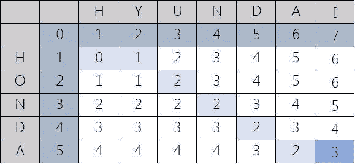

# 动态规划面试问题:Levenshtein 距离

> 原文：<https://betterprogramming.pub/dynamic-programming-interview-questions-levenshtein-distance-d415cb5e36ca>

## 找出两个单词之间的距离


努诺·安图内斯在 [Unsplash](https://unsplash.com?utm_source=medium&utm_medium=referral) 上拍摄的照片。

说起来很难过，但是这个系列终于要结束了。我决定结束它，因为我不想拖太久，也因为我认为 7 是一个很好的结束数字。幸运七号，你知道吗？

好了，今天的问题是，我们来看看如何计算两个单词之间的 Levenshtein 距离(又名编辑距离)。

> 两个单词之间的 Levenshtein 距离(也称为编辑距离)是将一个单词变为另一个单词所需的最小单字符编辑次数(插入、删除或替换)— [维基百科](https://en.wikipedia.org/wiki/Levenshtein_distance#)

# 问题是

注:此问题来自 [LeetCode](https://leetcode.com/problems/edit-distance/) 。

> 给定两个单词 word1 和 word2，找出将 word1 转换为 word2 所需的最少运算次数。
> 
> 您可以对一个单词进行以下 3 种操作:
> 
> 插入一个字符
> 
> 删除一个字符
> 
> 替换一个字符
> 
> 示例 1:
> 
> 输入:word1 = "horse "，word2 = "ros "
> 
> 输出:3
> 
> 解释:
> 
> horse -> rorse(将“h”替换为“r”)
> 
> rorse -> rose(删除“r”)
> 
> 玫瑰->玫瑰(去掉‘e’)
> 
> 示例 2:
> 
> 输入:word1 =“意图”，word2 =“执行”
> 
> 输出:5
> 
> 解释:
> 
> 意向-> inention(去掉‘t’)
> 
> inention -> enention(用“e”替换“I”)
> 
> 延伸->延伸(用“x”替换“n”)
> 
> 执行->执行(用“c”替换“n”)
> 
> 执行->执行(插入' u ')

我们的目标似乎很简单，但是和大多数动态编程问题一样，围绕解决方案建立基础是最困难的。

我应该在本系列的开始提到这一点，但迟做总比不做好:动态规划问题非常适用于具有最优子结构特性的问题——给定子问题的最优解，就可以找到问题的最优解，我们在分治型问题中也看到了这一特性。不同之处在于，在动态规划中，子问题是重叠的，因此一个子问题需要另一个子问题的解决方案，这使得记忆/列表对于降低时间复杂度非常有用。

这只是意味着解决任何 DP 问题的关键是首先尝试将主要问题分解成子问题。很容易，我们应该看到这一点:

*   问题:通过对 word1 (word2)执行插入、删除或替换操作，将 word1 转换为 word2。
*   子问题:通过对 word1 执行插入、删除或替换操作，将 word1[: i]转换为 word2[: j]。

既然我们已经分解了问题，我们需要建立基本案例。

# 基础案例

word1 或 word2 是空字符串。

*   如果 word1 是一个空字符串，那么我们要在 word1 中插入 *k* 个字符，其中*k*= word 2 的长度，所以我们这里的代价是 *k* 。
*   如果 word2 是空字符串，那么我们要从 word1 中删除 *k* 个字符，其中*k*= word 1 的长度，所以我们这里的代价也是 *k* 。

# 数据结构和制表

但是现在我们需要在某个地方存储我们的基本案例，那么什么是一个好的数据结构来表示它呢？当比较两个事物时，通常矩阵做得很好，对吗？一个字符串可以在一个轴上，另一个字符串可以在第二个轴上，该值可以是两个字符串之间的 Levenshtein 距离。例如，对于本田和现代，我们有:



图片来自 [Cuelogic](https://www.cuelogic.com/blog/the-levenshtein-algorithm) 。

# 一路向上

当我们向上发展时，有时考虑解决方案表的递归定义是有用的。我们知道我们的基本情况，但是递归情况下是什么？

注意 *n* 和 *m* 的数值。通过零索引，这意味着我们有一个矩阵 *(n+1) * (m+1)* 。这是因为我们希望包括空字符串的情况(即，`dist_table[i][0]`表示空字符串，而不是单词 2 的第一个字母，同样，`dist_table[0][j]`表示单词 1 的空字符串，而不是它的第一个字母)。

首先，我们需要问自己，从 word1 到 word2 的操作何时需要成本，何时不需要？

## 案例 A:无成本

这个非常简单:不需要成本的唯一方法是字母相同。根据递归定义，这意味着:

*注意:Python 切片工作使得* `*word[:k]*` *是* `*word*` *从索引 0 到索引 k-1 的子串，所以索引 k 不包括在内。*

```
# if the last letters are the same
if word1[n] == word[m]:
    return lev_dist(word1[:n], word2[:m])
```

所以我们简单地递归子串，排除最后一个索引。

## 案例 B:当有成本时

显然，如果字母不同，就会有成本，因此情况 A 的反面本质上是情况 b。让我们进一步将其分解为当字母不同时可以进行哪些操作，以及它对我们的递归定义究竟有什么影响。

*   Insert:这会将 word1 的长度增加 1，因为我们将 word2 的最后一个字母插入到 word1 中，所以 word1 和 word2 现在具有相同的最后一个字母。现在，我们可以在这些字符串上递归，就像我们在情况 A 中所做的那样，排除两个相同的字母，如下所示:

```
return lev_dist(word1, word2[:m]) + 1
```

注意我们是如何为插入操作添加`1`的，word1 基本上保持不变。

*   删除:这将 word1 的长度减少了 1，我们可以简单地递归如下:

```
return lev_dist(word1[:n], word2) + 1
```

*   Replace:这将把 word1 的最后一个字母替换为与 word2 的最后一个字母相同的字母，因此情况 A 适用，我们可以类似地递归:

```
return lev_dist(word1[:n], word[:m]) + 1
```

综上所述，我们现在有了最终的递归定义:

现在剩下要做的就是将同样的想法转换成自底向上的方法:

# 结论

这就把我们带到了动态编程系列的结尾！希望你已经学到了很多关于如何处理 DP 问题以及如何着手解决它们的知识，这样你就能在下一次面试中胜出！

祝你好运，感谢你的阅读！