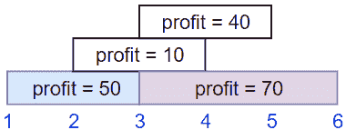
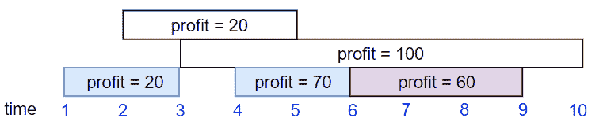
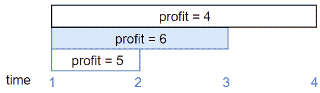

# 动态规划面试问题:作业调度中的最大利润

> 原文：<https://betterprogramming.pub/dynamic-programming-interview-questions-maximum-profit-in-job-scheduling-6c5ec15c4cc5>

## 从给定的工作清单中找出你能获得的最大利润


今天的问题很有挑战性——这是一个你可能在算法课程中见过的经典问题。对于那些已经看过的人来说，这将是一个很好的全面回顾。如果对你来说是新的，花点时间消化它。

让我们来看看这个问题。

我们有`n`项工作，其中每项工作都计划从`startTime[i]`到`endTime[i]`完成，获得利润`profit[i]`。

你得到了`startTime`、`endTime`和`profit`数组。您需要输出您可以获得的最大利润，这样子集中就不会有两个时间范围重叠的作业。

如果您选择在 x 时间结束的作业，您将能够开始另一个在 x 时间开始的作业。

## 示例 1



*   输入:`startTime` = [1，2，3，3]，`endTime` = [3，4，5，6]，`profit` = [50，10，40，70]
*   产量:120
*   说明:选择的子集是第一个和第四个作业。
*   时间范围[1–3]+[3–6]，我们得到利润 120 = 50 + 70。

## 示例 2



*   输入:`startTime` = [1，2，3，4，6]，`endTime` = [3，5，10，6，9]，`profit` = [20，20，100，70，60]
*   产量:150
*   说明:选择的子集是第一个、第四个和第五个工单。
*   获得的利润 150 = 20 + 70 + 60。

## 示例 3



输入:`startTime` = [1，1，1]，`endTime` = [2，3，4]，`profit` = [5，6，4]

产出:6

在我们开始解决这个问题之前，让我们考虑一个更简单的版本。

假设所有工作的利润相等。本质上，这意味着完成尽可能多的工作将是我们的最优解(只要是工作，你接什么工作真的不重要)。这听起来熟悉吗？答对了——这听起来像是一个贪婪算法类型的问题！

# 我们的贪婪算法模板

*   按特定顺序考虑作业。
*   接受每一份工作，如果它与已经接受的工作不冲突的话。

这里的关键是确定考虑作业的顺序。我们有多种选择:

*   最短间隔:按(完成到开始)次数的升序排列
*   冲突最少:Ci 的升序，其中 Ci 是与作业 I 冲突的剩余作业的数量。
*   最早开始时间(est):开始时间的升序。
*   最早结束时间(EFT):结束时间的升序。

让我们考虑每一种顺序，并尝试为它们想一些反例(即，为什么顺序不起作用)。

## 最短间隔


## 冲突最少


## 最早开始时间


蓝色条表示贪婪算法将选择的作业。对于这三种情况，解决方案都不是最佳的。

# 用 EFT 完成我们的贪婪算法

*   按完成时间的升序排列作业。
*   在决定是否应包括作业 I 时，通过检查作业 I 的开始时间是否> =作业 i-1 的完成时间来检查它是否与所有以前添加的作业冲突。
*   如果不冲突，那我们可以加。

现在，让我们尝试将这种贪婪算法应用到我们的作业调度中的利润最大化问题，当每个作业的利润不相同时。你会意识到它悲惨地失败了。这是因为现在，不仅工作的数量很重要，而且你从工作中获得多少利润也很重要。所以这是一个*加权*区间调度问题——利润高的作业比利润低的作业权重高。

我们从简单的未加权区间调度问题中学到了什么？一些很好的见解，但最重要的是，对我们很重要的*订购*。

当任务未被加权时，我们可以简单地按照完成时间的升序对任务进行排序，如果它与先前添加的任务不冲突，就添加该任务。但在加权版本中，只有在不与之前增加的工作岗位*和*冲突的情况下，我们才应该增加它，因为它增加了我们当前的利润。换句话说，我们想取(当前利润+作业 I 的利润，当前利润)的最大值。利用这个思路，我们试着用 Python 实现一下。

首先，让我们创建一个作业类，这样作业的每个实例都有开始时间、结束时间和利润。

```
class Job:
    def __init__(self, start, finish, profit):
        self.start = start
        self.finish = finish
        self.profit = profit
```

接下来，让我们从输入数组中创建作业实例，并根据它们的结束时间对它们进行排序，如下所示:

```
def solution(startTime, endTime, profit) -> int:
    jobs = []
    for i in range(len(profit)):
        jobs.append(Job(startTime[i], endTime[i], profit[i])) # sort jobs in increasing order of their finish times
    jobs.sort(key=lambda x: x.finish)
```

之后，我们采用通常的自下而上的方法:

为了得到最后一个不冲突的作业，我们可以做一个简单的线性搜索。

```
def get_last_non_conflicting_job(jobs, n):
    for i in reversed(range(n)):
        if jobs[i].finish <= jobs[n].start:
            return i
    return -1  # if no non-conflicting job is found
```

使用二分搜索法可以进一步优化我们的线性搜索:

我们完了！

我认为这个问题最难的部分是认识到排序的重要性，并确定我们应该迭代作业的顺序。除此之外，这真的只是另一个动态规划问题。

祝你面试好运！