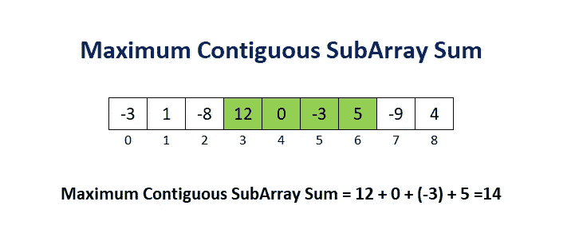

# 动态规划面试问题(三)

> 原文：<https://betterprogramming.pub/dynamic-programming-interview-questions-part-3-f7d15f37cecb>

## 求最大连续子阵列和



作者照片。

这是我们在动态编程系列中的第二个问题(由 [LeetCode](https://leetcode.com/problems/maximum-subarray/) 提供)！正如我所承诺的，这个将比上一个简单得多。

> "给定一个整数数组`nums`，找出具有最大和的连续子数组(至少包含一个数),并返回其和。
> 
> 示例:
> 
> 输入:[-2，1，-3，4，-1，2，1，-5，4]
> 
> 产出:6
> 
> 说明:[4，-1，2，1]的和最大= 6 "

很快，我们注意到这个问题和上一个问题的相似之处，因为我们必须考虑所有可能的相邻子数组(就像我们在上一个问题中必须考虑所有可能的子字符串)。同样，这意味着自下而上的方法效果最好。

# 目标

我们的目标只是返回具有最大和的连续子数组的和。这意味着我们真正关心的是跟踪相邻子阵列的最大和。在这里使用自底向上的方法意味着我们需要从我们的基本案例中找出一个使用计算解决方案的结构来逐步向上。

那么，我们如何使用之前在遍历数字数组时计算的和来计算新的和呢？

```
sum[i+1] = function(sum[i])
```

本质上，我们想要找出一个函数，这个函数将会计算上面给出的`sum[i]`中的`sum[i+1]`，这个函数之前已经计算过了。希望在这一点上，这个函数本质上应该是(其中`arr`是我们的输入数组):

```
function(sum[i]) {
    if (sum[i] + arr[i+1] < sum[i]) {
        return sum[i]
    } else {
        return sum[i] + arr[i+1]
    }
}
```

该函数将正确返回整个连续子阵列的当前最大和，直到索引 *i* 。既然我们已经了解了我们希望围绕代码构建的一般结构，我们就准备初始化我们的列表并建立基本案例。

# 表格

因为我们只是简单地跟踪连续子数组的最大和，直到索引 *n-1* ，其中 *n* 是我们的输入数组的长度，我们所需要的是一个长度为 *n* 的 1D 数组。

```
# initialize the array where we store our computed solutions
max_sums = [float("-inf") for i in range(len(num_array))]
```

注意:我们用负无穷大值初始化数组。

# 基础案例

我们可以简单地定义何时 *i = 0* ，因此这将是:

```
max_sums[0] = max(float("-inf"), num_array[0])
```

这实际上可以简化为:

```
max_sums[0] = num_array[0]
```

因为我们知道任何数都>负无穷大。

# 一路向上

利用我们对一般结构的了解，我们可以用 Python 中的`max()`函数将其缩短为一行。内置的`max()`函数返回两个值中的最大值。最后，我们可以再次使用`max()`函数返回总和的最大值。在这种情况下，`max()`函数遍历数组并返回数组的最大值。

```
for j in range(1, len(num_array)):
    max_sums[j] = max(max_sums[j-1] + num_array[j], num_array[j])return max(max_sums)
```

# 额外挑战

我们完事了。作为一个额外的挑战，我试图使用动态编程来找到连续的子阵列和总和，但未能找到解决方案。不过，我确实找到了一个非 DP 解决方案:

```
def function(num_array): max_sum = float("-inf")
    start = 0
    end = 1 for i in range(1, len(num_array)):
        sum = 0
        for j in range(i, len(num_array)):
            sum += num_array[j]
            if sum > max_sum:
                max_sum = sum
                start = i
                end = j + 1 print("The array " + str(num_array[start:end]) + " has the largest sum of " + str(max_sum))
```

请随意分享您对这一额外挑战的解决方案。我希望看到不同的方法！