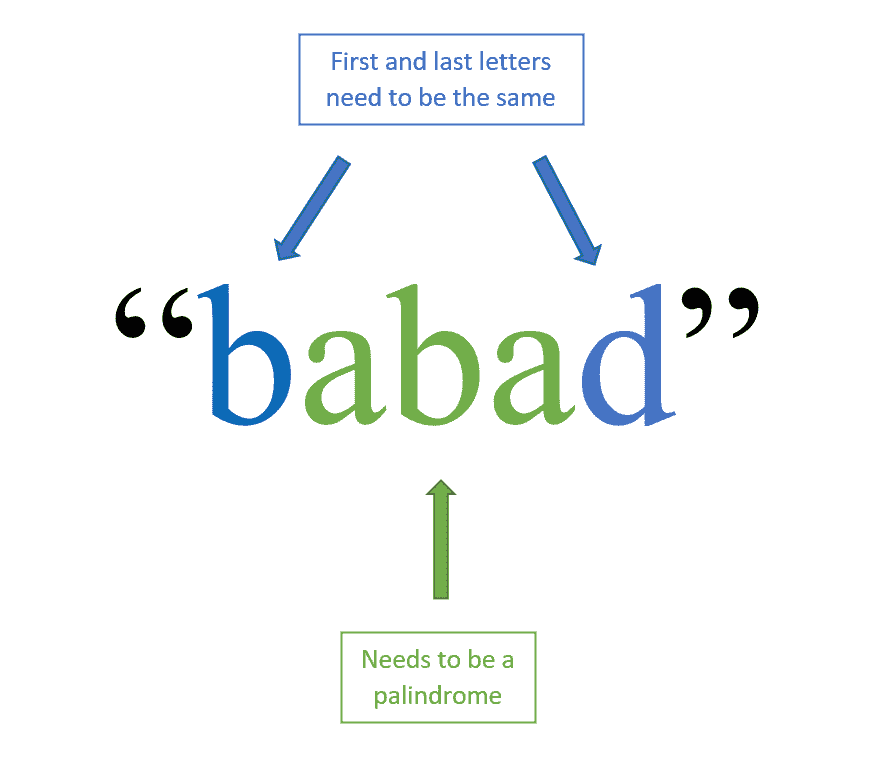
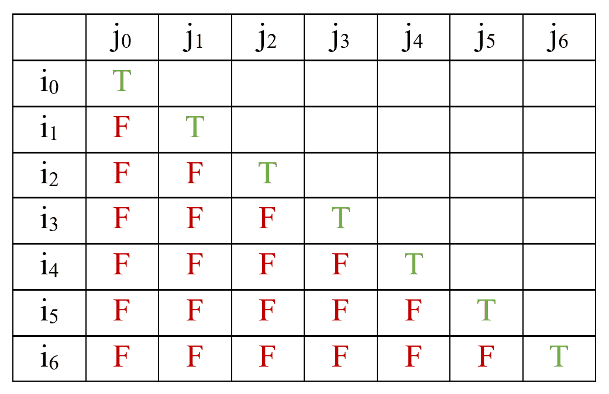
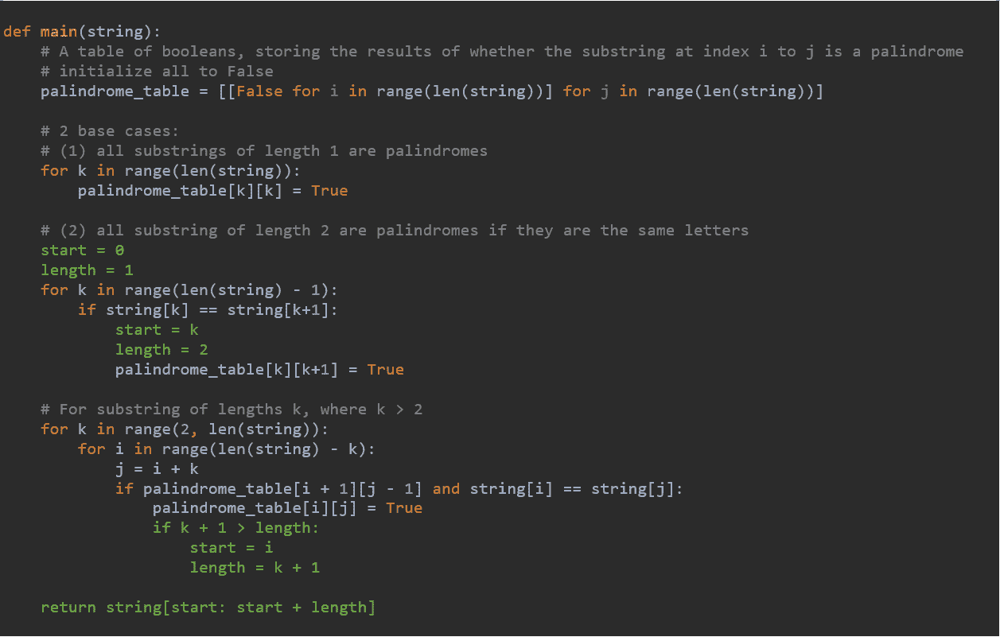

# 动态规划面试问题(下)

> 原文：<https://betterprogramming.pub/dynamic-programming-series-2-longest-palindromic-substring-bd1271e3a947>

## 查找最长的回文子串


菲利普·里昂在 [Unsplash](https://unsplash.com?utm_source=medium&utm_medium=referral) 上的照片。

在本系列的这一章中，我们将一起使用动态编程来解决一个问题。承蒙 [LeetCode](https://leetcode.com/problems/longest-palindromic-substring/) 的帮助，我们正在解决的问题如下:

> 给定一个字符串 *s* ，找出 *s* 中最长的回文子串。你可以假设 *s* 的最大长度是 1000。
> 
> 例 1:输入:' babad '输出:' bab '注意:' aba '也是有效答案。
> 
> 示例 2:输入:“cbbd”输出:“bb”

回想一下本系列的第一章[你认为我们应该使用自上而下还是自下而上的 DP 方法来解决这个问题？花点时间想想你会使用哪种方法，为什么。](https://medium.com/@steffy.lo98/dynamic-programming-series-1-what-is-it-and-why-is-it-so-important-64675b9f6049)

# 我的方法和原因

每当我看到一个看起来可以用 DP 解决的问题时，我都忍不住要先看看强力解决方案。暴力解决方案显然是非常低效的。它包括遍历一个子串所有可能的开始和结束位置，然后检查它是否是一个回文。如果我们看一下示例 1 的输入(“babad”)，使用零索引，这给了我们 *(0，0)，(0，1)，(0，2)，…，(0，n-1)* 作为第一个字母的可能开始和结束位置， *(1，1)，(1，2)，…，(1，n-1)* 作为第二个字母，等等，其中 *n* 是字符串输入的长度(因此在这种情况下 *n = 5 这意味着字符串“babad”总共有 *n + (n-1) + … + 1 = n(n+1)/2* 个不同的可能子字符串，并且因为验证每个子字符串将花费 *O(n)* 时间，所以总时间复杂度总计为 *O(n )* 。*

那么，我从这种暴力分析中得到了什么呢？我们需要验证每一个可能的子串。这意味着自下而上的方法效果最好。

既然我们已经选择了将要使用的方法，让我们建立一些基本案例。

*   情况 0 ( *n = 0* ):空字符串是一个回文，这是毫无疑问的。
*   案例 1 ( *n = 1* ):因为一个字母本身就是一个回文，所以所有长度为 1 的子串都是一个回文。
*   情况 2 ( *n = 2* ):长度为 2 的子串只有在第一个和最后一个字母相同的情况下才能是回文。
*   情况 3 ( *n = 3* ):如果第一个和最后一个字母相同，长度为 3 的子串是回文。中间的字母无关紧要，因为我们知道单个字母本身就是一个回文。嗯…这看起来很熟悉。似乎我们可以通过使用案例 1 和案例 2 的结果来确定案例 3。
*   情况 4 ( *n = 4* ):长度为 4 的子串是回文，如果第一个和最后一个字母相同，剩下的两个字母组成一个回文。

到现在为止，你应该开始看到回文的结构了。似乎单词是回文，第一个和最后一个字母必须相同，不包括第一个和最后一个字母的字符串也必须是回文。



作者照片。

它本质上有以下递归定义:

很明显，我们有三种基本情况:情况 0、情况 1 和情况 2。由于我们使用自下而上(列表)的方法，我们现在必须将这些基本情况的初始值列表，并使用这些值来计算我们给定输入的期望解。

那么，我们应该如何着手做这件事呢？我们如何表示一个子串所有可能的开始和结束位置，并存储它们的解呢？对此，什么是好的数据结构？嗯，看起来矩阵(即 2D 阵列)会工作得很好。

我们可以将*I*s 定义为子串的起始索引，将*j*s 定义为子串的结束索引，这样矩阵的对角线必须是`True`并且对角线以下的任何内容都必须是`False`，因为我们不需要以逆序考虑子串。请注意，我们的矩阵大小为 *n * n* ，其中 *n* 是我们输入字符串的长度。



作者照片。

# 用 Python 实现

所以现在我们知道该怎么做了，让我们把这个想法移到 Python 上。首先，我们有一个接受输入字符串的主函数。让我们初始化 2D 数组，使所有的`False`值都像这样:

```
def main(string):
    # A matrix of booleans, storing the results of whether the substring at index i to j is a palindrome
    palindrome_table = [[False for i in range(len(string))] for j in range(len(string))]
```

现在，我们想将对角线设置为填充所有的`True`值:

```
for k in range(len(string)):
   palindrome_table[k][k] = True
```

此时，我们已经计算了第一个和第二个基本案例(案例 0 和案例 1)的值！对于第三种基本情况，我们需要检查长度为 2 的每个子串是否是一个回文，并存储它们的结果:

```
for k in range(len(string) - 1):
   if string[k] == string[k+1]:
       palindrome_table[k][k+1] = True
```

看起来不错。现在，我们必须继续构建矩阵，同时从基础案例开始逐步推进:

好了，我们已经完成了价值矩阵。现在怎么办？我们如何找到最长的回文子串？嗯，只需通过调整现有代码来跟踪最长子串的起始和结束索引:



# 结论

我们完事了。这的确很有挑战性，但我们做到了！在本系列的下一部分，我们将继续用动态编程解决更多的问题。如果你没有得到这个，不要担心。我发现这也很难。下次我们会做一个更简单的。

感谢阅读！