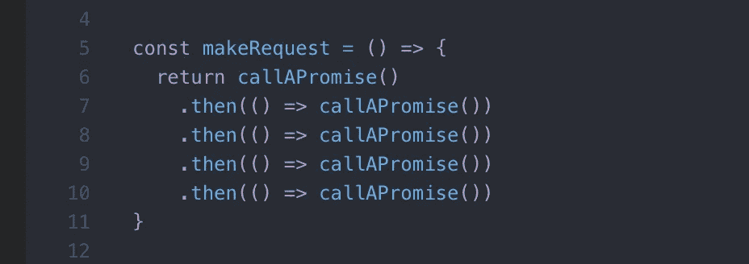

# 动态承诺链

> 原文：<https://betterprogramming.pub/dynamic-promise-chaining-af9c5cb87f2e>

## 递归和还原方法的演示和比较


# 介绍

现在许多开发者没有意识到承诺的全部魅力和它们提供的灵活性。在代码片段中，promise 只是用来从远程数据源获取一些数据，这是很常见的事情，同样可以用简单的回调函数来实现。而它的目的要复杂和强大得多。

在本指南中，我想分享我的知识，告诉你如何将承诺连锁化，什么更美味，如何动态地做，而不需要事先知道你应该执行多少连锁。

我们都听说过所谓的回调地狱。这是发明 Promise API 的主要动机之一。

承诺可以轻松应对这种情况。



经典承诺链

这种可预测的任务可以在几秒钟内解决。但是如果我们的任务不那么可预测呢？如果我们应该在承诺链中一个接一个地执行一些异步操作，而事先不知道有多少个，那该怎么办？换句话说，我们如何动态地建立一个承诺链？

我想展示两种方法来做到这一点。但首先，让我们创建一些工作的基础。

模拟文件已经可以下载了

以及模仿文件下载过程的简单功能。

在给定文件的`downloadTime`之后解析的承诺

考虑一下:出于某种原因，我们希望我们的模拟文件被一个接一个地下载(实际上这是一个常见的场景)。现在，我们知道正好有三个文件。正如我之前所说，处理静态数据将会非常容易。

```
const [file1,file2,file3] = mockFilesdownload(file1)
.then(_ => download(file2))
.then(_ => download(file3))
```

这很简单，对吧？但是当事情变得动态和不可预测时，你需要挖掘得更深。如果我们有 10 个文件，1000 个文件呢？让我们假设我们从外部来源接收指令，并且不知道有多少文件要下载。首先可以诱人的是使用`Promise.all` API。

> "`Promise.all()`方法返回一个`[Promise](https://developer.mozilla.org/en-US/docs/Web/JavaScript/Reference/Global_Objects/Promise)`，当所有作为 iterable 传递的承诺都已解析时，该方法将解析。"— [MDN 网络文档](https://developer.mozilla.org/en-US/docs/Web/JavaScript/Reference/Global_Objects/Promise/all)

并行承诺处理

该函数接受挑战不依赖于文件数量。但这不是我们需要的。与我们的目的相反，它并行下载文件，而不是一步一步。如果您仔细观察了输出，您可能会注意到这个函数并不关心源数组中文件的顺序。它会尽快下载它们。这就是为什么我们看到的输出是关于`file_1`，然后是`file_3`，然后才是`file_2`。这里的顺序是基于下载时间，而不是文件的顺序。

# 递归承诺链

## 递归

> 递归:函数调用自身的行为。递归用于解决包含更小的子问题的问题。递归函数可以接收两个输入:基本情况(结束递归)或递归情况(继续递归)。”— [MDN 网络文档](https://developer.mozilla.org/en-US/docs/Glossary/Recursion)

第一种方法是基于递归构建承诺链。它看起来像这样:

递归承诺链

我们已经可以看到预期的行为。不像`parallelDownload`，这个功能坚持文件顺序，不管花多少时间都是一个接一个下载。

## **一些关键片段**

*   我们执行`files.shift()`,从而为进一步的调用准备数组，同时将当前文件保存在一个变量中以供正在进行的调用。
*   `download(nextFile).then(_ => recursiveDownloadChain(files))`每次通话都会带来全新的承诺。如果文件存在(也就是说，我们的数组没有用完)，那么将使用一个已经变异的数组再次调用该函数。
*   当没有更多的文件时，我们提供一些端点`Promise.reolve()`，它将作为最终标志被触发。事实上，当我们编写`recursiveDownloadChain(files).then(....)`时，`then`中的代码被这个`Promise.resolve()`调用

# 还原承诺链

## array . protocol . reduce

> "`**reduce()**`方法对数组的每个元素执行一个 **reducer** 函数(您提供的),产生一个输出值。"— [MDN 网络文档](https://developer.mozilla.org/en-US/docs/Web/JavaScript/Reference/Global_Objects/Array/reduce)

第二种方法是使用 reducer 功能，在我看来这种方法更灵活，也更容易维护*。这就是:*

还原承诺链

## 一些关键片段

*   我们传递了一个初始值`Promise.resolve()`来用一个现有的 promise 对象初始化我们的链。所以我们现在能够在每次迭代中扩展它。
*   `chain.then(_ => download(currentFile))`正在从每下一个`currentFile`开始将我们的源数组缩减为一个承诺链。

# 全球连锁

到目前为止，我们已经实现了三种下载方式:

*   并行下载`Promise.all`
*   reductiveChainDownload `Array.prototype.reduce`
*   递归链下载`Recursion`

你知道吗？没有什么能阻止我们把它们捆绑在一个单一的全球链条中，只是为了好玩。

检查控制台中的输出，确信一切正常。

# 结论

在大多数情况下，还原方法会胜出。特别是:

*   **写起来可读性更强，更容易理解，也更简短——递归承诺链有时甚至对有经验的开发人员来说也不清楚。**
*   **更优化。**尽管`Arrat.prototype.reduce` 的算法没有这么简单，但它不会以任何方式影响调用堆栈，而递归方法会在每次下一次调用时填充调用堆栈，在极端情况下，它会导致内存超过性能。
*   它可以用比递归多得多的方式来处理。在 reductive 方法中，您始终可以访问作为一个整体的源数组，以及文件的当前索引，这是由额外的参数(第三和第四个)提供的，我们在本指南中没有探讨。在递归中，你没有任何内置的提供者来实现这样的东西，你必须深入到闭包或类似的东西中，这将导致完全不可维护的代码。

递归唯一值得一提的优点是:

*   **链接循环可以随时停止。** —而`Array.prototype.reduce`是牢不可破的，就像`Array.prototype.forEach`和所有基于回调的数组方法一样。当然，我们可以用一些技巧来实现它，但那不是最好的做法，也不标准。

感谢阅读。我很乐意在评论中更深入地讨论这个话题。