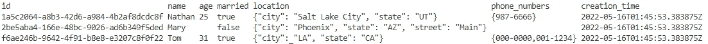

# 如何用 Go 实现动态 SQL 查询

> 原文：<https://betterprogramming.pub/dynamic-sql-query-with-go-8aeedaa02907>

## 从使用[行开始。列](https://pkg.go.dev/database/sql#Rows.Columns)或[行。ColumnTypes](https://pkg.go.dev/database/sql#Rows.ColumnTypes) 获取列信息


照片由 [Sunder Muthukumaran](https://unsplash.com/@sunder_2k25?utm_source=medium&utm_medium=referral) 在 [Unsplash](https://unsplash.com?utm_source=medium&utm_medium=referral) 上拍摄

对于大多数应用程序，我们将知道我们需要数据库中的什么数据，然后我们可以定义适当的数据类型来获取查询结果。

但有时我们可能需要灵活性，在运行时使用动态 SQL 或未知列查询来生成一些数据。例如，假设我们正在构建一个报告、管理或 GUI 工具。

在这篇文章中，我将在一个简单的报告示例中讨论如何使用 Go 标准库([数据库/sql](https://pkg.go.dev/database/sql) )来实现这一点。

完整的代码示例可以在[这里](https://github.com/wolftsao/go_dynamic_sql_example)找到

我将跳过明显的 Go 代码，直接跳到重要的部分。此外，为了使代码清晰易读，我将忽略错误处理。

# 获取列长度和列名

首先，我们需要获得像列名这样的列信息。

在本例中，我使用了[cocroach db](https://www.cockroachlabs.com/)和下面定义的`users`表:

```
 column_name  |  data_type  |
----------------+-------------+
  id            | UUID        |
  name          | STRING      |
  age           | INT8        |
  married       | BOOL        |
  location      | JSONB       |
  phone_numbers | STRING[]    |
  creation_time | TIMESTAMPTZ |
```

让我们运行一个全表查询:

```
rows, _ := db.Query("select * from users")
defer rows.Close()cols, _ := rows.Columns()
```

变量`cols`是列名(字符串的一部分)。假设我们只是将结果打印到`stdout`，我们可以轻松地使用`[text/tabwriter](https://pkg.go.dev/text/tabwriter)`:

```
w := tabwriter.NewWriter(os.Stdout, 0, 2, 1, ' ', 0)
defer w.Flush()sep := []byte("\t")
newLine := []byte("\n")w.Write([]byte(strings.Join(cols, "\t") + "\n"))
```

报告的标题部分已经完成，让我们来处理结果数据。

# 处理未知的行数据

对于动态或特别查询，由于我们不知道列类型，所以很难预先确定我们需要使用的变量类型(我们可以将`switch`语句与`[ColumnTypes](https://pkg.go.dev/database/sql#Rows.ColumnTypes)`配对来实现这一点，对于像格式化或进一步处理这样的高级用法，我们应该这样做)。但是那将是非常乏味的)。

另外，数据库列可以是`NULLABLE`。在 Go 中，我们需要用像`NullString`这样的特殊数据类型来处理这个问题。

出于简单报告的目的，我们需要一个通用数据类型来容纳数据库查询的结果。

幸运的是，字节片`[]byte`很好地解决了这个问题，包括 JSON/array 数据。此外，字节片在默认情况下将数据库 NULL 视为空，这减轻了我们额外处理。

```
row := make([][]byte, len(cols))
```

由于行可能包含多列，我们需要一个字节片。

现在，Go 中有一个棘手的部分，即[行。Scan](https://pkg.go.dev/database/sql#Rows.Scan) 是一个变量函数，参数类型为`any`，底层具体类型应该是指针。如果我们将每个参数指定为:

```
var id int
var name string
err := rows.Scan(&id, &name)
```

此时，我们可能认为可以将行改为`[]*[]byte`，然后在扫描调用中解包它:

```
row := make([]*[]byte, len(cols))
err := rows.Scan(row...)
```

不幸的是，我们将得到编译时错误消息:

```
cannot use row (variable of type []*[]byte) as []any value in argument to rows.Scan
```

为了解决这个问题，我们必须遵循编译器告诉我们的。我们需要一个`[]any`类型的变量，那么每个元素将是一个指向`row`变量的每个元素的指针:

```
rowPtr := make([]any, len(cols))
for i := range row {
  rowPtr[i] = &row[i]
}
```

这已经很多了，现在我们可以打印结果了。

# 打印查询结果

这一部分应该很简单，只需循环通过`rows`，扫描并写入标准输出:

```
for rows.Next() {
  _ := rows.Scan(rowPtr...) w.Write(bytes.Join(row, sep))
  w.Write(newLine)
}
```

我们现在可以执行程序了，结果会是这样的:



动态查询结果示例

下面是完整的最小可运行代码片段:

(确保有数据库和表格可用于运行程序，或查看[此](https://github.com/wolftsao/go_dynamic_sql_example)以获取完整示例)

# 摘要

为了在 Go 中实现动态 SQL 查询，我们:

1.  已用[行。列](https://pkg.go.dev/database/sql#Rows.Columns)或[行。ColumnTypes](https://pkg.go.dev/database/sql#Rows.ColumnTypes) 获取列信息
2.  使用更通用的数据类型(在本例中是字节片)来存储查询结果，使用中间类型(`[]any`)来匹配行。扫描呼叫
3.  像往常一样循环遍历这些行

非常感谢你的阅读！