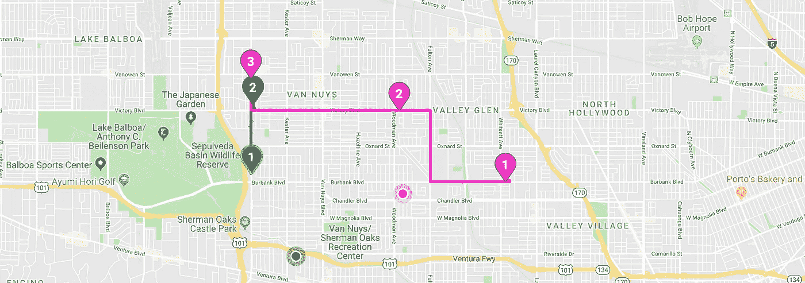

# Vue.js 中 Google 地图的动态 SVG 标记

> 原文：<https://betterprogramming.pub/dynamic-svg-markers-for-google-maps-in-vue-js-7541fa1a54a>

## 分步教程:使用动态生成的颜色创建标记并将其显示在地图上

谷歌地图很棒，[谷歌地图 API](https://developers.google.com/maps/documentation/) 更棒。

突然，几年前，我所有的项目都与谷歌地图相关，你可能会说我已经成为一名真正的谷歌地图 API 专家。

我已经向支持和开发团队提交了很多请求，我认识一些在谷歌地图团队工作的人，我也是[react-谷歌地图](https://tomchentw.github.io/react-google-maps/)回购的贡献者之一。

没有一个 API 是我没用过的，可悲的是，最令人沮丧的事情之一是*标记*。

与极度可定制的[地图框](https://docs.mapbox.com/help/tutorials/markers/)标记不同，谷歌地图不允许你做一些简单的事情，比如旋转标记图像，在其中插入多个字符，或者在地图上制作标记移动的动画。

很奇怪，对吧？

在我使用谷歌地图的这些年里，我已经看到了几十个使用案例，在这些案例中，这个功能是必不可少的，我不得不找出我自己的卑鄙手段。

对于其中的大多数，我最终使用了 [*自定义覆盖图*](https://developers.google.com/maps/documentation/javascript/examples/overlay-simple) ，这是一个很棒的工具，允许你在地图上放置任何 HTML 元素，正如你所知，这给了你无限的机会来创建自定义标记。

这有几个问题，例如，失去了[集群](https://developers.google.com/maps/documentation/javascript/marker-clustering)功能和街道视图上显示标记的功能(是的，有些客户非常喜欢这个功能)。

在这个主题中，我将向您展示如何使用 SVG 通过 [Vue.js](https://vuejs.org/) 生成动态标记。

对于 Vue，我一直在使用[*Vue 2-Google-maps*](https://github.com/xkjyeah/vue-google-maps#readme)**包，以便更容易地与地图进行交互。如果您选择不同的库，或者您只是使用没有包装器的纯 API，那么这篇文章仍然对您有用。**

# **编码**

**首先，让我们创建一个 SVG 文件，我们将使用它作为我们的标记。**

**希望你的团队有一个设计师，他们为你提供了一个不错的 SVG 文件。我通常从通过 [SVGOMG](https://jakearchibald.github.io/svgomg/) 工具运行文件开始，清除代码中的垃圾。**

**LocationIcon.vue**

**现在，我们想把一些道具传递给这个马克笔，比如笔画颜色和填充颜色。**

**LocationIcon.vue**

**要将该组件用作标记图像，必须将其转换成一个`base64` *URL 字符串*。**

**图标-url-generator.js**

**最后，让我们为标记创建一个图标。**

**如果你正在阅读这篇文章，你很可能熟悉[谷歌地图的标记 API](https://developers.google.com/maps/documentation/javascript/reference/marker) ，并且知道如何将它添加到你的地图中，所以我将跳过这一部分，只向你展示结束标记对象。**

**marker.js**

**就是这样！您有一个动态生成颜色的标记，显示在地图上。**

**正如你所想象的，你可以实现的修改是无止境的——旋转、移动、缩放……通过向你的 Vue 组件传递不同的道具来做你需要做的任何事情。**

# **结论**

**请注意，当您想要在地图上显示的标记数量不是非常多时，这种方法很好。**

**如果您有大量的标记，您可能希望将您的 SVG URL 字符串格式化为 PNG，因为 Google 强烈建议在高标记负载时使用 PNG 而不是 SVG。**

**有很多方法可以做到这一点。根据我的经验，最有效的方法是使用 [*画布*作为中间人](http://bl.ocks.org/biovisualize/8187844)。**

**在我以后的文章中，我会描述更多我使用[谷歌地图的 JavaScript API](https://developers.google.com/maps/documentation/javascript/tutorial) 学到的技巧。**

**我仍然在争论我更喜欢哪个框架——[React](https://reactjs.org/)还是 Vue——但是对于那些正在使用 React 的人来说，这里有一个简短的提示，告诉他们如何做和我上面描述的一样的事情:**

**react-mark . js**

**如果你有任何与谷歌地图相关的问题，请随时联系我，我很可能面临同样的问题，并找到了一个解决方案。感谢阅读！**