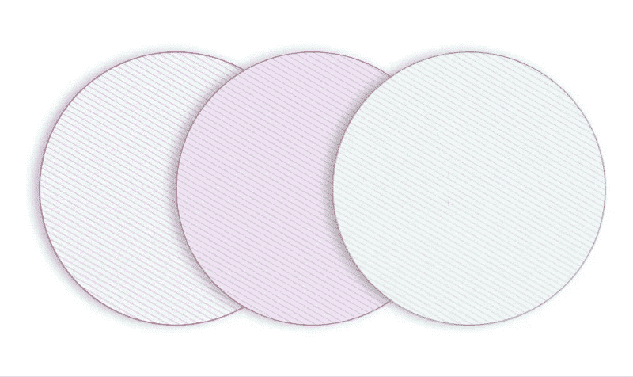
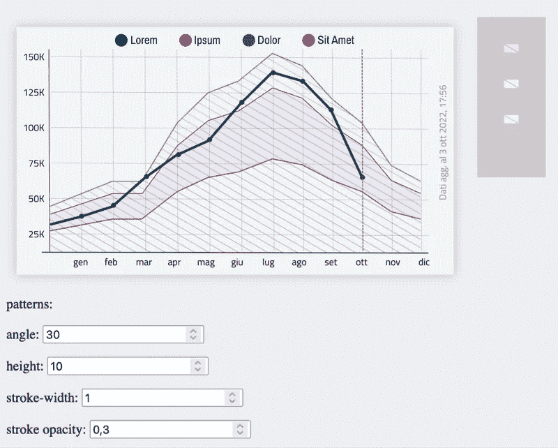
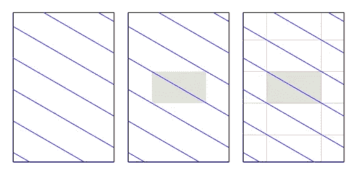
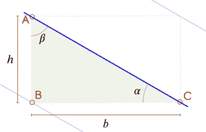
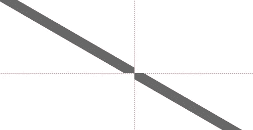
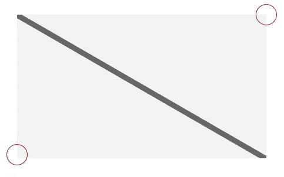
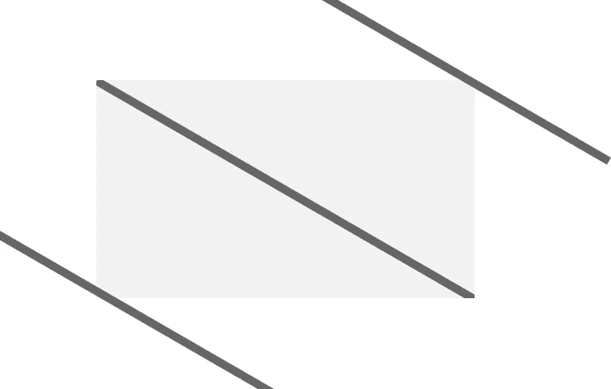
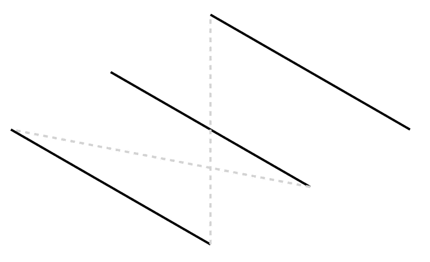
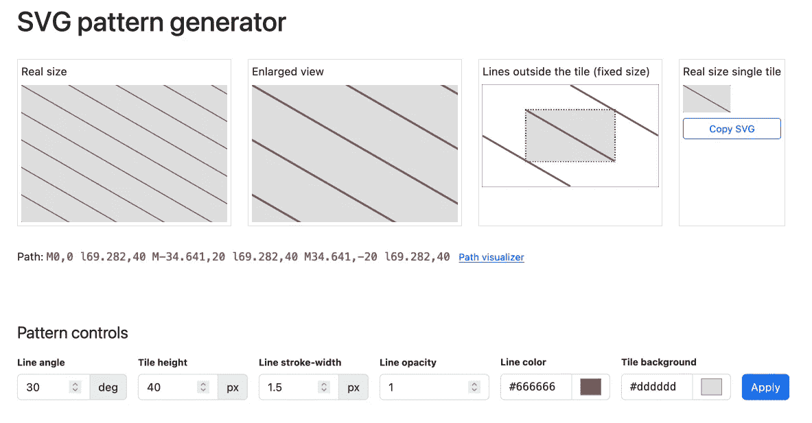
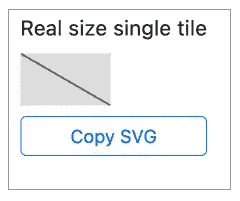

# 动态 SVG 模式

> 原文：<https://betterprogramming.pub/dynamic-svg-patterns-1b53c4ed1142>

## 在 React 中构建模式生成器

## 轻松生成 SVG 模式以包含在 React 项目中(带有 Figma 或 Sketch 的额外提示)



最近，我一直在处理一些用于图表填充的 SVG 模式。

我需要创建很多这样的图案，最困难的事情是为各种填充找出正确的颜色和色调，这样页面看起来就平衡了。

在研究了几个选项后，我发现最好的解决方案是使用图案而不是纯色或渐变填充。

最烦人的问题之一是在 Figma 中测试模型的困难。我尝试了许多不同的笔画宽度、颜色、线条角度等等，每一种变化在 Figma 中都花了相当长的时间。我也尝试了不同的插件，但是没有一个足够快或者适合我的目的。

为了解决这个问题，我决定安排一个快速而肮脏的 JavaScript 应用程序。首先，我从 Figma 以 SVG 格式导出了我正在处理的模块，并将其安装在一个 web 页面上。然后，我将需要填充图案的区域连接到一个简单的脚本，在这个脚本中我可以更改一些参数:



这样，我能够在很短的时间内测试模型的许多变体。最后，我将最终的模式带回 Figma，完成了我的原型。为了做到这一点，我使用了你可以在右边的灰色方框中看到的瓷砖，但我们稍后将回到这一点。

有可能我可以在 Figma 中直接做所有的事情，但是我没有时间(或者兴趣)这样做。

下面是我用来创建模式的过程，首先是原型，然后是 React 组件。

# 第一步:投射图案

根据[维基百科，镶嵌](https://en.wikipedia.org/wiki/Tessellation):

> *一个* ***镶嵌*** *或* ***平铺*** *是一个表面的覆盖，通常是一个平面，使用一个或多个几何形状，称为*平铺*，没有重叠也没有间隙。在数学中，镶嵌可以推广到更高维度和各种几何形状。*

我们需要一种简单的镶嵌，只基于在 *x* 和 *y* 轴上的瓷砖的平移。此外，我们需要的模式是一系列简单的线条:



如你所见，这个图案是绿色瓷砖的复制品。我们要做的就是安排好，让它可以无缝重复。

一旦我们决定了线之间的距离和角度，我们的目标是确定每个瓷砖的大小。

为此，我们必须处理[三角形](https://en.wikipedia.org/wiki/Triangle)和[三角学](https://en.wikipedia.org/wiki/Trigonometry)。

查看下面的模式，我们可以看到

*   线条起点( **A** )是图块的左上角；
*   这条线(蓝色)实际上是直角三角形的斜边，直角三角形的边是瓷砖的边；
*   **A-B** 侧( *h* )对应于图案线之间的距离。我们知道它，因为它是我们可以设定的参数之一，
*   同样适用于 **𝛼** 角度。

所以，我们得到 **C** 点坐标唯一缺少的值就是 **B-C** 边，我们三角形的底边( *b* )。



但是我们可以用一个简单的三角公式来确定它。三角形的底边等于另一条边乘以邻角的余切或对角的正切。

现在我们有了生成 SVG 模式所需的所有东西。

# 构建模式

SVG 有一个特定的[模式](https://developer.mozilla.org/en-US/docs/Web/SVG/Element/pattern)元素。

一个`pattern`元素必须在一个`[defs](https://developer.mozilla.org/en-US/docs/Web/SVG/Element/defs)`元素中定义，并且可以被添加到任何一个`svg`元素中(不仅仅是它们被应用到的那个)。

一旦定义了模式，就可以用它来填充 SVG 元素，方式如下:

```
<someElement fill="url(#pattern-id)">...</someElement>
```

为了将我们的 tile 定义为 SVG 模式元素，我们将编写如下代码:

```
<svg >
  <defs>
    <pattern id="pattern" patternUnits="userSpaceOnUse" width="69.282" height="40">
      <rect width="69.282" height="40" fill="#dddddd"></rect>
      <path d="M0,0 l69.282,40 M-34.641,20 l69.282,40 M34.641,-20 l69.282,40" stroke="#666666" stroke-width="1.5" stroke-opacity="1"></path>
    </pattern>
  </defs>
</svg>
```

`[rect](https://developer.mozilla.org/en-US/docs/Web/SVG/Element/rect)`元素是平铺背景(在本例中，它填充了浅灰色的`#ddd`),`[path](https://developer.mozilla.org/en-US/docs/Web/SVG/Element/path)`描述了我们的线条。

为了生成我们的模式，我们必须计算它们的`width`、`height`和`d`属性。

实际上，我们不需要计算`rect`元素的高度，因为它是我们可以选择的参数之一。

然后，给定参数`h`(矩形的高度，即线条之间的距离)和`𝛼`(线条角度)，矩形底(`b`)为:

```
b = Math.tan(((90 - 𝛼) * Math.PI) / 180) * h)
```

因为 JavaScript 缺少计算余切的原生函数，所以我们必须使用 Math 的`[tan](https://developer.mozilla.org/en-US/docs/Web/JavaScript/Reference/Global_Objects/Math/tan)`方法和`𝛼`相反的方法(也就是我们的方案中的`𝛽`)。我们不知道`𝛽`，但是由于所有三角形的角之和是 180°，而我们的三角形是 rect，所以可以计算为`90 - 𝛼`。

> 注意，常数是切线的倒数，所以如果你愿意，可以用`1/Math.tan(𝛼)`代替`Math.tan(𝛽)`。

所有的`Math`三角函数只接受以[弧度](https://en.wikipedia.org/wiki/Radian)表示的角度，所以我们必须使用下面的简单方法将角度转换成弧度:

```
angle_in_radians = angle_in_degrees * Math.PI / 180
```

其中`[Math.PI](https://developer.mozilla.org/en-US/docs/Web/JavaScript/Reference/Global_Objects/Math/PI)`代表数字`[π](https://en.wikipedia.org/wiki/Pi)`。

我们运算的结果很容易有几个小数位。如果您想在保持可接受的精度(比如 3)的同时降低它们，可以使用以下方法:

```
b = Math.round((Math.tan(((90 - 𝛼) * Math.PI) / 180) * h) * 1000) / 1000
```

现在我们有了`rect`元素的`width`属性和我们行的结束`x`坐标(`C`)。最后一步是计算`path`元素的`d`属性。

`d`允许我们通过使用一些简单的命令参数来定义任何路径。我们将只使用`M`和`l`命令，如需完整列表，请查看 MDN 上的[参考页面。](https://developer.mozilla.org/en-US/docs/Web/SVG/Attribute/d)

`d`代表*画*，所以想象一下你会怎么画我们的线:你会先把笔移到起点，然后画一条线到终点。

这变成`M0,0` ( **M** 移至坐标`0,0`的点)和`lb,h`(画一条 **l** 线至坐标`b,h`。

`l`命令是小写的，表示其坐标是相对于前一点的。

把所有东西放在一起(已经定义了我们的`b`和`h`变量:

```
d = `M0,0 l${b},${h}`
```

这似乎很容易，但不幸的是有一个小问题。

将上面的代码应用到我们的模式中，我们将得到类似这样的结果:



图案的边缘切断了我们的线条，所以我们在每个瓷砖的开头和结尾都缺少了两个小部分。要解决这个问题，我们必须添加缺失的部分:



最简单的解决方案是绘制两条与第一条类似的线，但从左下方和右上方平移:



图案将被裁剪，隐藏线条的不必要部分。所以我们的`d`属性变成了:

```
d=`M0,0 l${b},${h} 
   M${-b / 2},${h / 2} l${b},${h} 
   M${b / 2},${-h / 2} l${b},${h}`
```

我们只需要再加两笔，第一笔从`${-b / 2},${h / 2}`开始，第二笔从`${b / 2},${-h / 2}`开始。`l`参数与前一个命令相关，因此它们保持不变。

一切都用一个非常有用的工具解释清楚了: [SVG 路径可视化器](https://svg-path-visualizer.netlify.app/#M0%2C0%20l69.282%2C40%20M-34.641%2C20%20l69.282%2C40%20M34.641%2C-20%20l69.282%2C40):



另一个类似的伟大工具是 [SVG 路径编辑器](https://yqnn.github.io/svg-path-editor/)。

我已经做了一个[小演示](https://massimo-cassandro.github.io/area-test/2022-12-svg-pattern-generator/index.html)，在这里你可以改变许多参数来构建你的模式。



这是为各种类型的模式创建生成器的更大项目的第一步(然而，我不知道这会如何进行)。

# 警告

该脚本在大约 5-10 度和 70-75 度之间的角度下工作良好；使用其他值时，`b`参数倾向于`Infinity`或`0`，使程序无效。这并不难处理，但是由于超出了本文的范围，这里不讨论这些情况。

# 切换到反应

在 React 中有许多方法可以实现这个过程。为了拥有一个可重用的模式引擎，我选择创建一个能够为每个模式添加一组参数的组件。

下面的演示展示了应用于一些 SVG 形状的一系列模式:

# 回到图玛或素描

Figma 和 Sketch 呢？

我的演示的最后一个框显示了一个不使用模式的独立 SVG。



可以通过按钮复制 SVG，然后粘贴到 Figma 或 Sketch 中；两者都将呈现 SVG，因此您可以使用它来为您的模型创建模式。

整个过程仍然很繁琐，但我找不到更快的方法。

最后，如果您不需要定制模式，您可能会在 Michael Semmler 的[基本模式库中找到合适的模式](https://patterns.helloyes.dev/)

[查看我的其他与开发相关的文章](https://medium.com/@massimo.cassandro/my-dev-publications-eacf6727e4a)