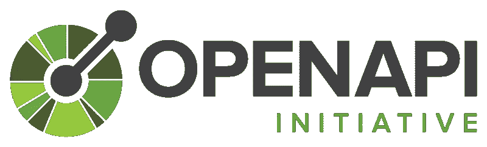

# 利用开放 API Spec 3.0 生成动态测试

> 原文：<https://betterprogramming.pub/dynamic-test-generation-with-open-api-spec-3-0-10dacd7866c2>

## 自动化您的测试套件


[Engin Akyurt](https://pixabay.com/users/engin_akyurt-3656355/?utm_source=link-attribution&amp;utm_medium=referral&amp;utm_campaign=image&amp;utm_content=3866515) 在 [Pixabay](https://pixabay.com/?utm_source=link-attribution&amp;utm_medium=referral&amp;utm_campaign=image&amp;utm_content=3866515) 拍摄的照片。

软件开发一直依赖于 API。从一开始，几乎所有软件都要求能够与外部系统集成。

今天，他们比以往任何时候都更加突出。一切都是 API 驱动的。我们现在甚至把 [API 优先开发](https://medium.com/better-programming/api-first-development-build-consistent-meaningful-apis-with-postman-db7d1e9e8b5c)作为一个东西。

对 API 的需求很高，作为开发人员，我们必须将精力集中在尽快推出可靠的、强定义的、稳定的 API 上。

但是如果我不谈测试，我会是一个什么样的负责任的开发人员呢？

一个 API 需要被测试。您需要验证它是否如文档所说的那样工作。您需要确保不破坏向后兼容性。

当然，你可以手动完成这些。但是随着您的 API 的增长，您必须编写的测试数量也在增长。并保持。最终，你会发现自己需要雇用一个人，他唯一的工作就是跟踪所有这些 API 测试。

但是如果有一种方法可以让我们自动化呢？



*图片来自* [*开放 API 规范*](https://www.openapis.org/) *。*

我写过几次关于开放 API 规范 3.0 (OAS)的文章。简而言之，这是描述现代 API 的行业标准方式。你可以在他们的网站上了解更多。

您应该用这个规范来定义您的 API。这是行业标准，意味着你可以雇佣具备必要技能的人来工作，并立即开始开发你现有的软件。

当你有问题时，有社区支持和论坛。规范不断得到改进。这个清单还在继续。

我不是来给你做广告的。我只是想确保你在开始构建你的 API 时已经考虑到了这一点，因为我接下来要说的内容都是假设你是这样的。


*标志为* [*邮递员*](https://www.postman.com/) *。*

这是我经常写的另一个话题。Postman 是一个用于 API 设计的全功能应用程序。它为您提供了 API 设计工具、测试请求的能力、自动化方法、源代码控制等等。

但是大多数人没有意识到的一个特性是他们的 API。Postman API 允许您操作集合、环境、模拟服务器，以及最重要的 API。

如果你用 Open API Spec 设计你的 API，并把它们存储在 Postman 中，你就有能力轻松地动态创建一套完全覆盖你的 API 的测试。


*形象由*[格尔德奥特曼](https://pixabay.com/users/geralt-9301/?utm_source=link-attribution&utm_medium=referral&utm_campaign=image&utm_content=3087393) *由*[*pix abay*](https://pixabay.com/?utm_source=link-attribution&utm_medium=referral&utm_campaign=image&utm_content=3087393)*。*

使用 Postman API，您可以加载 API 的 OAS 定义。加载您的定义后，您可以执行任意数量的治理验证、安全性测试、契约测试——甚至集成测试。

对于您在 Postman 中发送的每个请求，您都能够在执行之前和之后运行定制的 JavaScript 代码*。定制代码可以利用 [Postman 变量](https://learning.postman.com/docs/sending-requests/variables/)，运行测试和断言，甚至设置下一个运行哪个请求，允许你构建复杂的工作流或者一次又一次地循环相同的请求。*

为了构建一个动态测试生成器，您将使用 Postman 来加载您的 API 的 OAS 定义，加载所有定义的路径，构建请求体，并确定预期的结果。

幸运的是，我已经为你做了这一切！您可以克隆存储库，将环境和集合导入到您的工作区，填写所需的环境变量，然后运行它！

在提供的 GitHub repo 中，生成器将执行以下操作:

*   为提供的 API/工作空间加载 OAS。
*   验证定义的格式是否正确。
*   构建一个模式测试数组。
*   遍历数组中的每个测试，并向 API 提交一个请求。
*   根据 OAS 验证状态代码和响应主体模式。

在撰写本文时，这个集合的主要目的是提供验证必需 API 字段的测试。它将创建一个请求体，包含每个端点的所有必需字段，然后为每个字段创建一个排列。一种排列省略了一个必需字段，另一种排列传入一个空值。

然后，如果所有必填字段都存在，它将验证是否在响应中收到成功状态代码，如果必填字段缺失，则验证是否收到错误请求(400)状态代码。

# 模式测试数组

生成器将生成一组要运行的测试。测试以下列格式定义:

```
{ 
  "path": "", // Combines url from server and path 
  "parameters": [ ], // All parameters defined at the path 
  "method": "", // Path method 
  "allowedRole": "", // If using role based apps, grabs the first allowable role 
  "responses": [ // All expected responses for the path 
    { 
      "statusCode": 200, // Status code defined in responses array 
      "$ref": "#/components/responses/Ok" // Grabs either referenced response or inline defined schema 
    } 
  ], 
  "success": true, // Boolean for if this test is expected to be a success 
  "description": "Has all required fields", // Generated description for what is being tested 
  "body": { }, // Generated request body in JSON 
  "name": "" // Generated request name with method, path, description, and success 
}
```

每个测试代表一个对 API 的调用。Postman 将遍历每一个生成的测试，直到数组为空，命中您的 API 并根据 Open API 规范中定义的内容验证响应。

# 动态请求

在 Postman 中，可以在请求前脚本(请求执行前运行的代码)中以编程方式设置关于请求的所有内容。

从生成的模式测试(如`path`、`parameters`、`method`和`body`)中提取内容，并通过代码设置所有这些内容，这允许我们拥有一个可以反复转换的单一通用“请求”。

例如，如果我们想向 postman echo API 发出 POST 请求，我们只需在请求前脚本中执行以下操作:

```
pm.request.url = 'https://postman-echo.com/post'; 
pm.request.method = 'POST';
```

当请求执行时，它将发布到提供的 URL，而不是最初在请求上配置的任何内容。很酷，对吧？

# 动态测试

生成的模式测试的一部分包括一个`success`字段和一个`responses`字段。如果`success`字段被设置为`true`，集合知道期待一个成功状态码(2XX)。如果该字段是`false`，它知道期待一个故障状态代码(特别是 400)。

它还将使用 [ajv](https://ajv.js.org/) 验证响应体的形状。该测试将查看状态代码，加载特定于该代码的响应模式，并向 ajv 提供模式定义和响应主体。然后运行 Postman 测试，以确保验证成功返回。默认情况下，Ajv 包含在 Postman 沙盒环境中，因此运行这些测试不需要外部依赖。

在验证结束时，集合将检查是否有更多生成的模式测试要运行。如果有，它将使用`postman.setNextRequest`命令返回请求并重新执行。


*图像由*[](https://pixabay.com/users/mohamed_hassan-5229782/?utm_source=link-attribution&utm_medium=referral&utm_campaign=image&utm_content=4443332)**由*[*Pixabay*](https://pixabay.com/?utm_source=link-attribution&utm_medium=referral&utm_campaign=image&utm_content=4443332)*组成。**

# *为什么它很重要*

*如果你曾经花时间编写和维护 API 测试，你就会知道这有多麻烦。这是同样的事情，一遍又一遍，在执行之间有微小的变化。*

*它占用了开发人员大量的时间(当您应该致力于解决业务问题时)，并且是一个大量手工操作的过程。另外，你不会得到 100%的保障。这意味着你的 API 的每一种排列都不会被测试。*

*任何时候你有一个手动的过程，你就引入了一个出错的机会。*

*人都会犯错。做过一次或者一千次都无所谓。你会忘记一些东西，它会破碎。这是生活的现实。*

*因此，如果我们自动化这些 API 测试，我们将获得多种好处:*

1.  *为开发人员节省大量时间。*
2.  *保证每次都以同样的方式构建和测试。*
3.  *100%覆盖率。*

*一台机器不会变得懒惰并说，“这已经足够好了。”它会完全按照要求去做，以同样的方式构建和运行测试，并覆盖每一种排列。*

**

**图像由*[*Amjad Ali Ali*](https://pixabay.com/users/aa8916744-18145689/?utm_source=link-attribution&utm_medium=referral&utm_campaign=image&utm_content=5557589)*来自*[*pix abay*](https://pixabay.com/?utm_source=link-attribution&utm_medium=referral&utm_campaign=image&utm_content=5557589)*。**

# *尝试一下*

*我鼓励你尝试一下，甚至可能将它纳入你的 CI 渠道。我有[合同测试](https://github.com/allenheltondev/postman-contract-test-generator)和[安全测试](https://github.com/allenheltondev/postman-security-test-generator)的参考资料([我也就此写了一篇文章](https://medium.com/better-programming/micro-frontends-role-based-applications-and-you-5d6cd8d796eb))。*

*这只是开始。随着我们发现新的用例并证明生成器的有效性，还有更多的特性需要添加。*

*如果您希望投稿，请随时提交请求或添加问题。如果你遇到问题或者有好主意，我非常乐意帮忙。*

*如果这对你有用，请告诉我！我很想听听你的成功故事。*