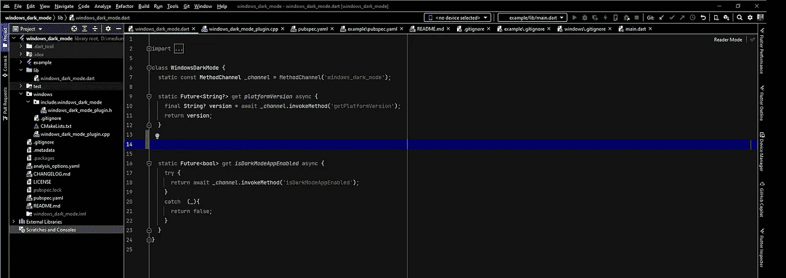
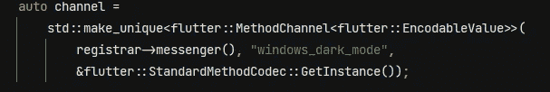

# 对 Flutter 桌面应用程序中的 Windows 设置更改做出反应

> 原文：<https://betterprogramming.pub/dynamic-theme-settings-change-in-a-flutter-desktop-app-63f137630417>

## 使用事件通道接收事件，动态主题化您的 Flutter Windows 应用程序


照片由[维达尔·诺德里-马西森](https://unsplash.com/@vidarnm?utm_source=medium&utm_medium=referral)在 [Unsplash](https://unsplash.com?utm_source=medium&utm_medium=referral) 拍摄

*简介:*学习如何在插件中使用*平台通道*从 Flutter 设置一个`WNDPROC` 回调函数。该示例展示了如何在应用程序中动态更改主题。

# 介绍

两个月前 [Flutter 2.10](https://medium.com/flutter/whats-new-in-flutter-2-10-5aafb0314b12) 带来了稳定的 Windows 支持。好吧，这不是新闻，Flutter 以前为 Windows 编译应用，为什么现在这么重要？答案是一个简单的词:“稳定”，因为现在谷歌宣布它是，我们可以决定投入更多的时间和资源，使用这个神奇的工具开发 Windows 应用程序。

多亏了几个热心人的工作， [pub.dev](https://pub.dev/) 上的很多包都支持 Windows 开发，而且这个列表还在增长。然而，正如在之前告诉[的那样，在 Flutter 中设计我们闪亮的新 Windows 应用程序有时可能会有我们遗漏的东西。](/flutter-platform-plugin-windows-1-8b7c0a96fac4)

例如，我们可能需要我们的应用程序对 Windows 系统范围的事件做出反应，并相应地改变它的行为。Flutter 没有现成的接口来做这件事。为了了解如何实现这一点，我们将实现一个*事件通道*，它可以在我们的 Dart 代码中提供这些事件。

> 如果你已经有利用平台渠道编写插件的经验，跳到下一段，如果没有，可以看前面的故事:

[](/flutter-platform-plugin-windows-1-8b7c0a96fac4) [## 创建一个 Flutter 插件，为 Windows 编写特定于平台的代码

### 通过编写您的 Flutter 桌面应用程序来利用 Windows 特有的功能

better 编程. pub](/flutter-platform-plugin-windows-1-8b7c0a96fac4) 

# 例子:我们想要什么

假设我们希望每次用户在 Windows 中打开或关闭黑暗模式时，我们的应用程序都接收一个事件。

使用 C++或其他“本地”语言在 Win32 应用程序中实现这一点似乎很简单:我们必须注册一个处理程序来监听我们的应用程序接收到的 Windows `WM_`事件:

```
HWND handle = GetActiveWindow()**;** oldProc = reinterpret_cast<WNDPROC>(GetWindowLongPtr(handle**,** GWLP_WNDPROC))**;** SetWindowLongPtr(handle**,** GWLP_WNDPROC**,** (LONG_PTR)MyWndProc)**;**
```

这是我们的新处理程序，每次 Windows WM_ message“到达”时都会调用它:

```
LRESULT CALLBACK MyWndProc(HWND hWnd**,** UINT iMessage**,** WPARAM wParam**,** LPARAM lParam)
      {
        if (iMessage == WM_SETTINGCHANGE)
        {
       if (!lstrcmp(LPCTSTR(lParam)**,** L"ImmersiveColorSet"))
                 {
                   ChangeOurAppTheme();
                 }
        }
        return oldProc(hWnd**,** iMessage**,** wParam**,** lParam)**;** }
```

当一个`WM_SETTINGCHANGE`消息被拦截时，如果`*lParam*`指向“ImmersiveColorSet”` Unicode 字符串，操作系统就发出信号，表明当前 UI 主题发生了变化。

# 颤振侧实施

在 Flutter 应用程序中，情况有点不同。让我们从克隆这个[库](https://github.com/pgiacomo69/windows_dark_mode)开始，并在我们的 IDE 中打开项目。

我们知道，在 Flutter 中使用方法通道就像调用远程 API 一样，但是现在我们需要订阅一个流。为此，我们将使用*事件通道*，让我们在首选 IDE 中打开`lib/windows_dark_mode.dart`:



现在，我们将在 WindowsDarkMode 类中添加以下代码:

为此，我们:

1.  将`_eventChannel`声明为一个`EventChannel`实例。这将是我们从 Dart 到平台代码的“传输连接”。在构造函数中，我们传递通道名。事实上，我们已经将这个名称构造为一个“路径”,对应于我们的插件名称和一个专有名称，它标识了正确的流。我使用这个约定来更好地识别通道并避免与其他包冲突的风险，事实上你可以随意命名通道。
2.  实现了从平台“翻译”事件的静态方法`DarkModeStream()`。在内部，我们调用提供`Stream<dynamic>`的方法`receiveBroadcastStream()`，将动态值映射到`ThemeMode`的级联方法`map()`，以及在两个或更多连续相同值到达时去抖事件的`distinct(),`。

# 实现，平台端

让我们看看“后端”，打开`/windows/windows_dark_mode_plugin.cpp` :


`WindowsDarkModePlugin`已经包含了我之前教程中实现的代码。当被询问时，它提供黑暗模式的当前状态。

在`RegisterWithRegistrar`当前我们只有*方法通道*声明，以接收来自 Dart 的查询:



用同样的方法，我们必须实现平台*事件通道*:

```
plugin->m_event_channel = std::make_unique<flutter::EventChannel<flutter::EncodableValue>> (
          registrar->messenger ()**,** "windows_dark_mode/dark_mode_callback"**,** &flutter::StandardMethodCodec::GetInstance ()
       )**;**
```

`m_event_channel`需要在类接口中声明，私有:

```
std::unique_ptr<flutter::EventChannel<flutter::EncodableValue>> m_event_channel**;**
```

这些包括需要补充的:

```
#include <flutter/event_channel.h>
#include <mutex>
```

*事件通道*已经准备好了，但是要发送事件，它需要一个 *StreamHandler* 将事件从平台排队到引擎，所以我们在同一个名称空间中包含了我们的新类:

在 WindowsDarkModePlugin 接口中声明一个变量:

```
MyStreamHandler<> *m_handler**;**
```

将其实例化，并分配给`RegisterWithRegistrar`中的事件通道，

```
MyStreamHandler<> *_handler=new MyStreamHandler<> ()**;** plugin->m_handler = _handler**;** auto _obj_stm_handle = static_cast<flutter::StreamHandler<flutter::EncodableValue>*> (plugin->m_handler)**;** std::unique_ptr<flutter::StreamHandler<flutter::EncodableValue>> _ptr {_obj_stm_handle}**;** plugin->m_event_channel->SetStreamHandler (std::move (_ptr))**;**
```

现在我们必须拦截 WM_ messages。我们可以调用 SetWindowLongPtr 来设置我们的 WNDPROC 处理程序，对吗？

但是我们不会，因为 Flutter Engine 也注册了他的 handler，它可以给我们机会来接入消息流，所以我们将使用`[RegisterTopLevelWindowProcDelegate](https://engine.chinmaygarde.com/classflutter_1_1_window_proc_delegate_manager_win32.html)`，一个由 Flutter Engine 提供的平台端的方法。所以我们将替换`WindowsDarkModePlugin`构造函数和析构函数:

现在，我们已经设置了一个回调来挂钩 WM_ messages，并在 WindowsDarkMode 的实例被释放时取消设置。

然后我们必须修改`WindowsDarkModePlugin`类的接口:

*   更改构造函数签名以接受`registrar`参数；
*   在私有部分声明`int window_proc_id = -1;`,这标识了我们正在注册的处理程序，这对于撤销注册很有用；
*   在私有部分声明`flutter::PluginRegistrarWindows* registrar;`，我们需要`registrar`在处理时注销我们的钩子；
*   在私有部分声明`std::optional<LRESULT> HandleWindowProc(HWND hWnd,UINT message,WPARAM wParam,LPARAM lParam);`头；

然后我们将替换`RegisterWithRegistrar`静态方法中的插件实例化，简单地添加`registrar`参数:
`auto plugin = std::make_unique<WindowsDarkModePlugin>(registrar)**;**`

我们将在类体中实现`HandleWindowProc`:

> 我们在我们的流处理器上调用`on_callback`方法，发送`isDarkModeAppEnabled()`的结果，后一个方法给我们一个布尔值，但我们使用`[flutter::EncodableValue()](https://engine.chinmaygarde.com/encodable__value_8h_source.html)`对它进行装箱，这是我们用来从平台向我们的应用程序的 Dart 端发送数据的方法，[在这里我们的布尔值将被取消装箱](https://docs.flutter.dev/development/platform-integration/platform-channels)。

现在我们将尝试编译这个项目，只是为了检查语法到目前为止是否良好，如果是的话…

# 让我们试试

现在，我们将修改“example/lib/main.dart”中的主体，将我们的`MaterialApp`包装在 StreamBuilder 中，因此当我们在 Windows 中切换主题时，我们的应用程序主题将会改变:

让我们点击运行:

希望这篇教程对你有用。很快我将继续这个话题，用其他教程展示如何在 Windows 中调试插件的 c++代码，以及如何获得 Windows 主题颜色。

上述教程的完整代码可以在这个 GitHub [库](https://github.com/pgiacomo69/windows_dark_mode/tree/events)的“events”分支中找到。感谢阅读。

相关文章:

[](/flutter-platform-plugin-windows-1-8b7c0a96fac4) [## 创建一个 Flutter 插件，为 Windows 编写特定于平台的代码

### 通过编写您的 Flutter 桌面应用程序来利用 Windows 特有的功能

better 编程. pub](/flutter-platform-plugin-windows-1-8b7c0a96fac4)