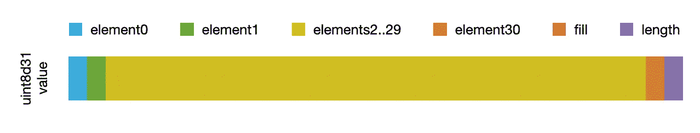
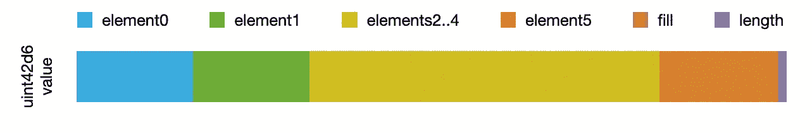
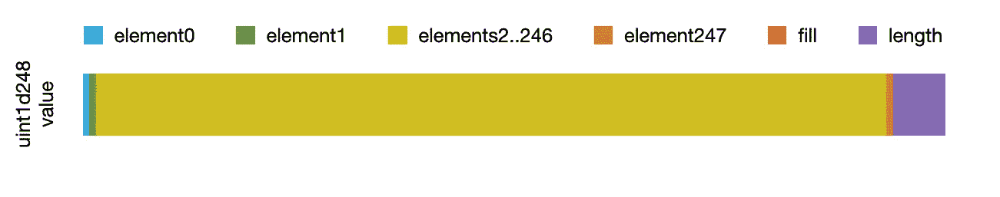
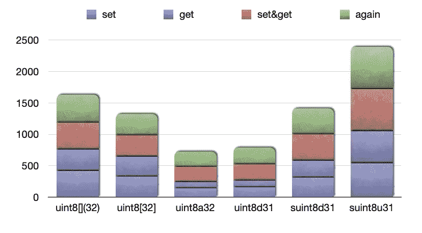
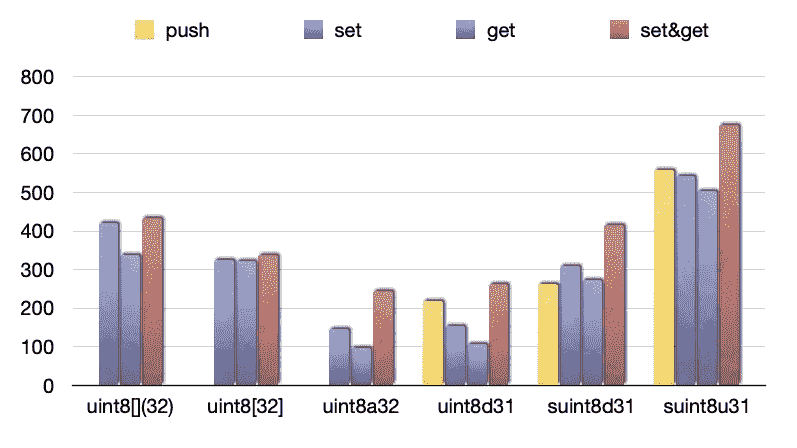
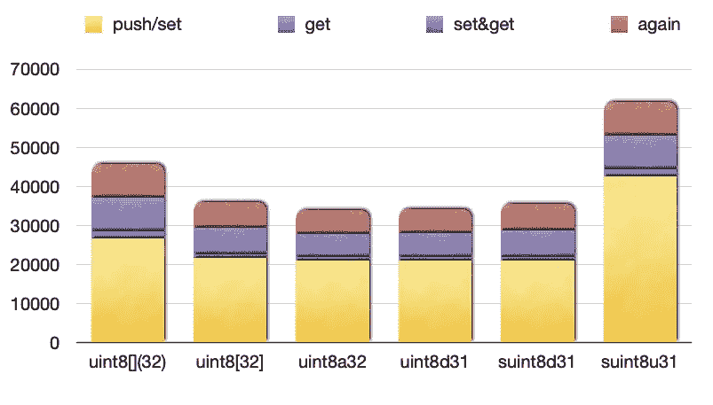
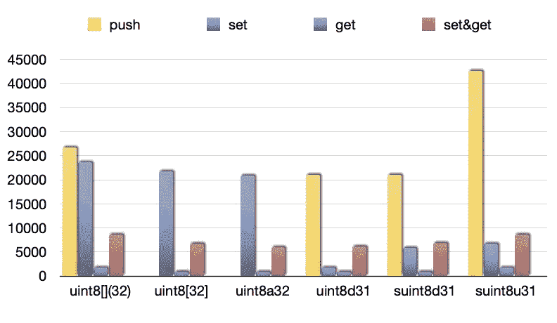
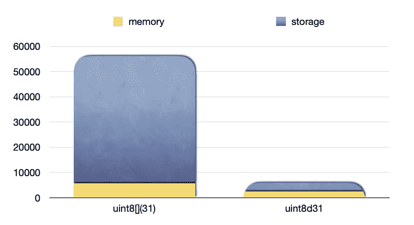

# Solidity 中的动态值数组

> 原文：<https://betterprogramming.pub/dynamic-value-arrays-in-solidity-8e9b44015833>

## 动态值数组在坚固性上比引用数组更高效吗？


照片由[尼克·关](https://unsplash.com/@snick_kwan?utm_source=medium&utm_medium=referral)在 [Unsplash](https://unsplash.com?utm_source=medium&utm_medium=referral) 拍摄

# 背景

在开发和测试 Datona Labs 的[Solidity](https://solidity.readthedocs.io/en/v0.7.0/)smart data access contract(S-DAC)模板的过程中，我们经常需要处理数量较少但未知的数据，比如用户 id。理想情况下，它们存储在小值的小型动态数组中。

在本文的例子中，我们研究了使用动态值数组是否比使用引用数组或 Solidity 中的类似解决方案更有效。

# 讨论

如果我们有由已知的少量小数字组成的数据，我们可以在 Solidity 中使用一个值数组，如作者的文章“ [Value Arrays in Solidity](https://medium.com/coinmonks/value-arrays-in-solidity-32ca65135d5b) ”中所述，其中我们提供并测量了 Solidity 值数组。我们的结论是，在许多情况下，我们可以使用值数组来减少我的存储空间和气体消耗。

之所以得出这个结论，是因为 Solidity 运行在以太坊虚拟机(EVM)上，它有一个非常大的 256 位(32 字节)的[机器字](https://en.wikipedia.org/wiki/Word_(computer_architecture))。这一特性，加上处理参考数组的高气体消耗，促使我们考虑使用值数组。

然而，如果我们为固定值数组操作提供了自己的库，那么让我们来确定提供动态值数组是否可行。

让我们比较一下动态值数组和固定值数组，以及 Solidity 自己的固定和动态数组。

我们还将比较包含长度和固定数组的结构，以及包含值数组的结构。

# 可能的动态值数组

在 Solidity 中，只可能有动态存储数组。存储器阵列具有固定的大小，并且不允许使用`push()`来附加额外的元素。

既然我们在 Solidity 库中为动态值数组提供了自己的代码，我们也可以提供在存储和内存数组上使用的`push()` (和`pop()`)。

动态值数组将需要记录和操作数组的当前长度。在下面的代码中，我们选择将长度存储在 256 位 32 字节机器字值的高位。

## 动态值数组

这些是动态值数组，与一些可用的实度类型相匹配:

```
**Dynamic Value Arrays**Type           Type Name   Descriptionuint128[](1)   uint128d1   one 128bit element value
uint64[](3)    uint64d3    three 64bit element values
uint32[](7)    uint32d7    seven 32bit element values
uint16[](15)   uint16d15   fifteen 16bit element values
uint8[](31)    **uint8d31**    thirty-one 8bit element values
```

我们建议使用如上所示的类型名，它贯穿于本文，但是您可能会发现一个更好的命名约定。

以下是 **uint8d31** 值数组类型的数据组织:



uint8d31 值数组类型的数据组织

我们将在下面更详细地查看 **uint8d31** 。

## 更多动态值数组

显然，有更多可能的值数组。假设我们保留 256 位值的最高位来保存最大动态数组长度，X 值中的位数乘以 Y 元素的数量必须小于或等于 256 减去足够保存数组长度的位数 L:

```
**More Dynamic Value Arrays**Type           Type Name  Len  Descriptionuint**X**[](**Y**)     uint**X**d**Y**     **L**   **X** * **Y** <= 256 - **L**uint255[](1)   uint255d1   1   one 248bit element value
uint126[](2)   uint126a2   2   two 124bit element values
uint84[](3)    uint84d3    2   three 82bit element values
uint63[](4)    uint63d4    3   four 62bit element values
uint50[](5)    uint50d5    3   five 51bit element values
uint42[](6)    *uint42d6*    3   six 42bit element values
uint36[](7)    uint36d7    3   seven 36bit element values
uint31[](8)    uint31d8    4   eight 31bit element values
uint28[](9)    uint28d9    4   nine 28bit element values
uint25[](10)   uint25d10   4   ten 25bit element values
uint22[](11)   uint22d11   4   eleven 22bit element values
uint21[](12)   uint21d12   4   twelve 21bit element values
uint19[](13)   uint19d13   4   thirteen 19bit element values
uint18[](14)   uint18d14   4   fourteen 18bit element values
uint16[](15)   uint16d15   4   as above
uint15[](16)   uint15d16   5   sixteen 15bit element values
uint14[](17)   uint14d17   5   seventeen 14bit element values
uint13[](19)   uint13d19   5   nineteen 13bit element values
uint12[](20)   uint12d20   5   twenty 12bit element values
uint11[](22)   uint11d22   5   twenty-two 11bit element values
uint10[](25)   uint10d25   5   twenty-five 10bit element values
uint9[](27)    uint9d27    5   twenty-seven 9bit element values
uint8[](31)    **uint8d31**    5   as above
uint7[](35)    uint7d35    6   thirty-five 7bit element values
uint6[](41)    uint6d41    6   forty-one 6bit element values
uint5[](50)    uint5d50    6   fifty 5bit element values
uint4[](62)    uint4d62    6   sixty-two 4bit element values
uint3[](83)    uint3d83    7   eighty-three 3bit element values
uint2[](124)   uint2d124   7   one-hundred & twenty-four 2bit EVs
uint1[](248)   *uint1d248*   8   two-hundred & forty-eight 1bit EVs
```

所需的数组类型是特定于项目的。此外，可能需要多个数组类型，例如，用户 id 使用 uint8d31，角色使用 uint5d50。

以下是所选值数组类型的数据组织:



*uint42d6* 值数组类型的数据组织



*uint1d248* 值数组类型的数据组织

注意 *uint1d248* 值数组。这使我们能够有效地将多达 248 个表示布尔值的一位元素值编码成一个 EVM 字。相比之下，Solidity 的 bool[248]占用了 248 倍的内存空间，甚至 8 倍的存储空间。

## 动态值数组实现

下面是一个有用的导入文件，它为动态值数组类型 uint8d31 提供了 get 和 set 函数:

```
// uint8d31.sollibrary uint8d31 { // provides the equivalent of uint8[](31)
    uint constant **wordBits** = 256;
    uint constant **bits** = 8;
    uint constant **elements** = 31;
    uint constant **lenBits** = 5;
    // ensure that (**bits** * **elements)** <= (**wordBits** - **lenBits)**

    uint constant range = 1 << bits;
    uint constant max = range - 1;
    uint constant lenPos = wordBits - lenBits;

    function *length*(uint va) internal pure returns (uint) {
        return va >> lenPos;
    } function *setLength*(uint va, uint len) internal pure returns
    (uint) {
        require(len <= elements);
        return (va & (uint(~0x0) >> lenBits)) | (len << lenPos);
    } function *get*(uint va, uint index) internal pure returns (uint) {
        require(index < (va >> lenPos));
        return (va >> (bits * index)) & max;
    } function *set*(uint va, uint index, uint value) internal pure 
    returns (uint) {
        require((index < (va >> lenPos)) && (value < range));
        index *= bits;
        return (va & ~(max << index)) | (value << index);
    } function *push*(uint va, uint value) internal pure returns (uint){
        uint len = va >> lenPos;
        require((len < elements) && (value < range));
        uint posBits = len * bits;
        va = (va & ~(max << posBits)) | (value << posBits);
        return (va & (uint(~0) >> lenBits)) | ((len + 1) << lenPos);
    }
}
```

`length()` 函数返回动态值数组的当前大小。您可以使用`setLength()`或`push()`或*改变数组中元素的数量。*

`get()`和`set()`函数按照固定值数组获取和设置特定的元素，除了只有在数组的当前大小内的元素才可以被访问。

`push()`函数将值追加到动态值数组的最大大小。简单地定义`pop()` 也可以提供一个高效的小值堆栈。

让我们看几个简单的、阳光明媚的测试，测试 uint8d31 示例库代码:

```
import "uint8d31.sol";contract TestUint8d31 {
    using uint8d31 for uint;

    function test1() public pure {
        uint va;
        require(va.length() == 0, "length not 0"); va = va.setLength(10);
        require(va.length() == 10, "length not 10");
    }

    function test2() public {
        uint va;
        va = va.push(0x12);
        require(va.get(0) == 0x12, "va[0] not 0x12");
        require(va.length() == 1, "length not 1");

        va = va.push(0x34);
        require(va.get(1) == 0x34, "va[1] not 0x34");
        require(va.length() == 2, "length not 2");

        va = va.setLength(31);
        require(va.length() == 31, "length not 31"); va = va.set(30, 0x78);
        require(va.get(30) == 0x78, "va[30] not 0x78");
        require(va.length() == 31, "length not 31");
    }
}
```

## 结构动态数组

使用结构的优点是它们是通过引用内部(而不是外部)库函数来传递的，不需要从`setLength()`、`set()`和`push()`分配函数返回值。

下面是一个包含固定数组和长度的 31 字节数据的结构，以及相关的库函数:

```
struct Suint8u31 { // struct representing uint8[](31)
    uint8[31] data;
    uint8 length;
}// ------------library Suint8u31lib {
    // constant declarations as per uint8d31

    function length(Suint8d31 memory s) internal pure returns (uint)
    {
        return s.length;
    } function setLength(Suint8d31 memory s, uint len) ... // other function definitions similar to uint8d31
}
```

这段代码类似于 uint8d31，只是在需要的地方替换了`s.length`和`s.data[index]`，并且没有从`setLength()`、`set()`或`push()`返回值。

上面定义的 Suint8u31 结构似乎消耗了 256 位的地址空间。但在可靠性方面，每个数组都包含一个额外的 256 位数组长度值，即使它是一个固定的数组，因此我们预计该解决方案的气体消耗将高于预期。

## 结构动态值数组

下面是一个包含动态值数组和相关库函数的结构:

```
struct Suint8d31 { // struct representing uint8[](31)
    uint va; // uint8d31 value array
}// ------------library Suint8d31lib {
    // as per uint8d31

    function length(Suint8d31 memory s) internal pure returns (uint)
    {
        return s.va >> lenPos;
    } function setLength(Suint8u31 memory s, uint len) ... // other function definitions similar to uint8d31
}
```

这段代码与 uint8d31 非常相似，只是用`s.va`代替每次出现的`va`，并且不从`setLength(`)、`set()`或`push()`返回值。

让我们测量一下这个神秘的舒适休息后的油耗。


作者的神秘照片

# 燃气流量

在编写了库和合同之后，我们使用作者在文章[固体功能的气体成本](https://medium.com/coinmonks/gas-cost-of-solidity-library-functions-dbe0cedd4678)中描述的技术来测量气体消耗。

以下是图表的图例:

```
**Legend         Meaning**uint8[](32)    Solidity dynamic array of 32 uint8
uint8[32]      Solidity fixed array of 32 uint8
uint8a32       Fixed Value Array of 32 uint8 ([other](https://medium.com/@plaxion/value-arrays-in-solidity-32ca65135d5b) article)
uint8d31       Dynamic Value Array of <= 31 uint8 (this article)
suint8d31      Struct containing Dynamic Value Array of <= 31 uint8
suint8u31      Struct containing Solidity fixed array of <= 31 uint8
```

## EVM 内存空间中的 uint8 阵列

这里，我们比较了在 EVM 内存空间中使用动态 uint8 数组的情况:



获取和设置 uint8 内存变量的气体消耗

此图表显示，动态值数组(uint8d31)上一些常见操作的气体消耗仅比固定值数组(uint8a32)多一点。

所有其他选项消耗的气体都要多得多，尤其是包含 Solidity 固定数组的结构(最后一列)。

以下是各项操作的气体消耗量对比:



uint8 内存变量的 push、get 和 set 的气体消耗

注意，`push()`在 Solidity 内存数组上是不允许的，即使是动态内存数组(每种类型的金色列)，但是我们确实为本文中测量的动态数据结构实现了它。

由此得出的结论是，动态值数组(uint8d31)只比固定值数组(uint8a32)消耗多一点点的数据，而所有其他选项消耗的数据(有时会多很多)更多。

## EVM 存储空间中的 uint8 阵列

这里，我们比较了在 EVM 存储空间中使用动态 uint8 阵列的情况:



推送/设置和获取 uint8 存储变量的气体消耗

在这里，除了第一列和最后一列的高气体消耗之外，画面是清楚的，选择不太明确。

以下是各项操作的气体消耗量对比:



uint8 存储变量的推送、获取和设置的气体消耗

要关注的列可能是 rust 列(每种类型的最右侧)，它倾向于显示分配存储空间后的典型使用情况，而第一个`push()`或`set()`会导致存储空间被分配，这会消耗 EVM 上的大量汽油。

以上，动态值数组(uint8d31)比固定值数组(uint8a32)消耗的气体多一点，其他所有选项消耗的气体都多一点。

# 分包合同和库的参数



将 uint8 参数传递给分包或库的气体消耗

不足为奇的是，最大的气体消耗是向一个分包函数或库函数提供一个数组参数，然后再次获取该值。

相反，使用一个值显然会消耗更少的汽油。

# 其他可能性

如果您发现动态值数组很有用，您可能还想考虑固定值数组、固定多值数组、值队列、值堆栈等等。如果你的算法(比如`Sort`)使用值数组而不是引用数组，它们会有怎样的表现？

# 结论

我们已经为 uintX[](Y)小型动态值数组的通用库代码提供并测量了代码。

与 Solidity 的动态数组相比，我们可以使用动态值数组来减少存储空间和气体消耗。

如果您的 Solidity 智能契约使用小值的小型动态数组(用于用户 id、角色等)，那么使用动态值数组可能会消耗更少的汽油。

在复制数组的情况下，例如，对于分包合同或库，动态值数组将总是消耗少得多的气体。

在其他情况下，继续使用动态引用数组。

感谢阅读！