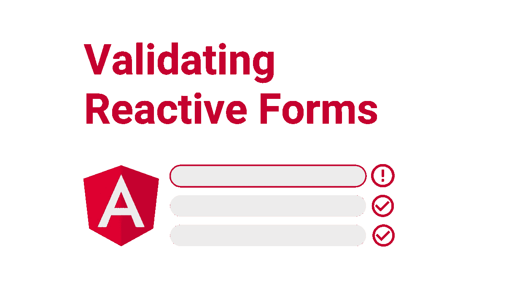
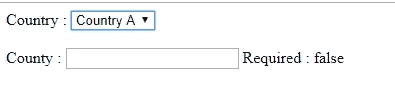
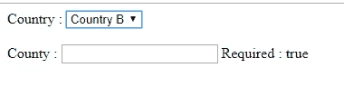

# 以角度反应形式动态添加/删除验证器

> 原文：<https://betterprogramming.pub/dynamically-add-remove-validators-in-angular-reactive-forms-8ea83c44529>

## 在角度反应表单中添加和删除动态验证的简单指南



图片来源:作者

如果你正在开发一个 [Angular](https://angular.io/) 应用程序，你可能会面临这样的情况，你必须在表单控件中动态地添加或删除一些验证器。例如，假设您的反应式表单中有一个`County`字段，您希望根据用户选择的国家将它设置为必填字段。为此，您可能会考虑根据所选择的国家在`County`字段中添加和删除`Required`验证器。

嗯，对于这种场景，Angular 帮了我们很大的忙。我们在 Angular 中有一些内置函数，可以用来有条件地设置验证器——多亏了反应式表单，我们可以非常非常容易地做到这一点。

所以我们从头开始吧。

我希望你有一个反应形式的运行角度应用程序。对我来说，我有一个非常简单的表单，有两个字段。一个是给`Country`的，第二个是给`County`的，就像开头提到的。

我有一个模板和相应的组件代码，如下所示。

让我们一步一步地讨论我们在这里做什么。

1.  我们刚刚创建了一个简单的反应式表单，有两个字段，`Country`和`County`。
2.  我们有一个`Country`的下拉列表，每当下拉列表的值改变时，我们调用一个函数`onCountryChange()`来更新`County`的验证器。
3.  只是为了验证是否设置了`Required`验证器，我们正在检查`County`字段是否有`required`错误。
4.  我们只是用默认验证初始化了反应式表单。
5.  在`onCountryChange()`方法中，我们检查所选国家的值。如果这个值是`B`(只是在我的例子中)，我们用`setValidators()`方法为`County`设置`Required`验证器。
6.  如果`Country`不是`B`，我们只是清除验证器。

下面是它在浏览器中的样子:



仅此而已。在角反应形式中添加或删除验证器就是这么简单。

# **需要记住的一些要点**

1.方法从表单控件中移除所有先前的/默认的验证器。例如，让我们假设在表单初始化期间，您为`County`设置了`maxLength`和`minLength`验证器。但是一旦`setValidators([Validators.required])`执行，它将从`County`中移除`maxLength`和`minLength`，并且只设置`Required`验证器。

因此，如果您想同时拥有`maxLength`和`minLength` ，只需这样做:

```
setValidators([Validators.required, Validators.maxLength(10), Validators.minLength(5)])
```

2.在更新(添加或删除)验证器之后，总是使用`updateValueAndValidity()`方法。因为你所有与控制相关的改变只有在你放了这个语句，也就是`updateValueAndValidity()`才会体现出来。

3.不幸的是，Angular 没有提供从表单控件中只移除一个验证器的方法。它有一个`clearValidators()`方法，但是这将移除所有的验证器。

为此，我们可以做两件事。我们可以使用`clearValidators()`来删除所有的验证器，然后使用`setValidators()`来设置需要的验证，或者我们可以直接使用`setValidators()`来设置需要的验证器(没有您不想要的验证器)。

这就是这篇文章的内容。我希望这有所帮助。

# 参考

最终代码可在 GitHub 上获得:

 [## gouravkajal/dummy app-dynamicFormValidation

### 此项目是使用 Angular CLI 版本 11.0.2 生成的。为开发服务器运行 ng serve。导航到…

github.com](https://github.com/gouravkajal/dummyApp-dynamicFormValidation) 

感谢阅读！