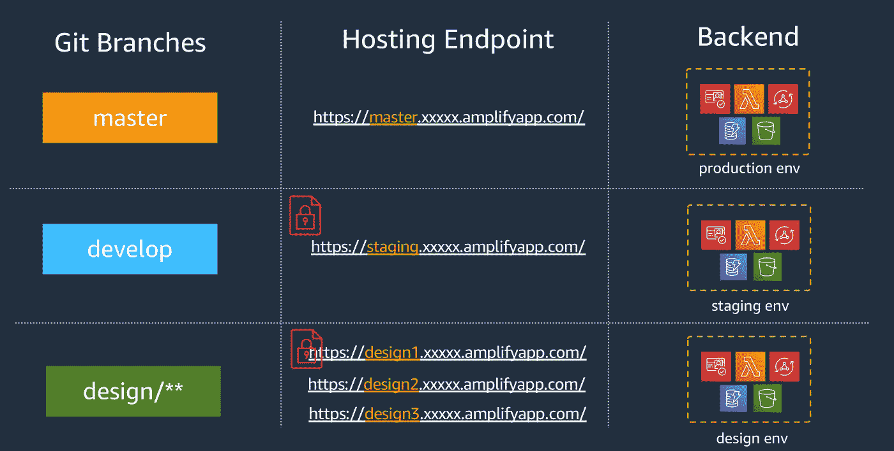

# 在运行时动态改变 Android 的后端环境

> 原文：<https://betterprogramming.pub/dynamically-change-backend-environment-in-android-at-runtime-d3af9ec7391f>

## 通过同时使用所有环境来加速您的 Android 应用程序开发



后端的环境示例

在处理大规模应用程序时，将服务上的环境分开总是很重要的。这有助于我们防止任何会影响最终用户正在使用的服务的不必要的问题。

在 Android 应用程序的上下文中，开发人员通常使用`build variant`或`build flavor`根据他们的后端环境来分离应用程序。

今天，我们将学习如何在不使用`build variant`或`build flavor`的情况下，在运行时动态改变后端的环境。

# 图书馆

在继续之前，我们将使用以下库:

*   [**Okhttp**](https://square.github.io/okhttp/) ，Android 应用的 http 客户端
*   [**Koin**](https://insert-koin.io/) ，Android 应用依赖注入工具

接下来，请在继续之前配置您的 Android 应用程序来使用这两个库。

# 环境

我们将用来改变 Android 应用环境的关键词是`interceptor`。但实际上是什么呢？

> 拦截器是一种强大的机制，可以监控、重写和重试调用

基本上，通过使用`interceptor`，我们将使用我们将要定义的环境来改变所有的 API 调用。

假设我们将有三个环境，即**开发**、**试运行**和**生产**。

因此，我们将在 Kotlin 的注释类中定义所有这三个环境，如下所示:

环境的注释类

# 创建拦截器

在定义了我们将要使用的环境之后，是时候创建`interceptor`来根据应用程序运行时所选择的环境改变基本 URL 了。

改变环境的拦截器

在这个新类中，我们继承了`interceptor`并覆盖了它的'`intercept`方法。

我们还定义了一个名为`env`的变量，它将定义在调用 API 时我们将使用哪个环境。以及用于每个环境另外三个基本 URL。

在`intercept`方法中，我们定义了一个基于所选环境的变量，我们将通过用之前定义的基本 URL 更改主机来返回一个新的请求。

我们还将定义另一个名为`setEnvironment`的方法，它将提示用户选择下一次 API 调用使用的环境。

# 注射

我们将使用 Koin 注入`EnvironmentInteceptor`,以确保当应用程序运行时，我们的应用程序中只有一个该类的实例。像这样做:

Koin 模块

将`yourModule`添加到 Koin 定义中的`Application`类

# 履行

最后，我们将使用之前在`EnvironmentInterceptor`中定义的对话框提示用户定义我们将使用的环境。

在应用程序中第一次调用 API 之前调用您的`setEnvironment`。下面是一个在`SplashScreenActivity`中这样做的例子:

*嗖…！！就像那个*一样，你可以改变后端的环境，而不需要构建单独的 apk。

# 提高安全性

改变环境只在开发阶段需要，这不能发布到最终用户将使用的应用程序版本。

我们如何无缝地分离它们？我们将区分每个`build variant`的`EnvironmentInterceptor`。默认情况下，Android 项目有 2 个`build variant`，即:

*   调试我们在开发过程中使用的应用程序的变体
*   **发布**我们将向最终用户发布的应用程序的变体

所以我们将在不同的目录中创建两个类。假设`EnvironmentInterceptor`位于数据包中。那么我们将把它存放在:

```
app\src\**debug**\java\<PACKAGE_NAME>\data\EnvironmentInterceptor.ktapp\src\**release**\java\<PACKAGE_NAME>\data\EnvironmentInterceptor.kt
```

将我们之前创建的`EnvironmentInterceptor`移动到`debug`目录中。而对于`release` 目录，这样定义`EnvironmentInterceptor`:

版本变体的环境拦截器

这将使我们的应用程序的发布版本不会向用户提示对话框，并将使用已经在应用程序中定义的嵌入式环境。