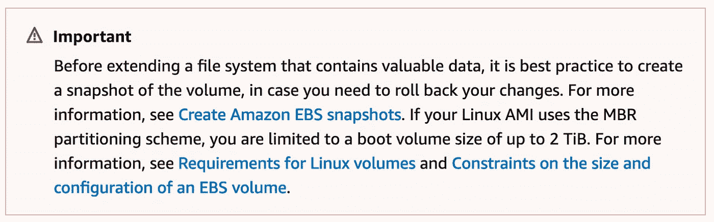
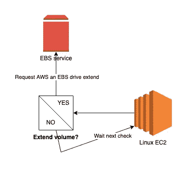
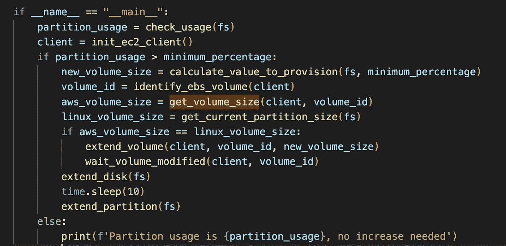

# 动态增加您的 AWS EBS 数量

> 原文：<https://betterprogramming.pub/dynamically-increase-your-aws-ebs-volumes-ed9683632510>

## 还能省下一大笔钱！

照片由 [Unsplash](https://unsplash.com?utm_source=medium&utm_medium=referral) 上的[伊加尔内斯](https://unsplash.com/@igalness?utm_source=medium&utm_medium=referral)拍摄

免责声明:如果您考虑在生产中使用这个脚本，我真的建议您在现实生活中测试它，并确保您已经知道您的应用程序是如何消耗磁盘空间的。即使节省一些钱听起来是一个好主意，但让您的业务正常运行也比系统由于一些磁盘问题而受损要好。

在我这边，这个脚本只在非 prod 环境中运行。

在考虑使用这个脚本之前，也请仔细阅读 AWS 警告。

如果您不在每一个级别优化成本，运行多个环境会耗费大量成本。一个典型的例子是，您不需要让环境全天候运行，因为大部分时间您的用户都不在工作。
但是你还有很多其他的优化技巧，可以用来节省更多的钱。我们今天将讨论一个问题，即 EBS 卷未使用的磁盘空间。

在继续之前，我们必须假设您满足一些先决条件，以符合我们将讨论的逻辑:

1.  您使用的是 GP3 卷，这意味着默认情况下您有 3，000 个 IOPS —这对于 GP2 卷是不可能的，因为使用 GP2 卷，总 IOPS 是由 AWS(总磁盘空间* 3)计算的
2.  你运行的是 Linux(我相信同样的逻辑也可以适用于 Windows，但是我对 Win Server 并不是很熟悉)——官方的 resize 文档可以在[这里](https://docs.aws.amazon.com/AWSEC2/latest/UserGuide/recognize-expanded-volume-linux.html)找到。
3.  每个 EC2 实例只能连接一个 EBS 卷。该脚本目前适用于单个分区(您可以配置)，但可以改进以处理多个驱动器(我这边没有这种需求)。
4.  站点注释:您只能每六小时请求一次相同数量的 EBS 增加。所以，慎重选择你的门槛！

我们将要开发的逻辑的概述

上面的模式描述了脚本的工作方式:

1.  cron 作业将每隔 X 分钟(比如 10 分钟)触发我们的脚本
2.  当被触发时，脚本将评估我们的分区是否需要扩展。我们有两个选择:
3.  1.不需要扩展——因此脚本将等待下一次执行
    2。需要伸展一下吗？然后，我们将要求 AWS 扩展我们的 EBS 驱动器，然后增加我们的本地磁盘/分区
4.  重复同样的逻辑

> 我们将要讨论的代码都是关于 Python 的。注意，我没有找到任何处理文件系统的好方法，所以我主要使用 os 模块和一些 awk 命令。任何替代方案将不胜感激！如果你只对剧本本身感兴趣，请跳到文章末尾

为了让您更好地理解引擎，我将脚本分成三部分:第一部分与 FS 磁盘使用有关，第二部分与 AWS 有关，最后一部分是关于扩展我们的本地驱动器。

# **分析磁盘使用情况**

为此，我们有三项职能。他们在这里:

1.  `check_usage` = >这个函数将文件系统作为一个参数(这里是`/`)，并将运行一个 shell ( `df -h / | tail -1 | awk '{sub("%","");print $5}'`)命令来获取当前的使用情况。请注意，我在这里只处理 Go…
2.  `get_current_partition_size` = >与第一个类似，取一个`FS`作为参数，这次返回分区大小。将在第三种方法中使用。
3.  `calculate_value_to_provision` = >应用一个简单的数学函数`(current_fs_usage / minimum_percentage * 100) — current_fs_size` 将你的分区增加到预定义的阈值。注意，如果需要的空间小于`5go`，我们将它转换为`5go`，以避免增加很小的空间。

# AWS Ebs —通过 API 增加本地音量

这里定义了更多的方法，但仍然是在我们开始掌握的 AWS 逻辑中。他们在这里:

1.  `*get_instance_id*` = >使用 EC2 元数据检索实例 id
2.  `*get_region*` = >使用 EC2 元数据返回实例运行的区域
3.  `*init_ec2_client*` = >返回一个 EC2 客户端，参数为实例区域
4.  `*identify_ebs_volume*` = >使用我们的实例 id 作为参数查询 AWS EC2 API，并返回 EBS id。请注意，仅当我们连接了一个驱动器时，才起作用
5.  `*get_volume_size*` = >返回我们的 EBS 卷大小。它将用于检查从 AWS 的角度来看是否已经进行了扩展，但是在操作系统方面没有成功
6.  `*extend_volume*` = >向 AWS 请求更多关于我们的 EBS 的信息
7.  等待我们的新存储在本地可用。注意，boto3 中没有原生的 waiter(如果你想实现的话，戳 AWS！)在 EBS 修改之后。所以我不得不根据文档做一点调整，文档上说一旦 EBS 的状态被优化，我们就可以使用它。

# 扩展我们的本地磁盘和文件系统

这里又是三个函数，让我们保持简单！

1.  `*get_main_disk*` = >我们需要根据分区来确定磁盘名称。一点点 lsblk 就好了！以字符串形式返回磁盘名称(如`nvme0n1`)
2.  `*extend_disk*` = >将新找到的磁盘扩展到 EBS 大小。如果您的 EBS 是 50Go，而您的磁盘是 40，那么您的新磁盘大小将变成 50。
3.  `*extend_partition*` = >最后一步是扩展分区。因为一个磁盘可以有多个分区，所以即使我们在示例中只运行一个分区，也需要执行这个步骤。在任何情况下，磁盘和分区都必须分开管理。

我们完了。最后一步是在`__main__`下创建你的算法逻辑，你就可以开始了！

您可以实现的逻辑示例

如果你需要，可以在 git 上找到完整的脚本[。请随意评论任何建议/问题，我将非常乐意帮忙！](https://gist.github.com/gmariette/d85f113b0a80f85f1ecab1bf31593d18)

如果你(不)喜欢这篇文章，请告诉我！

下一篇 AWS 文章再见。