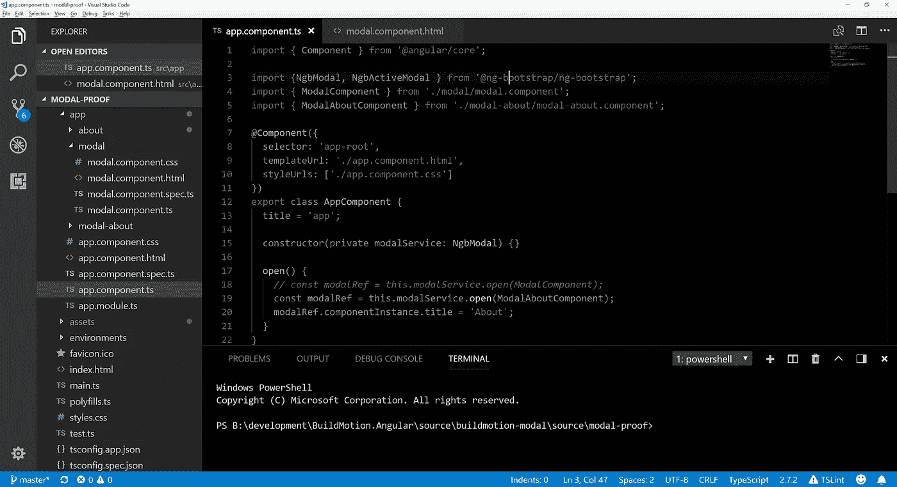

# 动态加载的 Bootstrap 4 模式组件——由 Angular

> 原文：<https://betterprogramming.pub/dynamically-loaded-bootstrap-4-modal-component-powered-by-angular-6621f5fd3173>



我当前的项目需要一个模态来显示一些应用程序信息。现在有很多 UI 控件。然而，我们当前的应用程序对主题和应用程序风格使用 Bootstrap。所以，这些来自 **@ng-bootstrap** 的 UI 控件是 Bootstrap 4，完全是为了 Angular 而构建的，很有意义。模态组件是从消费者组件动态加载的——非常酷！

上个月我得以参加 StackBlitz 和 Angular.io 的发布会。 [Eric Simons](https://medium.com/u/d63fefe55e24?source=post_page-----6621f5fd3173--------------------------------) 展示了 StackBlitz 和支持嵌入 StackBlitz 的新 SDK。点击以下链接，使用 [StackBlitz](https://stackblitz.com/) 查看该应用程序。

[在](https://stackblitz.com/github/buildmotion/buildmotion-modal/tree/master/source/modal-proof)中查看和编辑`[Stackblitz](https://stackblitz.com/github/buildmotion/buildmotion-modal/tree/master/source/modal-proof).`

# 或者，你可以走老路，创建一个新的应用程序！

使用 Angular CLI 命令创建应用程序。

```
ng new modal-proof
```

使用 CDN 更新`index.html`文件以引用[引导 CSS](http://getbootstrap.com/) 。

```
<link rel="stylesheet" href="https://maxcdn.bootstrapcdn.com/bootstrap/4.0.0/css/bootstrap.min.css" integrity="sha384-Gn5384xqQ1aoWXA+058RXPxPg6fy4IWvTNh0E263XmFcJlSAwiGgFAW/dAiS6JXm" crossorigin="anonymous">
```

# 包装

web 应用程序将需要`@ng-bootstrap-bootstrap`包和任何依赖项。

```
npm install --save @ng-bootstrap/ng-bootstrap@1.0.2
npm install --save ajv@^6.0.0
```

# 模态分量

创建一个新组件`ModalComponent`作为通用的模态组件，我们可以重用它来包装其他组件。我们只需要提供组件 a `title`并引用一个特定的`component`作为模态对话框`body`的内容。

```
ng generate component modal
```

1.  更新导入以包含`@Input`；添加带有默认标题值的`@Input() title`。
2.  在构造函数中注入`public activeModal: NgbActiveModal`。这允许模态隐藏。

接下来，更新组件以包括以下内容:

# 模态模板

模态模板使用引导类进行样式化。模式的主要部分包括:

*   模态标题
*   模态标题
*   模态体
*   模态页脚

`modal-body`部分包含一个`ng-content`指令，允许在主体中呈现组件。我们可以增强`ng-content`,让命名属性通过名称指向多个`ng-content`——我稍后会这么做。现在，我只想做好基础工作。先把它功能化，再优化。

# 使用

我们现在有了一个通用的模型模板，所以我们准备创建一个使用场景。在我们的示例中，我们将在`modal`中显示一个`About`组件。这将证明我们可以使用应用程序中的任何组件作为`modal-body`的内容。

创建一个新的`About`组件。这个组件将代表我们希望呈现为模态的应用程序组件的`any`。记住，目标之一是将目标组件动态加载到模式中。现在我们有了模态组件，我可以开始考虑应用程序中的模态候选对象了。

```
ng g component about
```

模板被更新以包括一些带有格式的附加内容—您明白了。在我的生产应用程序中，about 组件将使用 RESTful API 调用检索应用程序信息，并显示更多有用的信息。

```
<h1>Bootstrap 4 Modal :: Powered by Angular</h1><p>Native, quality widgets for your Angular applications.</p>
```

接下来，让我们创建一个名为`AboutModalComponent`的新组件。

```
ng g component modalAbout
```

# 将 About 组件包装在模式组件中

现在有趣的部分来了。更新`AppModalComponent`的模板。我们正在将`AboutComponent`包装在`ModalComponent`中。

*   添加一个`title`属性(匹配`ModalComponent`的`@Input`),这样您就可以为模态提供一个标题值。

```
<app-modal title="About the App">
  <app-about></app-about>
</app-modal>
```

# 触发模态

既然我们已经查看了模型的所有工作部分和内容，我们需要触发模型弹出。我们将添加一个简单的按钮来调用一个`(click)`事件。当按钮被点击时，`open()`方法将处理点击事件。

```
<button class="btn btn-lg btn-outline-primary" (click)="open()">Launch demo modal</button>
```

# 处理按钮点击

我们需要更新模型的消费者。注意在`AppComponent`的模板中没有其他模态组件引用或 HTML。我们只有按钮。我们将使用在组件构造函数中作为`modalService`注入的`NgbModal`来动态加载组件。

# AppModule

模态服务将`open`指定的组件`ModalAboutComponent`。为了使`ModalAboutComponent`能够以这种方式使用，您需要更新`AppModule`配置，以表明`ModalAboutComponent`可以动态加载。

```
entryComponents: [
    ModalAboutComponent
  ]
```

在我们运行应用程序之前，您需要确保`components`已经被导入和声明。

1.  导入`import { NgbModule, NgbActiveModal } from '@ng-bootstrap/ng-bootstrap';`
2.  将`NgbModule.forRoot()`添加到`imports`数组中。
3.  提供:`providers`数组中的`NgbActiveModal`。

我 *出版了一本关于棱角建筑的新书。了解如何利用库项目，通过组织和重用代码来创建更好的架构。在 Leanpub.com 有售。*

[](https://leanpub.com/angular-architecture-the-unofficial-guide) [## 棱角分明的建筑

### 在软件中，有些时候你只有一次机会把它做好。通过利用定义良好的架构，这是可能的…

leanpub.com](https://leanpub.com/angular-architecture-the-unofficial-guide) 

# 结论

这是一个很好的开始，作为一个小小的证明。我可能会增强组件来动态处理样式。这个项目也是放入我们的应用程序组件核心库的一个很好的候选——作为一个共享库，我们可以在几个不同的应用程序中使用它。

**github . com 上的源代码**:[https://github.com/buildmotion/buildmotion-modal](https://github.com/buildmotion/buildmotion-modal)

 [## Angular 企业安全学院

### 了解关于 Web 安全性的所有知识，并在 Angular 和 REST API 中实现基于角色的企业级授权

angular-academy.com](https://angular-academy.com/security/?aff=487495_tawgwlyz)