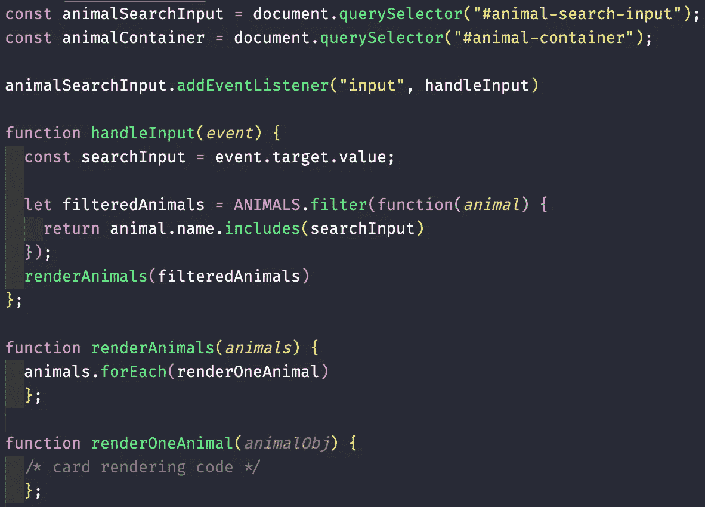
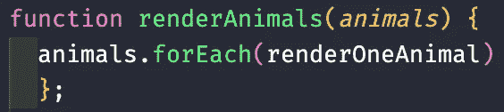
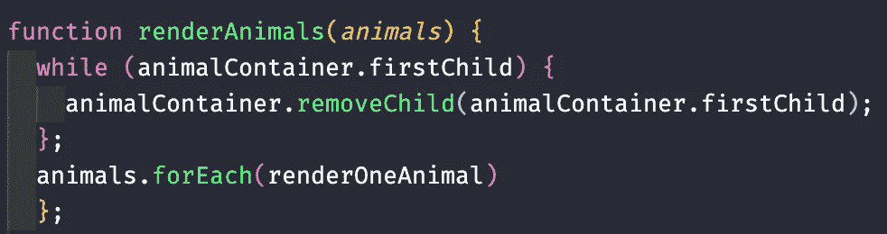
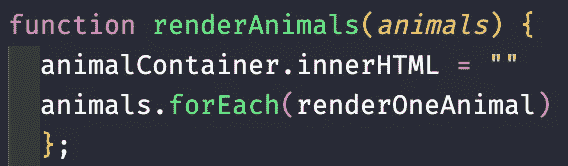

# 在 JavaScript 中动态移除 DOM 元素的子元素

> 原文：<https://betterprogramming.pub/dynamically-removing-children-from-a-dom-element-in-javascript-new-node-new-you-6143dabaea89>

## 新节点，新的你

约翰·施诺布里奇在 [Unsplash](https://unsplash.com/s/photos/computer?utm_source=unsplash&utm_medium=referral&utm_content=creditCopyText) 上拍摄的照片

想象一下:你已经完成了用 HTML/CSS 创建一个伟大的动态页面的所有工作，还在上面洒了一点 JavaScript。

你已经有了一个`list`或`div`,里面展示了各种各样的精彩内容，而且你从未对它的外观感到如此自豪。

除了——拿着手机——当你去过滤它或重新渲染数据时，它只是在你已经渲染的数据上添加内容！列表在不断增长，你的滚动条也在一秒一秒地变长。程序员要做什么？

问题可以分解为一个容易诊断的问题和一个容易规定的修复方法:

1.  您的页面或应用程序试图根据动态过滤器或更新的数据库将新信息呈现到 HTML 容器中，但它是在已经显示的内容上添加信息，而不是刷新容器。
2.  为了解决这个问题，我们需要“刷新”DOM 中的元素。有多种方法可以做到这一点，但是我们将只关注一种方法:删除该元素已经存在的“子元素”。

# 问题

假设这是您正在处理的代码的相关部分，来自一个列出动物并允许您在搜索栏中输入文本并动态过滤显示的动物的页面:

你有一个搜索栏(`form`)和一个容器(`div`)，通过`.querySelector`保存到 HTML 的变量中。您已经在搜索中设置了一个监听器，它根据用户在该领域的输入，实时过滤所有动物的数组。

过滤后的数组作为参数发送给呈现函数，该函数将改变附加到容器中并显示在页面上的结果。简单吧？

不幸的是，这里缺少的是完成交付件的一段关键代码。每次调用`handleInput`函数时，它都会呈现一个新过滤的动物数组，并将其添加到之前呈现的数组中。

每次搜索栏中的输入改变时都会发生这种情况，一次一个字符，所以现在你的页面上有了一大堆动物。缺少什么关键代码？

# 修复

`renderAnimals`函数在不“刷新”容器的情况下渲染一个新的过滤动物数组。

这种“刷新”是通过在新渲染到节点中之前移除已经存在的节点子节点来完成的。这可以通过两种方式之一用纯 JavaScript 代码简单地完成:

## 1.使用 *while* 循环和。移除孩子

被渲染到容器中的每个动物都是该父节点的“子节点”，即`animalContainer` div，可以通过一个`while`循环动态地一次移除一个。

我们现有的代码如下所示:

我们更新后的代码如下所示:

`while`循环检查`animalContainer.firstChild`是否返回`true`，确认至少存在一个子元素。它用`.removeChild()` *，*删除那个孩子，然后重复循环，直到不再有孩子存在。

容器现在是空的，可以用动态过滤的数据重新填充了！该函数将继续其定期计划的渲染。

## 2.使用。innerHTML 来完全重置容器

另一种选择稍微不那么优雅和“程序化”，但同样有效。您可以一次清除整个容器，而不是使用循环来遍历每个子元素:

在`animalContainer` `div`上使用`.innerHTML` 方法允许您在向其中呈现新信息之前，简单地将其中的所有 HTML 代码设置为一个空字符串，有效地一次性销毁所有子元素，而不是一次删除一个。

## 为什么用一个而不用另一个？

这两种方法做的事情完全一样，但做起来略有不同。决定哪一个更适合您的应用程序和 DOM 真的取决于您。

这些可以应用于页面上的任何父元素，该元素包含您想要移除的子元素，无论父元素是`div`、`ul`还是其他元素。

与一次清除所有元素相比，使用循环的主要优势在于，如果您希望对保留多少子元素有更多的控制。

您可以通过一个更复杂的循环来指定只删除一定数量的内容，通过在循环中运行`if else`语句来过滤您想要删除的子项，等等*。*

# 结论

如果您已经读到这里，那么现在您已经获得了一个新的、方便的 JavaScript 动态 DOM 编程工具。希望它能很好地为您服务，并为您现在和将来的项目开辟一些新的思路。