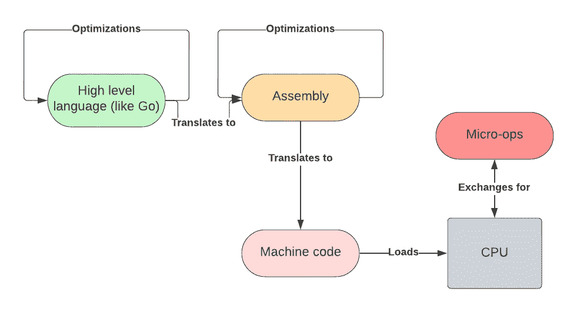
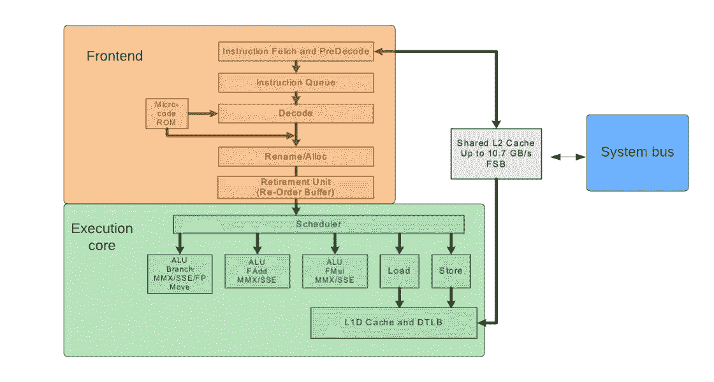
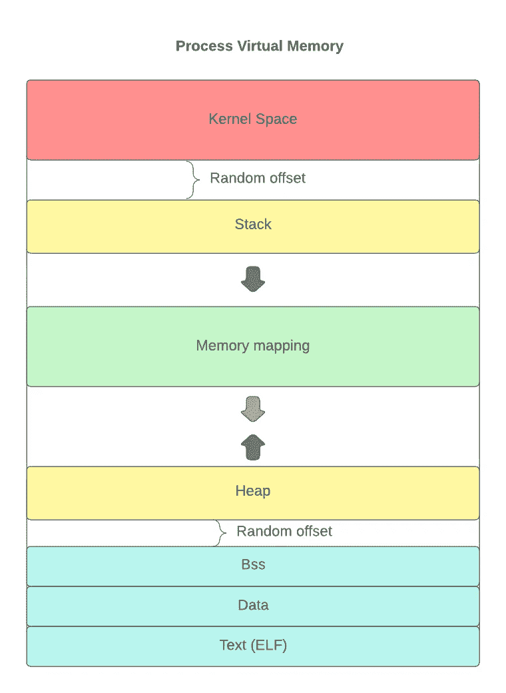
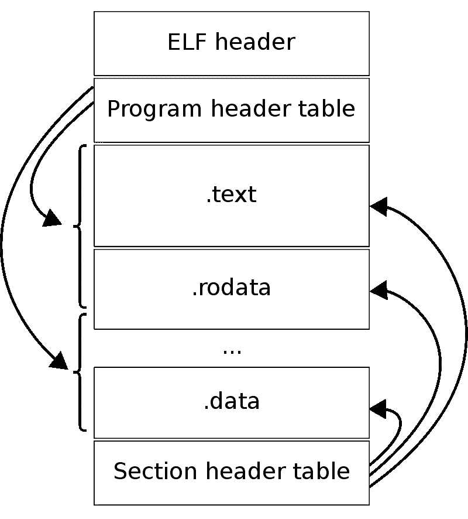

# 低级编程指南

> 原文：<https://betterprogramming.pub/e1-one-bite-of-assemblers-at-a-time-58682e7dc2aa>

## E1 :(一次)咬一口汇编程序


[Artem Labunsky](https://unsplash.com/@labunsky?utm_source=medium&utm_medium=referral) 在 [Unsplash](https://unsplash.com?utm_source=medium&utm_medium=referral) 上的照片

ASM 在编程界的份额几乎是 3%。这是一个比较大的数字，打败了 Rust 和 Go 之类的语言。但是当你在网上搜索教程的时候，几乎什么都不会出现。

这似乎是一个未知的领域，你只能靠自己。我无论如何都在学习它，试图填补这个空白，希望我的思想结构对你有益。

这一部分是低级编程相关概念的松散集合。让我们开始吧。

# 语言

**汇编**你可能知道，是一种低级编程语言，与中央处理器(CPU)的实际工作方式有很强的对应性。

通常情况下，与*操作数*(参数)一起被称为`*mnemonic*`的每个语句都是处理器执行特定任务的指令。这些就像在寄存器(处理器中的特殊缓冲区)之间移动变量、从内存加载、算法、位逻辑等等。

由于不同的处理器有不同的*指令集*(可用操作)，每个汇编程序都是针对特定的 CPU。除了将*机器码*翻译成人类可读的格式之外，汇编器通常还包括一些额外的特性，使编程更加容易，比如:

*   评论
*   常数
*   编译器指令
*   寄存器和存储单元的符号标记

有多种编译器，如 Gnu Assembler、Nasm、Masm，但它们共享两种方言中的任何一种:美国电话电报公司(较旧)和英特尔(较新)。

差异如下:

**机器码**由一系列控制 CPU 操作的数字组成，是汇编编译器的结果。处理器直接从程序所在的内存中加载这些命令，并处理它们，无需任何进一步的人工干预。

**微操作**是处理器在运行程序时可能完成的最小原子工作单位。单机代码可以翻译成多个微操作。当 CPU 解码机器指令时，它查找硬编码到芯片上特殊 ROM 存储器中的相应微操作。



任何语言的编译阶段

# 处理器架构

通常处理器由两个主要部件组成:*前端*和*执行核心*。

前端确保处理器以稳定的速率不断获得指令，没有空闲周期(不做任何事情的周期)。部分程序被加载到`L2`缓存中，在那里它们被分成指令和数据。如果指令还没有被缓冲以便更快地检索，则从存储器中加载指令。然后解码就是借助芯片上的查找表将机器代码翻译成微操作。今天的处理器有*流水线*设计，我不会解释，直到下一节。现在，假设它们并行执行多条指令。

执行核心执行解码后的微操作。它由几个并行工作的单元组成，例如:

*   算术与逻辑部件
*   上交所、MMX、AVX 单位
*   从存储器中加载和存储的单元

因为调度器必须并行执行操作，所以它可以提前执行指令。例如，如果有分支语句，就会发生这种情况。称之为*无序执行*或*投机*。当指令完成时，它被发送到*退休单元*进行清除。

有时，推测是错误的，我们必须逆转特定执行的效果。这就是*重新排序缓冲区*的用途，它只包含预测失误。你可以把它想象成 Saga 模式中的*补偿事务*。



典型现代处理器体系结构

# **流水线设计**

它也被称为*超标量设计，*最好用一个例子来说明。想象一下，处理器是一个流水线，分三个阶段完成一系列指令:加载、解码和执行。

在标量设计中，每条指令将经历所有阶段，直到下一条指令开始。

```
| Load | Decode | Execute |
|I1    | -      | -       |
|-     | I1     | -       |
|-     | -      | I1      |
|I2    | -      | -       |
|-     | I2     | -       |
|-     | -      | I2      |
|I3    | -      | -       |
|-     | I3     | -       |
|-     | -      | I3      |
```

但是在超标量设计中，流水线中的阶段可以像这样同时执行:

```
| Load | Decode | Execute |
|I1    | -      | -       |
|I2    | I1     | -       |
|I3    | I2     | I1      |
|-     | I3     | I2      |
|-     |-       | I3      | 
```

在这种情况下，对于大量的 n 条指令，加速将是 3 倍。但这不是玫瑰。由于这种并发性，在流水线的不同阶段，不同指令之间可能会发生数据竞争。

这通常通过在特殊电路缓冲器中保存级之间的临时值来解决，称为*混叠。*

# 进程内存(linux)

当内核启动一个程序时，它将自己的 *ELF 文件*读入内存，并为其建立虚拟地址空间。

虚拟意味着地址是逻辑的，并以称为*页*的单位转换成物理内存。

然后从二进制指定的指令开始执行。每次不同的进程被打开(多任务)，它的虚拟地址空间被加载。



Linux 进程的内存布局

*   顶部空间由内核占据，并为操作系统中运行的所有程序所共有。但是，它受到保护，不会被用户空间写入和执行
*   为了减少攻击，每个程序都有一个不同长度的堆栈偏移量
*   堆栈向下增长，直到达到其极限(著名的堆栈溢出异常)
*   内存映射用于将程序所需的任何文件直接加载到内存中(例如动态链接)
*   堆是一种内存，它比方法调用存在的时间更长，向上增长，并且也有随机长度的偏移量
*   Bss 是初始化为默认值的变量的一部分
*   数据是由程序员在整个程序中初始化为静态值的变量的一部分
*   文本包含要运行的指令

# 极低频

*可执行和可链接格式*是 Linux 可执行文件、共享库和目标文件的通用文件格式。它支持不同的处理器架构和字节序。



ELF 文件布局

整个文件由标题中列出的部分组成。有些部分很特别，最值得注意的是:

*   `.bss`
*   `.dynamic` —共享库的链接信息
*   `.init` —程序初始化
*   `.interp` —解释器的路径，例如，解释器可以是控制整个程序的动态链接器
*   `.symtab` —符号表
*   `.rodata` —只读数据
*   `.text` —可执行指令
*   `.got` —全局偏移表，该技术允许在多个可执行文件中重用共享库

# **动态与静态链接**

当一个程序被编译为静态时，所有的指令都是一个 ELF 文件的一部分，并且在程序运行之前符号的位置是已知的。因此，整个 ELF 文件可以在 init 上原样复制。但是，如果两个二进制文件共享一个公共代码，这个代码会出现两次，这是不节省空间的。这就产生了动态链接技术。

在动态链接中，编译器将引用外部共享库文件的外部符号留空。当程序启动时，动态链接器按需重载共享库，并用适当的内存地址填充这些空白。这就是所谓的*重新定位。*

当你生成的代码无论放在内存的什么地方都可以执行时，这就是所谓的*位置无关代码*或简称 PIC(这是库的情况，因为你不知道你的代码将被加载到哪里)。所有地址都相对于某个*基址*进行解析，基址是最常见的可执行起始地址。

这是很多材料，但希望你会觉得有用。直到下一次，

感谢阅读。