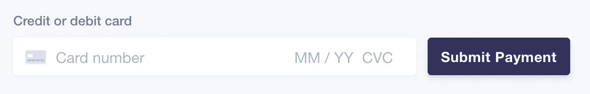
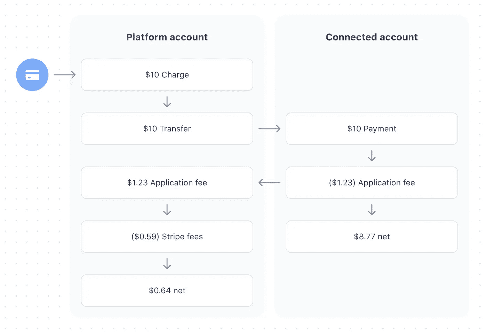

# 从你的软件中赚钱

> 原文：<https://betterprogramming.pub/earn-money-from-your-software-58fe98c44ecf>

## 使用 Stripe 构建基于佣金的软件的端到端指南


摩根·豪斯尔在 [Unsplash](https://unsplash.com/s/photos/payments?utm_source=unsplash&utm_medium=referral&utm_content=creditCopyText) 上的照片

我最近在 Stripe 上构建了一个平台，它有很多很棒的文档。我发现很难将每个服务连接成一个完整的端到端流。在这篇文章中，我将几个小时的研究和阅读整合成一个带有官方文档链接的分步指南。

Stripe 提供了一套出色的工具来处理一次性和重复性支付。这使得平台和市场的开发成为小团队更加现实的目标。

有了 Stripe API，您不必再担心合规性或安全问题。

在这里，我将使用 Stripe Connect 向您展示平台如何代表供应商处理支付。你还可以从每笔交易中抽取佣金。

我们将涵盖:

*   什么是条带连接？
*   入职客户。
*   如何在线处理付款？
*   支付关联账户并收取费用。

# 什么是条带连接？

如果你要建立一个像优步或 Etsy 这样的软件平台，资金流将在客户、平台和服务提供商之间流动。

让我们以优步为例来看看:

顾客支付出租车费 20 英镑，优步收取 12%的佣金，付给出租车司机 17.6 英镑。

Stripe Connect 提供了通过 API 驱动的平台促进资金转移的工具。

我尽量不重复太多已经在 [Stripe 官网](https://stripe.com/gb/connect)看到的信息。(这些文件棒极了)

我们将使用 [Stripe 的 express 账户](https://stripe.com/docs/connect/express-accounts)来实现这一点。快速帐户意味着 Stripe 将管理我们用户的加入，包括身份验证和基本帐户管理，但我们可以完全控制其他一切。实际上，这种关系仍然存在于用户和平台之间，而不是用户和 Stripe 之间。

# 第一步。入职


条纹入职流程

第一步是让你的用户入职。这将创建和/或连接他们的 Stripe 帐户与您的帐户。

该流程包括生成一个链接，将用户重定向到 Stripe 以便入职。完成后，它们会通过授权码重定向回您选择的 URL。您将这个令牌传递给 API 来验证结果。

这是针对 onboarding express 帐户的官方指南，以及在完成后验证 onboarding 流程。

完成后，您将通过拨打以下电话验证入职流程并收到新连接帐户的帐户 ID:

```
const response = await stripe.oauth.token({
  grant_type: 'authorization_code',
  code: 'ac_123456789',
});
```

[https://stripe . com/docs/connect/express-accounts # token-request](https://stripe.com/docs/connect/express-accounts#token-request)

这将返回一个包含`stripe_user_id`的有效载荷。这是关联帐户的 account_id，需要它来处理交易和向关联帐户转移资金。因此，将它存储在数据库中以备后用是非常重要的。

# 第二步。处理付款

现在我们有了 account_id，我们可以处理付款，并将资金直接发送到连接的帐户。在市场环境中，这意味着如果客户要购买 iPhone 外壳等产品，我们可以在我们的网站上处理付款，但资金将被发送给供应商。

流程如下:

1.  客户端向您的服务器请求支付意向密码。
2.  用 Stipe API 创建一个`paymentIntent`，指定交易的细节，比如价格，这将返回一个`paymentIntent.client_secret`。
3.  用`client_secret`回应你的客户。
4.  在客户端创建一个新的卡元素。
5.  当用户点击提交时，通过调用`stripe.confirmCardPayment`来确认支付，同时传递`paymentIntent.client_secret`和对卡元素的引用。
6.  为 Stripe 设置一个 webhook，通知您的服务器支付成功。

## 创建付款

[集成指南](https://stripe.com/docs/payments/integration-builder)详细介绍了客户端设置的所有步骤。



条纹元素

一旦完成，你将有一个处理付款的完整流程。

## 设置网页挂钩

付款后，您不应试图通过另一个客户端向您的服务器发出请求来完成订单。

*您的集成不应试图在客户端处理订单履行，因为这样客户可能会在支付完成后、履行流程开始前离开页面。*

相反，一旦付款被确认，显示一个成功的屏幕，但留到以后进一步处理。一旦付款被确认，在不久的将来，你会收到一个 webhook 通知，通知你付款的状态。

在这里你可以看到 Stripe 可以通过 webhooks 发送的所有可能事件的列表:【https://stripe.com/docs/api/events/types。

但是现在我们关注的是`payment_intent.succeeded`和`payment_intent.payment_failed`事件。

在这里，您将被引导设置一个 web hook[https://stripe . com/docs/payments/payment-intents/verifying-status # web hooks](https://stripe.com/docs/payments/payment-intents/verifying-status#webhooks)

## 本地测试 webhooks

Webhooks 需要一个可以通过互联网访问的端点。这可能会使本地测试变得很痛苦，但是有一些解决方案。

[**NGROK**](https://www.npmjs.com/package/ngrok) :我个人比较喜欢的是 [ngrok](https://ngrok.com/) 。该服务提供一个 CLI，以安全的方式将公共 URL 指向您的本地计算机。您还可以定义静态 URL，以避免不断更新您的 Stripe webhook 设置。它还附带了一个 NPM 软件包，以编程方式设置隧道。

我喜欢 [ngrok](https://ngrok.com/) ，因为它提供了一个通用的解决方案，可以用于许多用例，而不仅仅是 Stripe。

[**Stripe**](https://stripe.com/docs/webhooks/test):Stripe 也为本地 webhook 测试提供了自己的 CLI。这样，您可以监控 Stripe 发送的所有 webhooks，并将它们转发到您自己的本地主机。出于测试目的，也可以触发 webhooks。

# 第三步。支付关联账户并收取费用

为了将资金转移到关联账户，我们将创建一种称为“目的地费用”的东西。 [Stripe 提供了一些收费方法](https://stripe.com/docs/connect/charges)，因此充分了解什么最适合您的用例非常重要。

通过[目的地收费](https://stripe.com/docs/connect/destination-charges)，我们将创建一个支付意向，但指定接收资金的账户的目的地。

```
transfer_data: {
   destination: '{{CONNECTED_STRIPE_ACCOUNT_ID}}',
},
```

## 收取费用

根据你收取费用的方式，资金的流向以及谁支付 Stripe 自己的转会费会有所不同。你可以在这里阅读每种方法。

我们将通过`application_fee_amount`方式收取佣金。这意味着资金流动如下:



申请 _ 费用 _ 金额资金流向

使用申请费用金额方法。我们(平台)支付条纹费。这可以稍微干净一点，因为您的用户将只支付由您的平台定义的一种费用，并且不需要知道来自 Stripe 的任何费用。

你现在应该在一个可以。

*   机载用户。
*   代表用户收取费用。
*   通过 webhooks 确认付款。
*   每笔交易收取一定费用。

如果你有兴趣了解更多，这里有一些有用的链接:

*   退款:
    [https://stripe . com/docs/connect/direct-charges #发卡-退款](https://stripe.com/docs/connect/direct-charges#issuing-refunds)
*   apple Pay:
    https://stripe.com/docs/apple-pay
*   管理订阅:
    [https://stripe.com/docs/billing](https://stripe.com/docs/billing) [https://stripe . com/docs/billing/Subscriptions/customer-portal](https://stripe.com/docs/billing/subscriptions/customer-portal)

感谢阅读！

参考材料:

[](https://stripe.com/gb/pricing) [## 条纹:定价和费用

### Stripe 英国|查找 Stripe 费用和定价信息。查找我们的信用卡处理费、定价…

stripe.com](https://stripe.com/gb/pricing) [](https://stripe.com/gb/connect/pricing) [## 条带连接:定价

### Stripe 的核心功能是支付。我们的支付产品允许您接受信用卡、借记卡和移动…

stripe.com](https://stripe.com/gb/connect/pricing)