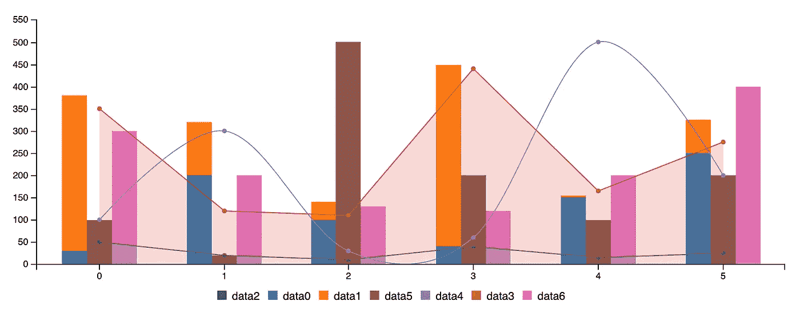
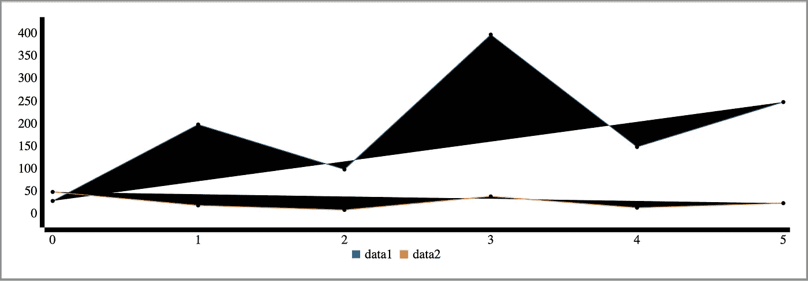
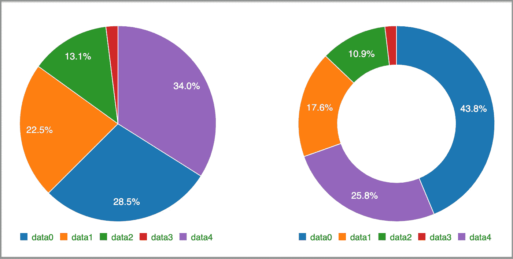
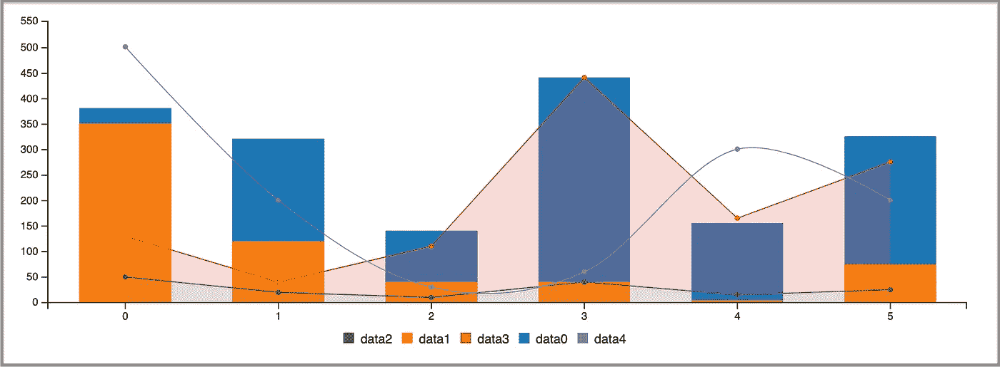

# 更简单的 D3 . js——使用 React 功能组件渲染 C3 图表

> 原文：<https://betterprogramming.pub/easier-d3-js-render-c3-charts-with-react-functional-components-372399497f98>

## 更好的图表与 C3



# **D3 是什么？**

[D3](https://d3js.org) 代表数据驱动文档。这是一个基于数据操作文档的 JavaScript 库。D3 是一个动态的、交互式的、在线的数据可视化框架，被大量的网站所使用。可视化的数据被称为图表。常见的有折线图、条形图、饼状图等。

# 什么是 C3？

[C3](https://c3js.org) 代表舒适、可定制、可控。C3 是一个建立在 D3 之上的 JavaScript 库。C3 允许我们在不了解 D3 所有复杂性的情况下快速构建图表。C3 提供了各种 API 和回调来访问图表的状态。

在本文中，我们将展示如何使用 React 功能组件构建 C3 图表。

# 静态 C3 图表

我们将使用 Create React 应用程序作为起点。因为 C3 是 D3 的包装器，所以需要`[c3](https://github.com/c3js/c3)`和`[d3](https://github.com/d3/d3)`包。

```
npm i c3
npm i d3
```

然后下面的包成为`package.json`中`[dependencies](https://medium.com/better-programming/package-jsons-dependencies-in-depth-a1f0637a3129)`的一部分。

```
"dependencies": {
  "c3": "^0.7.20",
  "d3": "^5.16.0",
}
```

将`src/index.css`更改为最小化样式:

C3 通过使用配置对象调用`generate()`来生成图表。图表将被插入到配置对象中由`bindto`选择器指定的元素中。

我们创建了`src/Chart.js`，其中官方的 C3 示例由 React 组件呈现:

在上面的代码中，函数组件`Chart`生成一个元素`<div id=”chart” />`(第 18 行)。

第 6-15 行定义了`generate` API 的配置对象。第 7 行指示将图表插入到 id 为`chart`的元素中。第 9-12 行硬编码了两个数据序列:`data1`和`data2`。第 13 行将图表类型定义为`line`。第 5-16 行生成了`useEffect`中的 C3 图。这个图表不会被更新，因为依赖列表是一个空数组(第 16 行)。

在`src/App.js`中，我们在第 5 行调用这个`chart`组件:

运行`npm start`，我们看到如下图表:



发生了什么事？该图表没有样式。C3 风格需要包含在`src/Chart.js`或`src/App.js`(第 3 行)中。

有了样式，图表看起来和 C3 官方文件中的一样。

来源:作者通过 [Youtube](https://www.youtube.com/watch?v=esajrsPgRH4&feature=emb_title) 提供的视频

您可以将鼠标悬停在线上以查看详细数据。通过悬停或单击 x 轴上的数据系列名称，可以显示或隐藏每一行。

# 动态 C3 图表

前面的图表是静态的。怎样才能画出动态图表？通常，图表数据是通过承诺获取的。为了简化代码，我们在`src/getData.js`中创建`getData`来生成动态数据。

这个`getData`函数接受一个`plotconfig`数组(第 9 行),然后使用一个`reduce`函数(第 11-18 行)将配置转换成可以由 C3 渲染的图表数据。

我们把`src/Chart.js`修改成叫`getData`。

这里，`data`是一个状态(第 6 行)，如果`data`对象改变，`useEffect`(第 22-30 行)将重新生成图表。另一个`useEffect`(第 7-20 行)被调用以每秒设置新数据。配置(第 10-16 行)在下面的视频中创建了五个动态更新的数据序列:

来源:作者通过 [Youtube](https://www.youtube.com/watch?v=zw59h1ryy6o&feature=emb_title) 提供的视频。

或者，我们创建`src/DataSource.js`来使获取数据成为一个组件。

在第 12 行，我们返回`null`。对于不打算渲染任何东西的情况，返回`null`是一个很好的做法。

在`src/Chart.js`中，使用`DataSource`组件，作为`useEffect`获取块的替代。

上面的组件化代码是不是看起来更整洁了？

对于 C3 图表，不同的数据系列可以有不同的点数。我们修改`plotConfig`(第 22-28 行)以在`src/Chart.js`中生成不同长度的数据:

以下是不同长度数据系列的图表:

来源:作者通过 [Youtube](https://www.youtube.com/watch?v=kXQzkfh03ZA&feature=emb_title) 提供的视频。

# 各种图表类型

C3 图表支持多种类型。在前面的例子中，类型已经被设置为`line`。

## **折线图**

显示数字随时间的变化。它们非常适合显示不断变化的时间序列以及一段时间内的趋势和发展。

我们将探索更多的图表类型，使用相同的代码，但设置为不同的类型。

## **步骤图表**

不使用最短距离连接两个数据点的折线图。相反，他们使用垂直线和水平线来连接图中的数据点，形成一个阶梯状的级数。阶跃图的垂直部分表示数据的变化及其幅度。步骤图的水平部分表示数据的恒定性。对于步进图表，类型设置为`step`。

下面是一个步骤图:

来源:作者通过 [Youtube](https://www.youtube.com/watch?v=-JckE-ji-nY&feature=emb_title) 提供的视频。

## **样条图表**

不使用直线连接两个数据点的折线图。相反，他们在数据系列中的点之间画一条曲线。对于样条图表，类型设置为`spline`。

这是一个样条图:

来源:作者通过 [Youtube](https://www.youtube.com/watch?v=FG1keUjp61A&feature=emb_title) 提供的视频。

## **条形图**

用于比较大小。它们使用矩形条表示分类数据，矩形条的高度或长度与其表示的值成比例。对于条形图，类型设置为`bar`。

下面是一个条形图:

来源:作者通过 [Youtube](https://www.youtube.com/watch?v=3uSVt4AOlxY&feature=emb_title) 提供的视频。

此外，可以将不同的条形图组合在一起，以制作堆叠条形图。在下面的配置中，所有五组数据都堆叠在一个条形图中。

```
data: {
  columns: data,
  type: "bar",
  groups: [
    ["data0", "data1", "data2", "data3", "data4"],
  ],
}
```

这是一个堆积条形图:

来源:作者通过 [Youtube](https://www.youtube.com/watch?v=nC8Vjfh7UlI&feature=emb_title) 提供的视频。

## **面积图**

填充了线条和 x 轴之间区域的折线图。对于面积图，类型设置为`area`。

以下是面积图:

来源:作者通过 [Youtube](https://www.youtube.com/watch?v=Ic-UxUhmU58&feature=emb_title) 提供的视频。

此外，可以将不同的区域组合在一起，以制作堆积面积图。在下面的配置中，所有五组数据都堆叠到一组中。

```
data: {
  columns: data,
  type: "area",
  groups: [
    ["data0", "data1", "data2", "data3", "data4"],
  ],
}
```

这是一个堆积面积图:

来源:作者通过 [Youtube](https://www.youtube.com/watch?v=rfZ1nHLIG6E&feature=emb_title) 提供的视频。

## **饼状图**

显示一个圆形的图表，分成与它所代表的数量成比例的扇形。对于饼图，类型设置为`pie`。

## **圆环图**

本质上是饼图，中间的一部分被切掉了。对于圆环图，类型设置为`donut`。

多个图表可以放入一个组件中:



图片由作者提供。

我们还可以将不同的数据系列放入一个图表中:

在第 16 行，它指定默认类型是`bar`。第 18-20 行指定了每个单独的数据系列类型。23 号线使两组:`data0` & `data1`和`data2` & `data3`。

我们有以下组合图表:



图片由作者提供。

# 结论

C3 图表通过简单的学习曲线带来了强大的制图能力。让我们重申一下它的优点:

*   舒适:C3 通过包装构建整个图表所需的代码，使得生成基于 D3 的图表变得容易。我们不需要再写 D3 代码了。
*   可定制:C3 在生成时给每个元素一些类，所以我们可以通过类定义一个定制的风格，也可以通过 D3 直接扩展结构。
*   可控的:C3 提供了各种 API 和回调来访问图表的状态。通过使用它们，我们甚至可以在图表呈现后对其进行更新。

感谢阅读。我希望这有所帮助。你可以在这里看到我的其他媒体出版物。