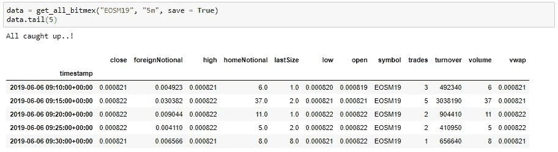
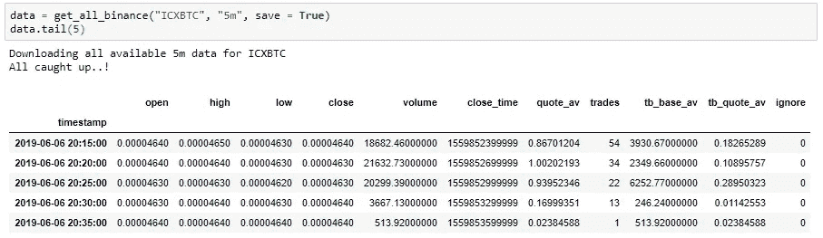

# 使用 Python API 检索币安和 BitMex 上每种加密货币的完整历史数据

> 原文：<https://betterprogramming.pub/easiest-way-to-use-the-bitmex-api-with-python-fbf66dc38633>

## 单一功能**读取**、**更新**、**保存、**和**收集**数据

*免责声明:我知道这不是我通常发布的内容，但因为这是我的兴趣所在——就像传统金融、机器学习和数据科学一样——我想你们中的一些人可能也会对此感兴趣。*

我最近一直在调查数据科学和加密货币市场之间的关系，这是我正在写的一篇相当长的文章。在这个过程中，我需要检索价格历史和其他数据，所以我决定写一篇补充文章，介绍我是如何完成这项工作的。

希望你觉得有用。如果你喜欢这个作品并想看更多，一定要跟我来！

# *TL；博士*

要检索比特币价格和数据(100 万克林):

1.  在[币安](https://accounts.binance.com/en/register?ref=10989518)和/或 [BitMex](https://www.bitmex.com/register/V2v4aJ) 上注册以获得 API 访问权限。
2.  导入我创建的易于使用的函数，并添加您的 API 细节。
3.  a.调用函数:get _ all _ 币安(" BTCUSDT "，" 1m "，save = True)
    b .调用函数:get_all_bitmex("XBTUSD "，" 1m "，save = True)

## 示例用途:

使用 get_all_bitmex 函数获取 **BitMex** 上 **EOS** 的 **5m** 历史价格数据的示例

使用 get _ all _ 币安函数获取**币安**上 **ICX** 的 **5m** 历史价格数据的例子

# 为什么是币安和比特墨西哥？

如果你有任何加密货币市场的经验，你知道这个问题的答案是显而易见的:

> [币安](https://accounts.binance.com/en/register?ref=10989518)是市场上最受欢迎的交易所 [**BitMex**](https://www.bitmex.com/register/V2v4aJ) 是市场上**交易量最大的**交易所。

正如我们所知，大容量等于大数据，大数据(通常)等于更好的建模和预测，特别是对于机器学习模型。

请注意，你不必购买任何比特币或任何其他加密货币来执行本文中的步骤。我们需要注册的原因是，一旦注册，你就可以访问他们的 API，这是我们将用来获取实际数据的。

您可以选择其中之一或两者都选，下面介绍的功能对两个交换机都很灵活。

# 检索和存储数据

我们的代码将执行以下操作:

1.  检查现有保存的数据
2.  找出最新保存的数据(如果有)和最新数据之间的差异
3.  发送 API 调用并追加现有的或新的数据帧
4.  保存和/或返回完整的数据帧

你唯一需要做的就是把你的 API-key 和 API-secret 添加到你的代码中，也要记住永远不要与任何人分享这些。如果你在[币安](https://accounts.binance.com/en/register?ref=10989518)或 [BitMex](https://www.bitmex.com/register/V2v4aJ) 交易或持有加密货币，这可能会导致资金损失。

它看起来很乱，但它非常实用和快速，唯一的限制因素是 BitMex 和币安每分钟允许的 API 调用的数量。

这非常容易使用，只需用 Python 调用该函数:

data = get_all_bitmex("XBTUSD "，" 5m "，save = True)

下载后，该函数将返回整个数据帧供您随意使用。如果将参数`save`作为`True` **，**传递，它会将数据帧保存在您的计算机上，文件名为“[symbol]-[kline_size]-data.csv”，即上述情况中的“XBTUSD-5m-data.csv”。

这个功能的巧妙之处在于它可以随时更新你的数据。

> **每次**函数被调用时，它将检查**您已经下载的数据的最新点**并用任何新数据更新**！**

每次使用来自 bitmex 的 XBTUSD 数据时，只需调用 get_all_bitmex("XBTUSD "，" 5m "，save = True)以确保它是最新的！

# 但是我想要所有市场的数据

别担心，这很容易做到！您可以通过以下方式检索所有市场的数据:

在这里，我们从 BitMex 和币安下载了比特币及其与以太坊和 Ripple 的关系的所有可用数据。

# 结论

感谢阅读。希望您发现这很有用！

如果你想看和了解更多，一定要关注我的 [**媒体**](https://medium.com/@peter.nistrup) 🔍和 [**碎碎念**](https://twitter.com/peternistrup) 🐦

 [## 彼得·尼斯特鲁普-中等

### 阅读彼得·尼斯特拉普在媒介上的作品。数据科学、统计和人工智能...推特:@PeterNistrup，LinkedIn…

medium.com](https://medium.com/@peter.nistrup)