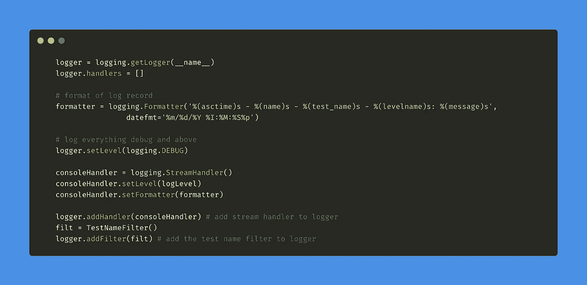
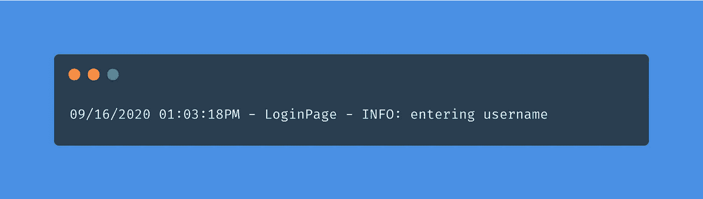
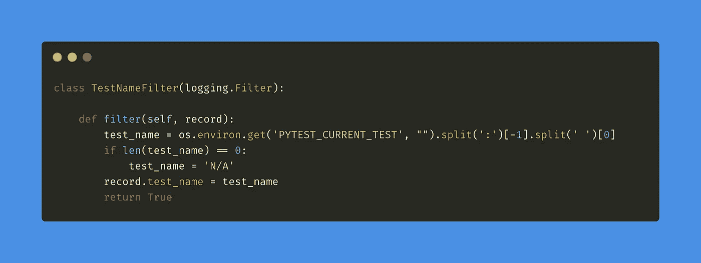
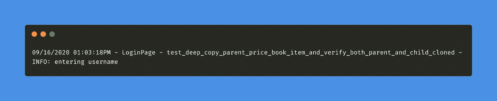

# 在 Python 中轻松地向 LogRecord 对象添加自定义属性

> 原文：<https://betterprogramming.pub/easily-add-custom-attributes-to-logrecord-objects-in-python-31dae85592b1>

## 自定义属性是在项目中传递领域相关信息的必要条件

作者照片。

从事大型项目在许多方面都具有挑战性。其中一个挑战是确保日志传达项目的所有相关信息，这些信息可能有助于调试问题和故障。

您的项目可能已经在使用 Python 的行业标准*日志*模块进行日志记录，因此我们需要能够扩展*日志*模块来添加这些信息。

# **示例**

我与 pytest 合作开发我的测试自动化解决方案。当我为一个包含数百个测试(包括单元测试和 selenium 测试)的项目使用日志记录时，我需要将测试的名称作为日志记录的一部分，以便告诉我哪个测试属于我正在查看的日志信息。

## **没有测试名称的日志记录**

上面的日志记录包含四条信息:

1.  日期和时间
2.  模块名
3.  记录级别
4.  消息

所有这些关键信息都很重要，但是它们并没有传达任何关于测试名称的信息。因此，让我们努力将这些信息添加到我们的日志记录中

为了向我们的日志记录添加一个自定义属性，我们将利用日志模块提供的`[logging.Filter](https://docs.python.org/3/library/logging.html#filter-objects)` 类来实现:

所以我们创建了一个名为`TestNameFilter`的新类，它继承了`logging.Filter` 类，并覆盖了`filter`函数，该函数提供了一个`record`对象，我们可以用它来添加我们的自定义属性。获取测试名称的一种方法是读取环境变量`PYTEST_CURRENT_TEST`，pytest 在运行测试之前在内部填充该变量。该函数返回布尔值`True`或`False`来分别指定是否必须记录日志记录。

我们还没完。我们需要将这个过滤器添加到我们的 logger 对象中，所以让我们这样做:

一旦我们初始化了 logger 对象，我们就可以向它添加处理程序(流处理程序、文件处理程序等等)和过滤器。注意属性`%(test_name)s` 被添加到我们的日志格式化程序中。这个变量应该和我们在`filter`函数中定义的一样，并添加到`record`对象中。现在让我们看看新的日志记录是什么样子的。

## **测试名称为**的日志记录

请注意，日志记录现在长了很多，其中包含了测试的名称。

# 结论

一个项目中的大量测试通常是并行运行的(想想 selenium grid)，所以日志记录应该识别哪个测试当前正在记录。使用日志过滤器是向日志记录添加自定义信息的一种有效方式。

# 资源

*   [日志记录。过滤器](https://docs.python.org/3/library/logging.html#filter-objects)
*   [Pytest](https://docs.pytest.org/en/stable/)