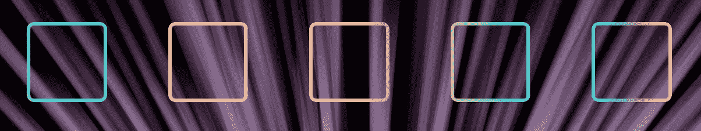

# 轻松地为您的 HTML 添加渐变边框

> 原文：<https://betterprogramming.pub/easily-add-gradient-borders-to-html-4421eefd5344>

## 添加渐变边框一直是一个难题，但是这里有一些简单的 JavaScript 来帮助你轻松地添加渐变边框



GitHub 上 HTML 的渐变边框。

# 渐变边框

[渐变边框](https://github.com/mesthabro/gradient-border/)是一个开源库，使我们能够为任何 HTML 元素添加渐变边框。实现相当容易；只要包含 JavaScript 代码，就可以添加渐变作为边框了。

# 使用

只需导入 Javascript 库，并将`**gradient-border**` 属性添加到 HTML 元素中。

```
<div class=”box” gradient-border=”5px, #92d7f1, #00BBFF”></div><div class=”box” gradient-border=”5px, #FBD3E9, #faaca8"></div><div class=”box” gradient-border=”5px, #eecda3, #ef629f”></div><div class=”box” gradient-border=”5px, #a8e063, #43cea2"></div><div class=”box” gradient-border=”5px, rgba(34,193,195,1) 0%, rgba(253,187,45,1) 100%”></div><script src="gradient-border.min.js"></script>
```

# 句法

```
<element gradient-border=”border-width, gradient-combination”></element>
```

border-width:仅在`**px**`中的边框宽度

渐变组合:线性渐变颜色的序列

# 你都准备好了！

就是这样。很简单，是吧？这也是我的另一个开源贡献。

这个库有一些限制。我也在考虑你们的贡献。如果您对这个库有什么新的想法，请随时提出拉取请求。