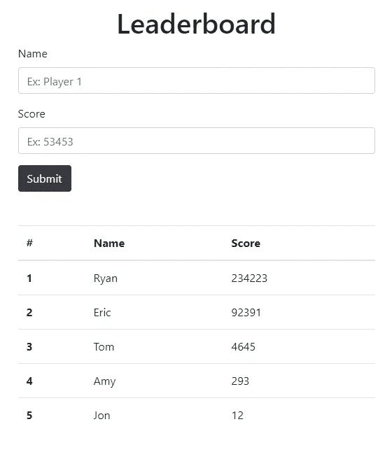
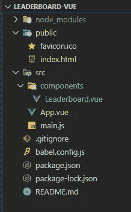
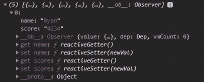

# 在 Vue.js 中轻松创建表单和动态表格

> 原文：<https://betterprogramming.pub/easily-create-a-form-and-a-dynamic-table-in-vue-js-a5ad3475b71f>

## 帮助您开始使用 Vue 的完美迷你项目


由 [Unsplash](https://unsplash.com/s/photos/scoreboard?utm_source=unsplash&utm_medium=referral&utm_content=creditCopyText) 上的 [Element5 Digital](https://unsplash.com/@element5digital?utm_source=unsplash&utm_medium=referral&utm_content=creditCopyText) 拍摄。

几个月前，我写了一篇文章演示如何在 React 中创建表单。因为我觉得这个练习是学习一个新的前端框架的重要组成部分，所以我在 [Vue.js](https://vuejs.org/) 中做了同样的事情。

本练习中的重要概念包括创建表单、使用输入、提交时的事件处理、创建表格、自定义方法、计算属性、列表排序、vue 指令等。这份名单还在继续！

谁能想到你能从这么简单的应用程序中学到这么多东西呢？

# 目标

使用表单接收用户的输入，并将数据输出为排行榜。

下面是我们最终产品的一个例子:



# 环境设置

为了您的方便，我创建了一篇文章来帮助您设置 Vue.js 环境。这将帮助您生成一个新的 vue . js“Hello World”项目。

一旦你到了这一步，还有一件事我们需要设置:在我们的`index.html`文件中包含 Bootstrap。这将有助于我们设计组件的风格。

你可以复制粘贴我下面的内容，也可以自己从 [Bootstrap 的网站](https://getbootstrap.com/docs/4.5/getting-started/introduction/)上获取(推荐的方法，因为 Bootstrap 会不断更新):

```
<link rel="stylesheet" href="https://stackpath.bootstrapcdn.com/bootstrap/4.5.0/css/bootstrap.min.css" integrity="sha384-9aIt2nRpC12Uk9gS9baDl411NQApFmC26EwAOH8WgZl5MYYxFfc+NcPb1dKGj7Sk" crossorigin="anonymous">
```

您的整个`index.html`应该是这样的:

好了，现在我们可以开始设置我们的应用程序了！

# 应用程序设置

我将尽可能保持简单，这样我们可以专注于手头的目标。在这样做的时候，我将大部分代码保留在一个组件中。如果您对我的目录结构感兴趣，请点击这里:



所有的逻辑将生活在`Leaderboard.vue`。`App.vue`专门作为我们`Leaderboard`组件的入口点。下面是`App.vue`的样子:

# 创建表单

我们首先要创建这个小应用程序的表单方面。它在`<template>`中有三个部分:标题、表单和“提交”按钮。

关于这段代码，我想指出一些事情:

*   要创建一个表单，你只需要`<label>`和`<input>`标签。Bootstrap 负责让`.form-group`和`.form-control`类看起来更漂亮。
*   `v-model`是我们如何在数据和输入之间创建双向数据绑定。当用户输入数据时，我们的数据值会自动更新。您可以在`<script>`标签的`data`部分看到数据。
*   我们目前有两个自定义方法。`onSubmit()`负责构建所有分数的最终数组。当我们输出这个数组时，它会以排行榜的形式出现。`clearForm()`点击“提交”按钮后，将输入字段清除回占位符。
*   `@click`是我们在 Vue.js 中处理事件的方式。这实际上是`v-on:click`的简写语法。基本上，当点击“提交”按钮时，报价中的方法就会被触发。

如果您想查看这个表单是否正常工作，只需在`onSubmit`方法中添加一个`console.log(this.allScores)`。输入五个条目后，应该是这样的:



表单创建后的控制台输出

现在，我们可以将从输入表单中收集的数据输出为排行榜表格。

# 输出到表格

现在是精彩的部分！

我们现在将从用户那里获取数据，按分数排序(正如您在排行榜中所期望的那样)，并将其输出到表格中。

为了完整起见，我将发布整个组件。如果您一直在跟随，您可以跳过前 26 行:

有几件事我想讨论一下:

*   我们正在利用 Bootstrap 的表格样式，所以我们需要做的就是使用`<table>`标签和`.table`类来创建一个外观整洁的表格。
*   `v-for`是另一个 vue 指令。这使我们能够呈现我们的项目列表，该列表现在根据来自`sortedList`方法的分数排序。
*   `sortedList()`方法根据分数降序排序。您会注意到`slice()`数组方法。这是因为我们需要在使用`computed()`时创建数组的副本。
*   `v-for = "(entry, i) in sortedList" :key="i"`。为了在表格左侧列出排名，我们需要给`v-for`指令添加一个索引。

如果您的最终产品看起来像这样，您就会知道您做得对:


最终产品

# 结论

如果有些事情没有意义，或者您有任何其他问题、评论或担忧，请随时留下评论。我会尽快回复你。