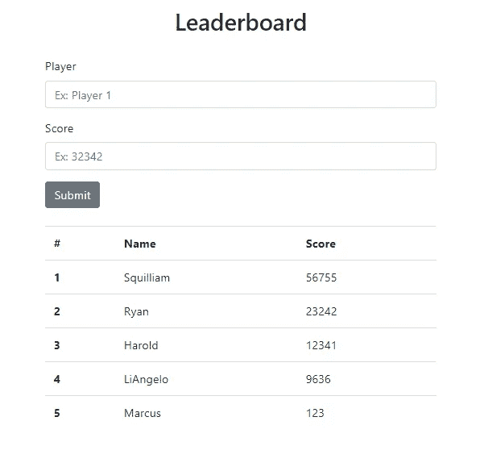
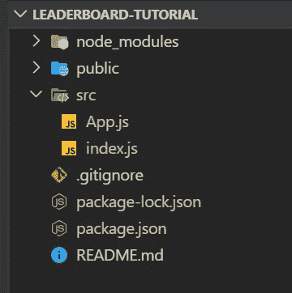
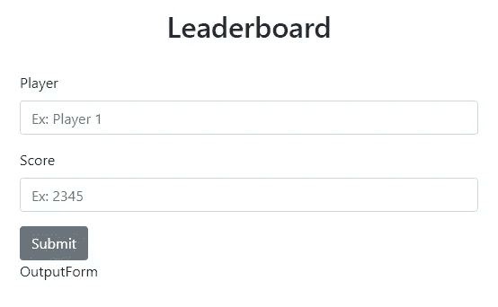
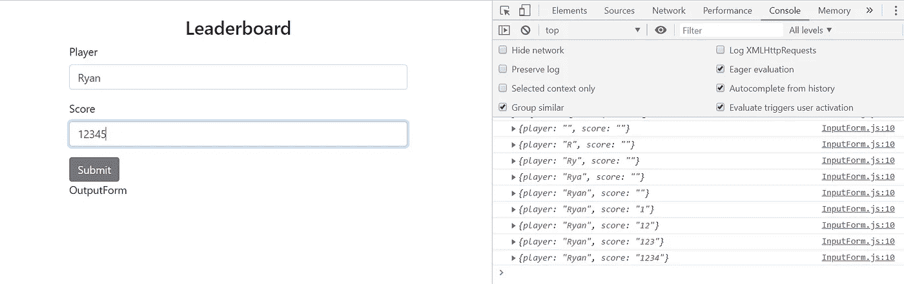
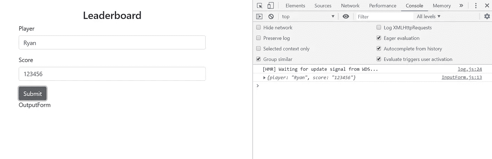
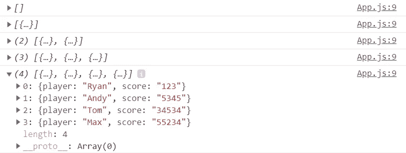
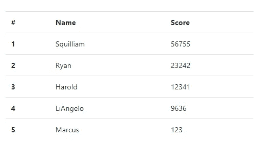

# 使用 React 挂钩轻松创建表单

> 原文：<https://betterprogramming.pub/easily-create-a-form-with-react-hooks-1cab17e2be0d>

## 在 React 中创建表单变得简单多了


由[卢卡·布拉沃](https://unsplash.com/@lucabravo?utm_source=unsplash&utm_medium=referral&utm_content=creditCopyText)在 [Unsplash](https://unsplash.com/s/photos/computer-code?utm_source=unsplash&utm_medium=referral&utm_content=creditCopyText) 上拍摄

你好。如果你在这里，你可能和我一样:漫无目的地在互联网上闲逛，寻找合适的例子来帮助制作这个叫做 Hooks click 的新概念。你的搜索到此结束。

我有一个与这篇文章配套的视频，因为只做一个或另一个(博客帖子或视频)感觉不太对。每个人学习的方式不同。

当我想理解一个复杂的话题时，我更喜欢阅读它，而不是听它，但我知道有人是听觉学习者，所以下面是视频:

与 Ryan 反应

# 目标

创建一个简单的排行榜应用程序，它使用`useState()`钩子从表单中获取信息，将其设置为状态，并输出到表格中。

## 目录:

*   [环境设置](#722b)
*   [应用程序设置](#5aba)
*   [表单组件](#6201)
*   [挂钩](#a2d2)
*   [输出排行榜组件](#36fe)
*   [回顾](#58b5)

很简单，对吧？这就是我们将要创造的:



我们的最终产品

这是一个简单的例子，而且是有目的的。理解本文中的基础知识将为您提供在任何需要您在 React 中使用`useState()`管理状态的应用程序中取得成功所需的工具。

如果你在任何时候迷路了，我会在底部贴一个这个项目的 Github repo 的链接，这样你就可以查看所有的代码。

# 环境设置

下面是一些我认为您已经安装的工具:

*   节点. js
*   npm 和 create-react-app——如果你愿意，可以使用 npx
*   VSCode —这是我选择的代码编辑器。你可以用任何你想要的东西。

如果您需要安装这些工具中的任何一个，我已经创建了另一篇文章，带您了解如何设置您的开发环境:[我的 React 开发环境设置](https://medium.com/better-programming/my-react-dev-environment-setup-ded7cedb87a)

# 应用程序设置

让我们开始吧。首先，我们将创建一个全新的 React 应用程序。如果你想直接跳到钩子上，我不会生气的:[带我去钩子上](https://medium.com/p/1cab17e2be0d/edit#a2d2)。

```
npx create-react-app leaderboard-tutorial
```

一旦我们创建了它，我们将做一些清理和一些准备工作。

我们首先删除 src 文件夹中的所有内容，除了`App.js`和`index.js`。您可以看到下面的目录结构:



目录视图

此外，清空您的`App.js`和`index.js`，这样我们刚刚删除的所有引用都不再存在。这里是`App.js`:

```
import React from "react";function App() {
  return <div **className="container mt-4"**>
           **Hello**
         </div>;
}
export default App;
```

和`index.js`:

```
import React from "react";
import ReactDOM from "react-dom";
import App from "./App";ReactDOM.render(<App />, document.getElementById("root"));
```

现在我们要安装 reactstrap 和 bootstrap。我会在这里留下一个 reactstrap 页面的链接，这样您就可以查看他们提供的不同组件，但我也会在下面列出我们确切需要的内容。

[](https://reactstrap.github.io/) [## 反应阱

### 通过 NPM npm 安装安装反应陷阱和对等依赖项—保存反应陷阱反应陷阱导入组件…

reactstrap.github.io](https://reactstrap.github.io/) 

为什么我要使用 reactstrap？这篇文章是关于学习如何使用`useState()`钩子，*而不是*如何创建组件。这不是 HTML/CSS/Bootstrap 课程。Reactstrap 允许我们花更多的时间关注钩子，而不是摆弄每个组件的样式。从长远来看，这会节省我们的时间，更不用说它看起来比普通的 HTML 要好得多——相信我！

```
npm i --save bootstrap reactstrap
```

另外，将这一行包含在您的`src/index.js`文件中:

```
import React from "react";
import ReactDOM from "react-dom";
import App from "./App";
**import 'bootstrap/dist/css/bootstrap.min.css';**ReactDOM.render(<App />, document.getElementById("root"));
```

好的——就准备工作和清理工作而言，这就是我们需要做的全部工作。您可以使用以下命令启动应用程序:

```
npm start
```

*检查点#1:* 此时，如果一切安装正确，您应该会看到这个(左上角的 Hello，用稍微好一点的字体写的，在一个容器中，因为 bootstrap 的缘故，上边距为 4):


检查点# 1:NPM 启动后

# 表单组件

现在我们需要布局我们的基本表单，为此我们将创建一个名为`InputForm.js`的组件。我将留下下面的代码来创建您见过的最简单的表单。

下面是目录结构最终的样子。我们将只创建两个组件:一个通过输入表单接收用户数据，另一个输出数据。


目录结构

文件名很容易理解，但如果不清楚的话:

*   Components/InputForm.js 是我们刚刚创建的用于处理输入的表单。将作为子组件。
*   components/output leaderboard . js 将成为我们输出用户/状态数据的表。将作为子组件。
*   App.js 是我们的切入点，我们的顶级。我们也将在这里创造我们的最终状态。将作为父组件。

在`App.js`中，我们将尽可能保持简单，因此我们将有如下代码:

而在`InputForm.js`

我来解释一下上面的一些代码。

您将在顶部看到 reactstrap 导入的所有不同组件。这有助于我们快速启动和运行。然后使用引导 CSS 允许我们使用一些引导本地类，如“mt-4”。需要注意的重要部分是输入表单的“name”属性。这些将在我们开始使用钩子时发挥作用。

加上`OutputLeaderboard.js`，你的`App.js`应该是这样的:

你可以创建`OutputLeaderboard.js`的框架，这样就不会有任何编译错误。

*检查点#2:* 如果您一直密切关注，您的应用程序应该如下所示:



检查点#2:表单创建

好了，现在让我们进入钩子！

## 钩子！

让我先解释一下什么是钩子。根据 [facebook 文档](https://reactjs.org/docs/hooks-state.html)，“一个 H **ook** 是一个特殊的功能，让你‘挂钩’React 状态和生命周期特性。”

这允许您在功能组件中管理您的状态。

什么是状态？**状态**是在重新渲染之间保留的信息。

我们不再需要将功能组件转换成基于类的组件！这使得动态添加状态变得非常容易(特别是如果您最初没有打算这样做的话)。

使用钩子时，有两条规则是我们绝对必须遵守的。如果你懒于遵守这些规则(就像我过去一样)，你将为此付出代价！所以请学习它们，请遵守它们。这会节省你很多时间。

1.  **只调用顶层的钩子**

钩子的执行顺序必须始终相同。这意味着不能在循环、条件或嵌套函数中调用钩子。希望您理解为什么当您使用其中任何一个时，控制流会有所不同，以及为什么这对一致性不利。

2.**仅从 React 函数调用钩子**

您不能从 Javascript 函数中调用钩子。我们希望确保所有有状态逻辑在源代码中都是可见的。

因此，让我们将第一个状态添加到应用程序中。

我们首先通过定义来创建我们的状态。这将是保存我们在每次输入时从用户那里收到的所有数据的状态。在`InputForm.js`内部，就在我们组件的`return()`部分的上方，添加下面一行:

另外，确保从 React 导入`useState`。

我们来分析一下。这里的语法可能看起来有点奇怪——这是因为我们利用了 ES6 的“数组析构”`useState`函数返回两个值——状态和用于修改状态的函数。

因此，我们的两元素数组中的每个值都对应于来自`useState()`的一个返回值。`eachEntry`和`setEachEntry`不是*React API 的一部分。这些名称可以是任何名称。*

然后我们必须给我们的状态一个初始值——这就是为什么你会看到空的花括号作为函数调用的参数。但是我们要改变它，让它有一个初始值。那个物体看起来像这样:

确保你把它放在你的州声明之前。

给`useState()`一个空对象`{}`，本来是有效的。然而，在创建表单时，React 会抱怨“受控与非受控”输入。通过赋予它一个值，我们现在正在“控制”状态。

现在我们需要一种方法，当有人在我们的文本框中输入内容时更新我们的状态。这是在处理程序的帮助下完成的。将此添加到您的`InputForm.js`:

这将获取`name` 并将其映射到传入事件的`value` (用户的简单击键)。

你会看到我还添加了一行，通过析构来隔离输入状态的每个字段。这将使名称到值的映射稍微容易一些。

这与我们的表单有什么联系？我们需要更新。

这是将事件处理程序和值添加到我们的输入标签后，`InputForm.js` 中的语法:

所以每次与表单的交互都会触发事件处理程序。它会将值映射到我们之前给它的名称，并将该条目存储在 state 中。理解这一点是关键，所以我建议你花几分钟时间摆弄它，直到你把它记下来。

如果您不熟悉的话，一个很好的形象化方法是在这个函数(`handleInputChange`)外面放一个`console.log()`，这样您就可以看到状态是如何随着用户按下的每个键而更新的。

```
const handleInputChange = e => {
  setEachEntry({ ...eachEntry, [e.target.name]: e.target.value });
};
**console.log(eachEntry);**
```



每次按键时，状态都会更新

(一旦你有了这个想法，你就可以把它拿出来——每次击一个键都有控制台输出有点烦人！)

让我们连接提交按钮，这样我们就可以看到输入状态的最终版本。我们将在`InputForm.js`中的另一个处理器的正下方添加一个处理器。

在`InputForm.js` 的底部，我们将给`Button`标签中的按钮一些交互性:

*CHECKPOINT #3:* 添加这个事件处理程序将让您在表单中输入一些信息并单击 submit 时看到状态的最终版本。



检查点#3:单击提交后的控制台

这就是乐趣的开始。我们将使这个状态对我们的顶级组件可见，这样我们就可以在其他地方使用它。

如果你看一下我们要创建的应用程序的截图，你会注意到一个排行榜形式的用户输入列表，而不是一个。从钩子的角度来看，这是一个状态数组，是对象的集合。

我们如何做到这一点？由*解除麟州*状态**。**

什么是提升状态？当您需要在其他组件中反映对您的状态所做的更改时。我们这样做的方法是将我们的状态提升到一个公共的更高层次的组件。

因此，在我们的例子中，当用户通过表单输入数据并点击提交按钮时，我们的状态正在改变。当这种情况发生时，我们需要在另一个子组件中反映这种变化——它最终将成为显示所有数据的`OutputLeaderboard`组件。因此，我们将状态的变化向上发送给父母，这样它就可以向下传递给另一个孩子。

就这么办吧。我们将首先创建一个名为`leaderboard`的新共享状态。每次点击`Submit`时，`eachEntry`将代表一个玩家得分对。`eachEntry`将是`leaderboard`状态数组中的不同元素。

我们将在顶层创建一个处理程序，`App.js`，并将该处理程序传递给它的子组件(`InputForm`)。这将包含更新我们共享状态的代码。

然后我们可以将该数据发送给`App.js` 中的所有其他子组件——在本例中是`OutputLeaderboard`。

在`App.js` **:**

在 **InputForm.js 中:**

您将看到我们将处理程序作为道具，将其析构，然后在我们的`handleFinalSubmit`函数中使用它来将`eachEntry`传递到顶层的共享状态。

*检查点#4:* 提交多个条目后，您应该会在控制台中看到以下输出:



我们的排行榜阵列

# 输出排行榜组件

现在是时候构建应用程序的输出部分了，如下所示:



在`App.js`中，我们将发送我们的状态:

在`OutputLeaderboard.js`中，我们将制定餐桌的基本轮廓。

如您所见，我们将最终状态对象作为道具传入。我们将遍历该对象，并将每个条目输出到表中的一行。你可以把那个组件(`RenderTableData`)放在它自己单独的文件中，但是我现在把它放在同一个文件(`OutputLeaderboard.js`)下面。

我将很快解释我做了什么来让表格以我想要的方式显示。我第一次通过道具进入状态。然后我创建了一个新的数组，它将我们的最终状态数组存储为一个排序数组。我希望它按照分数降序排列，就像你对排行榜的期望一样。

然后，我使用一个计数器作为键来映射每个值。计数器代表排行榜上的“排名”。我从对象的每个元素中提取球员和得分字段并显示它们。每个元素由该表的不同行表示。

*第五个检查点:*当所有的事情都完成后，你的最终产品应该是这样的:


我们的最终产品

就这么简单！

# 回顾

我们刚刚到底做了什么？

*   在一个子组件中接收来自最终用户的输入
*   将数据存储在本地状态中
*   在顶层创建了共享状态
*   用本地状态的多个实例填充共享状态
*   将共享状态输出到不同的子组件

在创建大型应用程序时，您将会多次使用这种模式。

你会意识到，一旦你掌握了基本模式，抓住钩子就真的不太难了。

正如承诺的那样，这里是到完整库的链接[。](https://github.com/ryangleason82/leaderboard-final)

我希望你在这篇教程中学到了一些东西。如果你有任何问题，请留下评论。