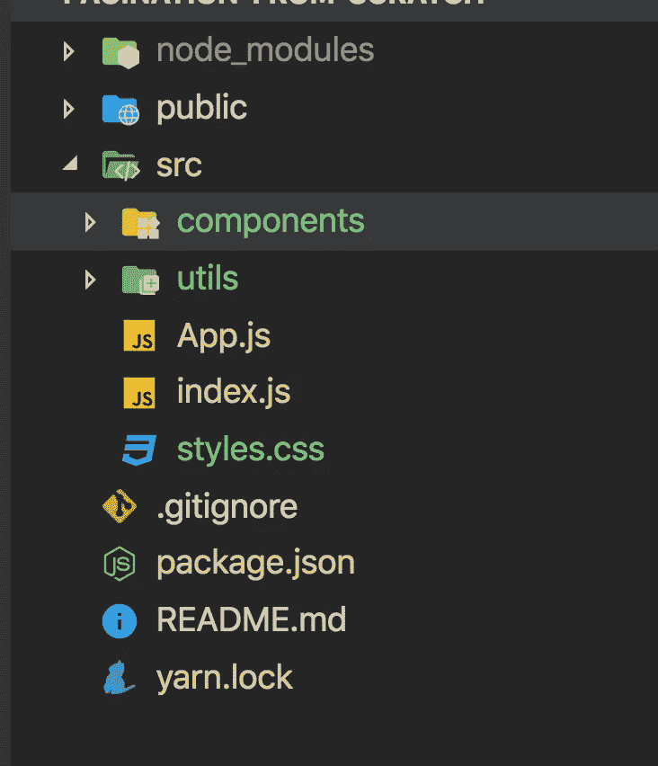
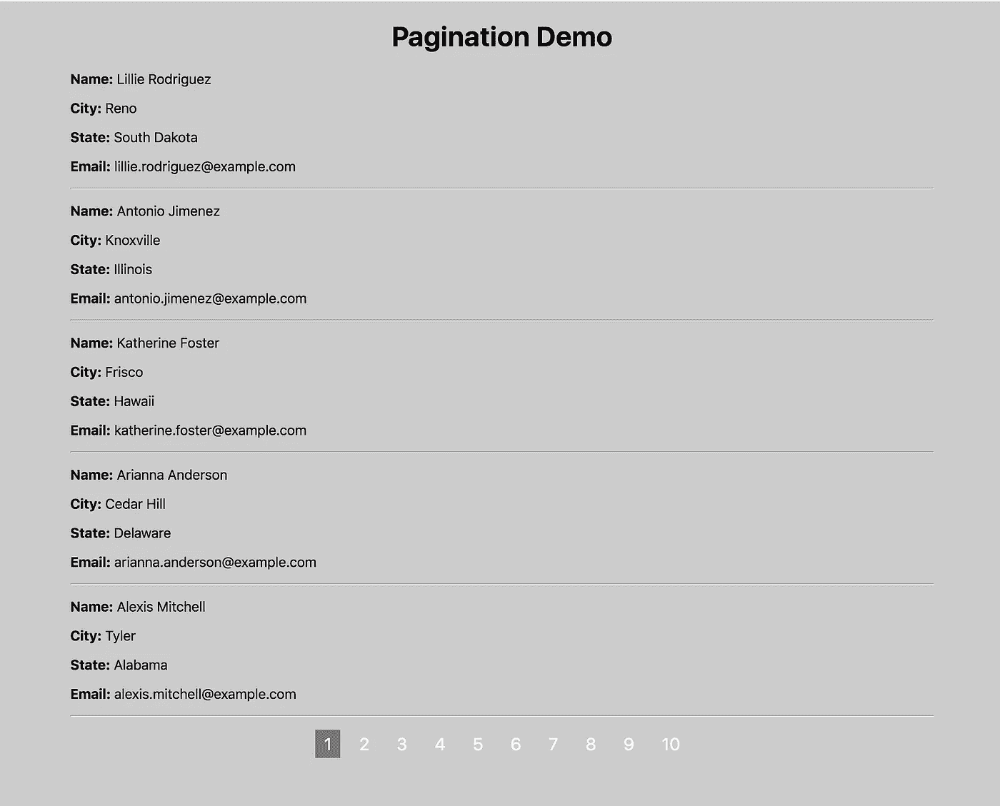

# 在 React 中从头开始轻松创建分页功能

> 原文：<https://betterprogramming.pub/easily-create-pagination-functionality-from-scratch-a738837ed6f2>

## 加速您的应用程序，实现和显示分页


马文·朗斯多夫在 [Unsplash](https://unsplash.com/s/photos/numbers?utm_source=unsplash&utm_medium=referral&utm_content=creditCopyText) 上拍摄的照片

在本文中，我们将在 React 中实现一个简单的分页组件，使用[随机用户生成器](https://randomuser.me/) API 显示随机用户列表。

让我们开始吧。

我们将使用 [Create React App](https://create-react-app.dev/) 来初始化项目。

通过运行以下命令创建一个新项目:

```
create-react-app pagination-from-scratch
```

项目创建完成后，删除`src`文件夹中的所有文件，在`src`文件夹中创建`index.js`、`App.js`、`styles.css`文件。同样，在`src`文件夹中创建`components`和`utils`文件夹。

您的文件夹结构将如下所示:



使用以下工具安装 [axios npm 包](https://www.npmjs.com/package/axios):

```
yarn add axios@0.19.2
```

打开`index.js`并添加以下代码:

```
import React from 'react';
import ReactDOM from 'react-dom';
import App from './App';
import './styles.css';ReactDOM.render(<App />, document.getElementById('root'));
```

打开`styles.css`并添加以下代码:

在`src/utils`文件夹中，用下面的声明创建`constants.js`:

```
export const USERS_PER_PAGE = 5;
```

在`src/components`内部，用以下代码创建`Users.js`:

这里，我们从主`App.js`组件中获取用户列表和当前页码，并从用户列表中计算要显示的用户的起始和结束位置。

在`src/components`文件夹中，用以下代码创建`User.js`:

这里我们只是显示来自`Users.js`组件的用户详细信息。

在`src/components`内，用下面的代码创建`Pagination.js`文件夹:

这里我们从`App.js`中获取`totalPages`、页码和点击处理程序作为道具，并通过用数字初始化一个空数组来创建分页数组。

```
const pages = [...Array(totalPages).keys()].map(number => number + 1);
```

然后我们将这些数字显示为页码。

在`src/App.js`内部，添加以下代码:

这里我们使用 React 钩子来声明状态和处理生命周期方法。

如果你不熟悉 React 钩子，可以看看我的文章中的介绍。

让我们了解一下代码是做什么的。

我们已经声明了具有初始状态的变量和使用`useState`钩子更新该状态的方法。

```
const [users, setUsers] = useState([]);
const [page, setPage] = useState(1);
const [totalPages, setTotalPages] = useState(0);
const [isLoading, setIsLoading] = useState(false);
```

然后，在`useEffect`钩子中，我们进行一个 API 调用来获得一个 50 个随机用户的列表，并在收到响应时设置各自的状态变量。

因为我们已经添加了一个空数组`[]`作为`useEffect`钩子的第二个参数，所以当组件被挂载时，`useEffect`中的代码将只执行一次。这类似于`componentDidMount`生命周期方法。

我们还在响应到来时显示加载消息，因此我们在进行 API 调用之前将加载状态设置为`true`，并在收到响应时使用`setIsLoading`方法将其设置为`false`。在 render 方法中，我们检查`isLoading`状态，并根据当前页码显示用户。

现在，当您运行应用程序时，通过运行`yarn start`命令，您可以看到带有分页的工作应用程序。



你可以在 GitHub 上找到这个应用程序的完整源代码和现场演示。

今天到此为止。我希望你学到了新东西。

不要忘记订阅我的每周简讯，里面有惊人的技巧、诀窍和文章，直接在你的收件箱 [**这里。**](https://yogeshchavan.dev/)