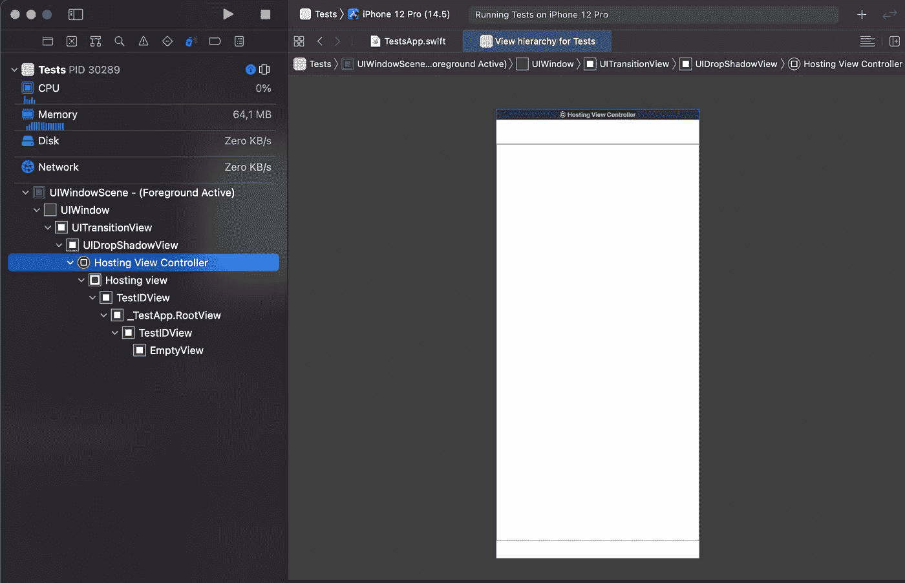

# 使用 _ViewTest 协议在 SwiftUI 中进行性能基准测试

> 原文：<https://betterprogramming.pub/easter-egg-swiftuis-viewtest-61b86f1e90d>

## 使用隐藏的测试 API 内省 SwiftUI 视图的`@State`的解决方法


托马斯·博尔曼斯在 [Unsplash](https://unsplash.com?utm_source=medium&utm_medium=referral) 上拍摄的照片

一天晚上，我漫不经心地浏览 SwiftUI 的`.swiftinterface`文件。这是一个有趣的地方，描述了许多隐藏的 SwiftUI 类型。它可以在以下文件中找到:

```
/Applications/Xcode.app/Contents/Developer/Platforms/iPhoneSimulator.platform/Developer/SDKs/iPhoneSimulator.sdk/System/Library/Frameworks/SwiftUI.framework/Modules/SwiftUI.swiftmodule/
```

其中一种隐藏类型是`_ViewTest`协议:

```
@available(iOS 13.0, macOS 10.15, tvOS 13.0, watchOS 6.0, *)
public protocol _ViewTest : SwiftUI._Test {
  associatedtype RootView : SwiftUI.View
  func initRootView() -> Self.RootView
  func initSize() -> CoreGraphics.CGSize
}
```

…及其扩展:

```
@available(iOS 13.0, macOS 10.15, tvOS 13.0, watchOS 6.0, *)
extension _ViewTest {
  public func setUpTest()
  public func tearDownTest()
  public var rootView: Self.RootView {
    get
  }
  public func viewForIdentifier<V, I>(_ identifier: I, _ type: V.Type = V.self) -> V? where V : SwiftUI.View, I : Swift.Hashable
  public func stateForIdentifier<I, S, V>(_ id: I, type _: S.Type = S.self, in _: V.Type = V.self) -> SwiftUI.Binding<S>? where I : Swift.Hashable, V : SwiftUI.View
  public func render(seconds: Swift.Double = 1.0 / 60.0)
  public func initSize() -> CoreGraphics.CGSize
  public func setSize(_ size: CoreGraphics.CGSize)
  public func setEnvironment(_ environment: SwiftUI.EnvironmentValues)
  public func resetEvents()
  public func loop()
  public func turnRunloop(times: Swift.Int = 1)
}
```

对我来说，如何从测试中内省 SwiftUI 视图的`@State`和结构是一个长期的难题，这些`...ForIdentifier...`方法看起来非常有前途。

深入挖掘，我发现了其他类型:

```
_TestApp
_PerformanceTest
_Benchmark
_BenchmarkHost
_UIHostingViewable
```

将所有的部分结合在一起，它看起来有点像一个新的 SwiftUI 测试 API，目前是苹果公司的私有产品，可能会在 2022 年 WWDC 奥运会上推出。

第一次尝试——在 iOS 模拟器中运行一些东西:

```
import SwiftUI[@main](http://twitter.com/main)
struct App {
    static func main() {
        _TestApp().run()
    }
}
```

而且，它还活着:



下一次尝试——找到任何有用的东西:

使用 SwiftUI 进行基准测试

运行此命令会产生以下输出:

```
IDENTIFIER: _IdentifiedViewProxy(identifier: AnyHashable("HackeryToggleViewID"), size: (57.0, 31.0), position: (-28.5, -15.5), transform: space(HostingViewCoordinateSpace()); sizedSpace(UniqueID(value: 7), 0.0, 0.0), adjustment: Optional((Function)))STATE: nilVIEW: nilIDENTIFIER: _IdentifiedViewProxy(identifier: AnyHashable("HackeryToggleID"), size: (57.0, 31.0), position: (-28.5, -15.5), transform: space(HostingViewCoordinateSpace()); sizedSpace(UniqueID(value: 7), 0.0, 0.0), adjustment: Optional((Function)))STATE: nilVIEW: nilBenchmark: 395.367 ms/tmp/com.apple.SwiftUI/Benchmarks/2021-09-15-034810.json
```

到目前为止，我还没找到有效的方法。

我认为有效且有用的部分:

*   通过`_forEachIdentifiedView`遍历视图中的所有标识符
*   渲染和滚动性能基准测试
*   精确控制每个运行循环运行的可能性
*   一些神秘主义者关于隐藏的替代识别机制`._identified(by: )`——尚待理解。和`.id(_)`或者`.tag(_)`或者`.accessibility(identifier:)`不一样。
*   仅用一个扩展简单地使所有的`UIHostingController<AnyView>`到`_ViewTest`一致的可能性，这使得`_ViewTest`协议的方法是活的。
*   使用`_makeUIHostingController(_)`使此类主机运行的可能性
*   性能测试套件只需使用附件要点中的前 18 行就可以使用了。

SwiftUI 提到的 JSON 文件的内容如下:

```
[
  {
    "Benchmark" : [
      0.39536708300147438
    ]
  }
]
```

如果从上面的要点中取消对这些额外的`measure`调用的注释，JSON 中会出现更多的值:

```
[
  {
    "Benchmark" : [
      0.28798272900166921,
      0.015350334993854631,
      0.028862484003184363
    ]
  }
]
```

感谢阅读！

注意:如果你能设法让那些`...ForIdentifier...`方法返回除了`nil`之外的东西，请告诉我，我很好奇我错过了什么。