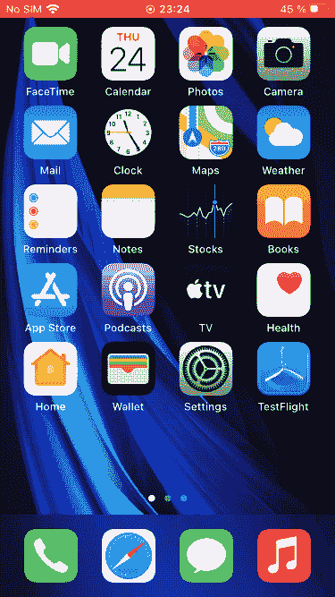
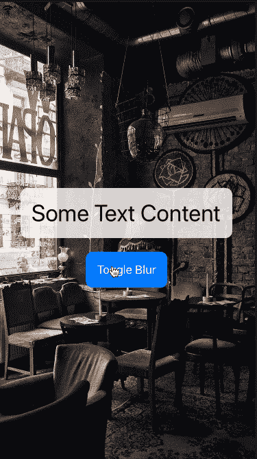

# 使用 SwiftUI 在 iOS 中轻松实现背景模糊(第 1 部分)

> 原文：<https://betterprogramming.pub/easy-background-blur-in-ios-with-swiftui-8cf5a407ec65>

## 为您的图像添加美丽的模糊或散景效果

西蒙·艾布拉姆斯在 unsplash.com[拍摄的照片](https://unsplash.com)

背景、视图和其他元素的模糊效果在现代 UI/UX 设计和软件开发中有很多优势，无论是为了吸引用户的注意力还是为了让事情看起来更好。

作为一个 iOS 用户，你可能已经非常了解这种效果，因为它们被用在操作系统本身的各种功能上。一个著名的例子是在 iPhone 上打开 Spotlight 搜索:

聚光灯搜索背景模糊

这里使用了模糊，这样用户就不会再被主屏幕的图标和字体分散注意力，可以专注于搜索及其结果。另一个优点是可读性:如果没有模糊，主页图标的字体会使人很难从结果中读出可能的重叠文本。

自 iOS 13 以来，苹果的 SwiftUI 框架为我们提供了一个很好的视图修改器:T4 模糊修改器。

这一系列文章的目标是说明如何在您自己的应用程序中应用这个修饰符。在第一部分中，重点是背景图像上的简单模糊，而在第二部分中，一个更复杂的视图将被模糊。

***注意:*** *需要 XCode 11.x 或更高版本，Swift 5.x，iOS 13.x 或更高版本。假设您已经掌握了一些 Swift 和 SwiftUI 编程知识，如何构建应用程序，以及如何在其中实现您自己的视图。这不是一个教你基础知识的教程。*

# 愿景

在我们开始编码之前，让我们看看我们想要实现什么。我们的第一个目标是一个带有背景图像的简单视图，当按钮被按下时，我们希望对其进行模糊处理:

简单的背景模糊

通过点击一个按钮，我们希望使背景模糊，但保持其他一切清晰。看似简单！

# 视图修改器

首先要做的是为模糊效果创建一个视图修改器。该修改器获取视图内容，将其包装在一个组中，并应用系统中的模糊修改器。

模糊视图修改器-简单版本

代码应该非常简单，不需要任何解释。

你可能想知道为什么需要这个修改器，因为模糊本身也可以直接应用到视图中。这个想法的问题是 SwiftUI 不允许内置视图修饰符是有条件的。对于条件绑定，必须创建一个单独的视图修改器——我们希望模糊效果是有条件的，因为它是由外部触发的(在我们的例子中，通过点击按钮)。

# 主视图

在我们的主视图中，我们现在需要将这个修改器添加到我们想要模糊的视图中。下面是我们上面预览视图的代码:

将模糊修改器应用于背景图像的主内容视图

主包装器是一个简单的 VStack，里面有一个`Text`和一个`Button`。在视图的头部，我们还声明了一个状态变量来保持状态，即是否显示模糊。

有趣的部分是我们设置为背景的图像视图(第 28-31 行)。在这个图像上，我们应用了之前创建的模糊修改器，因为我们不希望主视图(VStack)模糊，而只是背景本身模糊。就是这样！

在我们的例子中，我们使用一个简单的图像视图来模糊，但这可以是任何类型的视图，当然，例如，如果您有一些复杂的自定义视图用作背景。

如果你想了解更多关于阴影和模糊效果的知识，这里有一篇非常好的文章:“T2 如何在现代 UI 设计中使用阴影和模糊效果”