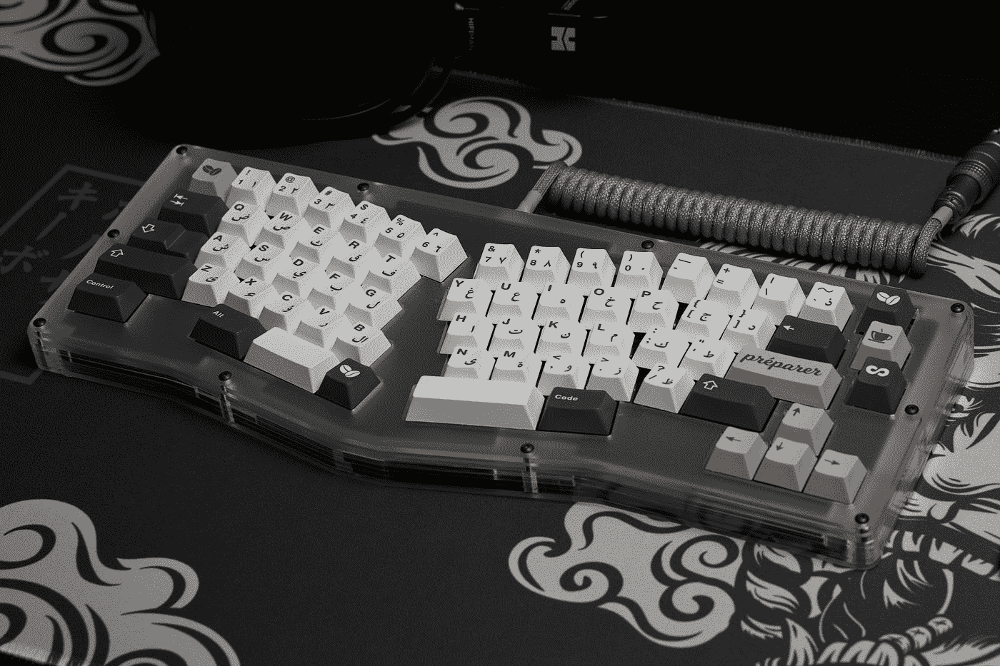
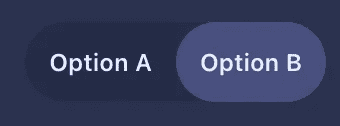

# 易于定制的反应开关组件

> 原文：<https://betterprogramming.pub/easy-custom-react-switch-component-1fcbadc2118b>

## 当你想自己动手做图书馆时

照片由 [Bernin Uben](https://unsplash.com/@nuclear?utm_source=medium&utm_medium=referral) 在 [Unsplash](https://unsplash.com?utm_source=medium&utm_medium=referral) 上拍摄

曾经有一段时间，没有像 Bootstrap 或 Material-UI 这样的 NPM 包和预建库，它们有几十个组件和闪亮的功能，可以开箱即用。无论好坏，你都得自己动手建造。

虽然我同意在大多数情况下没有必要重新发明轮子，但有时我还是喜欢在前端构建自己的组件，这样我就可以完全控制它们的功能、道具等。你在下面看到的开关/切换组件是我选择自己构建的一个组件，下面是我的做法。

**TL；最后的代码沙箱在底部。**

基本文本开关组件

# 代码

我使用基本的 React 和 CSS 样式编写了我的示例组件，但它非常简单，可以跨任何前端框架复制。在上面的图片中，我正在使用查克拉界面。

## 状态

switch 组件只需要一个状态变量来处理当前的活动选项。

*我使用了 TypeScript，所以我创建了一个 enum 并将其设置为我的状态所期望的类型，但这只是语法上的好处。没有必要。*

## 对标记做出反应

我们一会儿会讨论它的样式，但是要注意的是

1.  `SwitchContainer`:负责设置你的开关组件的主要背景色或者“未选中”的颜色。
2.  `ToggleItems`:这是您的组件实际上要在其间切换的内容。在这些项目上需要注意的重要一点是，我们使用了在上一节中定义的状态变量来改变`ToggleItem`的背景颜色。这导致了我们的`Selected`状态。如果`ToggleItem`不是`activeOption`，那么背景被设置为透明，这基本上只是显示我们已经提到的`SwitchContainer`的背景颜色，提供取消选择或不活动的颜色状态。

## 切换功能

Super basic，函数把你要设置的选项作为`activeOption`，设置状态。因此，触发标记的重新呈现器，该重新呈现器根据新选择的选项更新背景颜色。

## 式样

1.  `SwitchContainer`:正如我之前提到的，这主要是为了设置你的背景颜色，用作`unselected`颜色状态。宽度和高度只是`max-content`，因为我们让`ToggleItems`定义容器的宽度和高度。
2.  `ToggleItem`:这是一个非常简单的 CSS 块。内容对齐的具有定义宽度和高度的弯曲项目。这里最重要的是`ToggleItem` `border-radius`必须和`SwitchContainer`的`border-radius`匹配。这样，当选择时，活动选项背景颜色与`SwitchContainer`完全匹配。
3.  `Text`:基本文本样式这里没有什么特别要注意的。

# 一起

这是最终的代码沙箱。这个故事的寓意是:您不需要为前端需要的每个组件都导入一个库。有时候，自己创造也没什么。老实说，我发现编写定制组件比导入它们更有趣，即使这会花费我一些时间。

如果您想了解如何使用自定义代码构建任何其他组件，请发表评论。

我将尝试做一系列关于构建这样的定制组件的文章！