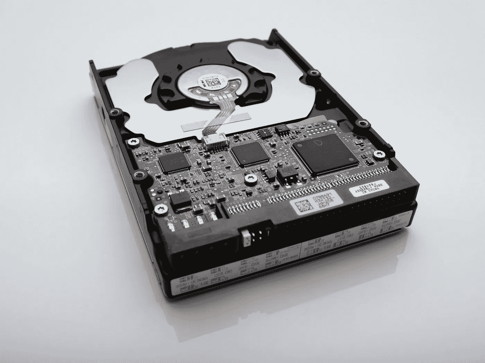
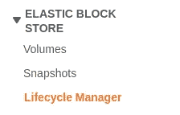
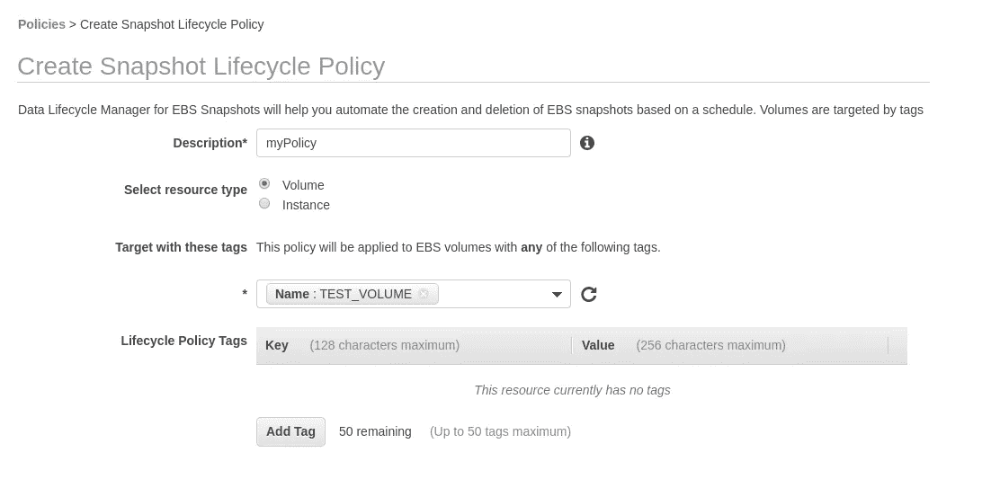
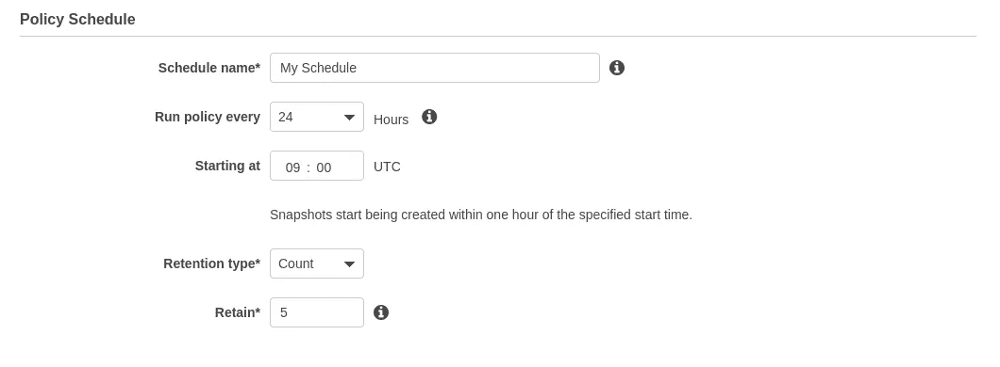
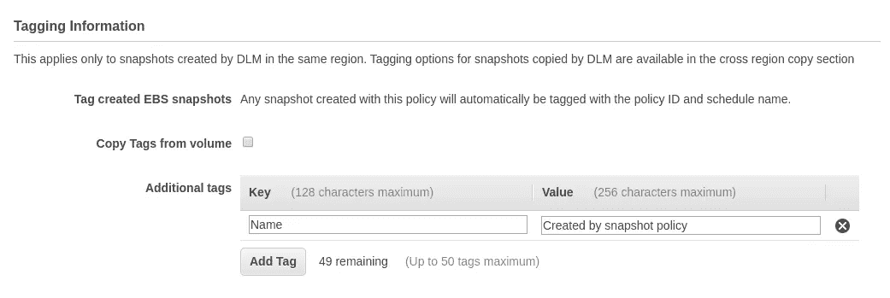
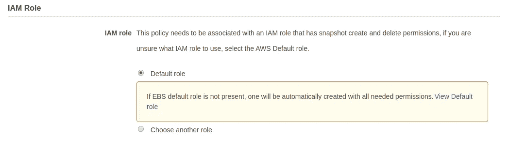
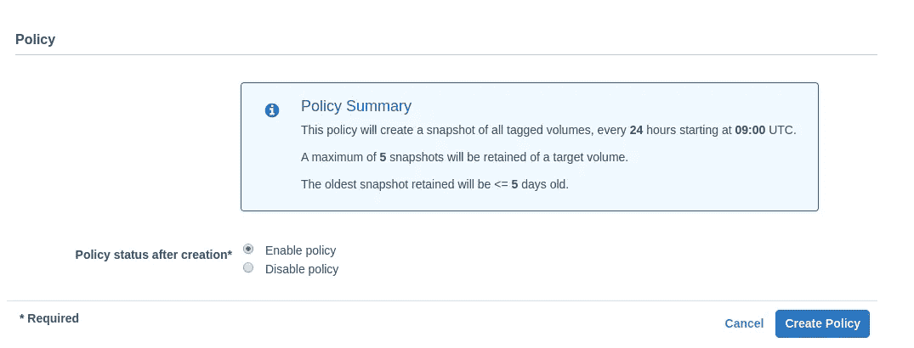

# 使用 AWS 数据生命周期管理器创建简单的磁盘快照

> 原文：<https://betterprogramming.pub/easy-disk-snapshots-with-aws-data-lifecycle-manager-9e36bf66019b>

## 立即备份您的数据，不要在以后付出代价



由[文森特·博塔](https://unsplash.com/@0asa?utm_source=unsplash&utm_medium=referral&utm_content=creditCopyText)在 [Unsplash](https://unsplash.com/s/photos/hard-drive?utm_source=unsplash&utm_medium=referral&utm_content=creditCopyText) 拍摄的照片

几乎任何人都可以在 Amazon AWS 上快速开始构建基础设施。只需点击一个按钮，您就可以启动新的虚拟机并添加大量存储。快速创建机器的能力是有用的，但是如何保护所有这些数据呢？

在过去，设置不同的备份/快照策略是一项繁琐的工作，需要配置笨重的脚本或重复的任务来保护您的数据。手动管理快照策略一点也不好玩，只会妨碍完成工作。

亚马逊推出了[数据生命周期管理器](https://docs.aws.amazon.com/dlm/latest/APIReference/Welcome.html) (DLM)，让事情变得简单多了。使用 DLM，您可以配置一个定期计划来拍摄实例或卷快照。数据保留策略也很简单，只需设置要保留数据的数量或最长期限。

让我们看看如何在卷上设置新策略。

# 生命周期管理器策略

创建新的生命周期策略非常简单，只需要几个简单的配置项目。访问 AWS 中的 EC2 控制台。在 EBS 部分，您应该看到“生命周期管理器”项:



显示生命周期管理器菜单项的 EC2 控制台。

进入生命周期管理器后，单击“创建快照生命周期策略”这将开始设置一个新策略，让您决定何时保留磁盘快照以及保留多长时间。



在 DLM 创造新政策。

开始创建新策略后，您有两种选择来创建快照类型:一个*卷*或*实例*类型。实例类型将拍摄整个 EC2 实例的快照，而卷将拍摄 EBS 卷的快照。

对于本例，让我们选择卷选项，并为新策略命名。在大多数情况下，您将只关心实例的关联卷，而不是实例本身。

# 把…作为目标

“使用这些标记的目标”部分控制要拍摄快照的卷。您可以使用您喜欢的任何标记来定位卷。在本例中，我选择仅将名为`TEST_VOLUME`的卷作为目标。

在实际情况下，您可能希望将一个标记应用于多个卷，并以该标记为目标。这样，当您想要向快照策略添加更多卷时，只需向卷添加标记。像这样的标签可能是:

```
MySnapshotPolicy: true
```

任何具有该标记的卷都将根据策略开始拍摄快照。但是对于这个示例策略，我们只是直接以单个卷的名称为目标，只是为了进行测试。

# 计划和保留

在下一部分中，您将为旧快照配置策略计划和保留期。



DLM 的政策时间表。

首先为新策略命名，然后选择何时运行该策略。这是一个周期性的计划，所以你可以选择不同的小时增量，如 12 或 24。对于图中的策略，我们已经设置了一个每日时间表，从 UTC 时间每天上午 9:00 开始。

确保选择非工作时间拍摄快照。一般来说，选择在夜间拍摄是个好主意，这样你就不会在繁忙的使用时段拍摄快照。UTC 时间上午 9:00 对应于 PDT 时间上午 2:00，这非常适合这个场景。

最后，选择保留类型。这可以是对要保留的快照数量的简单计数，也可以是按天数、周数、月数或年数进行的计数。此策略将保留最后五个快照，在本例中为最后五天。

# 磨尖

完成计划设置后，您有机会向新快照添加标记。为所有新快照配置“Name”标记是一个好主意，这样您就可以在查看快照控制台时区分它们。

您还可以复制策略将拍摄快照的卷上出现的任何标记。



DLM 策略中的快照标记信息。

除非您需要快照包含与卷相同的标记，否则可以不选中“从卷复制标记”选项。

# 完成安装

随着您继续完成策略设置的其余部分，您将有机会配置可选功能，如“快速快照恢复”或“跨区域拷贝”除非你对这些东西有特定的需求，否则可以让它们禁用。



在 DLM 配置 IAM 角色。

保留默认的 IAM 角色，除非您事先为此策略预配置了特定的权限角色。



完成 DLM 的新策略设置。

确保策略摘要准确反映您希望如何拍摄和保留快照。对整体配置感到满意后，单击“创建策略”。

就是这样！您刚刚创建了第一个数据生命周期管理器策略。您的目标卷应该会根据您的计划自动开始拍摄快照。

在拍摄第一张快照后，最好在快照控制台中快速直观地确认一切设置正确。确认标签如预期的那样被应用，并且时间表正常工作，可以省去您以后的麻烦。

*感谢阅读！我希望您喜欢更多地了解 AWS 中的数据生命周期策略。*