# 简单的谷歌地图设置教程— Swift 5

> 原文：<https://betterprogramming.pub/easy-google-maps-setup-tutorial-swift-4-f6d5c093817e>

## 集成谷歌地图的直接、逐步指南


泰勒·拉斯托维奇

在今天的文章中，我将向您展示如何轻松地将谷歌地图集成到您的应用程序中，以及通过 API 显示搜索地点的结果。

在我们开始教程之前，我想花点时间比较一下 ***谷歌地图*** 和 ***原生地图套件*** 的使用。

两者在位置搜索和观看方面非常相似。MapKit 是 Swift 自带的，因此您不需要安装第三方依赖项。它还有一个更符合 iOS 模式的风格。此外，如果你试图发出许多获取请求，谷歌的 API 是要花钱的。尽管如此，我将在本教程中使用谷歌地图，但如果我要在一个更大的项目中使用它，我可能会选择使用 MapKit。

我希望这篇教程对你的项目有所帮助，让我们开始吧！😃

# 步骤 1:创建 Xcode 项目

首先，打开 Xcode 并创建一个新项目。

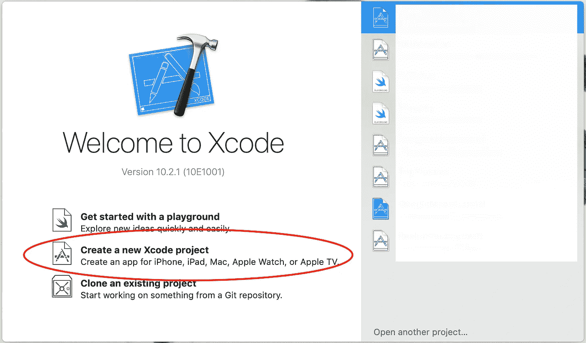

选择“创建新的 Xcode 项目”

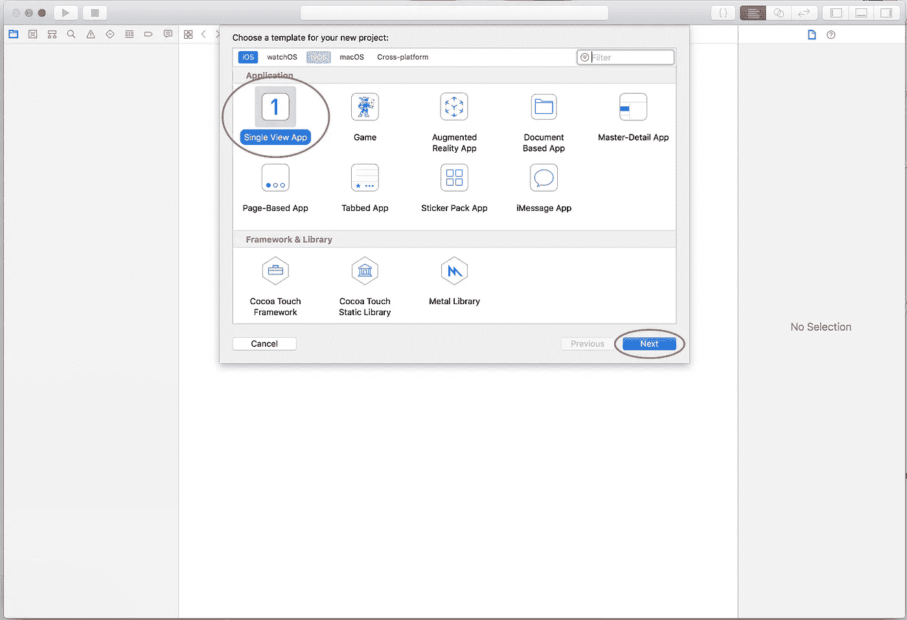

选择“单视图应用程序”并点击下一步

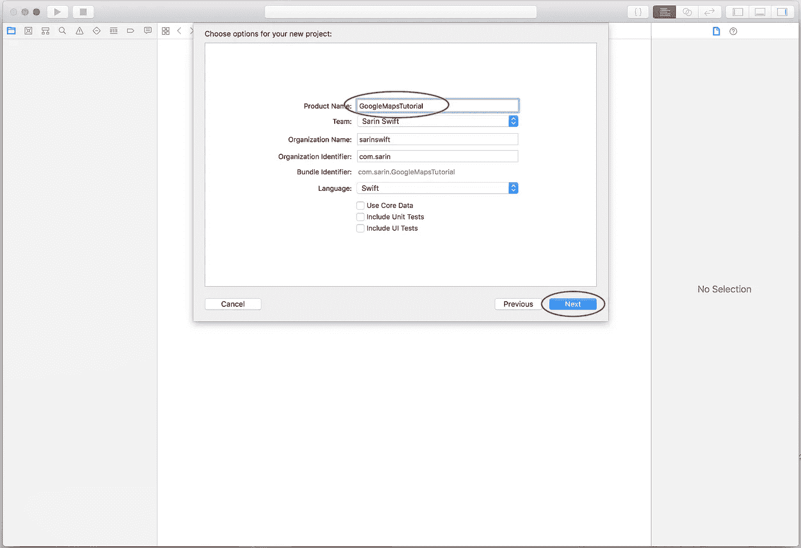

添加一个项目名称，然后点击下一步

单击“下一步”后，将新创建的项目保存到您计算机上的首选目标位置。

现在我们的应用程序已经启动并运行了。

# 第二步:安装谷歌豆荚

我通常通过我的终端安装吊舱，所以让我们看看这是如何做到的！

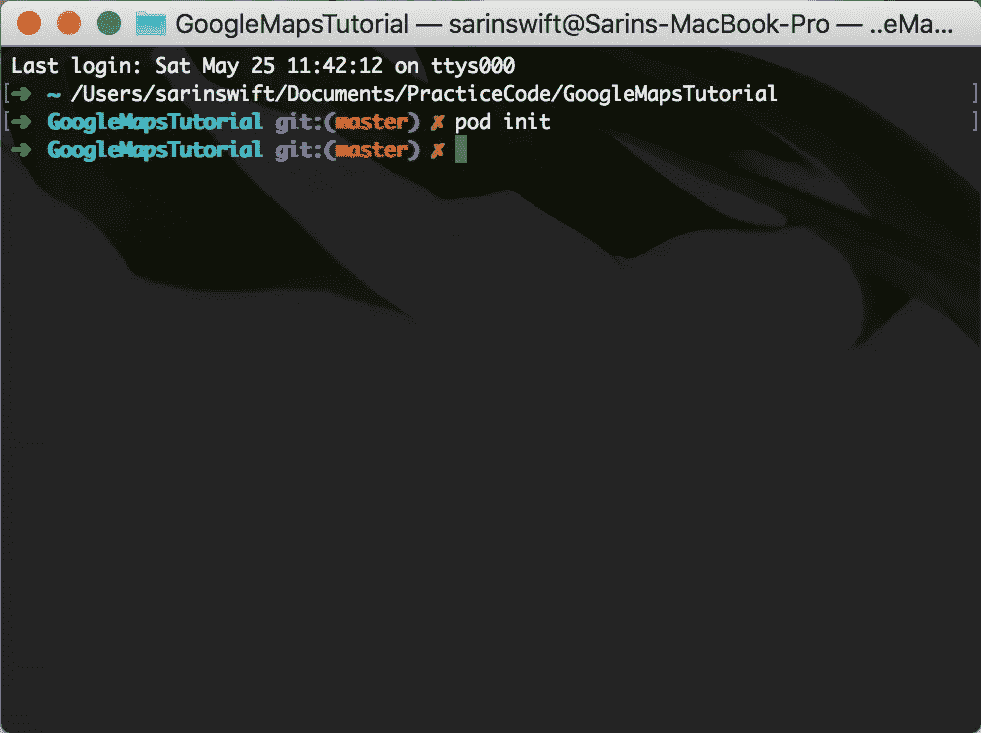

在终端中拖动你的 Xcode 主文件，然后输入‘pod init’

这将在我们的 Xcode 文件夹中创建一个新的 Podfile，我们可以在其中添加任何我们希望在应用程序中使用的依赖项。

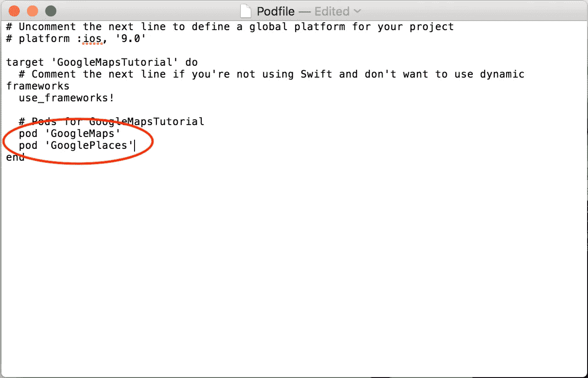

添加以下依赖项，保存文件，然后在终端中键入“pod install”

❗️ **重要提示** ❗
一旦安装了 pods，关闭 Xcode 项目，在你的项目文件中，你会看到一个名为`.xcworkspace`的白色文件。从现在开始，我们将只处理工作区文件，而不是`.xcodeproj`！

# 步骤 3:获取 API 密钥

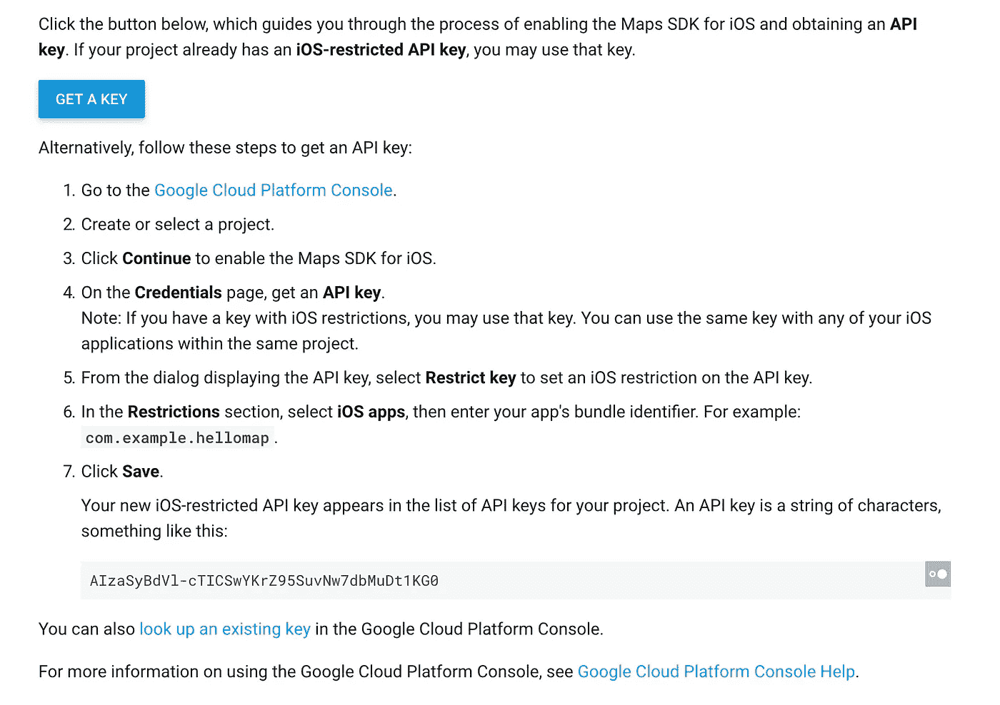

[iOS 地图的谷歌文档](https://developers.google.com/maps/documentation/ios-sdk/start)

仔细按照这些步骤获取 API 密钥。

# 步骤 4:设置地图视图

现在我们可以开始设置地图视图:

1.  进入*界面构建器*到我们的视图控制器。
2.  按住
    `Shift` + `Command` + `L`这 3 个键，使用快捷键打开*对象库*

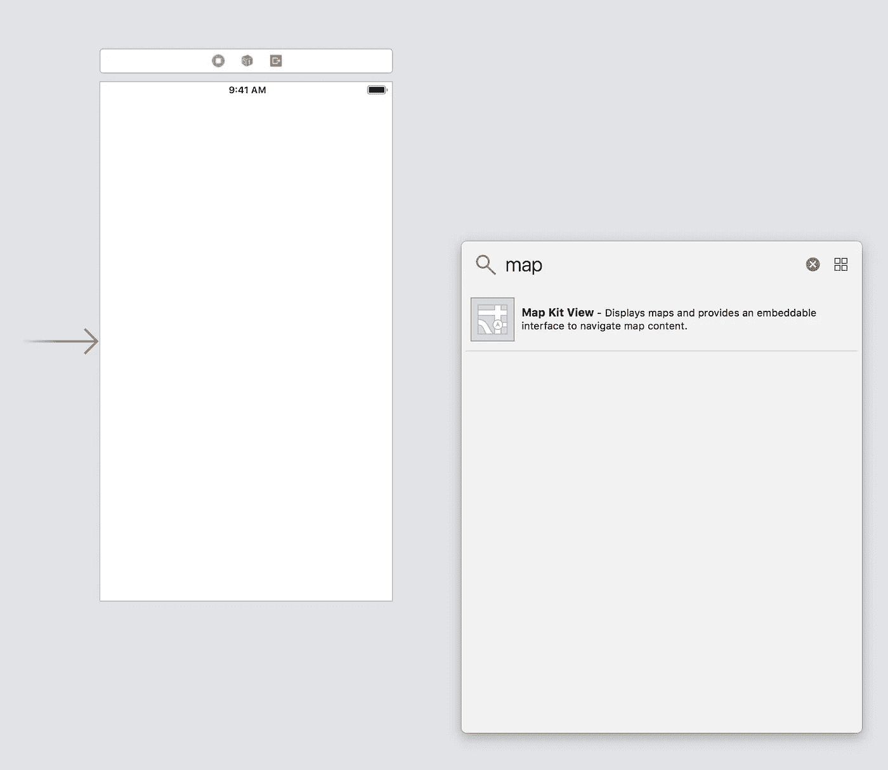

3.将*地图工具包视图*拖到我们的视图控制器上，然后我们想要添加
约束到所有 4 个边:顶部、顶部、底部和尾部。

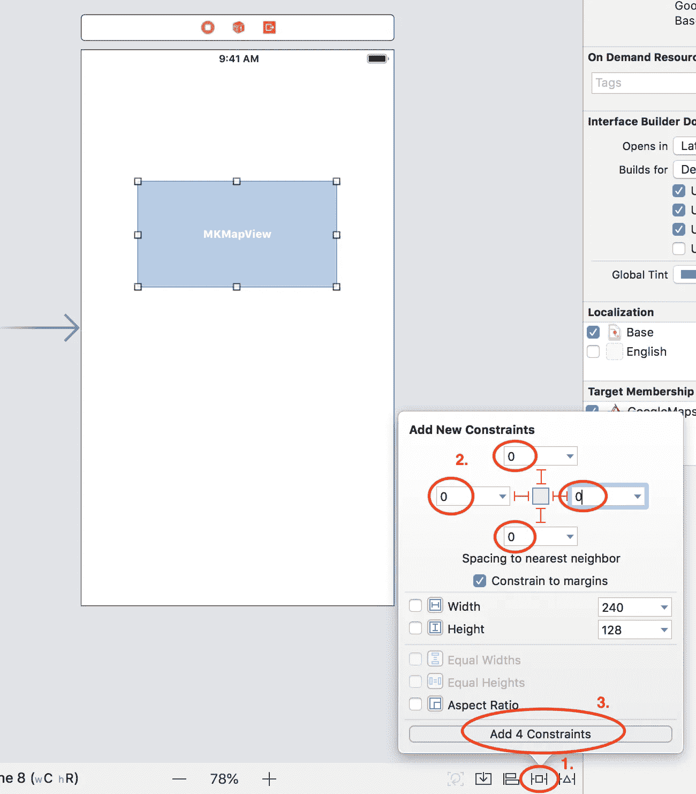

点击*添加 4 个约束*后，地图视图应该覆盖几乎整个视图控制器。

4.是时候将我们的地图视图通过 IBOutlet 连接到文件 *ViewController.swift* 了

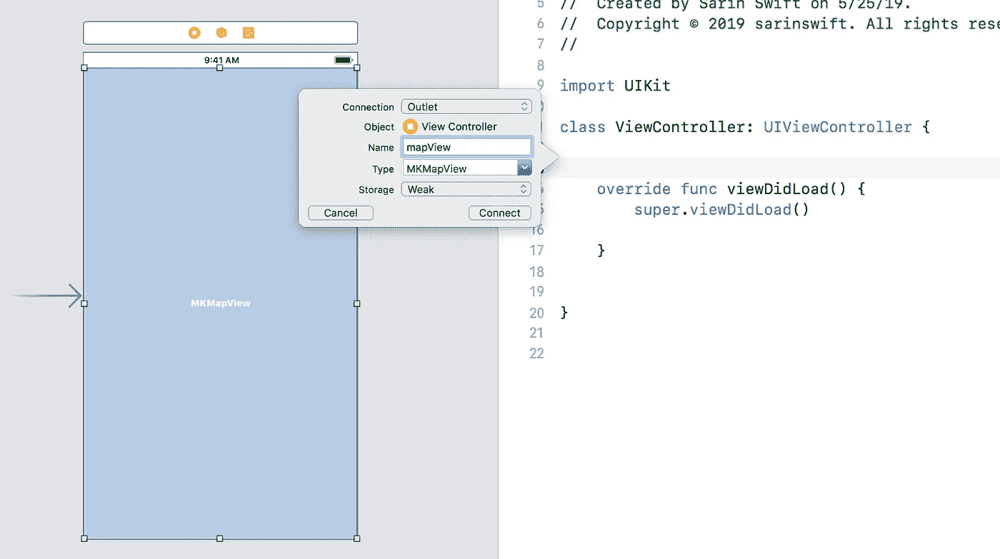

我们将有一个错误*使用未声明的类型‘MKMapView’**，我们需要做的就是在我们的 ViewController 文件的顶部，在“ ***import UIKit*** ”下添加“ ***import MapKit*** ”。*

# *步骤 5:在导航控制器中嵌入视图控制器*

*我们想嵌入一个导航控制器，这样我们就可以取代导航栏的空间成为我们的搜索栏！*

*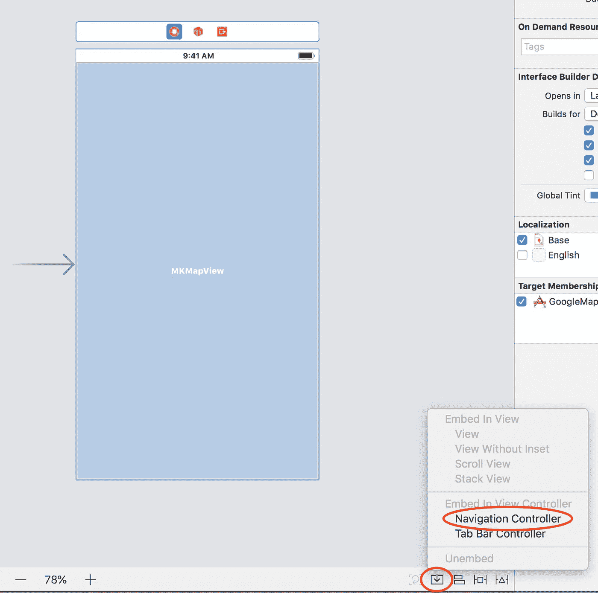*

*选择嵌入按钮，然后选择导航控制器*

# *步骤 6:以编程方式实现 Google 的搜索控制器*

*让我们回到 ViewController.swift 文件，最后开始写一些代码！！🎉🎉*

*在我们*导入 MapKit* 的地方的正下方，添加另一个导入语句:
`import GooglePlaces`*

*很好，现在我们有了 GooglePlaces，所以我们可以使用*GMSAutocompleteResultsViewController。*GMSAutocompleteResultsViewController**提供了一个以表格视图显示位置的界面，表格视图中的结果会随着搜索栏中文本的变化而更新。***

```
***var resultsViewController: GMSAutocompleteResultsViewController?
var searchController: UISearchController?***
```

***搜索栏将设置在 *viewDidLoad()* 中。让我们继续创建一个名为 *setupSearchBar()* 的函数，并在 *viewDidLoad()中调用它。****

***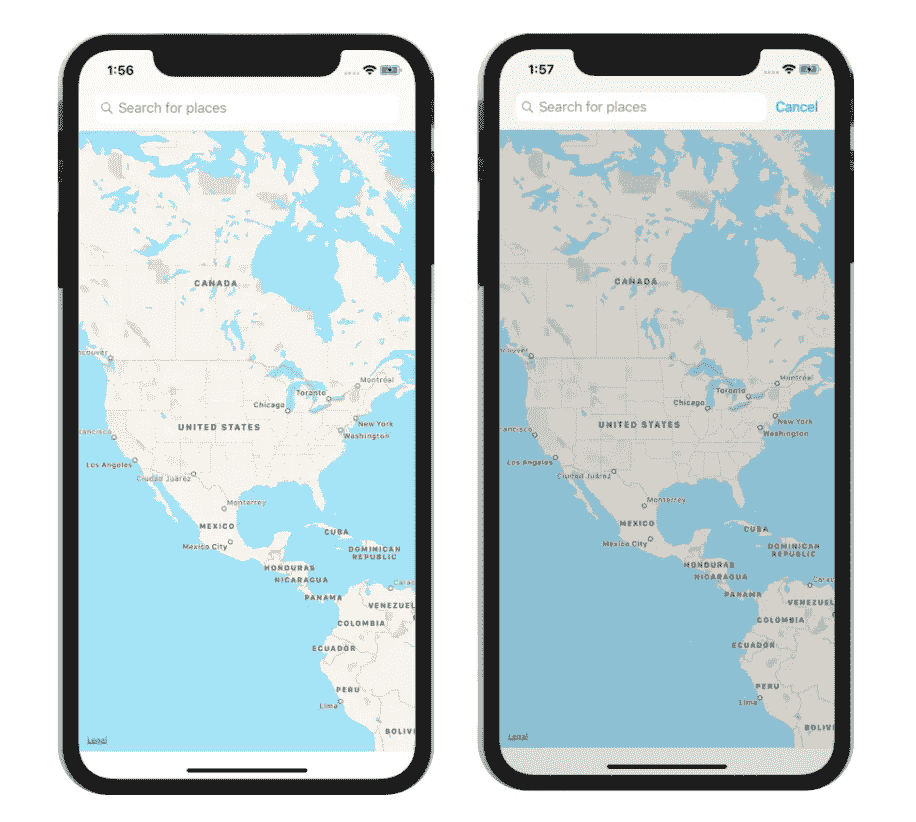***

***现在我们有了带有搜索栏的地图！***

***目前看起来很棒！然而，我们离让这个搜索栏显示结果还有几步之遥。如果你输入一些东西，应用程序将会崩溃，因为我们还没有提供 API 密钥。***

# ***步骤 7:在 AppDelegate 中初始化一个 API 键***

***继续操作，在我们的 AppDelegate 文件的顶部和在*应用程序的*方法中，在*返回 true 之前，*添加`GMSPlacesClient.provideAPIKey(“your_api_key_here”)`***

***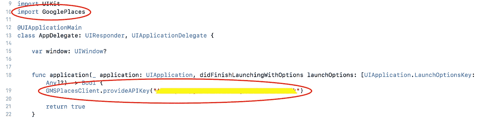***

***该应用程序现在应该可以在搜索栏表格视图中显示地点的结果。***

***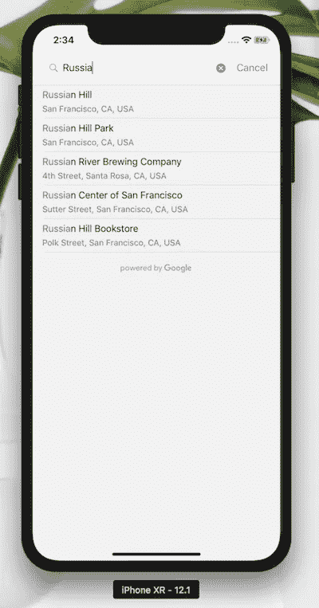***

***好像起作用了！但是，如果我们不能选择位置并在地图上显示出来，这怎么可能是一个功能良好的应用程序呢？***

# ***步骤 8:添加 GMSAutocompleteResultsViewControllerDelegate***

*****GMSAutocompleteResultsViewControllerDelegate**允许用户交互和应用程序控制器之间的通信。这将是当用户选择表格视图中结果的位置之一时的交互。***

***让我们创建一个 ViewController 的扩展(在类的下面和外面)并符合协议。***

***需要遵守 2 个协议存根:***

*   *****didAutocompleteWithPlace** ,当从可用的自动完成预测中选择一个地点时调用。***
*   *****didFailAutocompleteWithError**当检索自动完成预测或地点细节时发生错误时调用。***

# ***步骤 9:确认 ResultsViewController 为委托***

```
***resultsViewController?.delegate = self***
```

***这段代码可以放在 *viewDidLoad()* 或`setupSearchController`方法中，就在您初始化*GMSAutocompleteViewController*的实例之后。***

# ***步骤 10:将地图图钉放到用户选择的位置***

***这是我们的最后一步！！我们就要完成整个项目了。🙌🏼***

***我们将获得用户的位置，并在地图上添加注释。***

1.  ***我们需要这段代码，以便 *resultsViewController* 将关闭并显示回我们的地图视图。***
2.  ***我们移除地图上任何当前的注释。这将始终允许地图上只有一个大头针。这将在我们将要添加的地图图钉附近创建放大。***
3.  ***创建一个 MKPointAnnotation 的实例，我们根据用户选择的地点给出正确的位置细节。然后我们把这个标注添加到地图上！***

***至于最后要补充的:***

***您可能想用其他方法来处理这个错误，比如启动一个警报控制器来通知用户。***

# ***结论***

***感谢您查看这篇博文！如果你有任何问题或意见，请随时联系我。如果你觉得这篇文章有帮助，别忘了给它一些掌声。***