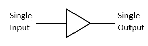
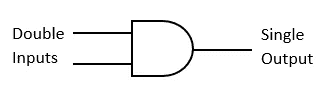
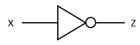
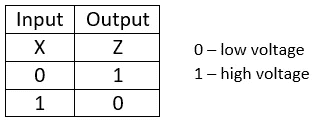
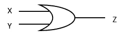
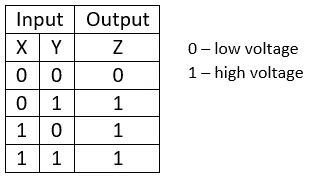
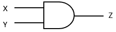
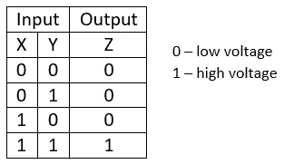

# 简单的逻辑门

> 原文：<https://betterprogramming.pub/easy-peasy-logic-gates-863e62657057>

## 基本逻辑门理解指南

Bartosz Kwitkowski 在 [Unsplash](https://unsplash.com/search/photos/circuit?utm_source=unsplash&utm_medium=referral&utm_content=creditCopyText) 上拍摄的照片

我们都知道字母是语言创造词汇的基础。类似地，在电子世界中创建数字电路时，逻辑门充当基本组件。

就像字母表中的元音一样，逻辑门的重要类型很少。在本文中，我们将了解基本逻辑门及其功能。

# 基础知识

逻辑门的三种基本类型是:

*   不
*   运筹学
*   还有。

基于上述门，创建了以下逻辑门:

*   “与非”
*   也不
*   异或运算
*   XNOR。

通常，逻辑门符号的输入在左边，输出在右边，如下图所示。

单输入/单输出单元(缓冲器)的标准逻辑门符号

双输入/单输出单元(和 ate)的标准逻辑门符号

# 二进制和十进制

在讨论真值表之前，有必要了解一下二进制和十进制的背景。

我们都熟悉十进制数字(0，1，2，3，4，5，6，7，8，9)，我们在日常计算中使用这些数字。这个数字系统的基数是 10。以类似的方式，二进制数(0，1)可用于表示十进制值，其中二进制数的基数为 2。

这里用二进制的重要性在于*表示一个数字元件的开关状态或电压状态:0 表示低电压/低信号，1 表示高电压/高信号。*这样，布尔代数就开始了。

接下来，我们将分别讨论每个门。这包括门背后的逻辑，它的标准符号，以及门的真值表。

# **非门**

非门也被称为 ***反相器*** 。这是因为非门的输出总是与输入完全相反。如果输入为高，输出将为低，反之亦然。

非门的标准符号可以表示如下。

标准非门符号

根据该图，X 表示输入信号，Z 表示输出信号。因此，真值表可以这样写:

非门的真值表

# **或门**

“或”门有两个输入和一个输出。如果任一输入信号为高，输出也将为高。换句话说，或门的操作类似于每个输入的 ***加法(+)*** 。

“或”门的标准符号可以表示如下。

标准或门符号

根据图表，X 和 Y 表示输入信号，Z 表示输出信号。因此，真值表可以这样写:

或门的真值表

# **与门**

与门和或门一样，也有两个输入和一个输出。在这个逻辑门中，只有当两个门输入信号为高时，输出信号才为高。否则，输出将为零。门的逻辑运算类似于 ***乘法(×)*** 运算。

与门的标准符号可以表示如下。

标准与门符号

根据图表，X 和 Y 表示输入信号，Z 表示输出信号。因此，真值表可以这样写:

与门的真值表

希望你喜欢并通过阅读这篇短文了解基本逻辑门。