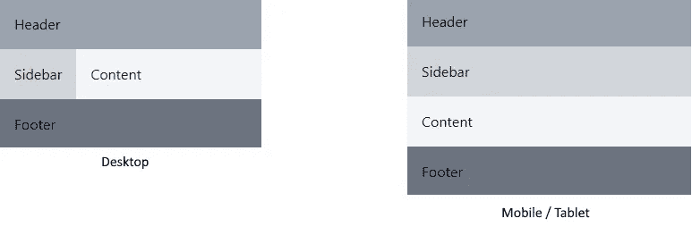

# 如何使用 Tailwind CSS 轻松构建响应式网页

> 原文：<https://betterprogramming.pub/easy-responsive-styling-with-tailwindcss-735f4b809bc9>

## *使用顺风 CSS 进行造型的指南*


由 [Unsplash](/s/photos/web-development?utm_source=unsplash&utm_medium=referral&utm_content=creditCopyText) 上的 [Davide Baraldi](https://unsplash.com/@davideibiza?utm_source=unsplash&utm_medium=referral&utm_content=creditCopyText) 拍摄的照片。

创建响应性 web 页面可能很难——尤其是当您不想处理 Bootstrap 或 Materialize 等框架的限制时。这些框架提供了简单的响应样式，但是也有很大的局限性，因为它们要求一切都是正确的。

如果你想改变一个按钮或输入字段的外观，你必须改变一个 CSS 文件来反映这些变化。如果你做错了，你将会遇到一些讨厌的冲突，你必须使用`!important`来解决。

当然，这并不好，还有其他方法。但是另一个创建响应性网站的简单方法是使用 [Tailwind CSS](https://tailwindcss.com/) 而没有框架的所有限制。

Tailwind 不提供预制组件，如样式按钮。它确实提供了大量的实用程序类，可以用来创建自己的按钮。这有助于发挥创造力。最好的部分是响应性，黑暗模式和焦点/悬停状态非常容易实现，只需使用 CSS 类，你不必创建。

# 装置

Tailwind 有几种不同的安装方式，这取决于你如何使用它。您可以使用 Next.js 这样的库来轻松实现，但也可以在任何 Node.js 或普通 HTML/CSS/JS 项目中使用它。根据您的项目，[官方文档](https://tailwindcss.com/docs/installation)可能有助于阅读。

为了简单起见，我将使用一个基于 React 的项目。我会用 [Next.js](https://nextjs.org/) 因为非常容易上手。我不会深入探讨任何困难或深入的特性。即使你没有使用任何类似的东西，你仍然可以通过这篇文章来学习 Tailwind，因为这是这篇文章的目的。

## 设置 Next.js

建立一个非常小的 Next.js 项目非常容易。它需要安装 NPM。我们需要通过 NPM(或 Yarn)安装 React、React-DOM 和 Next.js，并通过在一个`pages`文件夹中添加`index.js`来设置我们的项目。就是这样。

```
npm init -ynpm i next react react-dom
```

更改`package.json`中的脚本，让下面的脚本运行 Next.js 项目:

最后一步是创建`/pages/index.js`，这样我们就有了一个可以工作的主页。您可以复制/粘贴这个最小文件作为您的主页:

当您现在运行`npm run dev`并浏览到`localhost:3000`时，您应该会看到文本。尝试编辑该文件以查看快速刷新的效果。这是安装这个最小的 Next.js 项目的最后一步。

## 设置顺风

要在 Next.js 项目中设置 Tailwind，我们需要通过 NPM 安装几个包，初始化 Tailwind 本身，并将其导入我们的索引文件。

```
npm install tailwindcss@latest postcss@latest autoprefixer@latestnpx tailwindcss init -p
```

初始化 Tailwind 将创建一个`tailwind.config.js`文件和`postcss.config.js`文件，我们可以在其中添加动画、选项、启用黑暗模式等等。我们暂时让它空着。

我们在`index.js`文件的顶部导入 Tailwind，方法是:

```
import "tailwindcss/tailwind.css";
```

现在你可以看到，如果你给你的`div`添加一个实用类，比如红色文本或小边距的`text-red-600`或`m-4`，它就可以工作了。我们以后会进入所有的班级。

我们现在已经设置了使用 Tailwind 所需的一切，当我们到达那里时，我们将处理我们可能需要的任何其他设置。

# 你的第一个元素

创建独特的元素，比如按钮或提醒，一点也不难。这是学习如何使用 Tailwind 实用程序类以及如何在这些小元素中创建交互性而无需编写一行 CSS 的好方法。


我们将创建这个简单的按钮。我们将用悬停状态来完成它，以学习顺风的所有基础知识。

## **颜色**

我总是从背景和字体颜色和风格开始。这些构成了品牌和整体外观的良好开端。Tailwind 为我们提供了一个可以使用的默认主题。该主题由八种颜色组成，明度或暗度的取值范围为 50 到 900。

对于我们的按钮，这些颜色是使用`bg-green-400`和`text-green-900`添加的。您可以使用默认主题中您喜欢的任何颜色。如果你对默认主题不满意，你可以添加你自己的颜色，我们稍后会看到。

## 杂项风格

下一步是所有其他的风格。我们添加圆角和阴影来增加额外的深度。你可以阅读[官方文件](https://tailwindcss.com/docs/)亲自查看。

基本样式由一些边距和填充组成。这些都是用简单的字母`p`和`m`加上一个数字来定义的。您也可以使用`x`、`y`、`t`、`b`等设置间距的具体方向。

我使用了`px-4 py-2`作为我的间距，并添加了`font-bold`来创建一个更厚更易读的按钮。我还添加了一些简单的样式，比如阴影和边框半径。

在这种情况下，我们使用`shadow-lg`和`rounded-lg`。`-lg`意味着我们添加一个更大的阴影和更大的边框半径。如果你省略了`-lg`，你只会得到一个更小的半径和阴影。

你现在可能对这是如何工作的有一点感觉了。也许你甚至可以通过阅读文档来创建自己的按钮。也许你已经在想象可能性了。但是我们的按钮缺少一样东西:悬停风格。

## 基本交互性

我们可以通过使用前缀来定义[基本交互性](https://tailwindcss.com/docs/hover-focus-and-other-states)。对于通过某个测试时需要应用的样式，Tailwind 使用了很多前缀(例如，当我们悬停在按钮上时只需要显示的样式)。

这是通过使用前缀`hover:`完成的。冒号是基本的分隔符，如果出于某种原因需要更改它，可以在[配置文件](https://tailwindcss.com/docs/configuration#separator)中进行。

我们希望当鼠标悬停在按钮上时定义一个更深的颜色，或者一个更小的阴影(或者根本没有)。`hover:bg-green-600`和`hover:shadow-none`对我们来说非常有用。

注意，你可以给任何你想要的东西加上前缀。如果您愿意，可以给按钮的绝对位置加上前缀。这提供了很大的灵活性，对于响应能力非常重要。

*注:你可以在 GitHub* *上找到最后的按键代码* [*，检查你的代码是否与我的匹配。我使用了一个 Next.js 项目，所以请记住，围绕我的按钮的代码可以不同。*](https://gist.github.com/mbvissers/a12e3963d40c535390d432a54af0fc83)

# 基本响应

响应式网页可以用几种方法制作。最受欢迎的可能是 Flexbox，而 CSS Grid 也逐渐流行起来。Tailwind 支持这两者，但是在本文中我将坚持使用 Flex。



我们将尝试使用 flexboxes 重新创建这个非常简单的响应模式。这非常简单，只需要对我们正在使用的盒子有一个基本的了解。

## 盒子

该布局由四个基本框和六个`div`元素组成。我们的四个框是容器、页眉、页脚和主框。我们的第五个和第六个*元素*是主框中的侧边栏和内容。

当我们有更大的布局时，主框将是一行，当我们有更小的布局时，主框将是一列(例如在手机或平板电脑上)。内容元素将获得一个`flex-grow`类，比我们的侧边栏有更大的宽度。

## 代码

我们用 flexboxes 定义我们的基本布局。开始时，我们不需要添加任何前缀类。我们可以从移动或桌面布局开始。我建议从移动布局开始。

在这段代码中，唯一带前缀的元素是当屏幕尺寸改变时会改变的元素。默认情况下，我们的主元素将是一列，如果屏幕尺寸是`md`，中等或更大，它将是一行。你可以在代码的第 4 行看到。

当您粘贴并运行这段代码时，您将获得适合您的屏幕大小的布局。如果您调整屏幕大小，元素会相应改变。

如果您愿意，还可以添加一个根据屏幕大小改变颜色的元素。你可以使用[屏幕尺寸前缀](https://tailwindcss.com/docs/breakpoints)和背景颜色来完成这项工作。

# 可重用的类

当然，每次都为每个按钮编写所有的类是很烦人的，是一种不好的做法，也是编写美味意大利面的好方法。但那不是有利的。幸运的是，Tailwind 给了我们使用 Tailwind 实用程序类来添加我们自己的类的选项。

根据您选择的框架，您可能需要添加一些文件夹或文档来处理静态 CSS 文件。 [Next.js 提供了一种简单的方法来添加静态 CSS 文件，并且与 Tailwind](https://nextjs.org/docs/basic-features/built-in-css-support) 配合得非常好。然而，我不会深入讨论这个问题。

使用 CSS 文件中的`@apply`指令，您可以将 Tailwind 的类添加到自己的类名中。这大大提高了可读性和可维护性。

现在，您可以在项目中使用这两个类，而不必重写所有的实用程序类。如果没有这个选项，Tailwind 将会写得一塌糊涂。但是将快速原型的强大功能与将它们保存到自己的类中的方法结合起来，可以创建一个强大的库。

# 结论

Tailwind CSS 是一个很棒的库，可能需要一些时间来适应。但是，当您掌握它时，您可以快速地构建响应性 web 应用程序的原型，并在以后针对生产和可维护性进行优化。

非常感谢您的阅读，祝您度过愉快的一天。

## 更多顺风文章

[](https://javascript.plainenglish.io/the-easiest-to-implement-dark-mode-32057aaec511) [## 实现黑暗模式的最简单方法

### TailwindCSS 的团队真的超越了自己。

javascript.plainenglish.io](https://javascript.plainenglish.io/the-easiest-to-implement-dark-mode-32057aaec511) [](https://javascript.plainenglish.io/how-to-animate-with-tailwindcss-394842ae8b39) [## 如何用 TailwindCSS 制作动画

### 基于实用程序类的动画！

javascript.plainenglish.io](https://javascript.plainenglish.io/how-to-animate-with-tailwindcss-394842ae8b39)