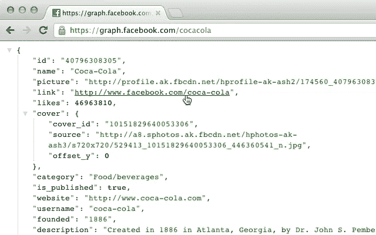
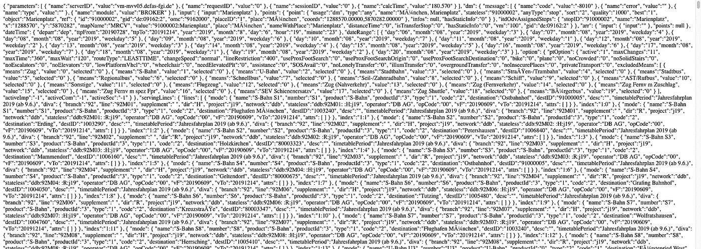
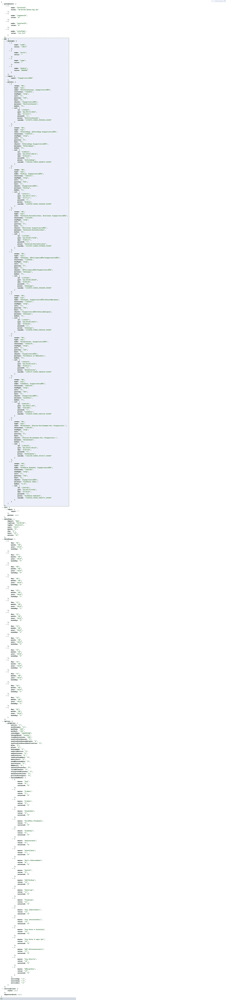

# 带有 Chrome/Firefox 扩展的易读 JSON

> 原文：<https://betterprogramming.pub/easy-to-read-json-with-this-chrome-firefox-extension-29f4938dce50>

## 当您直接在浏览器选项卡中访问 JSON 和 JSONP 时，可以很好地打印出来

Img 来源:Chrome 网上商店

[JSON](https://www.json.org/) 是一种非常流行的文件格式。有时，我们可能需要在浏览器标签中读取一个 JSON 对象，这可能很困难。

我们可能需要去搜索一个在线工具，把它变成一个易于阅读的格式，这样我们就可以理解它。

现在，这里有一个 Chrome 和 Firefox 的扩展，它可以进行格式化，让你的 JSONs 在浏览器中立刻变得漂亮，而不需要执行许多不必要的步骤。

它附带了对 JSON 和 JSONP 的支持，并突出了语法，以便您可以相应地区分不同的属性和值。它还提供了折叠节点的选项，可以在新标签页中打开可点击的 URL，你可以看到原始的、未格式化的 JSON。

它适用于任何 JSON 页面，不管您打开的是什么 URL。在`chrome://extensions`中启用后，它也可以处理本地文件。您可以通过在控制台中键入`json`来检查 JSON。

对于 Chrome 你可以点击[来安装这个扩展，对于 Firefox](https://chrome.google.com/webstore/detail/json-formatter/bcjindcccaagfpapjjmafapmmgkkhgoa?hl=en) 你可以点击[来安装，然后测试它，例如，通过访问这个](https://addons.mozilla.org/en-US/firefox/addon/basic-json-formatter/) [API 响应](https://efa.mvv-muenchen.de/ng/XSLT_DM_REQUEST?outputFormat=JSON&language=en&stateless=1&coordOutputFormat=MRCV&useRealtime=1&zope_command=enquiry&type_dm=stop&name_dm=Zugspitzstra%C3%9Fe&itOptionsActive=1&ptOptionsActive=1&mergeDep=1&useAllStops=1&mode=direct&anyMaxSizeHitList=10000&useAllStops=1)。

这是格式化前的样子:

现在，看看用 [JSON 格式化程序](https://github.com/callumlocke/json-formatter)得到的漂亮的 JSON 响应:

这里有一个专业的提示:如果你也想折叠它的所有兄弟，在折叠一棵树的时候按住 CTRL(或者在 Mac 上按住 CMD)。

它是一个开源项目，所以你可以在 GitHub 上查看它的[源代码。](https://github.com/callumlocke/json-formatter)

感谢阅读！