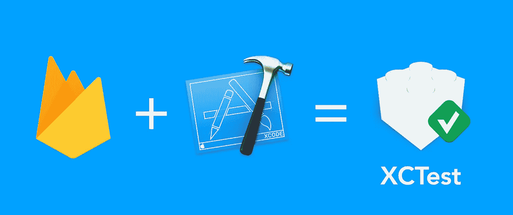
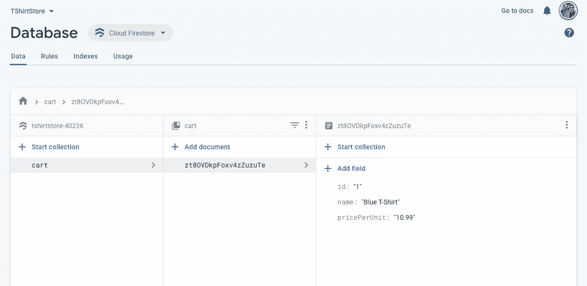
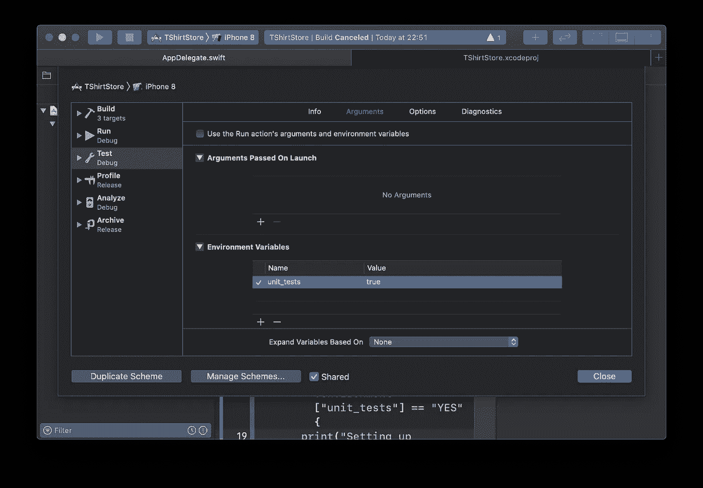

# 如何在 iOS/macOS 应用中对 Firebase Firestore 进行单元测试？

> 原文：<https://betterprogramming.pub/easy-unit-testing-for-firebase-in-xcode-874842f79d84>

## 利用 Firebase 模拟器

作者照片。

# 目的

你是否在你的 iOS 应用中使用 Firebase，并在与 Firebase 相关的代码的单元测试中挣扎？如果是这样，那么你就找到了一篇完美的文章。请继续阅读！

# 先决条件

1.  您有一个用 Firebase SDK 配置的 Xcode 项目。如果没有，那么点击这个 [GitHub 链接](https://github.com/akshitzaveri/TShirtStore/tree/c252187b8dee2532525088850fe06cf6be1ba081)下载 Xcode 项目。
2.  你可以进入 Firebase 控制台。如果你没有，那么去 [Firebase 控制台](https://console.firebase.google.com/)并遵循[iOS 入门](https://firebase.google.com/docs/ios/setup)指南。
3.  您已经在开发机器上配置了 Firebase 模拟器，并且模拟器正在运行。如果你还没有，那么看看我之前关于这个话题的文章。

# 更新 GoogleService-Info.plist

请确保下载 Firebase 项目的`GoogleService-Info.plist`,并用 Xcode 项目中现有的替换它。

# 验证 iOS 应用程序

请验证您的 iOS 应用程序是否正确连接到 Firebase，并按照我们希望的方式插入数据。如果您下载了我上面链接的代码并运行它，您应该能够在模拟器中看到:

只要您点击“添加到购物车”按钮，您就应该能够看到插入 Firestore 的数据:

如果您已经验证了上述所有内容，那么让我们继续配置 Xcode 项目。

# 配置 Xcode 项目

如果您没有配置 Firebase 的 Xcode 项目，那么[下载示例](https://github.com/akshitzaveri/TShirtStore/tree/c252187b8dee2532525088850fe06cf6be1ba081)。

请确保将 Firebase 项目的`GoogleService-Info.plist`添加到项目中，替换现有的项目。

如果您使用附带的`GoogleService-Info.plist`，它可能已经节流，所以它可能不会工作。

在`ViewModelTests.swift`中写了几个测试。运行这些程序，您应该会看到它在 Firebase 控制台中向 Firestore 添加数据。

太好了。现在我们已经验证了我们的代码已经设置好了，可以开始运行了，让我们将 Firebase 模拟器配置到 Xcode 中。

打开`AppDelegate.swift`，在`FirebaseApp.configure()`后添加此代码:

仅为测试设置 Firebase 本地仿真器连接。

上面的代码正在更新 Firestore 设置，以连接部署在 localhost:8080 上的 Firestore 模拟器。

你会注意到我们使用了`unit_tests`键，我们要求`ProcessInfo`提供这个键。这将告诉我们是否正在运行测试或真正的代码。这样，我们可以将 Firebase 模拟器连接配置为仅用于测试的`localhost`。

查看下面的截图，了解我们是如何设置的:

编辑方案->测试->环境变量->单元测试->真。

现在，关掉网络，然后再次运行测试。测试还是会通过的。这意味着成功了！如果它不起作用，首先检查模拟器是否在您的本地机器上运行。

不要忘记让模拟器在后台运行。如果模拟器没有运行，那么`localhost`设置可能会被忽略，您的测试可能会连接到生产数据库。

让我们通过验证购物车是否真的更新了我们首先插入的产品，将测试带到下一个层次。

## 更新扩展产品:FirebaseConvertable

扩展产品:FirebaseConvertable

这里，我们添加了一个失败的初始化器，它将接受一个字典(Firebase 文档格式)并从中创建一个产品对象。

## 更新 ViewModel.swift

ViewModel.swift

这里，我们添加了一个从购物车中获取所有产品的函数。

## 更新 ViewModelTests.swift

ViewModelTests.swift

这里，我们用`getProductsFromCart`检查更新现有的测试，并将`test_WhenProductIsNotNilAndAddToCartIsCalled_ThenItReturnsSuccess`重命名为`test_WhenProductIsNotNilAndAddToCartIsCalled_ThenTheProductIsAdded` *。*

现在，进行测试。那应该是成功的。我们到此为止。嗯……我不想告诉你，但是我们还没完。再次运行测试。惊喜？失败了。为什么？错误应该类似于“products.count 与 1 不完全匹配”

看起来 Firestore 在我们的测试之间保存数据。因此，每次我们运行测试时，购物车都会增加一个产品，数量也会增加一。试试看。

Firestore 仅在从终端停止模拟器时自动清除数据库。所以如果你关闭终端，Firestore 的数据就会被清空。但是等等，不要关闭终端。我们有更好的选择。

我们如何确保 Firestore 在每次测试中自动成为一张白纸？

## XCTestCase+Firestore.swift

将以下文件添加到 Xcode 项目的`Test`目标中:

XCTestCase+Firestore.swift

## 它是做什么的？

它对整个数据库调用删除操作，并使用信号量等待操作完成。因此，在删除请求完成之前，我们的测试不会退出。

我们还需要添加“应用传输安全设置”,因为我们将使用不太安全的 HTTP 协议。

## 更新 ViewModelTests.swift

将下面一行添加到`tearDown()`或`tearDownWithError()`函数中。我喜欢把它加在`tearDown`里面，因为清空 Firestore 看起来像是一次清理行动。

现在，再次运行测试，您将看到相同的错误。但是这一次，我们的`clearStore()`函数将被`tearDown()`调用，这将清空 Firestore 数据库。让我们再运行一次测试来验证这一点。测试通过！现在，多次运行测试。它永远不会失败！

# 结论

在本文中，我们看到了如何成功地使用 Firebase 本地仿真器套件来加速单元测试并避免弄乱生产数据。

感谢您的阅读。如果你有任何问题，请让我知道。