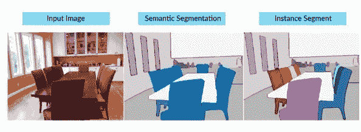
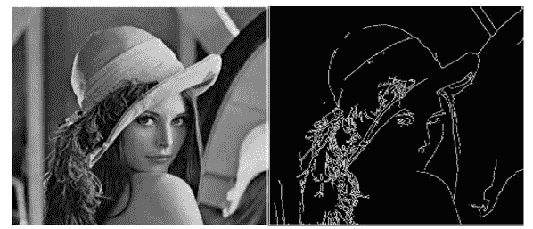
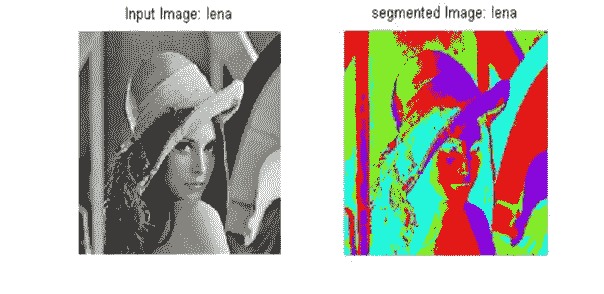
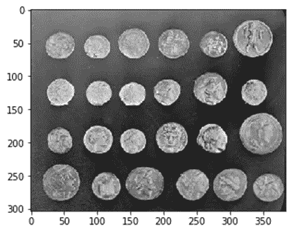
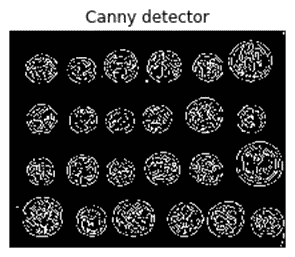
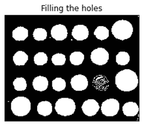

# 使用 Python 实现基于边缘和基于区域的分割

> 原文：<https://betterprogramming.pub/edge-based-and-region-based-segmentation-using-python-f5364607bff0>

## 图像处理的图像库

Patrick 在 [Unsplash](https://unsplash.com?utm_source=medium&utm_medium=referral) 上拍摄的照片。

在本文中，我想重点介绍基于边缘和基于区域的分割技术。在进入细节之前，我们需要了解什么是分段以及它是如何工作的。

# ***分割***

图像分割是一种将数字图像分割成各种图像对象的技术。

区域(图像对象)中的每个像素在某些属性方面是相似的，例如颜色、强度、位置或纹理，这可以降低图像的复杂性，以便于分析。

在分割的帮助下，隐藏信息也可以从图像中检测出来。

分割算法基于图像的两个基本属性:

*   强度值，如不连续性(边界方法)
*   相似性(区域方法)

在下图中，我们有一个以椅子、桌子、窗户等为特征的图像。我们可以在分割的帮助下分别得到这些对象。中间的图像有一把椅子、一张桌子和一扇窗户作为我们的分割图像对象。在最右边的图像中，通过标记图像对象来使用实例分割。

在 Python 的机器学习到来之后，分割变得非常容易。

来源:[堆栈交换](http://stackexchange.com)

# ***需要对图像进行分割***

将一幅图像分割成不同的图像对象，从中提取信息，然后进行标记，用于训练各种 ML 模型来解决业务问题。

一个例子是在分段的帮助下自动标记出席的面部识别系统。

分割的另一个应用是在医学领域中，用于在检测像肿瘤、癌症等严重疾病之后进行有效和快速的诊断。并且还用于观察由放射照相术、MRI、热成像、内窥镜检查、细胞和组织的超声波检查产生的医学图像中的图案。

图像分割在机器人等领域也有巨大的应用。

图像分类是分割的流行应用之一，其中算法能够从图像中仅捕获所需的成分。为了快速获得结果，在 Python 中实现图像分割很容易执行。

# ***基于边缘的分割***

在这种方法中，区域的边界彼此之间以及与背景之间有足够的差异，允许基于强度(灰度级)的局部不连续性进行边界检测。

换句话说，它是在图像中定位边缘的过程。这是理解图像特征的非常重要的一步，因为我们知道边缘由有意义的特征组成，并且具有重要的信息。

来源:[研究之门](http://researchgate.net)

# ***基于区域的分割***

这种方法包括根据一组特定的标准将图像分割成相似的区域。

基于区域的分割技术涉及一种算法，该算法通过将图像分成具有相似像素特征的各种成分来制作片段。这种技术在输入图像中搜索小块或大块，用于分割目的。

它或者将更多的像素添加到所选择的块中，或者进一步将块点减少成更小的片段，并将它们与其他更小的块点合并。因此，在这种方法的基础上还有两种更基本的技术:区域生长和区域合并与分裂。

来源:[研究之门](http://researchgate.net)

# ***细分的主要应用***

*   严重疾病的检测
*   面部识别系统
*   无人驾驶汽车
*   机器人学

 [## Python 图像处理中的预处理技术

### OpenCV 下的图像处理技术

pub.towardsai.net](https://pub.towardsai.net/pre-processing-techniques-in-image-processing-with-python-81e5c8babf09)  [## 第二部分 Python 图像处理中的预处理技术

### OpenCV 下的图像处理技术

pub.towardsai.net](https://pub.towardsai.net/part-ii-pre-processing-techniques-in-image-processing-with-python-17fb628453ff) 

# ***Python 实现***

作者照片

## **基于边缘的分割**

在这段代码中，我们使用 canny 库，这是一种流行的边缘检测算法，用于检测输入图像的边缘。

作者照片。

通过设置有效对象的最小大小，可以轻松移除小的虚假对象:

我们使用`ndimage as ndi`，这意味着一个 *n* 维图像，它是一个子模块，处理图像处理操作，如输入、输出、裁剪、过滤等。

`Ndi.binary_fill_holes`用于填充与边界相连的 *n* 维二元数组孔洞和入侵孔洞。

作者照片。

## **基于区域的分割**

这里，我们从`skimage.filters`引入 sobel 模块，用于在输入图像中寻找边缘。

`Sobel transform`还帮助我们找到输入图像中的垂直和水平边缘。

作者照片。

# ***结论***

本文通过 Python 实现详细解释了分割及其两种重要技术(基于边缘的分割和基于区域的分割)。

我希望你喜欢这篇文章。

我希望你喜欢这篇文章。通过我的 [LinkedIn](https://www.linkedin.com/in/data-scientist-95040a1ab/) 和 [twitter](https://twitter.com/amitprius) 联系我。

# 推荐文章

*   [NLP——用 Python 零到英雄](https://medium.com/towards-artificial-intelligence/nlp-zero-to-hero-with-python-2df6fcebff6e?sk=2231d868766e96b13d1e9d7db6064df1)
*   [Python 数据结构数据类型和对象](https://medium.com/towards-artificial-intelligence/python-data-structures-data-types-and-objects-244d0a86c3cf?sk=42f4b462499f3fc3a160b21e2c94dba6)
*   [Python 中的异常处理概念](https://pub.towardsai.net/exception-handling-concepts-in-python-4d5116decac3?source=friends_link&sk=a0ed49d9fdeaa67925eac34ecb55ea30)
*   [为什么 LSTM 在深度学习方面比 RNN 更有用？](https://pub.towardsai.net/deep-learning-88e218b74a14?source=friends_link&sk=540bf9088d31859d50dbddab7524ba35)
*   [神经网络:递归神经网络的兴起](https://pub.towardsai.net/neural-networks-the-rise-of-recurrent-neural-networks-df740252da88?source=friends_link&sk=6844935e3de14e478ce00f0b22e419eb)
*   [用 Python 全面解释线性回归](https://medium.com/towards-artificial-intelligence/fully-explained-linear-regression-with-python-fe2b313f32f3?source=friends_link&sk=53c91a2a51347ec2d93f8222c0e06402)
*   [用 Python 全面解释逻辑回归](https://medium.com/towards-artificial-intelligence/fully-explained-logistic-regression-with-python-f4a16413ddcd?source=friends_link&sk=528181f15a44e48ea38fdd9579241a78)
*   [Python 中 concat()、merge()和 join()的区别](https://pub.towardsai.net/differences-between-concat-merge-and-join-with-python-1a6541abc08d?source=friends_link&sk=3b37b694fb90db16275059ea752fc16a)
*   [与 Python 的数据争论—第 1 部分](https://pub.towardsai.net/data-wrangling-with-python-part-1-969e3cc81d69?source=friends_link&sk=9c3649cf20f31a5c9ead51c50c89ba0b)
*   [机器学习中的混淆矩阵](https://medium.com/analytics-vidhya/confusion-matrix-in-machine-learning-91b6e2b3f9af?source=friends_link&sk=11c6531da0bab7b504d518d02746d4cc)