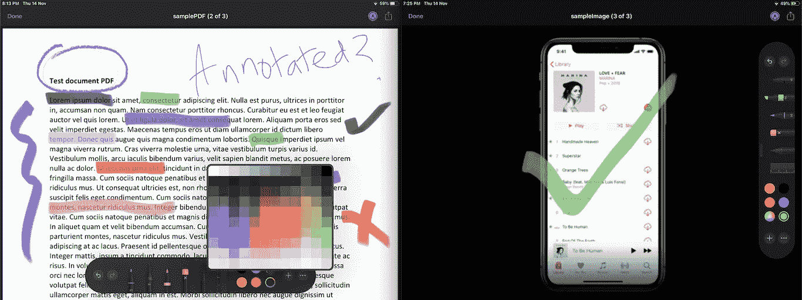
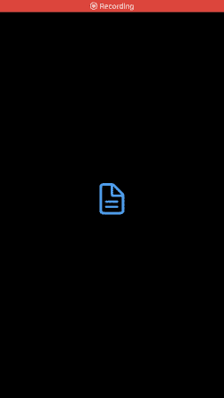

# 在 iOS 13 中使用快速查看来编辑 pdf、图像和视频

> 原文：<https://betterprogramming.pub/edit-pdfs-images-and-videos-using-quick-look-in-ios-13-ad2131080587>

## `The QuickLook framework introduced an editing mode`


由[未绘制的插图](https://undraw.co/search)

作为 iOS 中不太为人所知的瑰宝之一，Quick Look 框架对于在应用程序中预览文档非常有用。在 WWDC 2019 期间，随着编辑模式的引入，该框架得到了很好的升级。

`QLPreviewController`是负责在视图控制器中呈现不同类型内容的控制器。目前，它支持图像、视频、pdf、CSV 和 iWork 文件类型。

`QLPreviewItemEditingMode`是该框架的新成员，它允许我们轻松地对图像和 pdf 进行注释，并对视频进行修剪或转换。

`QLPreviewItemEditingMode`嵌入 [PencilKit](https://medium.com/better-programming/an-introduction-to-pencilkit-in-ios-4d40aa62ba5b) 框架，用于编辑图像和 pdf。

# 我们的目标

*   探索快速查看框架中的新增功能
*   构建使用 Quick Look 编辑文档的 iOS 应用程序
*   使用`FileManager`将编辑好的文档保存在文档目录中

## 最终目的地

在这篇文章结束时，我们将能够编辑和保存图像、视频和 pdf，如下所示:



未来的一瞥

# iOS 13 QuickLook 有什么新功能？

除了增加`QLPreviewItemEditingMode`之外，`QLPreviewControllerDelegate`协议还引入了三个新的可选委托方法。

## 处理编辑模式功能

我们可以通过实现以下方法来处理编辑模式:

```
optional func previewController(_ controller: QLPreviewController, **editingModeFor** previewItem: QLPreviewItem) -> QLPreviewItemEditingMode
```

在上述方法中，我们可以将返回类型设置为`createCopy`、`default`或`updateContents`来相应地处理编辑结果。`updateContents`覆盖`FileManager`中 QLPreviewItems 的内容。默认情况下，编辑模式是关闭的。

## 保存编辑的内容

编辑完成后，我们可以使用以下可选方法保存修改后的内容:

```
func previewController(_ controller: QLPreviewController, didSaveEditedCopyOf previewItem: QLPreviewItem, at modifiedContentsURL: URL)
```

当`EditingMode`为`createsCopy`时，上述方法被触发。它返回修改内容的 URL(内容驻留在一个临时位置)。然后，我们可以选择处理 URL 并将其保存在`FileManager`中。

## 通知已编辑的内容

我们可以选择在得到成功更新 QLPreviewItem 的通知后更新用户界面。当编辑模式为`updatesContent`时触发:

```
func previewController(_ controller: QLPreviewController, didUpdateContentsOf previewItem: QLPreviewItem)
```

在下一节中，我们将创建一个简单的 iOS 应用程序，它使用源代码中提供的示例图像、视频和 PDF 来调用快速预览。只需在您的 ViewController 中输入`import QuickLook`即可开始。

# 设置 QLPreviewController

以下代码用于在我们的应用程序的 view controller 中显示快速查看预览控制器，并启用编辑模式:

```
@objc func onButtonClick(sender: UIButton){

        let previewController = QLPreviewController()
        previewController.dataSource = self
        previewController.delegate = self
 **previewController.setEditing(true, animated: true)**
        self.present(previewController, animated: true, completion: nil)
}
```

接下来，您需要遵循`QLPreviewControllerDelegate`、`QLPreviewControllerDataSource`协议，并在您的类中实现委托函数。

# 设置我们的数据源

对于数据源，我们已经设置了一个文件名文字数组，用于显示如下所示的`QLPreviewItems`:

```
var items : [String] = ["sampleVideo.mp4", "samplePDF.pdf", "sampleImage.png"]
```

接下来，我们需要实现数据源协议方法，以便显示`QLPreviewItems`。下面的代码负责显示`QLPreviewItems`中的数据源文件:

```
extension ViewController: QLPreviewControllerDataSource {
    func numberOfPreviewItems(in controller: QLPreviewController) -> Int {
        return items.count
    }

    func previewController(_ controller: QLPreviewController, previewItemAt index: Int) -> QLPreviewItem {

        print(controller.isEditing)

        let name = self.items[index]
        let file = name.components(separatedBy: ".")
        let path = Bundle.main.path(forResource: file.first!, ofType: file.last!)
        let url = NSURL(fileURLWithPath: path!)
        return url as QLPreviewItem
    }
}
```

# 保存更新的内容

最后，我们将添加可选的委托功能，以便使用`FileManager`将编辑的内容保存为副本:

在上面的代码中，我们使用`modifiedContentsURL`检索文件路径。使用文件管理器，我们将编辑后的文件保存到应用程序的文档目录中。

结果，我们得到了下面的应用程序并开始运行！



我们已经使用新的 [iOS 13 系统符号](https://medium.com/better-programming/ios-13-context-menus-and-sf-symbols-a03b032fe330)设置了我们的按钮。

# 结论

因此，我们探索了在 2019 年 WWDC 奥运会期间很大程度上被忽视的小宝石。快速查看编辑模式是一个有趣的特性，因为它允许我们使用内置的 PencilKit 框架在应用程序中快速注释 pdf。完整的源代码可以在 [Github 资源库](https://github.com/anupamchugh/iowncode/tree/master/iOS13QuickLook)中找到。

这一次到此为止。我希望你喜欢阅读。