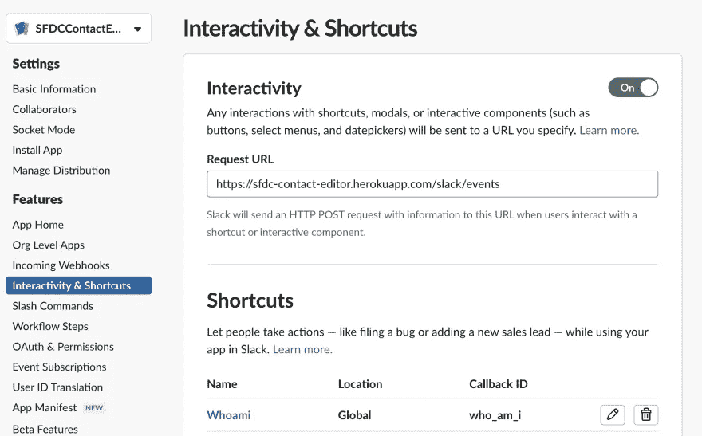
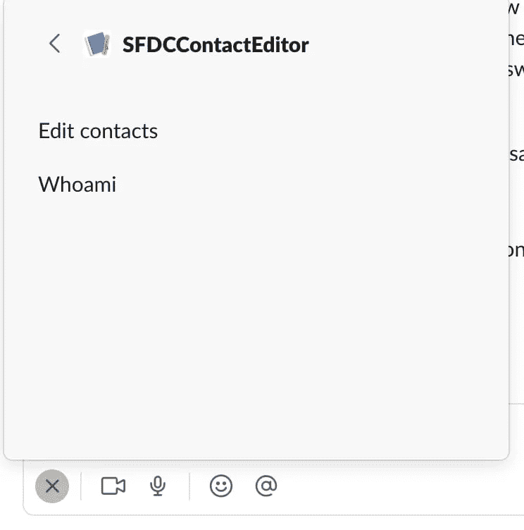
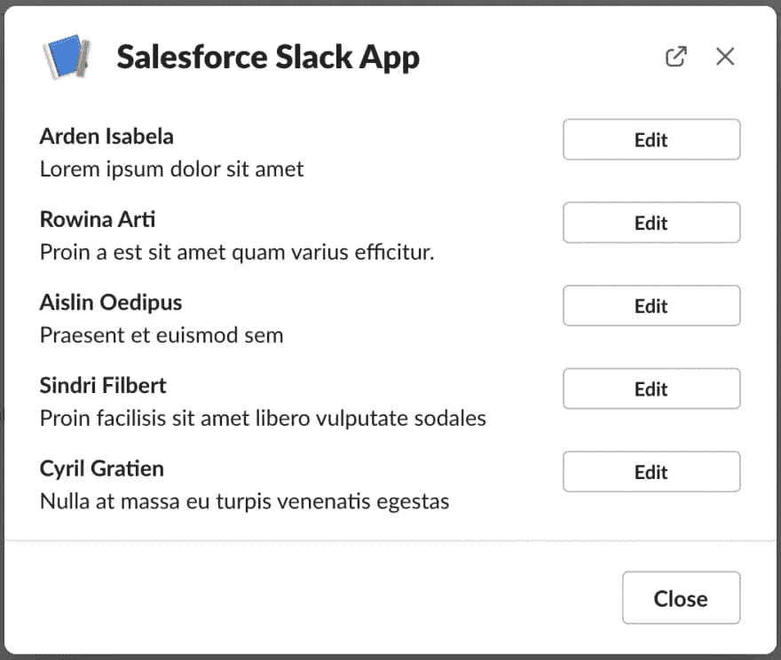
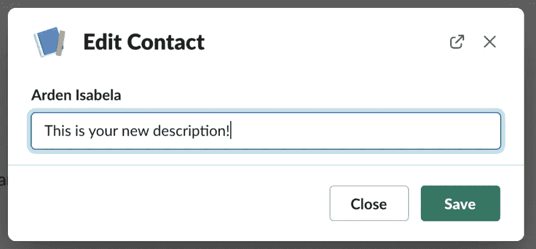

# 完全在您的 Slack 应用程序中编辑 Salesforce 数据

> 原文：<https://betterprogramming.pub/edit-salesforce-data-entirely-within-your-slack-app-5cee81a92f9a>

## 第 3 部分:同步数据— Salesforce 符合 Slack


埃德加·莫兰在 [Unsplash](https://unsplash.com/s/photos/salesforce?utm_source=unsplash&utm_medium=referral&utm_content=creditCopyText) 上的照片

最后，我们已经到了使用 Salesforce 的 [Slack 入门套件](https://github.com/developerforce/salesforce-slack-starter-kit)快速搭建与 Salesforce 数据交互的可部署 Slack 应用程序系列的最后一部分。Slack Starter Kit 使得通过 Salesforce 进行身份验证、将您的代码组织成可重用的块以及将项目部署到 Heroku 以便实时访问变得非常容易。我们这个系列很大程度上基于这些视频教程，展示了如何构建 Slack 应用程序。

[在我们的第一篇文章](/building-a-slack-app-with-native-sfdc-integration-bc91050d063e)中，我们熟悉了 Slack 入门套件并设置了我们的开发环境。[在我们的第二篇文章](/building-a-slack-app-with-native-sfdc-integration-1b2dee945650)中，我们的 Slack 应用程序发出了一个从 Salesforce 组织获取数据的查询，然后使用 Block Kit 中的 UI 组件显示结果。现在，我们将扩展该模式，展示如何在 Slack 中完全编辑 Salesforce 数据。我们开始吧！

# 创建快捷方式

在 Block Kit UI 之外，Slack 还支持另外两个交互系统:[斜杠命令](https://api.slack.com/interactivity/slash-commands)和[快捷键](https://api.slack.com/interactivity/shortcuts/)。斜线命令由用户在 Slack 的文本输入中输入(每个频道都有)，而快捷方式本质上是图形化的。因为它们更容易可视化，我们将通过创建一个快捷方式来演示快捷方式，该快捷方式将获取我们的联系人列表，并使我们能够编辑它们。

添加快捷方式(或者斜杠命令)首先需要告诉 Slack 命令的名称。转到 Slack 上的应用概述页面，然后单击**交互性&快捷方式**:



点击**新建快捷方式**，选择**全局**作为快捷方式类型，然后点击**下一步**。在下一页上，输入这些值:

*   **姓名**:编辑联系人
*   **简短描述**:编辑 SFDC 上的联系人
*   **回拨 ID** : `edit-contact-shortcut`

点击**创建**，然后点击**保存更改**。切换到您的松弛工作区，并单击文本区域中的加号。您将能够浏览所有工作区快捷方式。在这里，您还会看到刚刚创建的全新快捷方式:



这个快捷方式还不做任何事情，但是这个过程对于 Slack 了解你的快捷方式是必要的。接下来，让我们添加代码来处理每当有人单击该快捷方式时触发的事件。

# 给捷径布线

在您的代码编辑器中，导航到`apps/slack-salesforce-starter-app/listeners/shortcuts/index.js`。这是我们将快捷方式事件与执行的代码联系起来的地方。初学者工具包已经给了我们一个快捷方式:`whoami`。给定的行向我们建议我们需要做什么:我们调用一个名为`shortcut`的函数，并传入一个字符串和一个函数名。在这种情况下，我们的字符串是我们之前定义的回调 ID，我们的函数名是我们尚未编写的代码。将文件内容更改为如下所示:

```
const { whoamiCallback } = require('./whoami');
const { editContactCallback } = require('./edit-contact');module.exports.register = (app) => {
   app.shortcut('who_am_i', whoamiCallback);
   app.shortcut('edit-contact-shortcut', editContactCallback);
};
```

我们在这里打好基础，说:“ *Slack App，如果你得到一个回调 ID 为* `*edit-contact-shortcut*` *的快捷方式，运行* `*editContactCallback*`。”

在同一个文件夹中，创建一个名为`edit-contact.js`的文件，并将这些行粘贴到其中:

```
'use strict';const {
  editContactResponse,
  authorize_sf_prompt
} = require('../../user-interface/modals');const editContactCallback = async ({ shortcut, ack, client, context }) => {
  try {
    await ack();
    if (context.hasAuthorized) {
      const conn = context.sfconnection;
      await client.views.open({
        trigger_id: shortcut.trigger_id,
        view: await editContactResponse(conn)
      });
    } else {
      // Get BotInfo
      const botInfo = await client.bots.info({ bot: context.botId });
      // Open a Modal with message to navigate to App Home for authorization
      await client.views.open({
        trigger_id: shortcut.trigger_id,
        view: authorize_sf_prompt(context.teamId, botInfo.bot.app_id)
      });
    }
  } catch (error) {
    // eslint-disable-next-line no-console
    console.error(error);
  }
};module.exports = { editContactCallback };
```

现在，这可能看起来有点吓人，但它主要是关于验证样板文件，确保用户有一个活动的 SFDC 连接。在第一个逻辑路径中(如果`context.hasAuthorized`是`true`，我们执行一个名为`editContactResponse`的函数，它接受我们的 open Salesforce `conn`部分。在否定的情况下，我们要求用户转到 Home 选项卡重新进行身份验证，就像我们在本教程的第 1 部分中所做的那样。

导航到`apps/slack-salesforce-starter-app/user-interface/modals`文件夹，创建一个名为`edit-contact-response.js`的文件。这里，我们将弹出一个带有联系信息的模式，类似于我们在本教程第 2 部分的 Home 选项卡中看到的行:

```
'use strict';
const { Elements, Modal, Blocks } = require('slack-block-builder');const editContactResponse = async (conn) => {
  const result = await conn.query(
    `Select Id, Name, Description FROM Contact`
  );
  let records = result.records; let blockCollection = records.map((record) => {
    return Blocks.Section({
      text: `*${record.Name}*\n${record.Description}`
    }).accessory(
      Elements.Button()
        .text(`Edit`)
        .actionId(`edit_contact`)
        .value(record.Id)
    );
  }); return Modal({ title: 'Salesforce Slack App', close: 'Close' })
    .blocks(blockCollection)
    .buildToJSON();
};module.exports = { editContactResponse };
```

第 2 部分中的代码和这个块的主要区别在于，我们使用了一个名为`blockCollection`的数组，它允许我们构造一个块数组(在本例中是 Section 块)。`blocks`知道如何获取这个数组并将其转换成 Slack 理解的格式，这使得通过循环数组创建数据变得非常简单，就像我们在这里所做的那样。在本系列的第 2 部分中，我们构建了一个巨大的数据串。然而，通过使用`BlockCollection`，我们可以附加其他松散的元素——比如按钮——我们已经在这里完成了。

最后，在`apps/slack-salesforce-starter-app/user-interface/modals/index.js`中，我们需要导出这个函数，这样它就可以被我们的`edit-contact.js`函数导入:

```
'use strict';
const { whoamiresponse } = require('./whoami-response');
const { editContactResponse } = require('./edit-contact-response');
const { authorize_sf_prompt } = require('./authorize-sf-prompt');module.exports = { whoamiresponse, editContactResponse, authorize_sf_prompt };
```

在通过 git push 将这个新代码部署到 Heroku 之后，切换到 Slack 工作区，尝试执行快捷方式；您将会看到一个类似如下的对话框:



# 更新 Salesforce 数据

我们能够获取并显示 Salesforce 数据。现在，是时候连接编辑按钮来更改 Salesforce 数据了！

Slack 的许多交互组件都有一个`[action_id](https://api.slack.com/interactivity/handling#payloads)`，和`callback_id`一样，用来识别用户操作的元素。就像初学者工具包中的其他东西一样，有一个特殊的目录，您可以在其中为这些动作 id 定义侦听器:`apps/slack-salesforce-starter-app/listeners/actions`。在那里的`index.js`文件中，让我们添加一个新行，将动作 ID 与我们尚未编写的功能联系在一起:

```
'use strict';
const { appHomeAuthorizeButtonCallback } = require('./app-home-authorize-btn');
const { editContactButtonCallback } = require('./edit-contact-btn');module.exports.register = (app) => {
  app.action('authorize-with-salesforce', appHomeAuthorizeButtonCallback);
  app.action('edit_contact', editContactButtonCallback);
};
```

在同一个文件夹中，创建一个名为`edit-contact-btn.js`的新文件，并将这些行粘贴到其中:

```
'use strict';
const {
  editIndividualContact,
  authorize_sf_prompt
} = require('../../user-interface/modals');const editContactButtonCallback = async ({ body, ack, client, context }) => {
  const contactId = body.actions[0].value;
  try {
    await ack();
  } catch (error) {
    // eslint-disable-next-line no-console
    console.error(error);
  } if (context.hasAuthorized) {
    const conn = context.sfconnection;
    const result = await conn.query(
      `SELECT Id, Name, Description FROM Contact WHERE Id='${contactId}'`
    );
    let record = result.records[0];
    await client.views.push({
      trigger_id: body.trigger_id,
      view: editIndividualContact(record)
    });
  } else {
    // Get BotInfo
    const botInfo = await client.bots.info({ bot: context.botId });
    // Open a Modal with message to navigate to App Home for authorization
    await client.views.push({
      trigger_id: body.trigger_id,
      view: authorize_sf_prompt(context.teamId, botInfo.bot.app_id)
    });
  }
};module.exports = { editContactButtonCallback };
```

这个文件的开头和结尾应该看起来很熟悉:我们正在向 Slack 发送一个`ack`响应，让它知道我们的应用程序收到了事件负载(在本例中，是通过单击编辑按钮)。我们还会检查我们是否仍然通过了身份验证。这里，我们使用联系人的 ID 进行单个 DB 查找，在构造 UI 时，我们将它作为一个值附加到编辑按钮上。

这段代码创建了另一个我们需要定义的模态设计。回到`apps/slack-salesforce-starter-app/user-interface/modals`，创建一个名为`edit-individual-contact.js`的文件，并将这些行粘贴到其中:

```
'use strict';
const { Elements, Modal, Blocks } = require('slack-block-builder');const editIndividualContact = (record) => {
  return Modal({ title: 'Edit Contact', close: 'Close' })
    .blocks(
      Blocks.Input({ blockId: 'description-block', label: record.Name }).element(
        Elements.TextInput({
          placeholder: record.Description,
          actionId: record.Id
        })
     )
   )
   .submit('Save')
   .callbackId('edit-individual')
   .buildToJSON();
};module.exports = { editIndividualContact };
```

这里，我们创建了一个只有一个块的模型:一个输入元素。该元素将预先填充联系人的描述。我们可以编辑这个块，并根据需要更改描述。

在这段代码中需要指出两个重要的注意事项:

1.  注意，我们将一个`actionId`附加到输入元素上。这类似于我们之前附加到编辑按钮上的 ID，只是这一次，它是基于我们正在编辑的记录的 ID 动态生成的。
2.  您还会注意到我们有另一个 ID，即`callbackID`，它附加到了模型本身。请记住这些 id 的存在:我们将在一会儿解决这两个问题。现在，打开同一个目录中的`index.js`文件，以及`require/export`这个新的模型创建函数:

```
const { editIndividualContact } = require('./edit-individual-contact');
// ...
module.exports = {
  whoamiresponse,
  editContactResponse,
  editIndividualContact,
  authorize_sf_prompt
};
```

现在，当您单击编辑按钮时，系统会提示您更改描述:



我们现在需要将更新后的文本发送给 Salesforce。点击**保存**按钮……无任何反应。为什么？Slack 有一套不同的事件来处理这样的交互，叫做[视图提交](https://api.slack.com/reference/interaction-payloads/views)。在构建应用程序时，初学者工具包提供了一个很好的出发点，但它不能处理每个松散的用例，包括这个。但这不是问题——我们将自己添加功能！

在`apps/slack-salesforce-starter-app/user-interface folder`中，创建一个名为`views`的新文件夹。就像之前一样，我们这里的**保存**按钮有一个动作 ID 来标识它:`edit-individual-contact`。我们将回到`apps/slack-salesforce-starter-app/listeners/actions/index.js`来配置这个函数:

```
const { editIndividualButtonCallback } = require('./edit-individual-btn);// ... app.action('edit-individual-contact', editIndividualButtonCallback);
```

创建一个名为`edit-individual-contact.js`的新文件，并将这些行粘贴到其中:

```
'use strict';const { submitEditCallback } = require('./submit-edit');module.exports.register = (app) => {
  app.view('edit-individual', submitEditCallback);
};
```

这种格式与 Slack 初学者工具包提供的其他侦听器相同。唯一的区别是我们调用了`view`方法。我们还需要将这个侦听器和其他侦听器一起注册。打开`apps/slack-salesforce-starter-app/listeners/index.js`，和`require/register`新的视图监听器:

```
const viewListener = require('./views');module.exports.registerListeners = (app) => {
  // ...
  viewListener.register(app);
};
```

接下来，在`apps/slack-salesforce-starter-app/listeners/views`中，创建另一个名为`submit-edit.js`的文件，并将这些行粘贴到其中:

```
'use strict';
const { editContactResponse, authorize_sf_prompt } = require('../../user-interface/modals');const submitEditCallback = async ({ view, ack, client, context }) => {
  try {
    await ack();
  } catch (error) {
    // eslint-disable-next-line no-console
    console.error(error);
  } if (context.hasAuthorized) {
    const contactId = view.blocks[0].element.action_id;
    const newDescription =
      view.state.values['description-block'][contactId].value;
    const conn = context.sfconnection;
    await conn.sobject('Contact').update({
      Id: contactId,
      Description: newDescription
    }); await client.views.open({
      trigger_id: view.trigger_id,
      view: await editContactResponse(conn)
    });
  } else {
    // Get BotInfo
    const botInfo = await client.bots.info({ bot: context.botId });
    // Open a Modal with message to navigate to App Home for authorization
    await client.views.push({
      trigger_id: view.trigger_id,
       view: authorize_sf_prompt(context.teamId, botInfo.bot.app_id)
    });
  }
};module.exports = { submitEditCallback };
```

我们来讨论一下之前设置的那些 id。当 Slack 将事件有效负载发送到我们的应用程序时，默认情况下，它会自动为每个输入元素生成一个 ID。那是因为 Slack 不知道底层数据*是什么*。通过动作 id 命名元素是您的责任。Slack 使用这些 id 作为密钥来填充有效负载。当您收到 Slack 的有效负载时，您可以使用您提供的键来解析用户输入的数据。

现在，如果您按照流程编辑您的联系人的描述，您会注意到模式将正确保存。要验证 Salesforce 端的数据是否已更新，请在您的终端中运行`sfdx force:org:open`并导航到 Contacts 选项卡。

# 结论

Slack Starter Kit 使得构建一个监听用户事件的 Slack 应用程序变得轻而易举。然而，除此之外，与 Salesforce 和 Heroku 互动也是一种绝对的乐趣。我们已经介绍了初学者工具包的所有功能。如果您想了解 Slack 和 Salesforce 如何合作，请查看我们在 [building better together](https://developer.salesforce.com/blogs/2021/11/slack-and-salesforce-building-better-together) 上的博文。此外，与 Salesforce 交互的后端框架是精彩的 [JSforce](https://jsforce.github.io/) 项目。请务必查看其文档和[sales force API 参考](https://developer.salesforce.com/docs/apis)以了解更多关于您可以构建的内容！