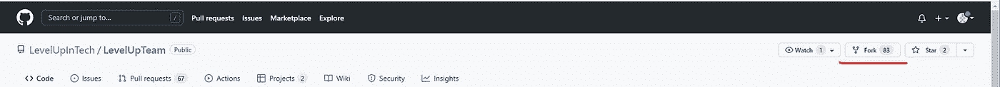
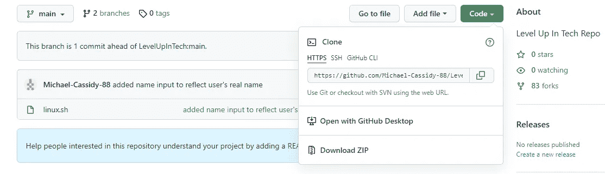
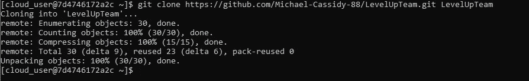
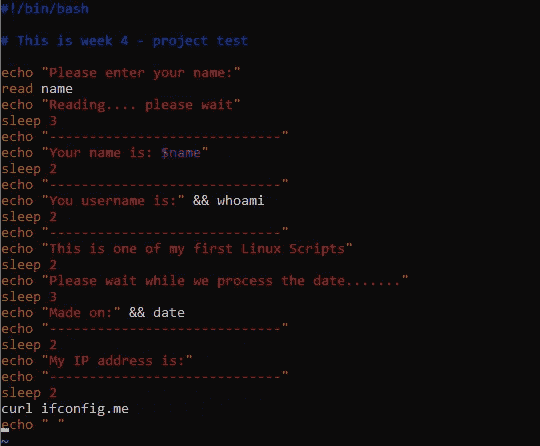
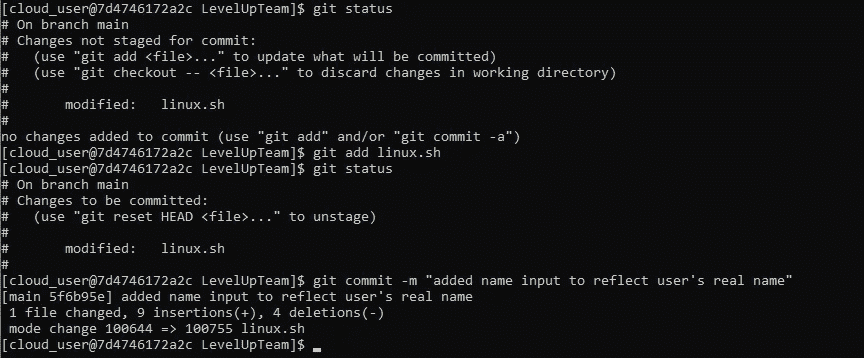
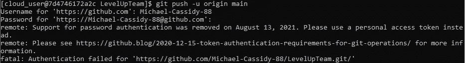
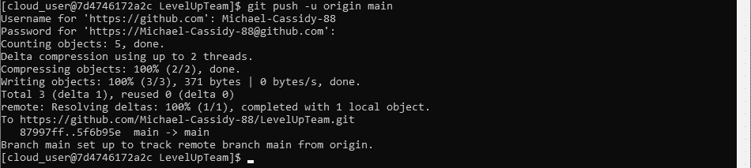
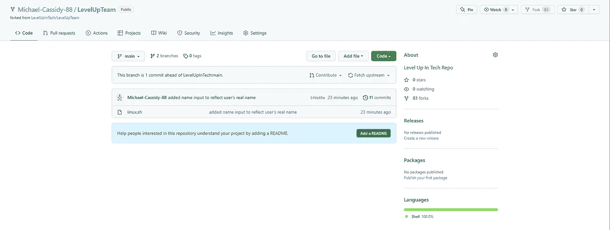
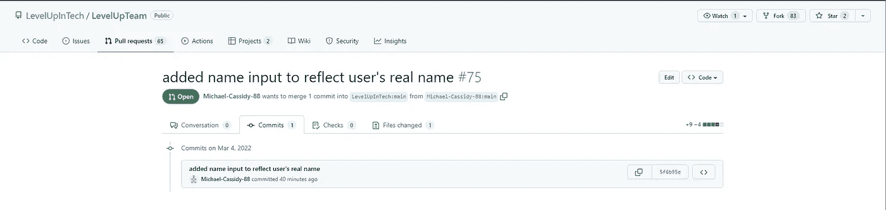
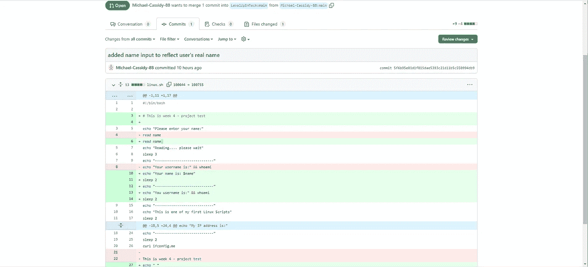

# 使用 GitHub 编辑分叉回购

> 原文：<https://betterprogramming.pub/editing-a-forked-repo-using-github-d5fa49f840d0>

## 并且知道如何有效地使用 Git


亚历克斯·康德拉蒂耶夫在 [Unsplash](https://unsplash.com?utm_source=medium&utm_medium=referral) 上的照片

如果你想从 GitHub 编辑一个库，你需要以下东西:

*   GitHub 帐户
*   GitHub“开发者设置”部分下的个人访问令牌
*   CLI(我将使用 CentOS 7)
*   Git 已安装和配置

检查服务器的任何更新:

```
sudo yum update
```

**第一步。**选择你想要的仓库。在本例中，我将使用以下网址的技术回购级别:

```
[https://github.com/LevelUpInTech/LevelUpTeam](https://github.com/LevelUpInTech/LevelUpTeam)
```

确保您点击 GitHub 网站右上角的分叉图标，以便分叉回购。



**第二步。对你来说，这可能是第一步，但是如果你还没有，确保在你的服务器上安装 Git。这可以通过以下命令完成:**

```
sudo yum install git
```

如果您使用的是基于 Debian 的发行版，比如 Ubuntu，您可以使用以下命令:

```
sudo apt-get install git
```

Git 成功安装后，您将需要使用以下命令对其进行配置:

```
git config --global user.name <username>  
git config --global user.email <email_address>
```

这样，配置文件将存储诸如您的用户名、默认编辑器以及您希望与您的提交相关联的电子邮件等信息。

对于这个项目，我使用 vim 来编辑存储库。要使 vim 成为您的默认编辑器，请使用以下命令:

```
git config --system core.editor vim
```

**第三步。在您派生出回购协议之后，您应该能够复制新的 HTTPS 来将派生克隆到您的本地服务器中。**



**第四步。**在 CLI 中使用以下命令克隆存储库:

```
git clone https://github.com/username/reponame <local_repo_path>
```

在我的例子中，命令是:

```
git clone https://github.com/Michael-Cassidy-88/LevelUpTeam.git LevelUpTeam
```



如您所见，我在我的主目录中创建了一个克隆。如果您愿意，可以预先创建另一个目录来存储克隆的回购协议。

**第五步。**使用以下命令将目录更改为新克隆的存储库:

```
cd <local_repo_path>
```

**第六步。**一旦进入克隆的回购程序，您就可以浏览这些文件。在我的例子中，我将使用 vim 编辑一个 linux.sh 脚本。



脚本已编辑

**第七步。**编辑完脚本后，退出 vim (:wq)并将新保存的脚本添加到本地存储库中。如您所见，我通过输入以下命令来检查状态:

```
git status
```



准备好添加修改后的文件后，输入以下内容:

```
git add <name_of_script>
```

要提交这些更改，请输入:

```
git commit -m "some info about what you did to the script"
```

你需要添加评论，这样其他最终看到你回购的人就会知道你做了什么。

**第八步。**把文件推回自己的 GitHub repo。为此，请使用以下命令:

```
git push -u origin main
```

当您在中输入时，系统会提示您输入您的 GitHub 用户名和密码。确保使用来自 GitHub 的个人访问令牌作为密码。如果您不使用个人访问令牌，可能会收到此消息:



否则，它应该看起来像这样:



成功的

**第九步。**一旦你重新登录到你的 GitHub 账户，你将能够看到你推送到你的回购的新文件。



为了发送一个拉请求以与原始存储库合并，您将返回到主存储库，单击“拉请求”，然后创建一个新的拉请求。



您可以单击 commits 来查看您对原始脚本做了哪些更改，以及您要求主存储库的作者在主源代码中做了哪些更改。



现在，您等待您的 pull 请求被发布或拒绝。无论哪种方式，您都有希望学会如何使用 GitHub 和 Git 来编辑分叉的存储库。