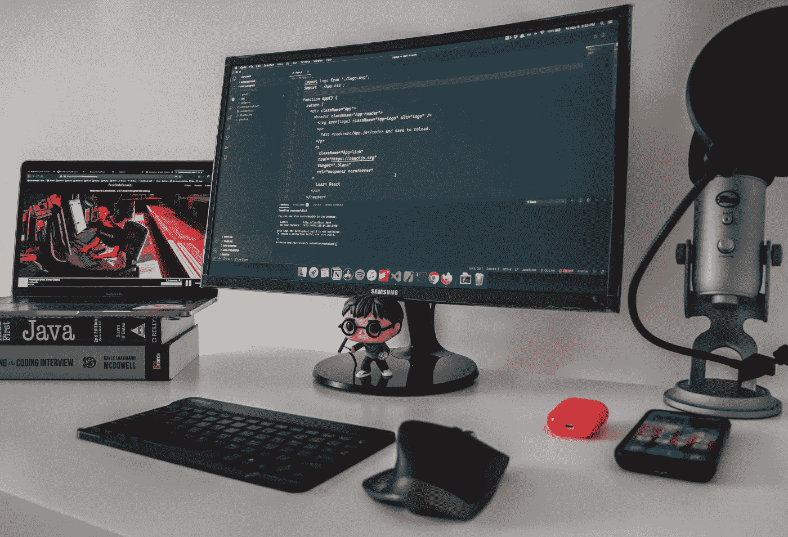

# 本周编辑精选(2021 年 4 月 10 日至 23 日)

> 原文：<https://betterprogramming.pub/editors-pick-of-the-week-april-10-23-2021-92c2e61ae711>

## 最近发表的关于更好编程的我最喜欢的文章

嘿大家好，

我们希望你们都度过了愉快的一周。在这篇更好的编程时事通讯中，我们从过去的两周中得到了一些有趣的故事来与您分享。有些是关于你最喜欢的编程语言的便利技巧和诀窍，而其他的则有我们的贡献者分享他们在软件行业的经验。别再浪费时间了，让我们开始吧。

Jac Alexandru 在 [Unsplash](https://unsplash.com/?utm_source=medium&utm_medium=referral) 上的照片。

## [在 JavaScript 中不要使用 If-Else 和 Switch，使用对象文字](/dont-use-if-else-and-switch-in-javascript-use-object-literals-c54578566ba0)

首先，[杰克·泰勒](https://medium.com/u/2b66cdc6a8bc?source=post_page-----92c2e61ae711--------------------------------)分享了他关于使用对象文字在 JavaScript 中编写更简洁的条件的两点看法。你认为它是 if-else 和 switch 语句的好的替代吗？评论区对此褒贬不一。

来自 [Pexels](https://www.pexels.com/photo/woman-using-her-laptop-while-having-a-conversation-over-the-phone-4050316/?utm_content=attributionCopyText&utm_medium=referral&utm_source=pexels) 的 [Vlada Karpovich](https://www.pexels.com/@vlada-karpovich?utm_content=attributionCopyText&utm_medium=referral&utm_source=pexels) 的照片。

## [你不必编码就能成为自由开发者——这里有 5 种不同的收入来源](/you-dont-have-to-code-to-be-a-freelance-developer-here-are-5-alternative-income-streams-ae8cc39d9778)

作为一名自由职业者，我知道这不全是闪闪发光的金子。工作时不时会在盛宴和饥荒的循环中到来，收入也不稳定。Fernando Doglio 揭示了一些不直接涉及编码的编程赚钱的方法。看看吧！

[@fatosi](https://unsplash.com/@fatosi) 在 [Unsplash](https://unsplash.com/) 上的照片。

## [我希望在开始我的开发者生涯之前就知道的 10 件事](/10-things-i-wish-i-had-known-before-starting-my-developer-career-d13e99a47a7e)

在成为软件开发人员之前，我们都很兴奋。有时候，这种兴奋战胜了我们，我们犯了错误。[比安卡·德拉戈米尔](https://medium.com/u/e6dea663e8ef?source=post_page-----92c2e61ae711--------------------------------)分享了她作为软件开发人员工作两年后的经历。“除非明确要求你加班，否则你不应该加班”是她学到的教训之一*。*

照片由[卢卡·布拉沃](https://unsplash.com/@lucabravo?utm_source=medium&utm_medium=referral)在 [Unsplash](https://unsplash.com/?utm_source=medium&utm_medium=referral) 上拍摄

## [Python 中的 5 种常见反模式](/5-common-anti-patterns-in-python-a9d6443fabe4)

Python 是一种流行的语言。然而，每种语言都有一定的反模式，这会导致低效的编程实践。 [Sayar Banerjee](https://medium.com/u/9c7b7e60ff?source=post_page-----92c2e61ae711--------------------------------) 分享了 Python 中的一些反模式，并向我们展示了修复它们的方法。

来自 [Pexels](https://www.pexels.com/photo/man-in-red-polo-shirt-thought-a-good-idea-3779432/?utm_content=attributionCopyText&utm_medium=referral&utm_source=pexels) 的 [Andrea Piacquadio](https://www.pexels.com/@olly?utm_content=attributionCopyText&utm_medium=referral&utm_source=pexels) 的照片

## [22 种最佳实践，让你的 API 设计技能更上一层楼](/22-best-practices-to-take-your-api-design-skills-to-the-next-level-65569b200b9)

设计一个 API 可能很棘手。穆罕默德·费萨尔(Mohammad Faisal)写下了一些你今天就可以开始采用的最佳实践。你可能会知道一些。但是有 22 个。我希望你能学到一些东西。

[engin akyurt](https://unsplash.com/@enginakyurt?utm_source=medium&utm_medium=referral) 在 [Unsplash](https://unsplash.com/?utm_source=medium&utm_medium=referral) 上拍照。

## [PHP 的“从不”返回类型](/the-never-return-type-for-php-802fbe2fa303)

PHP 还没有死。[伊塔洛·巴埃萨·卡布雷拉](https://medium.com/u/384ff2f05c19?source=post_page-----92c2e61ae711--------------------------------)让我们先来看看今年年底 PHP 8.1 中的新关键词`never`。看看它是如何融入您的代码的。

由[麦克斯韦·纳尔逊](https://unsplash.com/@maxcodes?utm_source=medium&utm_medium=referral)在 [Unsplash](https://unsplash.com/?utm_source=medium&utm_medium=referral) 上拍摄的照片

## [编写干净 Swift 代码的 5 个技巧](/5-tips-to-write-clean-swift-code-2ef287a11500)

[Riccardo Cipolleschi](https://medium.com/u/4ebe4ef7da18?source=post_page-----92c2e61ae711--------------------------------) 探索他最喜欢的编写干净简洁的 Swift 代码的方法。使用协议见证、高阶函数和关键路径只是这些技术中的一部分。我相信 iOS 开发者会喜欢这篇文章。

由 [Avinash Murugappan](https://unsplash.com/@avinash27?utm_source=medium&utm_medium=referral) 在 [Unsplash](https://unsplash.com/?utm_source=medium&utm_medium=referral) 上拍摄的照片

## [10 个有趣的代码扩展，让开发人员享受编码的乐趣](/10-fun-vs-code-extensions-to-enjoy-coding-as-a-developer-c8754af65fd8)

有很多关于 VS 代码扩展的惊人故事。这是我的第一个，我试着避开常用的编码工具，收集了一些有创意的工具，让我的一天充满了创意。

尼克·舒利亚欣在 [Unsplash](https://unsplash.com/?utm_source=medium&utm_medium=referral) 上拍摄的照片

## 对我来说，在高科技公司工作变成了一场噩梦

在大型科技公司找到一份工作是许多人的梦想。但是, [Salam](https://medium.com/u/9698e26ec793?source=post_page-----92c2e61ae711--------------------------------) 记录了她在一家大型科技公司工作时的噩梦经历。她所经历的挣扎和她从中学到的东西可能会帮助其他正在挣扎的人。

这周就讲到这里。我希望你能在周末找到一些涂鸦、编码和构建新东西的灵感。

这一次到此为止。感谢阅读。

干杯，

[阿努帕姆](https://medium.com/u/9833cc01f515?source=post_page-----92c2e61ae711--------------------------------)和更好的编程团队