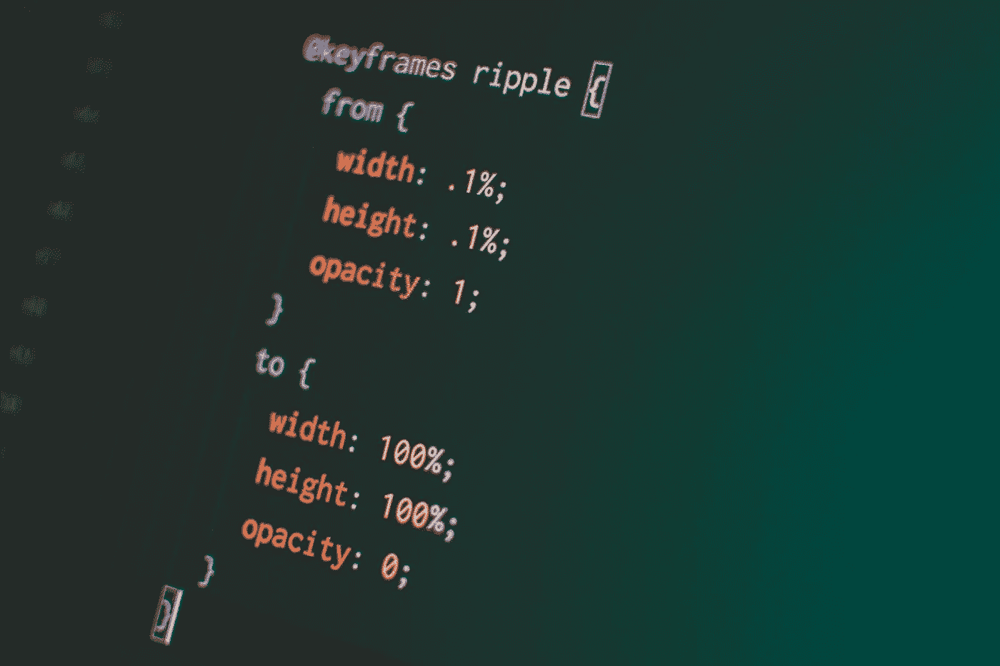

# 本周编辑精选(2021 年 5 月 1 日至 7 日)

> 原文：<https://betterprogramming.pub/editors-pick-of-the-week-may-1-7-2021-9b8f9d4d5b20>

## 本周发表的我最喜欢的文章的综述

嘿，更好的编程读者们，

祝你们周五快乐！最近，[务实的程序员](https://medium.com/pragmatic-programmers)给他们的媒体出版物[增加了五本新书](/five-new-pragmatic-programmer-books-on-medium-f311a40ac514)。 [Sunil](https://medium.com/u/a7b125868703?source=post_page-----9b8f9d4d5b20--------------------------------) 和 In Plain English 团队最近发布了一份新的出版物: [AWS in Plain English](https://aws.plainenglish.io/) 。一定要去看看。

现在，我们已经宣布了这些令人兴奋的消息，让我们来看看本周发表的我最喜欢的五篇文章。

由 [Safar Safarov](https://unsplash.com/@codestorm?utm_source=medium&utm_medium=referral) 在 [Unsplash](https://unsplash.com/?utm_source=medium&utm_medium=referral) 上拍摄的照片。

## [你应该考虑了解的 7 个 NPM 套餐](/7-npm-packages-you-should-consider-knowing-4e036a1dfa69)

首先， [Owahida Afrin](https://medium.com/u/b994ba6dee3c?source=post_page-----9b8f9d4d5b20--------------------------------) 为我们提供了一些 JavaScript 开发者肯定会喜欢的 NPM 包。哪一个是你最喜欢的？

[Pankaj Patel](https://unsplash.com/@pankajpatel) 在 [Unsplash](https://unsplash.com/?utm_source=medium&utm_medium=referral) 上拍照。

## 作为一名网站开发者应该避免的 5 种 CSS 做法

阿列克谢·谢佩利夫的这首曲子今天在媒体上很流行。他向我们展示了 web 开发人员经常陷入的一些 CSS 陷阱，同时也向我们展示了更好的可用技术。

图片作者。

## 软件开发人员掌握谷歌搜索艺术的 11 个技巧

虽然编码可能是一门科学艺术，但知道如何谷歌正确的东西更是一门艺术。

由[沙恩·朗斯](https://unsplash.com/@shanerounce?utm_source=medium&utm_medium=referral)在 [Unsplash](https://unsplash.com/?utm_source=medium&utm_medium=referral) 上拍摄的照片。

## [软件工程师与数据工程师](/software-engineer-vs-data-engineer-2272d950e87d)

数据工程师和软件工程师的区别是什么？他们是如何处理日常任务的？他们需要同样的技能吗？ [SeattleDataGuy](https://medium.com/u/41cd8f154e82?source=post_page-----9b8f9d4d5b20--------------------------------) 分解了这两个学科的区别。

阿尔瓦罗·雷耶斯在 [Unsplash](https://unsplash.com/?utm_source=medium&utm_medium=referral) 上拍摄的照片

## [我希望年轻时知道的 4 种编程建议](/4-kinds-of-programming-advice-i-wish-my-younger-self-knew-ac3572549ce5)

并不是所有人在刚开始的时候都能得到最好的编程建议。我们至少可以与新加入团队的初级工程师和实习生分享我们的经验。Eric Chi 与我们分享他的软件工程经验。“首先关注解决问题，其次才是编码”是我个人最喜欢的建议。

这就是本周的时事通讯！查看 [betterprogramming.pub](https://betterprogramming.pub/) 了解更多有趣的故事。

感谢阅读。直到下一次，

阿努帕姆和更好的编程团队